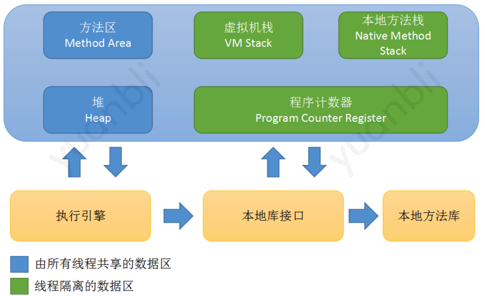

# 1. Java垃圾回收

## 1.1 垃圾回收区域及划分

### 1.1.1 JVM 内存运行时区域划分

- **程序计数器**：一块较小的内存空间，可以看作是当前线程所执行的字节码的行号指示器，各线程间计数器互不影响，独立存储
- **虚拟机栈**：描述的是Java方法执行的内存模型：每个方法在执行的同时会创建一个栈帧*Stack Frame*，是每个方法运行时的基础数据结构，由于存储局部变量、操作数栈、动态链接、方法出口等信息。每个放啊从调用到执行完成的过程，就对应一个栈帧在虚拟机栈中入栈到出栈的过程
- **本地方法栈**：与虚拟机栈发挥作用相似，区别在于虚拟机栈为虚拟机执行Java方法服务，而本地放啊栈则为虚拟机使用到的*Native*方法服务
- **Java堆**：是Java虚拟机所管理的内存最大的一块。堆被所有线程共享，在虚拟机启动时创建。此内存区域的唯一目的就是存放对象实例，几乎所有对象实例都在这里分配内存
- **方法区**：与Java堆一样，是各个线程共享的内存区域，用于存储已被虚拟机加载的类信息、常量、静态变量、即时编译器编译后的代码等数据

Java内存运行时区域的各个部分，其中程序计数器、虚拟机栈、本地方法栈随着线程而生，随着线程而灭；栈中的栈帧随着方法的加入退出而进栈出栈，在类结构确定下来时就已知每个栈帧中的分配内存。

Java堆和方法区不同，一个接口中多个实现类需要的内存可能不同，一个方法中的多个分支需要的内存也可能不一样，只有程序处于运行期间时才能知道会创建那些对象，这部分内存的分配和回收都是动态的。Java8中，方法区存放于元空间中，元空间与堆共享物理内存，因此，Java堆和方法区是垃圾收集器管理的主要区域。

由于Java垃圾收集器基本都采用分代垃圾收集理论，所以Java堆也可以细分为如下区域：

- 新生代区域：*Eden*区、*From Survivor*区、*To Survivor*区
- 老年代区域：*Old Memory*区

对象首先会在*Eden*区域分配；在一次新生代垃圾回收后，如果对象还存在，就会进入*To*区，并且对象的年龄相应加1（*Eden区 --> Survivor区后对象的初始年龄变为1*），并且每次垃圾回收年龄都会加1，当年龄增加到晋升年龄阈值，就会晋升到老年代中。

针对*HotSpot VM*的实现，它的GC可以分为两大类：

- 部分收集*Partial GC*
  - 新生代收集（*Minor GC / Young GC*）
  - 老年代收集（*Major GC / Old GC*）
  - 混合收集（*Mixed GC*）：针对新生代和部分老年代进行垃圾收集
- 整堆收集（*Full GC*）：收集整个Java堆和方法区

### 1.1.2 Java堆内存常见分配策略

Java堆内存分配策略如下：

- 对象优先在*Eden*区分配，大部分对象朝生夕死
- 大对象直接进入老年代。大对象需要大量连续内存空间，容易导致内存空间提前触发垃圾收集。为了避免大对象分配内存时，由于分配担保机制带来的复制而降低效率，所以大对象直接进入空间较大的老年代区域
- 长期存活的对象也会由新生代移动到老年代。
- 空间分配担保。发生*Minor GC*之前，虚拟机会先检查老年代最大可用连续内存空间是否大于新时代所有对象总空间。如果这个条件成立，那么*Minor GC*确保是安全的。不成立，则虚拟机会看*HandlePromotionFailure*设置值是否允许担保失败：
  - 如果允许，那么会继续检查老年代最大可用连续空间是否大于历次晋升到老年代对象的平均大小
  - 如果大于，将尝试进行一次*Minor GC*，尽管这次GC有风险
  - 如果小于，或者*HandlePromotionFailure*设置不允许冒险，那此时将进行一次*Full GC*

## 1.2 判断对象死亡

### 1.2.1 如何判断对象可以回收

- 引用计数法
- 可达性算法

#### **引用计数法**

给每一个对象设置一个引用计数器，每当有一个地方引用这个对象时，就将计数器加一，引用失效的时候，计数器减一。当一个对象引用计数器为零时，说明此对象没有被引用，也就是"死对象"，将会被垃圾回收。引用计数法无法解决循环引用问题，当对象A引用对象B，对象B又引用对象A，那么此时对象A,B的计数器均不为零，就无法完成垃圾回收

#### **可达性算法**

从GC Roots对象开始向下搜索，如果一个对象到GC Roots没有任何引用链相连时，则说明此对象不可用，GC Roots的对象有如下几种：

- 虚拟机栈中引用的对象
- 方法区类静态属性引用的方法
- 本地常量池引用的对象
- 本地方法栈JNI引用的对象

当一个对象不可达GC Roots的时候，并不会被立马回收，而是处于一个死缓的阶段，若真正被回收需要经历俩次标记.

#### **四种引用**

引用对象被回收的话，引用会进入引用队列中

- 强引用

  发生GC，且可达性算法判断该对象可以被回收时才会被回收

-  软引用

  发生GC，如果内存不够时会回收没有和GC Roots直接相连的软引用对象

- 弱引用

  发生GC，会直接回收没有和GC Roots直接相连的软引用对象

- 虚引用

  必须配合引用队列使用，引用对象回收时，将虚引用入队，由Reference Handler线程调用虚引用相关方法释放直接内存

#### **不可达的对象并非“非死不可”**

即使在可达性分析法中不可达的对象，也并非是“非死不可”的，这时候它们暂时处于“缓刑阶段”，要真正宣告一个对象死亡，至少要经历两次标记过程；可达性分析法中不可达的对象被第一次标记并且进行一次筛选，筛选的条件是此对象是否有必要执行 finalize 方法。当对象没有覆盖 finalize 方法，或 finalize 方法已经被虚拟机调用过时，虚拟机将这两种情况视为没有必要执行。被判定为需要执行的对象将会被放在一个队列中进行第二次标记，除非这个对象与引用链上的任何一个对象建立关联，否则就会被真的回收。

## 1.3 垃圾回收算法

### **标记-清除**

标记要回收的对象，然后统一回收，效率不高，标记和清除的效率都很低；会产生大量不连续的内存碎片

### **复制算法**

复制算法将可用内存按容量划分为相等的俩部分，每次只使用其中的一块，当一块内存用完时，将还存活的对象复制到第二块内存上，然后一次性清除完第一块内存，在将第二块内存上的对象复制到第一块内存。每次都优先使用Eden区，若Eden区满，就将对象复制到Surivivor区上，然后清除Eden区，如果此时存活对象太多，以至Survior不够用，会将这些对象通过分配担保机制复制到老年代中。

### **标记-整理**

解决标记-清除会产生大量内存碎片的问题；当对象存活率较高的时候，也解决了复制算法的效率问题。该算法在清除对象的时候将可回收的对象移动到一端，然后清除掉边界以外的对象，这样就不会产生内存碎片了

### **分代回收**

堆内存被划分为新生代和老年代，新生代又细致划分为一块较大的Eden空间，俩块较小的Servivor(From Survivor，To Survivor)，默认比例为8：1：1。

- 新生代采用复制算法回收对象，新生代的GC是Minor GC
- 老年代采用标记清除算法，老年大的GC是Full GC

大多数情况下，对象在新时代的Eden区分配，当Eden没有足够空间分配时，虚拟机将发起一次Minor GC。**大对象直接分配到老年代。**

长期存活的对象将进入老年代，通过对象年龄计数器判断。如果对象在Eden分配并经过一次Minor GC仍存活，将移动到Survivor空间中，设置年龄为1，在Survivor中每经过一次Minor GC，年龄加1，当年龄达到默认15时，将被晋升到老年代中。

1. *Minor GC*

minor gc会引发stop the world，垃圾回收结束，用户线程才恢复运行，当Eden区满了之后，就会触发Minor GC，将Eden区和from surivivor区存活对象复制到To Survivor区，经过这次 GC 后，Eden 区和From区已经被清空。这个时候，From和To会交换他们的角色，保证名为 To 的 Survivor 区域是空的。当对象在Survivor经过一定次数Minior GC之后，就会晋升至老年代。

基于复制算法进行回收，采用空闲指针的方式来控制GC触发，指针保持最后一个分配的对象在新生代区间的位置，当有新对象待分配时，检查内存是否足够，不足就会触发GC，对象连续分配时，逐渐从Eden到Survivor，最后到老年代。

2. *Full GC*

老年代对象存活时间长，采用标记清除或标记清理算法进行回收

1>.触发Full GC条件

①老年代空间不足。调优时应尽量让对象在Minor GC阶段被回收，不要创建大对象或数组

②Permanet Generation空间满

③统计得到Minor GC晋升到老年代平均大小大于剩余空间

## 1.4 垃圾收集器

| 垃圾收集器        | 特点                                                         | 算法                                               | 适用场景                                                     | 优点                         | 缺点                                            |
| ----------------- | ------------------------------------------------------------ | -------------------------------------------------- | ------------------------------------------------------------ | ---------------------------- | ----------------------------------------------- |
| Serial            | 最基本、历史最悠久的单线程垃圾收集器。                       | 新生代采用标记-复制算法，老年代采用标记-整理算法。 | 运行在 Client 模式下的虚拟机                                 | 简单、高效                   | 垃圾回收时必须暂停其他所有的工作线程            |
| ParNew            | Serial 收集器的多线程版本                                    | 新生代采用标记-复制算法，老年代采用标记-整理算法   | 运行在 Server 模式下的虚拟机                                 | 并行，效率高                 |                                                 |
| Parallel Scavenge | 使用标记-复制算法的多线程收集器，关注吞吐量                  | 新生代采用标记-复制算法，老年代采用标记-整理算法。 | JDK1.8 默认收集器在注重吞吐量及CPU资源的场合                 | 吞吐量高                     |                                                 |
| Serial Old        | Serial 收集器的老年代版本                                    | 标记-整理算法                                      | 在 JDK<1.5与 Parallel Scavenge 收集器搭配使用作为CMS收集器的后备方案 | 简单、高效                   | 垃圾回收时必须暂停其他所有的工作线程            |
| Parallel Old      | Parallel Scavenge 收集器的老年代                             | 标记-整理算法                                      | 在注重吞吐量及CPU资源的场合                                  | 吞吐量高                     |                                                 |
| CMS               | 多线程的垃圾收集器（*用户线程和垃圾回收线程可以同时进行*）   | 标记-清除算法                                      | 希望系统停顿时间最短，注重服务的响应速度的场景               | 并发收集、低停顿             | 对 CPU 资源敏感，无法处理浮动垃圾，产生垃圾碎片 |
| G1                | 一款面向服务器的垃圾收集器，并行并发，空间整合，可预测的停顿时间 | 标记-复制算法                                      | 服务端应用、针对具有大内存多处理器的机器                     | 停顿时间可控、基本无空间碎片 | 可能存在空间浪费、程序运行时的额外执行负载高    |

### 1.4.1 CMS收集器

CMS(Concurrent Mark Sweep)收集器是一种以获取最短回收停顿时间为目标的并发收集器，也是老年代垃圾收集器，第一次实现了让垃圾收集线程与用户线程（基本上）同时工作。CMS收集器在Minor GC时会暂停所有的应用线程，并以多线程的方式进行垃圾回收。在Full GC时不再暂停应用线程，而是使用若干个后台线程定期的对老年代空间进行扫描，及时回收其中不再使用的对象。

CMS收集器是根据 “标记-清除”算法实现的，它的运作过程分为7个步骤：

**初始标记（STW）**

该阶段单线程执行，主要分分为两步：

1. 标记GC Roots可达的老年代对象；
2. 遍历新生代对象，标记可达的老年代对象；

**并发标记**

该阶段GC线程和应用线程并发执行，遍历初始标记阶段标记出来的存活对象，然后继续递归标记这些对象可达的对象。使用三色可达性分析算法进行标记，因为该阶段并发执行的，在运行期间可能发生新生代的对象晋升到老年代、或者是直接在老年代分配对象、或者更新老年代对象的引用关系等等，对于这些对象，都是需要进行重新标记的，否则有些对象就会被遗漏，发生漏标的情况。为了提高重新标记的效率，该阶段会使用三色可达性分析中的增量更新解决这一问题：把上述对象所在的Card标识为Dirty，后续只需扫描这些Dirty Card的对象，避免扫描整个老年代

**预清理阶段**

前一个阶段已经说明，不能标记出老年代全部的存活对象，是因为标记的同时应用程序会改变一些对象引用，这个阶段就是用来处理前一个阶段因为引用关系改变导致没有标记到的存活对象的，它会扫描所有标记为Dirty的Card

**可终止的预处理**

这个阶段的目标跟“预清理”阶段相同，也是为了减轻重新标记阶段的工作量。

可中断预清理的价值：在进入重新标记阶段之前尽量等到一个Minor GC，尽量缩短重新标记阶段的停顿时间。另外可中断预清理会在Eden达到50%的时候开始，这时候离下一次minor gc还有半程的时间，这个还有另一个意义，即避免短时间内连着的两个停顿。

在该阶段，主要循环的做两件事：

1. 处理 From 和 To 区的对象，标记可达的老年代对象
2. 和上一个阶段一样，扫描处理Dirty Card中的对象

​    当然了，这个逻辑不会一直循环下去，打断这个循环的条件有三个：

1. 可以设置最多循环的次数 `CMSMaxAbortablePrecleanLoops`，默认是0，意思没有循环次数的限制。
2. 如果执行这个逻辑的时间达到了阈值`CMSMaxAbortablePrecleanTime`，默认是5s，会退出循环。
3. 如果新生代Eden区的内存使用率达到了阈值`CMSScheduleRemarkEdenPenetration`，默认50%，会退出循环。（这个条件能够成立的前提是，在进行Precleaning时，Eden区的使用率小于十分之一）

**重新标记（STW）**

这个阶段会导致第二次stop the word，该阶段的任务是完成标记整个老年代的所有的存活对象。重新扫描堆中的对象，进行可达性分析,标记活着的对象。这个阶段扫描的目标是：新生代的对象 + Gc Roots + 前面被标记为dirty的card对应的老年代对象。如果预清理的工作没做好，这一步扫描新生代的时候就会花很多时间，导致这个阶段的停顿时间过长。这个过程是多线程的。

为什么要扫描新生代呢，因为对于老年代中的对象，如果被新生代中的对象引用，那么就会被视为存活对象，即使新生代的对象已经不可达了，也会使用这些不可达的对象当做cms的“gc root”，来扫描老年代； 因此对于老年代来说，引用了老年代中对象的新生代的对象，也会被老年代视作“GC ROOTS”:当此阶段耗时较长的时候，可以加入参数-XX:+CMSScavengeBeforeRemark，在重新标记之前，先执行一次ygc，回收掉年轻带的对象无用的对象，并将对象放入幸存带或晋升到老年代，这样再进行年轻带扫描时，只需要扫描幸存区的对象即可，一般幸存带非常小，这大大减少了扫描时间。

**并发清理**

通过以上5个阶段的标记，老年代所有存活的对象已经被标记并且现在要通过Garbage Collector采用清扫的方式回收那些不能用的对象了。 这个阶段主要是清除那些没有标记的对象并且回收空间； 由于CMS并发清理阶段用户线程还在运行着，伴随程序运行自然就还会有新的垃圾不断产生，这一部分垃圾出现在标记过程之后，CMS无法在当次收集中处理掉它们，只好留待下一次GC时再清理掉。这一部分垃圾就称为“浮动垃圾”。

### 1.4.2 G1收集器

G1 (Garbage-First) 是一款面向服务器的垃圾收集器,主要针对配备多颗处理器及大容量内存的机器. 以极高概率满足 GC 停顿时间要求的同时,还具备高吞吐量性能特征。

G1垃圾收集器相对比其他收集器而言，最大的区别在于它取消了年轻代、老年代的物理划分，取而代之的是将堆划分为若干个区域（Region），这些区域中包含了有逻辑上的年轻代、老年代区域。这样做的好处就是，我们再也不用单独的空间对每个代进行设置了，不用担心每个代内存是否足够。

具备以下特点：

- 并行与并发：G1 能充分利用 CPU、多核环境下的硬件优势，使用多个 CPU（CPU 或者 CPU 核心）来缩短 Stop-The-World 停顿时间。部分其他收集器原本需要停顿 Java 线程执行的 GC 动作，G1 收集器仍然可以通过并发的方式让 java 程序继续执行
- 分代收集：虽然 G1 可以不需要其他收集器配合就能独立管理整个 GC 堆，但是还是保留了分代的概念。
- 空间整合：与 CMS 的“标记-清理”算法不同，G1 从整体来看是基于“标记-整理”算法实现的收集器；从局部上来看是基于“标记-复制”算法实现的
- 可预测的停顿：这是 G1 相对于 CMS 的另一个大优势，降低停顿时间是 G1 和 CMS 共同的关注点，但 G1 除了追求低停顿外，还能建立可预测的停顿时间模型，能让使用者明确指定在一个长度为 M 毫秒的时间片段内

G1算法将堆划分为若干个区域（Region），它仍然属于分代收集器。不过，这些区域的一部分包含新生代，新生代的垃圾收集依然采用暂停所有应用线程的方式，将存活对象拷贝到老年代或者Survivor空间。老年代也分成很多区域，G1收集器通过将对象从一个区域复制到另外一个区域，完成了清理工作。这就意味着，在正常的处理过程中，G1完成了堆的压缩（至少是部分堆的压缩），这样也就不会有cms内存碎片问题的存在了。

对象分配策略**：**它分为3个阶段：

- TLAB(Thread Local Allocation Buffer)线程本地分配缓冲区
- Eden区中分配
- Humongous区分配

TLAB为线程本地分配缓冲区，它的目的为了使对象尽可能快的分配出来。如果对象在一个共享的空间中分配，我们需要采用一些同步机制来管理这些空间内的空闲空间指针。在Eden空间中，每一个线程都有一个固定的分区用于分配对象，即一个TLAB。分配对象时，线程之间不再需要进行任何的同步。对TLAB空间中无法分配的对象，JVM会尝试在Eden空间中进行分配。如果Eden空间无法容纳该对象，就只能在老年代中进行分配空间。

在G1中，还有一种特殊的区域，叫Humongous区域。 如果一个对象占用的空间超过了分区容量50%以上，G1收集器就认为这是一个巨型对象。这些巨型对象，默认直接会被分配在年老代，但是如果它是一个短期存在的巨型对象，就会对垃圾收集器造成负面影响。为了解决这个问题，G1划分了一个Humongous区，它用来专门存放巨型对象。如果一个H区装不下一个巨型对象，那么G1会寻找连续的H分区来存储。为了能找到连续的H区，有时候不得不启动Full GC。

G1 收集器的运作大致分为以下几个步骤：

- 初始标记
- 并发标记
- 最终标记
- 筛选回收

G1 收集器在后台维护了一个优先列表，每次根据允许的收集时间，优先选择回收价值最大的 Region(这也就是它的名字 Garbage-First 的由来) 。这种使用 Region 划分内存空间以及有优先级的区域回收方式，保证了 G1 收集器在有限时间内可以尽可能高的收集效率（把内存化整为零）。

# 2. Golang垃圾回收

从 Go v1.12 版本开始，Go使用了**非分代的、并发的、基于三色标记和清除的垃圾回收器**。和 C/C++ 一样，Go 是静态类型的编译型语言，因此不需要 VM，Go 应用程序二进制文件中嵌入了一个小型运行时(Go runtime)，可以处理诸如垃圾收集器 GC、调度和并发之类的语言功能。

## 2.1 Golang内存管理

Golang运行调度有三个基本的概念：G、M、P。一个 Gorotine 的运行需要 G+M+P 三部分结合：

- G：Gorotine执行的上下文环境
- M：操作系统线程
- P：Processer，进程调度器

### 2.1.1 TCMalloc

Go将内存划分为页*Page*，和 Java 的内存结构不同，没有分代内存，是因为 Go 的内存分配器采用了 TCMalloc的设计思想：

**1. Page**

与TCMalloc中的Page相同，x64下1个Page的大小是8KB。上图的最下方，1个浅蓝色的长方形代表1个Page。

**2. Span**

与TCMalloc中的Span相同，Span是内存管理的基本单位，代码中为mspan，一组连续的Page组成1个Span，所以上图一组连续的浅蓝色长方形代表的是一组Page组成的1个Span，另外，1个淡紫色长方形为1个Span。

**3. mcache**

mcache是提供给P（逻辑处理器）的高速缓存，用于存储小对象（对象大小<= 32Kb）。尽管这类似于线程堆栈，但它是堆的一部分，用于动态数据。所有类大小的mcache包含scan和noscan类型mspan。Goroutine可以从mcache没有任何锁的情况下获取内存，因为一次P只能有一个锁G。因此，这更有效。mcache从mcentral需要时请求新的span。

**4. mcentral**

mcentral与TCMalloc中的CentralCache类似，是所有线程共享的缓存，需要加锁访问，它按Span class对Span分类，串联成链表，当mcache的某个级别Span的内存被分配光时，它会向mcentral申请1个当前级别的Span。每个mcentral包含两个mspanList：

- empty：双向span链表，包括没有空闲对象的span或缓存mcache中的span。当此处的span被释放时，它将被移至non-empty span链表。
- non-empty：有空闲对象的span双向链表。当从mcentral请求新的span，mcentral将从该链表中获取span并将其移入empty span链表。

**5.mheap**

mheap与TCMalloc中的PageHeap类似，它是堆内存的抽象，把从OS申请出的内存页组织成Span，并保存起来。当mcentral的Span不够用时会向mheap申请，mheap的Span不够用时会向OS申请，向OS的内存申请是按页来的，然后把申请来的内存页生成Span组织起来，同样也是需要加锁访问的。

**6. 栈**

栈存储区，每个Goroutine（G）有一个栈。在这里存储了静态数据，包括函数栈帧，静态结构，原生类型值和指向动态结构的指针。这与分配给每个P的mcache不是一回事。

### 2.1.2 内存分配

Go中的内存分类并不像TCMalloc那样分成小、中、大对象，但是它的小对象里又细分了一个Tiny对象，Tiny对象指大小在1Byte到16Byte之间并且不包含指针的对象。小对象和大对象只用大小划定，无其他区分。

**核心思想**：

把内存分为多级管理，降低锁的粒度(只是去mcentral和mheap会申请锁), 以及多种对象大小类型，减少分配产生的内存碎片。

- **微小对象(Tiny)（size <16B）**：使用mcache的微小分配器分配小于16个字节的对象，并且在单个16字节块上可完成多个微小分配
- **小对象（尺寸16B〜32KB）**：大小在16个字节和32k字节之间的对象被分配在G运行所在的P的mcache的对应的mspan size class上
- **大对象（大小> 32KB）**：大于32 KB的对象直接分配在mheap的相应大小类上(size class)。如果mheap为空或没有足够大的页面满足分配请求，则它将从操作系统中分配一组新的页（至少1MB）
- 如果对应的大小规格在 mcache 中没有可用的块，则向 mcentral 申请
- 如果 mcentral 中没有可用的块，则向 mheap 申请，并根据 BestFit 算法找到最合适的 mspan。如果申请到的 mspan 超出申请大小，将会根据需求进行切分，以返回用户所需的页数。剩余的页构成一个新的 mspan 放回 mheap 的空闲列表
- 如果 mheap 中没有可用 span，则向操作系统申请一系列新的页（最小 1MB）。 Go 会在操作系统分配超大的页（称作 arena）。分配一大批页会减少和操作系统通信的成本

### 2.1.3 内存回收

go内存会分成堆区（Heap）和栈区（Stack）两个部分，程序在运行期间可以主动从堆区申请内存空间，这些内存由内存分配器分配并由垃圾收集器负责回收。栈区的内存由编译器自动进行分配和释放，栈区中存储着函数的参数以及局部变量，它们会随着函数的创建而创建，函数的返回而销毁。如果只申请和分配内存，内存终将枯竭。Go使用垃圾回收收集不再使用的span，把span释放交给mheap，mheap对span进行span的合并，把合并后的span加入scav树中，等待再分配内存时，由mheap进行内存再分配。**因此，Go堆是Go垃圾收集器管理的主要区域。**

## 2.2 垃圾回收

### 2.2.1 三色可达性分析

为了解决标记清除算法带来的STW问题，Go和Java都会实现三色可达性分析标记算法的变种以缩短 STW 的时间。三色可达性分析标记算法按“是否被访问过”将程序中的对象分成白色、黑色和灰色：

- 白色对象 — 对象尚未被垃圾收集器访问过，在可达性分析刚开始的阶段，所有的对象都是白色的，若在分析结束阶段，仍然是白色的对象，即代表不可达
- 黑色对象 — 表示对象已经被垃圾收集器访问过，且这个对象的所有引用都已经被扫描过，黑色的对象代表已经被扫描过而且是安全存活的，如果有其他对象只想黑色对象无需再扫描一遍，黑色对象不可能直接（不经过灰色对象）指向某个白色对象
- 灰色对象 — 表示对象已经被垃圾收集器访问过，但是这个对象上至少存在一个引用还没有被扫描过，因为存在指向白色对象的外部指针，垃圾收集器会扫描这些对象的子对象

**三色可达性分析算法流程**

初始状态下所有对象都是白色的：

1. 从GC Roots开始枚举，它们所有的直接引用变为灰色（移入灰色集合），GC Roots变为黑色

2. 从灰色集合中取出一个灰色对象进行分析：

- 将这个对象所有的直接引用变为灰色，放入灰色集合中

- 将这个对象变为黑色

3. 重复步骤2，一直重复直到灰色集合为空
4. 分析完成，仍然是白色的对象就是GC Roots不可达的对象，可以作为垃圾被清理

**STW**

三色标记清除算法本身是不可以并发或者增量执行的，它需要STW，而如果并发执行，用户程序可能在标记执行的过程中修改对象的指针， 这种情况一般会有2种：

- 一种是把原本应该垃圾回收的死亡对象错误的标记为存活。虽然这不好，但是不会导致严重后果，只不过产生了一点逃过本次回收的浮动垃圾而已，下次清理就可以，比如上图所示的三色标记过程中，用户程序取消了从B对象到E对象的引用，但是因为B到E已经被标记完成不会继续执行步骤2，所以E对象最终会被错误的标记成黑色，不会被回收，这个D就是浮动垃圾，会在下次垃圾收集中清理
- 一种是把原本存活的对象错误的标记为已死亡，导致“对象消失”，这在内存管理中是非常严重的错误。我们将这种错误称为**悬挂指针**，即指针没有指向特定类型的合法对象，影响了内存的安全性

### 2.2.2 标记清除算法

当成功区分出Go 垃圾收集器管理区域的存活对象和死亡对象后，Go垃圾收集器接下来的任务就是执行GC，释放无用对象占用的内存空间，以便有足够的可用内存空间为新对象分配内存。目前常见的垃圾回收算法在上面的垃圾收集算法中已有介绍，而Go使用的是**标记清除算法**。

当堆空间被耗尽的时，就会STW(也被称为stop the world)，其执行过程可以分成标记和清除两个阶段。Go垃圾收集器从根结点开始遍历，执行可达性分析算法，递归标记所有被引用的对象为存活状态；标记阶段结束后，垃圾收集器会依次遍历堆中的对象并清除其中的未被标记为存活的对象。

由于用户程序在垃圾收集的过程中也不能执行（STW）。在可达性分析算法中，Go的GC Roots一般为全局变量和G Stack中的引用指针，和整堆的对象相比只是极少数，因此它带来的停顿是非常短暂且相对固定的，不随堆容量增长。在从GC Roots往下遍历对象的过程，堆越大，存储对象越多，递归遍历越复杂，要标记更多对象而产生的停顿时间自然就更长。因此我们需要用到更复杂的机制来解决 STW 的问题。

## 2.3 屏障技术

为了解决上述的“对象消失”的现象，Wilson于1994年在理论上证明了，当且仅当以下两个条件同时满足时，会产生“对象消失”的问题，即原本应该是黑色的对象被误标为白色：

- 赋值器插入了一条或多条从黑色对象到白色对象的新引用
- 赋值器删除了全部从灰色对象到该白色对象的直接或间接引用

为了我们要解决并发扫描时的对象消失问题，保证垃圾收集算法的正确性，只需破坏这两个条件的任意一个即可，**屏障技术**就是在并发或者增量标记过程中保证三色不变性的重要技术。

内存屏障技术是一种屏障指令，它可以让 CPU 或者编译器在执行内存相关操作时遵循特定的约束，目前多数的现代处理器都会乱序执行指令以最大化性能，但是该技术能够保证内存操作的顺序性，在内存屏障前执行的操作一定会先于内存屏障后执行的操作。垃圾收集中的屏障技术更像是一个钩子方法，它是在用户程序读取对象、创建新对象以及更新对象指针时执行的一段代码，根据操作类型的不同，我们可以将它们分成读屏障（Read barrier）和写屏障（Write barrier）两种，因为读屏障需要在读操作中加入代码片段，对用户程序的性能影响很大，所以编程语言往往都会采用写屏障保证三色不变性。

主要有以下三种写屏障

- 插入写屏障

- 删除写屏障

- 混合写屏障

### 2.3.1 GC过程

1. **sweep termination（清理终止）**

- 暂停程序，触发STW。所有的 P（处理器）都会进入 safe-point（安全点）；

- 清理未被清理的 span 。如果当前垃圾收集是强制触发的，需要处理还未被清理的内存管理单元；

2. **the mark phase（标记阶段）**

- 将GC状态`gcphase`从`_GCoff`改成`_GCmark`、开启写屏障、启用协助线程（mutator assists）、将根对象入队

- 恢复程序执行，标记进程（mark workers）和协助程序会开始并发标记内存中的对象，写屏障会覆盖的重写指针和新指针（标记成灰色），而所有新创建的对象都会被直接标记成黑色；

- GC执行根节点的标记，这包括扫描所有的栈、全局对象以及不在堆中的运行时数据结构。扫描goroutine 栈会导致 goroutine 停止，并对栈上找到的所有指针加置灰，然后继续执行 goroutine。

- GC遍历灰色对象队列，会将灰色对象变成黑色，并将该指针指向的对象置灰。

- 由于GC工作分布在本地缓存中，GC 会使用分布式终止算法（distributed termination algorithm）来检测何时不再有根标记作业或灰色对象，如果没有了 GC 会转为mark termination（标记终止）

3. **mark termination（标记终止）**

- STW

- 将GC状态`gcphase`切换至 `_GCmarktermination` ，关闭gc工作线程和协助程序

- 执行housekeeping，例如刷新mcaches

4.  **the sweep phase（清理阶段）**

- 将GC状态`gcphase`切换至 `_GCoff` 来准备清理阶段，初始化清理阶段并关闭写屏障

- 恢复用户程序，从现在开始，所有新创建的对象会标记成白色；如果有必要，在使用前分配清理spans

- 后台并发清理所有的内存管理类单元

### 2.3.2 GC触发条件

运行时会通过`runtime.gcTrigger.test`方法决定是否需要触发垃圾收集，当满足触发垃圾收集的基本条件（即满足`_GCoff`阶段的退出条件）时 ：允许垃圾收集、程序没有崩溃并且没有处于垃圾收集循环，该方法会根据三种不同方式触发进行不同的检查：

用于开启垃圾回收的方法为`runtime.gcStart`，因此所有调用该函数的地方都是触发GC的代码

- `runtime.mallocgc` 申请内存时根据堆大小触发GC
- `runtime.GC` 用户程序手动触发GC
- `runtime.forcegchelper` 后台运行定时检查触发GC

# 3. Java和Go GC对比

## 3.1 垃圾回收区域

Java内存运行时区域的各个部分，其中程序计数器、虚拟机栈、本地方法栈3个区域随着线程而生，随着线程而灭；栈中的栈帧随着方法的进入和退出而有条不紊地执行着出栈和入栈的操作，每个栈帧中分配多少内存基本是在类结构确定下来时就已知的。而Java堆和方法区则不同，一个接口中的多个实现类需要的内存可能不同，一个方法中的多个分支需要的内存也可能不一样，我们只有在程序处于运行期间时才能知道会创建哪些对象，这部分内存的分配和回收都是动态的，因此，**Java堆和方法区是Java垃圾收集器管理的主要区域**。

go内存会分成堆区（Heap）和栈区（Stack）两个部分，程序在运行期间可以主动从堆区申请内存空间，这些内存由内存分配器分配并由垃圾收集器负责回收。栈区的内存由编译器自动进行分配和释放，栈区中存储着函数的参数以及局部变量，它们会随着函数的创建而创建，函数的返回而销毁。如果只申请和分配内存，内存终将枯竭。Go使用垃圾回收收集不再使用的span，把span释放交给mheap，mheap对span进行span的合并，把合并后的span加入scav树中，等待再分配内存时，由mheap进行内存再分配。**因此，Go堆是Go垃圾收集器管理的主要区域。**

## 3.2 触发垃圾回收的时机

Java 当应用程序空闲时,即没有应用线程在运行时,GC会被调用。因为GC在优先级最低的线程中进行,所以当应用忙时,GC线程就不会被调用,但以下条件除外。

Java堆内存不足时,GC会被调用。但是这种情况由于java是分代收集算法且垃圾收集器种类十分多，因此其触发各种垃圾收集器的GC时机可能不完全一致，这里我们说的为一般情况。

1. 当Eden区空间不足时Minor GC
2. 对象年龄增加到一定程度时Young GC
3. 新生代对象转入老年代及创建为大对象、大数组时会导致老年代空间不足，触发Old GC
4. System.gc()调用触发Full GC
5. 各种区块占用超过阈值的情况

Go则会根据以下条件进行触发：

- `runtime.mallocgc` 申请内存时根据堆大小触发GC
- `runtime.GC` 用户程序手动触发GC
- `runtime.forcegchelper` 后台运行定时检查触发GC

## 3.3 收集算法

当前Java虚拟机的垃圾收集采用**分代收集**算法，根据对象存活周期的不同将内存分为几块。比如在新生代中，每次收集都会有大量对象死去，所以可以选择“标记-复制”算法，只需要付出少量对象的复制成本就可以完成每次垃圾收集。 而老年代的对象存活几率是比较高的，而且没有额外的空间对它进行分配担保，所以我们必须选择“标记-清除”或“标记-整理”算法进行垃圾收集。

当前Go的都是基于**标记清除**算法进行垃圾回收。

## 3.4 垃圾碎片的处理

由于Java的内存管理划分，因此容易产生垃圾对象，JVM这些年不断的改进和更新GC算法，JVM在处理内存碎片问题上更多采用**空间压缩和分代收集**的思想，例如在新生代使用“标记-复制”算法，G1收集器支持了对象移动以消减长时间运行的内存碎片问题，划分region的设计更容易把空闲内存归还给OS等设计。

由于Go的内存管理的实现，很难实现分代，而移动对象也可能会导致runtime更庞大复杂，因此Go在关于内存碎片的处理方案和Java并不太一样。

**1. Go语言span内存池的设计，减轻了很多内存碎片的问题。**

​    Go内存释放的过程如下：当 mcache 中存在较多空闲 span 时，会归还给 mcentral；而 mcentral 中存在较多空闲 span 时，会归还给 mheap；mheap 再归还给操作系统。这种设计主要有以下几个优势：

- 内存分配大多时候都是在用户态完成的，不需要频繁进入内核态
- 每个 P 都有独立的 span cache，多个 CPU 不会并发读写同一块内存，进而减少 CPU L1 cache 的 cacheline 出现 dirty 情况，增大 cpu cache 命中率
- 内存碎片的问题，Go 是自己在用户态管理的，在 OS 层面看是没有碎片的，使得操作系统层面对碎片的管理压力也会降低
- mcache 的存在使得内存分配不需要加锁

**2. tcmalloc分配机制，Tiny对象和大对象分配优化，在某种程度上也导致基本没有内存碎片会出现。**

​    比如常规上 sizeclass=1的 span，用来给 <= 8B 的对象使用，所以像 int32, byte, bool 以及小字符串等常用的微小对象，都会使用 sizeclass=1 的 span，但分配给他们 8B 的空间，大部分是用不上的。并且这些类型使用频率非常高，就会导致出现大量的内部碎片。

​    因此 Go 尽量不使用 sizeclass=1 的 span， 而是将 < 16B 的对象为统一视为 tiny 对象。分配时，从 sizeclass=2 的 span 中获取一个 16B 的 object 用以分配。如果存储的对象小于 16B，这个空间会被暂时保存起来 (mcache.tiny 字段)，下次分配时会复用这个空间，直到这个 object 用完为止。

**3. Go的对象(即struct类型)是可以分配在栈上的**。

Go会在编译时做静态逃逸分析(Escape Analysis)，如果发现某个对象并没有逃出当前作用域，则会将对象分配在栈上而不是堆上，从而减轻了GC内存碎片回收压力。

- 函数内部申请的临时变量，并不会作为返回值返回，它就是被编译器申请到栈里面。

- 编译器会认为变量之后还会被使用。因此就申请到堆上，申请到堆上面的内存才会引起垃圾回收，如果这个过程（特指垃圾回收不断被触发）过于高频就会导致 gc 压力过大，程序性能出问题。

## 3.5 GC Roots 对象的选择

在Java中由于内存运行时区域的划分，通常会选择以下几种作为“GC Roots” 的对象：

- 虚拟机栈(栈帧中的本地变量表)中引用的对象
- 本地方法栈(Native 方法)中引用的对象
- 方法区中类静态属性引用的对象
- 方法区中常量引用的对象
- Java虚拟机内部引用
- 所有被同步锁持有的对象

而在Java中的不可达对象有可能会逃脱。即使在可达性分析法中不可达的对象，也并非是“非死不可”的，这时候它们暂时处于“缓刑阶段”，要真正宣告一个对象死亡，至少要经历两次标记过程；此外Java中由于存在运行时常量池和类，因此也需要对运行时常量池和方法区的类进行清理。

而Go的选择就相对简单一点，即全局变量和G Stack中的引用指针，简单来说就是全局量和go程中的引用指针。因为Go中没有类的封装概念，因而Gc Root选择也相对简单一些。

## 3.6 写屏障

为了解决并发三色可达性分析中的悬挂指针问题，出现了2种解决方案，分别是分别是“Dijkstra插入写屏障”和“Yuasa删除写屏障”

​    在java中，对上述2种方法都有应用，比如CMS是基于**插入写屏障**做并发标记的，G1、Shenandoah则是使用**删除写屏障来实现的**

​    在 Go 语言 v1.7 版本之前，运行时会使用 Dijkstra 插入写屏障保证强三色不变性，Go 语言在 v1.8 组合 Dijkstra 插入写屏障和 Yuasa 删除写屏障构成了混合写屏障，混合写屏障结合两者特点，通过以下方式实现并发稳定的gc：

1. 将栈上的对象全部扫描并标记为黑色
2. GC期间，任何在栈上创建的新对象，均为黑色。
3. 被删除的对象标记为灰色。
4. 被添加的对象标记为灰色。

 由于要保证栈的运行效率，混合写屏障是针对于堆区使用的。即**栈区不会触发写屏障，只有堆区触发**，由于栈区初始标记的可达节点均为黑色节点，因而也不需要第二次STW下的扫描。本质上是融合了插入屏障和删除屏障的特点，解决了插入屏障需要二次扫描的问题。同时针对于堆区和栈区采用不同的策略，保证栈的运行效率不受损。

# 4. 总结

|       Java       |                              Go                              |                                                              |
| :--------------: | :----------------------------------------------------------: | ------------------------------------------------------------ |
|      GC区域      |                        Java堆和方法区                        | Go堆                                                         |
|    触发GC时机    |                   分代收集导致触发时机很多                   | 申请内存、手动触发、定时触发                                 |
|   垃圾收集算法   | 分代收集。在新生代（“标记-复制”）； 老年代（“标记-清除”或“标记-整理”） | 标记清除算法                                                 |
|     垃圾种类     |          死亡对象（可能会逃脱）、废弃常量和无用的类          | 全局变量和G Stack中的引用指针                                |
|     标记阶段     |         三色可达性分析算法（插入写屏障，删除写屏障）         | 三色可达性分析算法(混合写屏障)                               |
|   空间压缩整理   |                              是                              | 否                                                           |
|     内存分配     |                      指针碰撞/空闲列表                       | span内存池                                                   |
| 垃圾碎片解决方案 |              分代GC、对象移动、划分region等设计              | Go语言span内存池、tcmalloc分配机制、对象可以分配在栈上、对象池 |

从垃圾回收的角度来说，经过多代发展，Java的垃圾回收机制较为完善，Java划分新生代、老年代来存储对象。对象通常会在新生代分配内存，多次存活的对象会被移到老年代，由于新生代存活率低，产生空间碎片的可能性高，通常选用“标记-复制”作为回收算法，而老年代存活率高，通常选用“标记-清除”或“标记-整理”作为回收算法，压缩整理空间。

Go是非分代的、并发的、基于三色标记和清除的垃圾回收器，它的优势要结合它tcMalloc内存分配策略才能体现出来，因为小微对象的分配均有自己的内存池，所有的碎片都能被完美复用，所以GC不用考虑空间碎片的问题。 
