## 1. 内存分配器

程序中的数据和变量都会被分配到程序所在的虚拟内存中，内存空间包含两个重要区域：栈区（Stack）和堆区（Heap）。函数调用的参数、返回值以及局部变量大都会被分配到栈上，这部分内存会由编译器进行管理；不同编程语言使用不同的方法管理堆区的内存，C++ 等编程语言会由工程师主动申请和释放内存，Go 以及 Java 等编程语言会由工程师和编译器共同管理，堆中的对象由内存分配器分配并由垃圾收集器回收。

### 1.1 设计原理

内存管理一般包含三个不同的组件，分别是：

- 用户程序（Mutator）

- 分配器（Allocator）

- 收集器（Collector）

当用户程序申请内存时，它会通过内存分配器申请新内存，而分配器会负责从堆中初始化相应的内存区域。

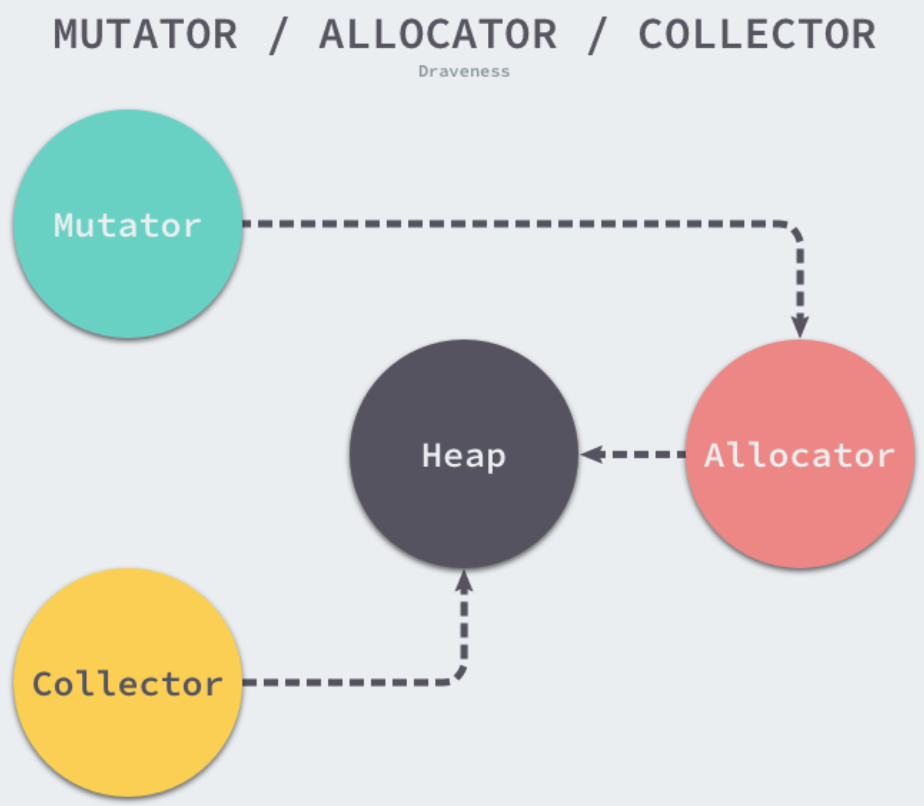

下边介绍内存分配的过程以及其背后的设计与实现原理。

#### 1.1.1 分配方法

编程语言的内存分配器一般包含两种分配方法：

- 线性分配器（Sequential Allocator，Bump Allocator）
- 空闲链表分配器（Free-List Allocator）

这两种分配方法有着不同的实现机制和特性。

##### 1. 线性分配器

线性分配（Bump Allocator）是一种高效的内存分配方法，但是有较大的局限性。当我们使用线性分配器时，只需要在内存中维护一个指向内存特定位置的指针，如果用户程序向分配器申请内存，分配器只需要检查剩余的空闲内存、返回分配的内存区域并修改指针在内存中的位置，即移动下图中的指针：

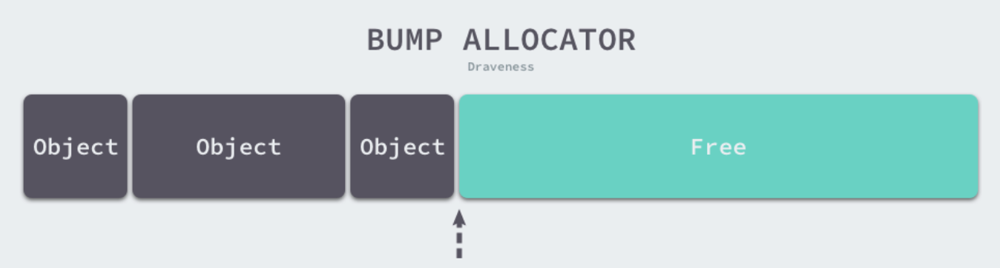

线性分配器实现为它带来了较快的执行速度以及较低的实现复杂度，但是线性分配器无法在内存被释放时重用内存。如下图所示，如果已经分配的内存被回收，线性分配器无法重新利用红色的内存：


因为线性分配器具有上述特性，所以需要与合适的垃圾回收算法配合使用，例如：标记压缩（Mark-Compact）、复制回收（Copying GC）和分代回收（Generational GC）等算法，它们可以通过拷贝的方式整理存活对象的碎片，将空闲内存定期合并，这样就能利用线性分配器的效率提升内存分配器的性能了。

##### 2. 空闲链表分配器

空闲链表分配器（Free-List Allocator）可以重用已经被释放的内存，它在内部会维护一个类似链表的数据结构。当用户程序申请内存时，空闲链表分配器会依次遍历空闲的内存块，找到足够大的内存，然后申请新的资源并修改链表：

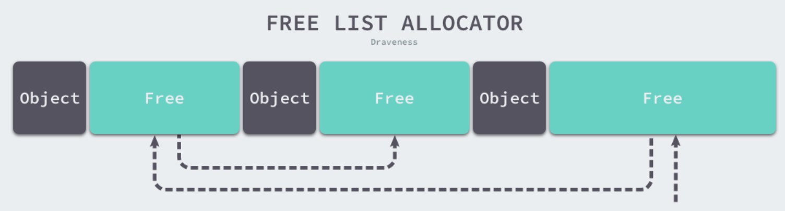

因为不同的内存块通过指针构成了链表，所以使用这种方式的分配器可以重新利用回收的资源，但是因为分配内存时需要遍历链表，所以它的时间复杂度是 𝑂(𝑛)O(n)。空闲链表分配器可以选择不同的策略在链表中的内存块中进行选择，最常见的是以下四种：

- 首次适应（First-Fit）— 从链表头开始遍历，选择第一个大小大于申请内存的内存块
- 循环首次适应（Next-Fit）— 从上次遍历的结束位置开始遍历，选择第一个大小大于申请内存的内存块
- 最优适应（Best-Fit）— 从链表头遍历整个链表，选择最合适的内存块
- 隔离适应（Segregated-Fit）— 将内存分割成多个链表，每个链表中的内存块大小相同，申请内存时先找到满足条件的链表，再从链表中选择合适的内存块

##### 3. Go内存分配策略

Go 语言使用的内存分配策略与第四种策略有些相似：

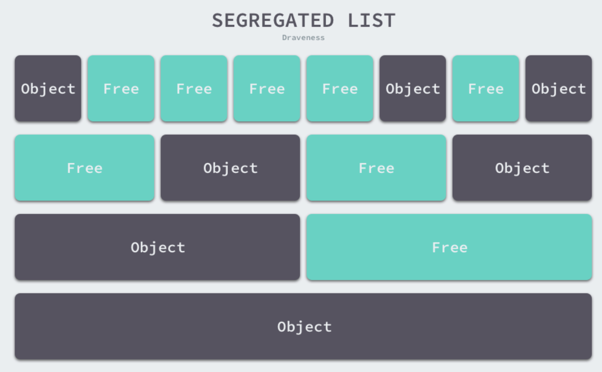

会将内存分割成由 4、8、16、32 字节的内存块组成的链表，当我们向内存分配器申请 8 字节的内存时，它会在上图中找到满足条件的空闲内存块并返回。隔离适应的分配策略减少了需要遍历的内存块数量，提高了内存分配的效率。

#### 1.1.2 分级分配

线程缓存分配（Thread-Caching Malloc，TCMalloc）是用于分配内存的机制，它比 glibc 中的 `malloc` 还要快很多。Go 语言的内存分配器就借鉴了 TCMalloc 的设计实现高速的内存分配，它的核心理念是使用多级缓存将对象根据大小分类，并按照类别实施不同的分配策略。

##### 1. 对象大小

Go 语言的内存分配器会根据申请分配的内存大小选择不同的处理逻辑，运行时根据对象的大小将对象分成微对象、小对象和大对象三种：

|  类别  |     大小      |
| :----: | :-----------: |
| 微对象 |  `(0, 16B)`   |
| 小对象 | `[16B, 32KB]` |
| 大对象 | `(32KB, +∞)`  |

因为程序中的绝大多数对象的大小都在 32KB 以下，而申请的内存大小影响 Go 语言运行时分配内存的过程和开销，所以分别处理大对象和小对象有利于提高内存分配器的性能。

##### 2. 多级缓存

内存分配器不仅会区别对待大小不同的对象，还会将内存分成不同的级别分别管理，TCMalloc 和 Go 运行时分配器都会引入）三个组件分级管理内存：

- 线程缓存（Thread Cache）
- 中心缓存（Central Cache）
- 页堆（Page Heap）

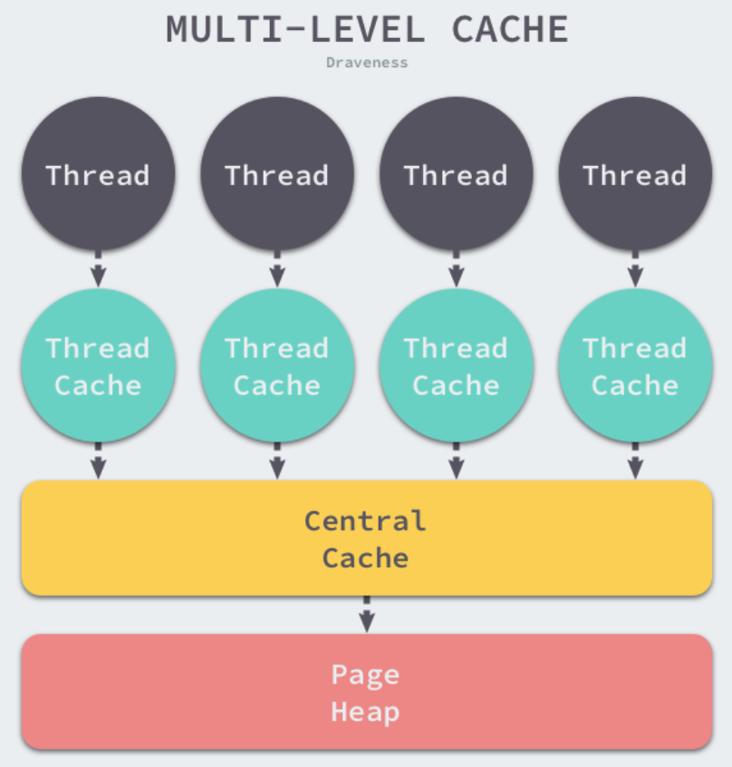

线程缓存属于每一个独立的线程，它能够满足线程上绝大多数的内存分配需求，因为不涉及多线程，所以也不需要使用互斥锁来保护内存，这能够减少锁竞争带来的性能损耗。当线程缓存不能满足需求时，运行时会使用中心缓存作为补充解决小对象的内存分配，在遇到 32KB 以上的对象时，内存分配器会选择页堆直接分配大内存。

这种多层级的内存分配设计与计算机操作系统中的多级缓存有些类似，因为多数的对象都是小对象，我们可以通过线程缓存和中心缓存提供足够的内存空间，发现资源不足时从上一级组件中获取更多的内存资源。

#### 1.1.3 虚拟内存布局

在 Go 语言 1.10 以前的版本，堆区的内存空间都是连续的；

但是在 1.11 版本，Go 团队使用稀疏的堆内存空间替代了连续的内存，解决了连续内存带来的限制以及在特殊场景下可能出现的问题。

##### 1. 线程内存

Go 语言程序的 1.10 版本在启动时会初始化整片虚拟内存区域，如下所示的三个区域 `spans`、`bitmap` 和 `arena` 分别预留了 512MB、16GB 以及 512GB 的内存空间，这些内存并不是真正存在的物理内存，而是虚拟内存：

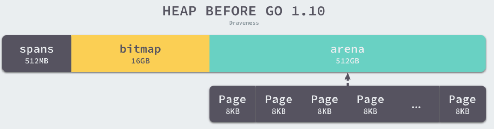

- `spans` 区域存储了指向内存管理单元 runtime.mspan的指针，每个内存单元会管理几页的内存空间，每页大小为 8KB
- `bitmap` 用于标识 `arena` 区域中的那些地址保存了对象，位图中的每个字节都会表示堆区中的 32 字节是否空闲
- `arena` 区域是真正的堆区，运行时会将 8KB 看做一页，这些内存页中存储了所有在堆上初始化的对象

对于任意一个地址，我们都可以根据 `arena` 的基地址计算该地址所在的页数并通过 `spans` 数组获得管理该片内存的管理单元 runtime.mspan。

Go 语言在垃圾回收时会根据指针的地址判断对象是否在堆中，并通过上一段中介绍的过程找到管理该对象的 runtime.mspan。这些都建立在**堆区的内存是连续的**这一假设上。这种设计虽然简单并且方便，但是在 C 和 Go 混合使用时会导致程序崩溃：

- 分配的内存地址会发生冲突，导致堆的初始化和扩容失败

- 没有被预留的大块内存可能会被分配给 C 语言的二进制，导致扩容后的堆不连续

线性的堆内存需要预留大块的内存空间，但是申请大块的内存空间而不使用是不切实际的，不预留内存空间却会在特殊场景下造成程序崩溃。

##### 2. 稀疏内存

稀疏内存是 Go 语言在 1.11 中提出的方案，使用稀疏的内存布局不仅能移除堆大小的上限，还能解决 C 和 Go 混合使用时的地址空间冲突问题。不过因为基于稀疏内存的内存管理失去了内存的连续性这一假设，这也使内存管理变得更加复杂：

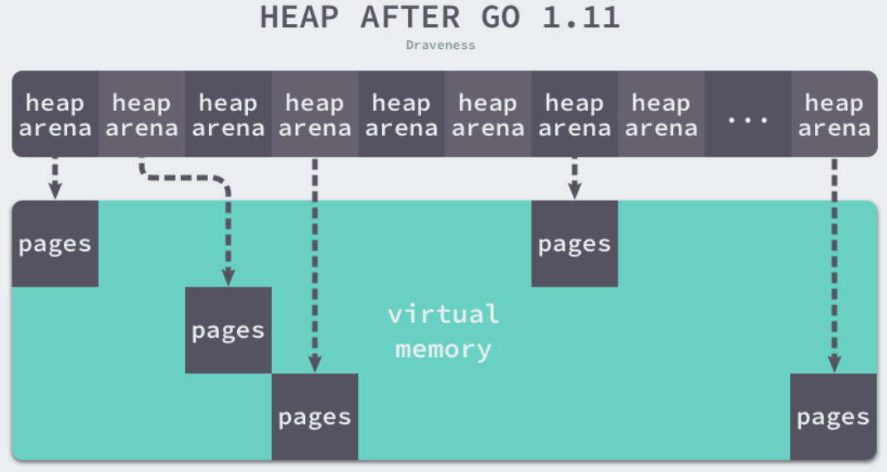

运行时使用二维的 `runtime.heapArena`数组管理所有的内存，每个单元都会管理 64MB 的内存空间：

```go
type heapArena struct {
	bitmap       [heapArenaBitmapBytes]byte
	spans        [pagesPerArena]*mspan
	pageInUse    [pagesPerArena / 8]uint8
	pageMarks    [pagesPerArena / 8]uint8
	pageSpecials [pagesPerArena / 8]uint8
	checkmarks   *checkmarksMap
	zeroedBase   uintptr
}
```

该结构体中的 `bitmap` 和 `spans` 与线性内存中的 `bitmap` 和 `spans` 区域一一对应，`zeroedBase` 字段指向了该结构体管理的内存的基地址。上述设计将原有的连续大内存切分成稀疏的小内存，而用于管理这些内存的元信息也被切成了小块。

#### 1.1.4 地址空间

因为所有的内存最终都是要从操作系统中申请的，所以 Go 语言的运行时构建了操作系统的内存管理抽象层，该抽象层将运行时管理的地址空间分成以下四种状态：

|    状态    |                             解释                             |
| :--------: | :----------------------------------------------------------: |
|   `None`   |         内存没有被保留或者映射，是地址空间的默认状态         |
| `Reserved` |        运行时持有该地址空间，但是访问该内存会导致错误        |
| `Prepared` | 内存被保留，一般没有对应的物理内存访问该片内存的行为是未定义的可以快速转换到 `Ready` 状态 |
|  `Ready`   |                        可以被安全访问                        |

每个不同的操作系统都会包含一组用于管理内存的特定方法，这些方法可以让内存地址空间在不同的状态之间转换，下图展示了不同状态之间的转换过程：

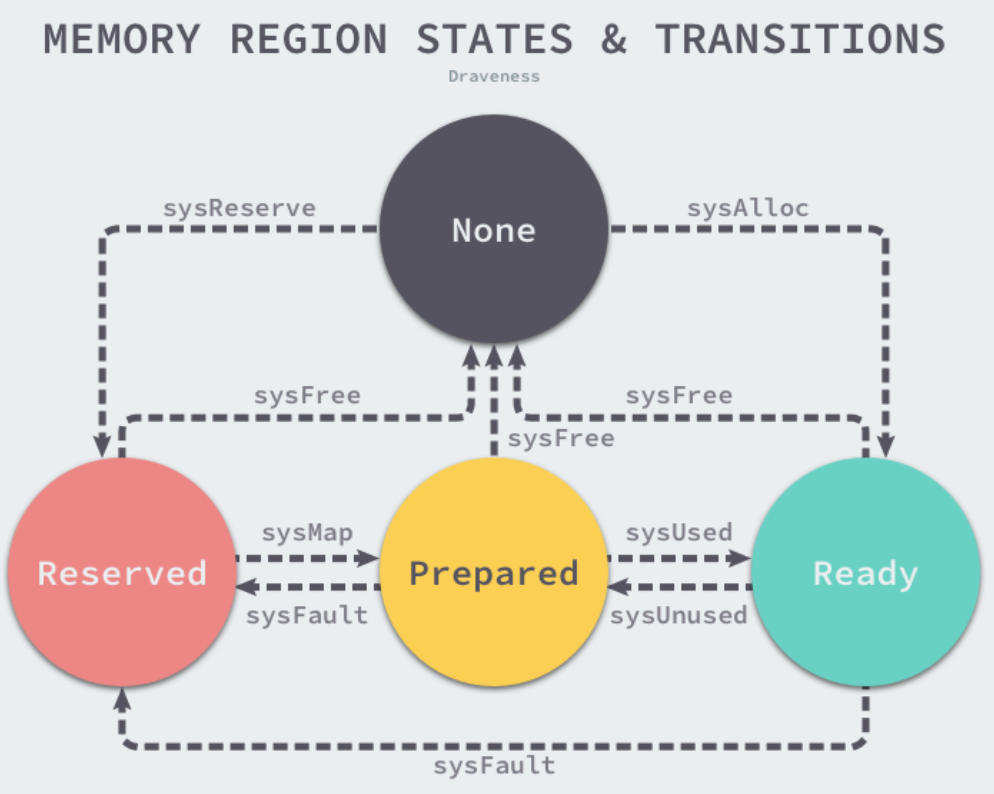

- `runtime.sysAlloc` 会从操作系统中获取一大块可用的内存空间，可能为几百 KB 或者几 MB；
- `runtime.sysFree`会在程序发生内存不足（Out-of Memory，OOM）时调用并无条件地返回内存；
- `runtime.sysReserve`会保留操作系统中的一片内存区域，访问这片内存会触发异常；
- `runtime.sysMap` 保证内存区域可以快速转换至就绪状态；
- `runtime.sysUsed`通知操作系统应用程序需要使用该内存区域，保证内存区域可以安全访问；
- `runtime.sysUnused`通知操作系统虚拟内存对应的物理内存已经不再需要，可以重用物理内存；
- `runtime.sysFault`将内存区域转换成保留状态，主要用于运行时的调试；

运行时使用 Linux 提供的 `mmap`、`munmap` 和 `madvise` 等系统调用实现了操作系统的内存管理抽象层，抹平了不同操作系统的差异，为运行时提供了更加方便的接口。

### 1.2 内存管理组件

Go 语言的内存分配器包含以下几个重要组件：

-  `runtime.mspan`：内存管理单元
- `runtime.mcache`：线程缓存
- `runtime.mcentral`：中心缓存
- `runtime.mheap`：页堆

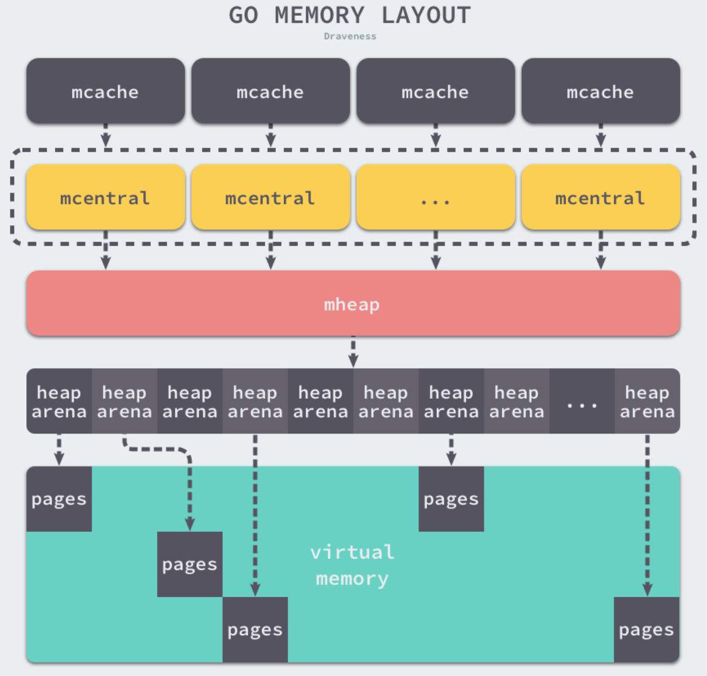

所有的 Go 语言程序都会在启动时初始化如上图所示的内存布局，每一个处理器都会分配一个线程缓存 `runtime.mcache` 用于处理微对象和小对象的分配，它们会持有内存管理单元 `runtime.mspan`。

每个类型的内存管理单元都会管理特定大小的对象，当内存管理单元中不存在空闲对象时，它们会从 `runtime.mheap`持有的 134 个中心缓存 `runtime.mcentral`中获取新的内存单元，中心缓存属于全局的堆结构体 `runtime.mheap`，它会从操作系统中申请内存。

在 amd64 的 Linux 操作系统上，`runtime.mheap`会持有 4,194,304 `runtime.heapArena`，每个 `runtime.heapArena`都会管理 64MB 的内存，单个 Go 语言程序的内存上限也就是 256TB。

#### 1.2.1 内存管理单元 mspan

`runtime.mspan`是 Go 语言内存管理的基本单元，该结构体中包含 `next` 和 `prev` 两个字段，它们分别指向了前一个和后一个 `runtime.mspan`。

串联后的`mspan`会构成如下双向链表，运行时会使用 `runtime.mSpanList`存储双向链表的头结点和尾节点并在线程缓存以及中心缓存中使用。

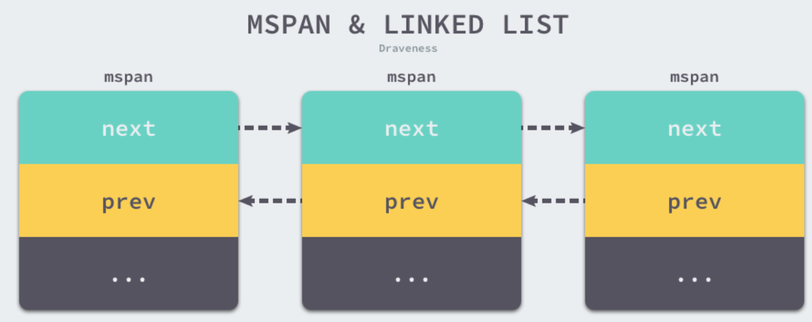

因为相邻的管理单元会互相引用，所以我们可以从任意一个结构体访问双向链表中的其他节点。

##### 1. 页和内存

每个 `runtime.mspan`都管理 `npages` 个大小为 8KB 的页，这里的页不是操作系统中的内存页，它们是操作系统内存页的整数倍，该结构体会使用下面这些字段来管理内存页的分配和回收：

```go
type mspan struct {
	startAddr uintptr // 起始地址 startAddr和npages确定管理的多个页所在内存
	npages    uintptr // 页数
	freeindex uintptr // 扫描页中空闲对象的初始索引

	allocBits  *gcBits // 标记内存占用情况
	gcmarkBits *gcBits // 标记内存回收情况
	allocCache uint64  // allocBits补码，用于快速查找内存中未被使用的内存
	...
}
```

`runtime.mspan`会以两种不同的视角看待管理的内存，当结构体管理的内存不足时，运行时会以页为单位向堆申请内存：


当用户程序或者线程向 `runtime.mspan`申请内存时，它会使用 `allocCache` 字段以对象为单位在管理的内存中快速查找待分配的空间：

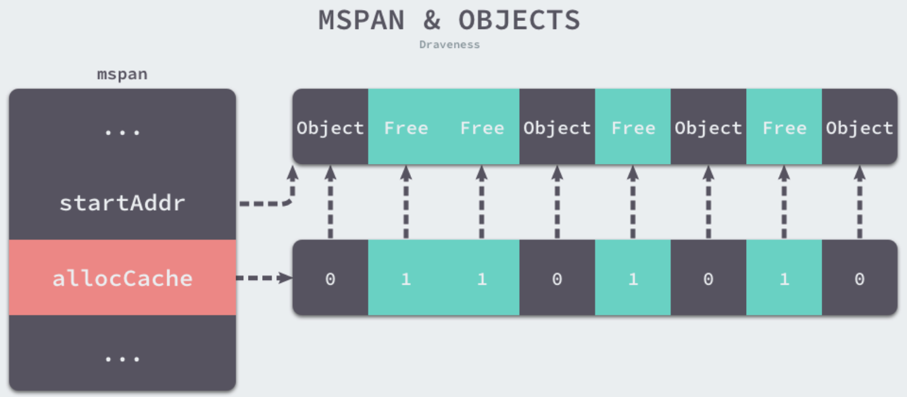

如果我们能在内存中找到空闲的内存单元会直接返回，当内存中不包含空闲的内存时，上一级的组件 `runtime.mcache`会为调用 `runtime.mcache.refill` 更新内存管理单元以满足为更多对象分配内存的需求。

##### 2. 状态

运行时会使用 `runtime.mSpanStateBox`存储内存管理单元的状态 `runtime.mSpanState`：

```go
type mspan struct {
	...
	state       mSpanStateBox
	...
}
```

该状态可能处于 `mSpanDead`、`mSpanInUse`、`mSpanManual` 和 `mSpanFree` 四种情况。当 `runtime.mspan`在空闲堆中，它会处于 `mSpanFree` 状态；当 `runtime.mspan`已经被分配时，它会处于 `mSpanInUse`、`mSpanManual` 状态，运行时会遵循下面的规则转换该状态：

- 在垃圾回收的任意阶段，可能从 `mSpanFree` 转换到 `mSpanInUse` 和 `mSpanManual`；
- 在垃圾回收的清除阶段，可能从 `mSpanInUse` 和 `mSpanManual` 转换到 `mSpanFree`；
- 在垃圾回收的标记阶段，不能从 `mSpanInUse` 和 `mSpanManual` 转换到 `mSpanFree`；

##### 3. 跨度类

`runtime.spanClass`是 `runtime.mspan`的跨度类，它决定了内存管理单元中存储的对象大小和个数：

```go
type mspan struct {
	...
	spanclass   spanClass
	...
}
```

Go 语言的内存管理模块中一共包含 67 种跨度类，每一个跨度类都会存储特定大小的对象并且包含特定数量的页数以及对象，所有的数据都会被预先计算好并存储在 `runtime.class_to_size`和 `runtime.class_to_allocnpages` 等变量中：

#### 1.2.2 线程缓存 mcache

`runtime.mcache`是Go语言中的线程缓存，它会与线程上的处理器一一绑定，主要用来缓存用户程序申请的微小对象。每一个线程缓存都持有 68 * 2 个 `runtime.mspan`，这些内存管理单元都存储在结构体的 `alloc` 字段中：

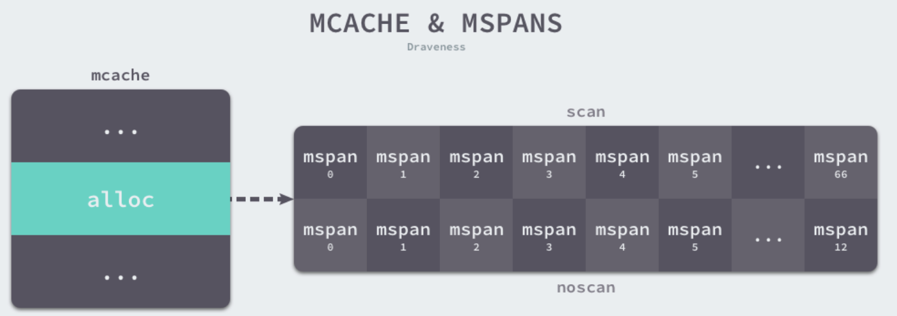

线程缓存在刚刚被初始化时是不包含 `runtime.mspan`的，只有当用户程序申请内存时才会从上一级组件获取新的 `runtime.mspan` 满足内存分配的需求。

**初始化**

运行时在初始化处理器时会调用 `runtime.allocmcache`初始化线程缓存，该函数会在系统栈中使用 `runtime.mheap`中的线程缓存分配器初始化新的 `runtime.mcache`结构体：

初始化后的 `runtime.mcache`中的所有 `runtime.mspan` 都是空的占位符 `emptymspan`。

**替换** 

`runtime.mcache.refill`会为线程缓存获取一个指定跨度类的内存管理单元，被替换的单元不能包含空闲的内存空间，而获取的单元中需要至少包含一个空闲对象用于分配内存

会从中心缓存中申请新的 `runtime.mspan`存储到线程缓存中，这也是向线程缓存插入内存管理单元的唯一方法。

**微分配器**

线程缓存中还包含几个用于分配微对象的字段，下面的这三个字段组成了微对象分配器，专门管理 16 字节以下的对象，微分配器只会用于分配非指针类型的内存。

```go
type mcache struct {
	tiny             uintptr // 指向堆中的一片内存
	tinyoffset       uintptr // 下一个空闲内存所在的偏移量
	local_tinyallocs uintptr // 内存分配器中分配的对象个数
}
```

#### 1.2.3 中心缓存 mcentral

`runtime.mcentral`是内存分配器的中心缓存，与线程缓存不同，访问中心缓存中的内存管理单元需要使用互斥锁：

```go
type mcentral struct {
	spanclass spanClass
	partial  [2]spanSet
	full     [2]spanSet
}
```

每个中心缓存都会管理某个跨度类的内存管理单元，它会同时持有两个 `runtime.spanSet`，分别存储包含空闲对象和不包含空闲对象的内存管理单元。

##### 1. 内存管理单元

线程缓存会通过中心缓存的 `runtime.mcentral.cacheSpan`方法获取新的内存管理单元，该方法的实现比较复杂，我们可以将其分成以下几个部分：

- 从清理过的、包含空闲空间的 `runtime.spanSet`结构中查找可以使用的内存管理单元

- 从未被清理过的、有空闲对象的 `runtime.spanSet`结构中查找可以使用的内存管理单元

- 获取未被清理的、不包含空闲空间的 `runtime.spanSet`中获取内存管理单元并通过 `runtime.mspan.sweep` 清理它的内存空间；

- 调用 `runtime.mcentral.grow`从堆中申请新的内存管理单元；

- 更新内存管理单元的 `allocCache` 等字段帮助快速分配内存；

##### 2. 扩容

中心缓存的扩容方法 `runtime.mcentral.grow`会根据预先计算的 `class_to_allocnpages` 和 `class_to_size` （存储对象大小数量及页数）获取待分配的页数以及跨度类并调用 `runtime.mheap.alloc`获取新的 `runtime.mspan`结构。

#### 1.2.4 页堆 mheap

`runtime.mheap`是内存分配的核心结构体，Go 语言程序会将其作为全局变量存储，而堆上初始化的所有对象都由该结构体统一管理，该结构体中包含两组非常重要的字段，其中一个是全局的中心缓存列表 `central`，另一个是管理堆区内存区域的 `arenas` 以及相关字段。

页堆中包含一个长度为 136 的 `runtime.mcentral`数组，其中 68 个为跨度类需要 `scan` 的中心缓存，另外的 68 个是 `noscan` 的中心缓存，下图为页堆与中心缓存列表：

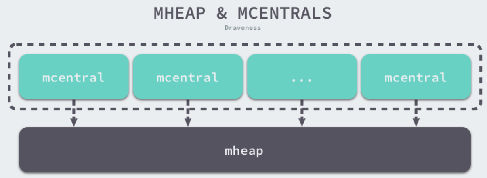

Go 语言所有的内存空间都由如下所示的二维矩阵 `runtime.heapArena`管理，这个二维矩阵管理的内存可以是不连续的：

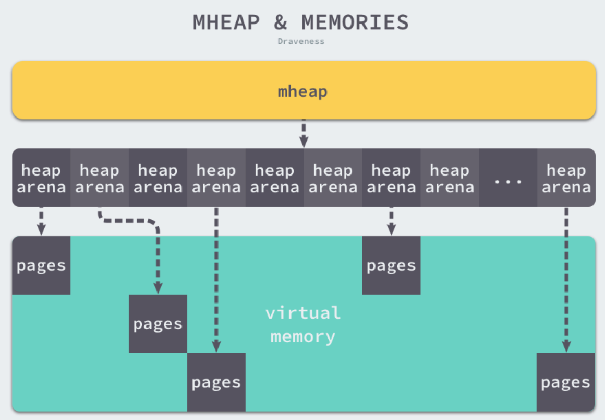

 64 位操作系统中，每一个 `runtime.heapArena`都会管理 64MB 的内存空间。

##### 1. 初始化

堆区的初始化会使用 `runtime.mheap.init`方法，我们能看到该方法初始化了非常多的结构体和字段，不过其中初始化的两类变量比较重要：

- `spanalloc`、`cachealloc` 以及 `arenaHintAlloc` 等 `runtime.fixalloc`类型的空闲链表分配器

- `central` 切片中 `runtime.mcentral`类型的中心缓存

##### 2. 内存管理单元

`runtime.mheap`是内存分配器中的核心组件，运行时会通过它的 `runtime.mheap.alloc`方法在系统栈中获取新的 `runtime.mspan` 单元。

##### 3. 扩容

`runtime.mheap.grow` 会向操作系统申请更多的内存空间，传入的页数经过对齐可以得到期望的内存大小，我们可以将该方法的执行过程分成以下几个部分：

- 通过传入的页数获取期望分配的内存空间大小以及内存的基地址；

- 如果 `arena` 区域没有足够的空间，调用 `runtime.mheap.sysAlloc`从操作系统中申请更多的内存；

- 扩容 `runtime.mheap`持有的 `arena` 区域并更新页分配器的元信息；

- 在某些场景下，调用 `runtime.pageAlloc.scavenge`回收不再使用的空闲内存页；

### 1.3 内存分配

堆上所有的对象都会通过调用 `runtime.newobject`函数分配内存，该函数会调用 `runtime.mallocgc`分配指定大小的内存空间，这也是用户程序向堆上申请内存空间的必经函数。

`runtime.mallocgc`会根据对象的大小执行不同的分配逻辑。运行时根据对象大小将它们分成微对象、小对象和大对象，会根据大小选择不同的分配逻辑：

- 微对象 `(0, 16B)` ：先使用微型分配器，再依次尝试线程缓存、中心缓存和堆分配内存；
- 小对象 `[16B, 32KB]` ： 依次尝试使用线程缓存、中心缓存和堆分配内存；
- 大对象 `(32KB, +∞)` ：直接在堆上分配内存；

#### 1.3.1 微对象

Go 语言运行时将小于 16 字节的对象划分为微对象，它会使用线程缓存上的微分配器提高微对象分配的性能，我们主要使用它来分配较小的字符串以及逃逸的临时变量。微分配器可以将多个较小的内存分配请求合入同一个内存块中，只有当内存块中的所有对象都需要被回收时，整片内存才可能被回收。

微分配器管理的对象不可以是指针类型，管理多个对象的内存块大小 `maxTinySize` 是可以调整的，在默认情况下，内存块的大小为 16 字节。`maxTinySize` 的值越大，组合多个对象的可能性就越高，内存浪费也就越严重；`maxTinySize` 越小，内存浪费就会越少，不过无论如何调整，8 的倍数都是一个很好的选择。

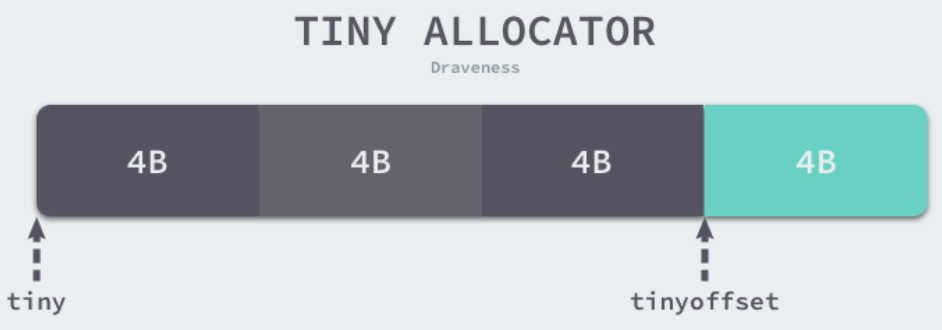

微分配器已经在 16 字节的内存块中分配了 12 字节的对象，如果下一个待分配的对象小于 4 字节，它会直接使用上述内存块的剩余部分，减少内存碎片，不过该内存块只有所有对象都被标记为垃圾时才会回收。

#### 1.3.2 小对象

小对象是指大小为 16 字节到 32,768 字节的对象以及所有小于 16 字节的指针类型的对象，小对象的分配可以被分成以下的三个步骤：

- 确定分配对象的大小以及跨度类 `runtime.spanClass`

- 从线程缓存、中心缓存或者堆中获取内存管理单元并从内存管理单元找到空闲的内存空间

- 调用 `runtime.memclrNoHeapPointers`清空空闲内存中的所有数据；

#### 1.3.3 大对象

运行时对于大于 32KB 的大对象会单独处理，我们不会从线程缓存或者中心缓存中获取内存管理单元，而是直接调用 `runtime.mcache.allocLarge`分配大片内存。

## 2. 垃圾收集器

### 2.1 设计原理

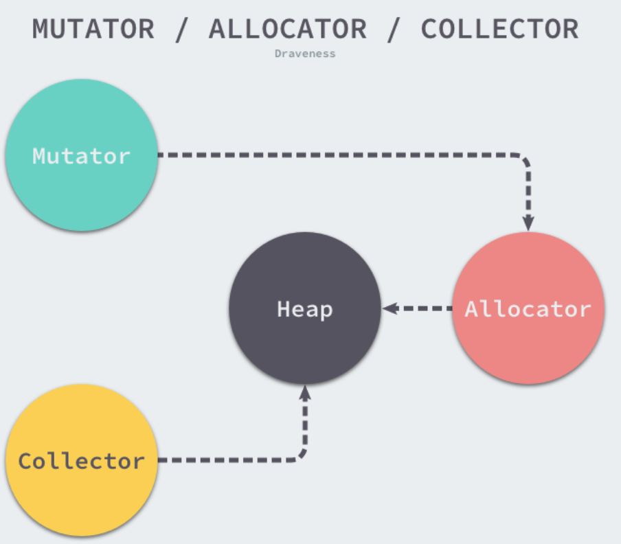

在上图中，用户程序（Mutator）会通过内存分配器（Allocator）在堆上申请内存，而垃圾收集器（Collector）负责回收堆上的内存空间，内存分配器和垃圾收集器共同管理着程序中的堆内存空间。

#### 2.1.1 标记清除

标记清除（Mark-Sweep）算法是最常见的垃圾收集算法，标记清除收集器是跟踪式垃圾收集器，其执行过程可以分成标记（Mark）和清除（Sweep）两个阶段：

1. 标记阶段 — 从根对象出发查找并标记堆中所有存活的对象
2. 清除阶段 — 遍历堆中的全部对象，回收未被标记的垃圾对象并将回收的内存加入空闲链表

这里介绍的是最传统的标记清除算法，垃圾收集器从垃圾收集的根对象出发，递归遍历这些对象指向的子对象并将所有可达的对象标记成存活；标记阶段结束后，垃圾收集器会依次遍历堆中的对象并清除其中的垃圾，整个过程需要标记对象的存活状态，用户程序在垃圾收集的过程中也不能执行。

#### 2.1.2 三色标记

为了解决原始标记清除算法带来的长时间 STW，多数现代的追踪式垃圾收集器都会实现三色标记算法的变种以缩短 STW 的时间。三色标记算法将程序中的对象分成白色、黑色和灰色三类[4](https://draveness.me/golang/docs/part3-runtime/ch07-memory/golang-garbage-collector/#fn:4)：

- 白色对象 — 潜在的垃圾，其内存可能会被垃圾收集器回收；
- 黑色对象 — 活跃的对象，包括不存在任何引用外部指针的对象以及从根对象可达的对象；
- 灰色对象 — 活跃的对象，因为存在指向白色对象的外部指针，垃圾收集器会扫描这些对象的子对象；

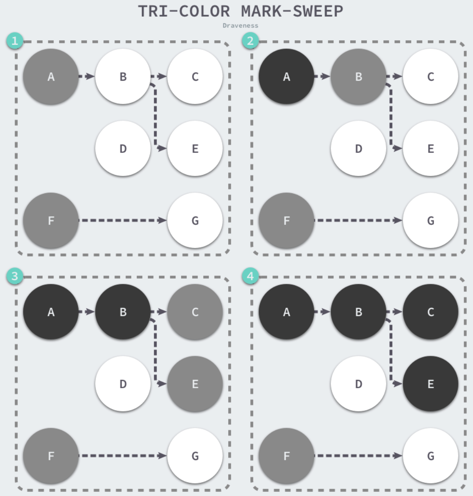

三色标记垃圾收集器的工作原理很简单，我们可以将其归纳成以下几个步骤：

1. 从灰色对象的集合中选择一个灰色对象并将其标记成黑色
2. 将黑色对象指向的所有对象都标记成灰色，保证该对象和被该对象引用的对象都不会被回收
3. 重复上述两个步骤直到对象图中不存在灰色对象

当三色的标记清除的标记阶段结束之后，应用程序的堆中就不存在任何的灰色对象，我们只能看到黑色的存活对象以及白色的垃圾对象，垃圾收集器可以回收这些白色的垃圾：

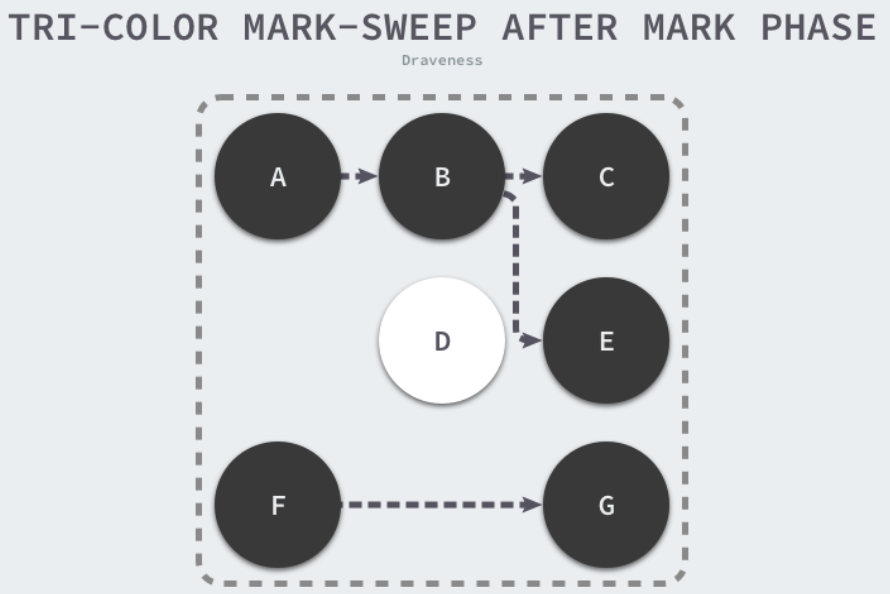

因为用户程序可能在标记执行的过程中修改对象的指针，所以三色标记清除算法本身是不可以并发或者增量执行的，它仍然需要 STW，否则可能导致本来不应该被回收的对象却被回收了，这在内存管理中是非常严重的错误，我们将这种错误称为悬挂指针，即指针没有指向特定类型的合法对象，影响了内存的安全性[5](https://draveness.me/golang/docs/part3-runtime/ch07-memory/golang-garbage-collector/#fn:5)，想要并发或者增量地标记对象还是需要使用屏障技术。

#### 2.1.3 屏障技术

内存屏障技术是一种屏障指令，它可以让 CPU 或者编译器在执行内存相关操作时遵循特定的约束，目前多数的现代处理器都会乱序执行指令以最大化性能，但是该技术能够保证内存操作的顺序性，在内存屏障前执行的操作一定会先于内存屏障后执行的操作。

想要在并发或者增量的标记算法中保证正确性，我们需要达成以下两种三色不变性（Tri-color invariant）中的一种：

- 强三色不变性 — 黑色对象不会指向白色对象，只会指向灰色对象或者黑色对象
- 弱三色不变性 — 黑色对象指向的白色对象必须包含一条从灰色对象经由多个白色对象的可达路径

垃圾收集中的屏障技术更像是一个钩子方法，它是在用户程序读取对象、创建新对象以及更新对象指针时执行的一段代码，根据操作类型的不同，我们可以将它们分成读屏障（Read barrier）和写屏障（Write barrier）两种，因为读屏障需要在读操作中加入代码片段，对用户程序的性能影响很大，所以编程语言往往都会采用写屏障保证三色不变性。

##### 1. 插入写屏障

```she
writePointer(slot, ptr):
    shade(ptr)
    *slot = ptr
```

述插入写屏障的伪代码非常好理解，每当执行类似 `*slot = ptr` 的表达式时，我们会执行上述写屏障通过 `shade` 函数尝试改变指针的颜色。如果 `ptr` 指针是白色的，那么该函数会将该对象设置成灰色，其他情况则保持不变。

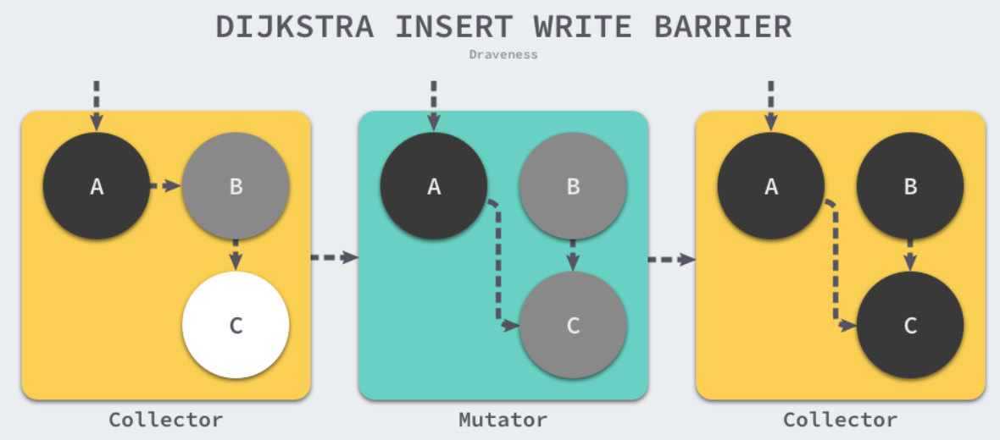

假设我们在应用程序中使用 Dijkstra 提出的插入写屏障，在一个垃圾收集器和用户程序交替运行的场景中会出现如上图所示的标记过程：

1. 垃圾收集器将根对象指向 A 对象标记成黑色并将 A 对象指向的对象 B 标记成灰色
2. 用户程序修改 A 对象的指针，将原本指向 B 对象的指针指向 C 对象，这时触发写屏障将 C 对象标记成灰色
3. 垃圾收集器依次遍历程序中的其他灰色对象，将它们分别标记成黑色

Dijkstra 的插入写屏障是一种相对保守的屏障技术，它会将**有存活可能的对象都标记成灰色**以满足强三色不变性。

##### 2. 删除写屏障

```shell
writePointer(slot, ptr)
    shade(*slot)
    *slot = ptr
```

上述代码会在老对象的引用被删除时，将白色的老对象涂成灰色，这样删除写屏障就可以保证弱三色不变性，老对象引用的下游对象一定可以被灰色对象引用。

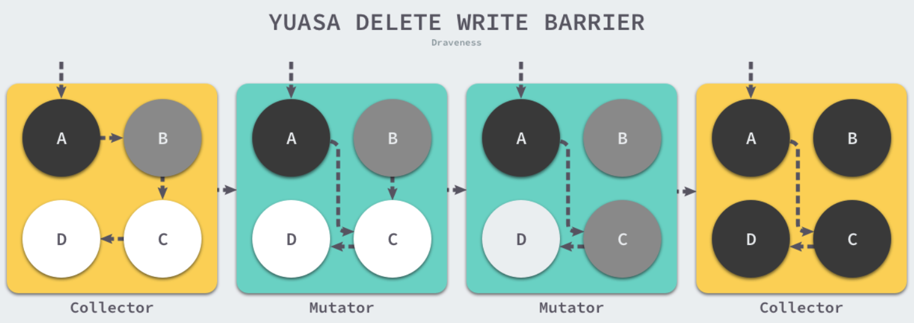

假设我们在应用程序中使用 Yuasa 提出的删除写屏障，在一个垃圾收集器和用户程序交替运行的场景中会出现如上图所示的标记过程：

1. 垃圾收集器将根对象指向 A 对象标记成黑色并将 A 对象指向的对象 B 标记成灰色；
2. 用户程序将 A 对象原本指向 B 的指针指向 C，触发删除写屏障，但是因为 B 对象已经是灰色的，所以不做改变；
3. **用户程序将 B 对象原本指向 C 的指针删除，触发删除写屏障，白色的 C 对象被涂成灰色**；
4. 垃圾收集器依次遍历程序中的其他灰色对象，将它们分别标记成黑色；

### 2.2 演进过程

我们从 Go 语言垃圾收集器的演进能够看到该组件的实现和算法变得越来越复杂，最开始的垃圾收集器还是不精确的单线程 STW 收集器，但是最新版本的垃圾收集器却支持并发垃圾收集、去中心化协调等特性。

#### 2.2.1 并发垃圾收集

Go 语言在 v1.5 中引入了并发的垃圾收集器，该垃圾收集器使用了我们上面提到的三色抽象和写屏障技术保证垃圾收集器执行的正确性，工作流程如下：

首先，并发垃圾收集器必须在合适的时间点触发垃圾收集循环，假设我们的 Go 语言程序运行在一台 4 核的物理机上，那么在垃圾收集开始后，收集器会占用 25% 计算资源在后台来扫描并标记内存中的对象：

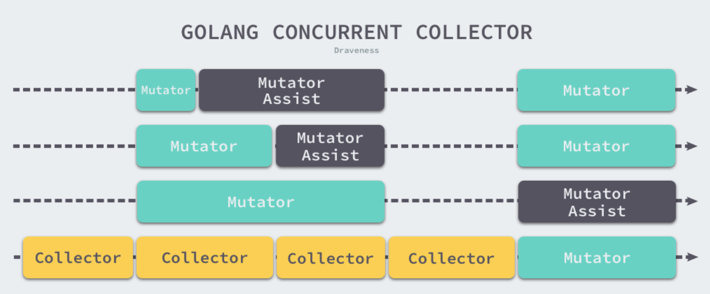

Go 语言的并发垃圾收集器会在扫描对象之前暂停程序做一些标记对象的准备工作，其中包括启动后台标记的垃圾收集器以及开启写屏障，如果在后台执行的垃圾收集器不够快，应用程序申请内存的速度超过预期，运行时会让申请内存的应用程序辅助完成垃圾收集的扫描阶段，在标记和标记终止阶段结束之后就会进入异步的清理阶段，将不用的内存增量回收。

#### 2.2.2 回收堆目标

STW 的垃圾收集器虽然需要暂停程序，但是它能够有效地控制堆内存的大小，Go 语言运行时的默认配置会在堆内存达到上一次垃圾收集的 2 倍时，触发新一轮的垃圾收集，这个行为可以通过环境变量 `GOGC` 调整，在默认情况下它的值为 100，即增长 100% 的堆内存才会触发 GC。

因为并发垃圾收集器会与程序一起运行，所以它无法准确的控制堆内存的大小，并发收集器需要在达到目标前触发垃圾收集，这样才能够保证内存大小的可控，并发收集器需要尽可能保证垃圾收集结束时的堆内存与用户配置的 `GOGC` 一致。

#### 2.2.3 混合写屏障

在 Go 语言 v1.7 版本之前，运行时会使用 Dijkstra 插入写屏障保证强三色不变性，但是运行时并没有在所有的垃圾收集根对象上开启插入写屏障。因为应用程序可能包含成百上千的 Goroutine，而垃圾收集的根对象一般包括全局变量和栈对象，如果运行时需要在几百个 Goroutine 的栈上都开启写屏障，会带来巨大的额外开销，所以 Go 团队在实现上选择了在标记阶段完成时**暂停程序、将所有栈对象标记为灰色并重新扫描**，在活跃 Goroutine 非常多的程序中，重新扫描的过程需要占用 10 ~ 100ms 的时间。

Go 语言在 v1.8 组合 Dijkstra 插入写屏障和 Yuasa 删除写屏障构成了如下所示的混合写屏障，该写屏障会**将被覆盖的对象标记成灰色并在当前栈没有扫描时将新对象也标记成灰色**：

```she
writePointer(slot, ptr):
    shade(*slot)
    if current stack is grey:
        shade(ptr)
    *slot = ptr
```

为了移除栈的重扫描过程，除了引入混合写屏障之外，在垃圾收集的标记阶段，我们还需要**将创建的所有新对象都标记成黑色**，防止新分配的栈内存和堆内存中的对象被错误地回收，因为栈内存在标记阶段最终都会变为黑色，所以不再需要重新扫描栈空间。

### 2.3 实现原理

需要初步了解最新垃圾收集器的执行周期，Go 语言的垃圾收集可以分成清除终止、标记、标记终止和清除四个不同阶段，它们分别完成了不同的工作：

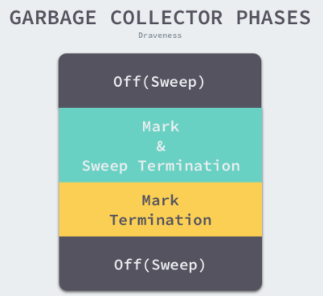

1. 清理终止阶段

-  **暂停程序**，所有的处理器在这时会进入安全点（Safe point）
-  如果当前垃圾收集循环是强制触发的，我们还需要处理还未被清理的内存管理单元

2. 标记阶段

- 将状态切换至 `_GCmark`、开启写屏障、用户程序协助（Mutator Assists）并将根对象入队

- 恢复执行程序，标记进程和用于协助的用户程序会开始并发标记内存中的对象，写屏障会将被覆盖的指针和新指针都标记成灰色，而所有新创建的对象都会被直接标记成黑色
- 开始扫描根对象，包括所有 Goroutine 的栈、全局对象以及不在堆中的运行时数据结构，扫描 Goroutine 栈期间会暂停当前处理器
- 依次处理灰色队列中的对象，将对象标记成黑色并将它们指向的对象标记成灰色
- 使用分布式的终止算法检查剩余的工作，发现标记阶段完成后进入标记终止阶段

3. 标记终止阶段

- **暂停程序**、将状态切换至 `_GCmarktermination` 并关闭辅助标记的用户程序
- 清理处理器上的线程缓存

4. 清理阶段

- 将状态切换至 `_GCoff` 开始清理阶段，初始化清理状态并关闭写屏障
- 后台并发清理所有的内存管理单元，当 Goroutine 申请新的内存管理单元时就会触发清理

## 3. 栈空间管理

应用程序的内存一般会分成堆区和栈区，程序在运行期间可以主动从堆区申请内存空间，这些内存由内存分配器分配并由垃圾收集器负责回收。本节介绍GO语言栈内存管理。

### 3.1 设计原理

栈区的内存一般由编译器自动分配和释放，其中存储着函数的入参以及局部变量，这些参数会随着函数的创建而创建，函数的返回而消亡，一般不会在程序中长期存在，这种线性的内存分配策略有着极高地效率，但是工程师也往往不能控制栈内存的分配，这部分工作基本都是由编译器完成的。

#### 3.1.1 寄存器

寄存器[1](https://draveness.me/golang/docs/part3-runtime/ch07-memory/golang-stack-management/#fn:1)是中央处理器（CPU）中的稀缺资源，它的存储能力非常有限，但是能提供最快的读写速度，充分利用寄存器的速度可以构建高性能的应用程序。寄存器在物理机上非常有限，然而栈区的操作会使用到两个以上的寄存器，这足以说明栈内存在应用程序的重要性。

栈寄存器是 CPU 寄存器中的一种，它的主要作用是跟踪函数的调用栈，Go 语言的汇编代码包含 BP 和 SP 两个栈寄存器，它们分别存储了栈的基址指针和栈顶的地址，栈内存与函数调用的关系非常紧密，BP 和 SP 之间的内存就是当前函数的调用栈。


栈区内存都是从高地址向低地址扩展的，当应用程序申请或者释放栈内存时只需要修改 SP 寄存器的值，这种线性的内存分配方式与堆内存相比更加快速，仅会带来极少的额外开销。

#### 3.1.2 线程栈

如果我们在 Linux 操作系统中执行 `pthread_create` 系统调用，进程会启动一个新的线程，如果用户没有通过软资源限制 `RLIMIT_STACK` 指定线程栈的大小，那么操作系统会根据架构选择不同的默认栈大小。

|  架构   | 默认栈大小 |
| :-----: | :--------: |
|  i386   |    2 MB    |
|  IA-64  |   32 MB    |
| PowerPC |    4 MB    |
|    …    |     …      |
| x86_64  |    2 MB    |

用户程序可以在分配的栈上存储函数参数和局部变量。然而这个固定的栈大小在某些场景下不是合适的值，如果程序需要同时运行几百个甚至上千个线程，这些线程中的大部分都只会用到很少的栈空间，当函数的调用栈非常深时，固定栈大小也无法满足用户程序的需求。

线程和进程都是代码执行的上下文，但是如果一个应用程序包含成百上千个执行上下文并且每个上下文都是线程，会占用大量的内存空间并带来其他的额外开销，Go 语言在设计时认为执行上下文是轻量级的，所以它在用户态实现 Goroutine 作为执行上下文。

#### 3.1.3 逃逸分析

但是手动分配内存会导致如下的两个问题：

1. 不需要分配到堆上的对象分配到了堆上 — 浪费内存空间
2. 需要分配到堆上的对象分配到了栈上 — 悬挂指针、影响内存安全

与悬挂指针相比，浪费内存空间反而是小问题。在 C 语言中，栈上的变量被函数作为返回值返回给调用方是一个常见的错误，在如下所示的代码中，栈上的变量 `i` 被错误返回：

```c
int *dangling_pointer() {
    int i = 2;
    return &i;
}
```

当 `dangling_pointer` 函数返回后，它的本地变量会被编译器回收，调用方获取的是危险的悬挂指针。

在编译器优化中，逃逸分析是用来决定指针动态作用域的方法。Go 语言的编译器使用逃逸分析决定哪些变量应该在栈上分配，哪些变量应该在堆上分配，其中包括使用 `new`、`make` 和字面量等方法隐式分配的内存，Go 语言的逃逸分析遵循以下两个不变性：

1. 指向栈对象的指针不能存在于堆中；
2. 指向栈对象的指针不能在栈对象回收后存活；

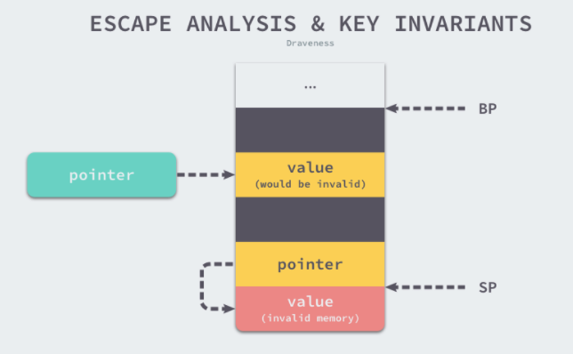

我们通过上图展示两条不变性存在的意义，当我们违反了第一条不变性时，堆上的绿色指针指向了栈中的黄色内存，一旦函数返回后函数栈会被回收，该绿色指针指向的值就不再合法；如果我们违反了第二条不变性，因为寄存器 SP 下面的内存由于函数返回已经释放，所以黄色指针指向的内存已经不再合法。

#### 3.1.4 栈内存空间

Go 语言使用用户态线程 Goroutine 作为执行上下文，它的额外开销和默认栈大小都比线程小很多，然而 Goroutine 的栈内存空间和栈结构也在早期几个版本中发生过一些变化：

1.  v1.0 ~ v1.1 — 最小栈内存空间为 4KB

2. v1.2 — 将最小栈内存提升到了 8KB

3. v1.3 — 使用**连续栈**替换之前版本的分段栈

4. v1.4 — 将最小栈内存降低到了 2KB

##### 1. 分段栈

分段栈是 Go 语言在 v1.3 版本之前的实现，所有 Goroutine 在初始化时都会调用 `runtime.stackalloc:go1.2`分配一块固定大小的内存空间，这块内存的大小由 `runtime.StackMin:go1.2`表示，在 v1.2 版本中为 8KB：

如果通过该方法申请的内存大小为固定的 8KB 或者满足其他的条件，运行时会在全局的栈缓存链表中找到空闲的内存块并作为新 Goroutine 的栈空间返回；在其余情况下，栈内存空间会从堆上申请一块合适的内存。

当 Goroutine 调用的函数层级或者局部变量需要的越来越多时，运行时会调用 `runtime.morestack:go1.2`和 `runtime.newstack:go1.2`创建一个新的栈空间，这些栈空间虽然不连续，但是当前 Goroutine 的多个栈空间会以链表的形式串联起来，运行时会通过指针找到连续的栈片段：

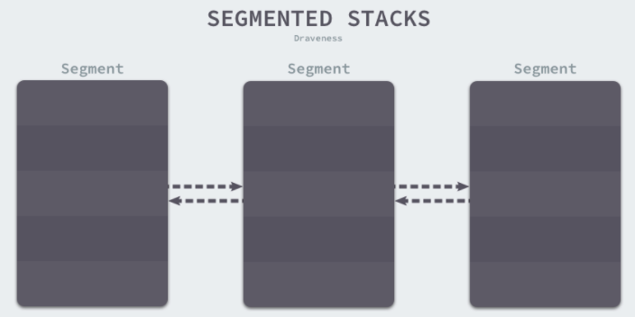

分段栈机制虽然能够按需为当前 Goroutine 分配内存并且及时减少内存的占用，但是它也存在两个比较大的问题：

- 如果当前 Goroutine 的栈几乎充满，那么任意的函数调用都会触发栈扩容，当函数返回后又会触发栈的收缩，如果在一个循环中调用函数，栈的分配和释放就会造成巨大的额外开销，这被称为热分裂问题（Hot split）；

- 一旦 Goroutine 使用的内存**越过**了分段栈的扩缩容阈值，运行时会触发栈的扩容和缩容，带来额外的工作量；

##### 2. 连续栈

连续栈可以解决分段栈中存在的两个问题，其核心原理是每当程序的栈空间不足时，初始化一片更大的栈空间并将原栈中的所有值都迁移到新栈中，新的局部变量或者函数调用就有充足的内存空间。使用连续栈机制时，栈空间不足导致的扩容会经历以下几个步骤：

1. 在内存空间中分配更大的栈内存空间
2. 将旧栈中的所有内容复制到新栈中
3. **将指向旧栈对应变量的指针重新指向新栈**
4. 销毁并回收旧栈的内存空间

因为需要拷贝变量和调整指针，连续栈增加了栈扩容时的额外开销，但是通过合理栈缩容机制就能避免热分裂带来的性能问题。在 GC 期间如果 Goroutine 使用了栈内存的四分之一，那就将其内存减少一半，这样在栈内存几乎充满时也只会扩容一次，不会因为函数调用频繁扩缩容。

### 3.2 栈操作

Go 语言中的执行栈由 `runtime.stack`表示，该结构体中只包含两个字段，分别表示栈的顶部和栈的底部，每个栈结构体都表示范围为 `[lo, hi)` 的内存空间：

```go
type stack struct {
	lo uintptr
	hi uintptr
}
```


