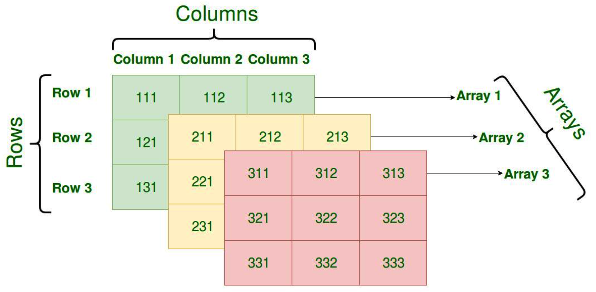
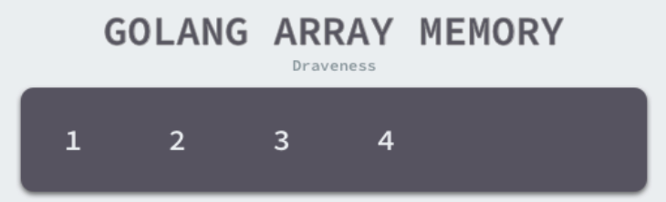
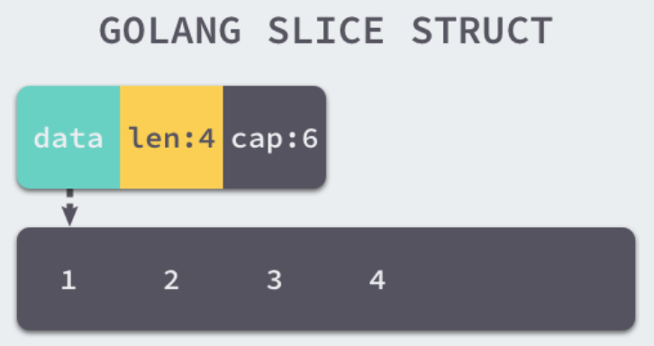

## 1. 数组

数组和切片是 Go 语言中常见的数据结构，很多刚刚使用 Go 的开发者往往会混淆这两个概念。数组作为最常见的集合在编程语言中是非常重要的，除了数组之外，Go 语言引入了另一个概念 — 切片，切片与数组有一些类似，但是它们的不同导致了使用上的巨大差别。

### 1.1 概述

数组是由相同类型元素的集合组成的数据结构，计算机会为数组分配一块连续的内存来保存其中的元素，我们可以利用数组中元素的索引快速访问特定元素，常见的数组大多都是一维的线性数组，而多维数组在数值和图形计算领域却有比较常见的应用。



数组作为一种基本的数据类型，我们通常会从两个维度描述数组，也就是数组中存储的元素类型和数组最大能存储的元素个数，在 Go 语言中我们往往会使用如下所示的方式来表示数组类型：

```go
[10]int
[200]interface{}
```

Go 语言数组在初始化之后大小就无法改变，存储元素类型相同、但是大小不同的数组类型在 Go 语言看来也是完全不同的，只有两个条件都相同才是同一类型。元素类型 `Elem` 和数组的大小 `Bound`，这两个字段共同构成了数组类型。

### 1.2 初始化

Go 语言的数组有两种不同的创建方式，一种是显式的指定数组大小，另一种是使用 `[...]T` 声明数组，Go 语言会在编译期间通过源代码推导数组的大小：

```go
arr1 := [3]int{1, 2, 3}
arr2 := [...]int{1, 2, 3}
```

#### 3.2.1 上限推导

两种不同的声明方式会导致编译器做出完全不同的处理，

如果我们使用第一种方式 `[10]T`，那么变量的类型在编译进行到类型检查阶段就会被提取出来，随后使用 `cmd/compile/internal/types.NewArray`创建包含数组大小的 `cmd/compile/internal/types.Array`结构体。

当我们使用 `[...]T` 的方式声明数组时，编译器会在的 `cmd/compile/internal/gc.typecheckcomplit`函数中对该数组的大小进行推导。

#### 3.2.2 语句转换

对于一个由字面量组成的数组，根据数组元素数量的不同，编译器会在负责初始化字面量的 `cmd/compile/internal/gc.anylit` 函数中做两种不同的优化：

- 当元素数量小于或者等于 4 个时，会直接将数组中的元素放置在栈上

- 当元素数量大于 4 个时，会将数组中的元素放置到静态区并在运行时取出

当数组的元素**小于或者等于四个**时，`cmd/compile/internal/gc.fixedlit` 会负责在函数编译之前将 `[3]{1, 2, 3}` 转换成更加原始的语句：

```go
var arr [3]int
arr[0] = 1
arr[1] = 2
arr[2] = 3
```

会将原有的初始化语句 `[3]int{1, 2, 3}` 拆分成一个声明变量的表达式和几个赋值表达式，这些表达式会完成对数组的初始化。

但是如果当前数组的元素大于四个，`cmd/compile/internal/gc.anylit`会先获取一个唯一的 `staticname`，然后调用 `cmd/compile/internal/gc.fixedlit` 函数在静态存储区初始化数组中的元素并将临时变量赋值给数组：

假设代码需要初始化 `[5]int{1, 2, 3, 4, 5}`，那么我们可以将上述过程理解成以下的伪代码：

```go
var arr [5]int
statictmp_0[0] = 1
statictmp_0[1] = 2
statictmp_0[2] = 3
statictmp_0[3] = 4
statictmp_0[4] = 5
arr = statictmp_0
```

总结起来，在不考虑逃逸分析的情况下，如果数组中元素的个数小于或者等于 4 个，那么所有的变量会直接在栈上初始化，如果数组元素大于 4 个，变量就会在静态存储区初始化然后拷贝到栈上，这些转换后的代码才会继续进入中间代码生成和机器码生成两个阶段，最后生成可以执行的二进制文件。

### 1.3 访问和赋值

无论是在栈上还是静态存储区，数组在内存中都是一连串的内存空间，我们通过指向数组开头的指针、元素的数量以及元素类型占的空间大小表示数组。如果我们不知道数组中元素的数量，访问时可能发生越界；而如果不知道数组中元素类型的大小，就没有办法知道应该一次取出多少字节的数据，无论丢失了哪个信息，我们都无法知道这片连续的内存空间到底存储了什么数据：



数组访问越界是非常严重的错误，Go 语言中可以在编译期间的静态类型检查判断数组越界，`cmd/compile/internal/gc.typecheck1`会验证访问数组的索引：

- 访问数组的索引是非整数时，报错 “non-integer array index %v”；

- 访问数组的索引是负数时，报错 “invalid array index %v (index must be non-negative)"；

- 访问数组的索引越界时，报错 “invalid array index %v (out of bounds for %d-element array)"；

数组和字符串的一些简单越界错误都会在编译期间发现，例如：直接使用整数或者常量访问数组；但是如果使用变量去访问数组或者字符串时，编译器就无法提前发现错误，我们需要 Go 语言运行时阻止不合法的访问：

```go
arr[4]: invalid array index 4 (out of bounds for 3-element array)
arr[i]: panic: runtime error: index out of range [4] with length 3
```

## 2. 切片

常用的数据结构是切片，即动态数组，其长度并不固定，我们可以向切片中追加元素，它会在容量不足时自动扩容。在 Go 语言中，切片类型的声明方式与数组有一些相似，不过由于切片的长度是动态的，所以声明时只需要指定切片中的元素类型：

```go
[]int
[]interface{}
```

从切片的定义我们能推测出，切片在编译期间的生成的类型只会包含切片中的元素类型，即 `int` 或者 `interface{}` 等。`cmd/compile/internal/types.NewSlice`就是编译期间用于创建切片类型的函数：

```go
func NewSlice(elem *Type) *Type {
	if t := elem.Cache.slice; t != nil {
		if t.Elem() != elem {
			Fatalf("elem mismatch")
		}
		return t
	}

	t := New(TSLICE)
	t.Extra = Slice{Elem: elem}
	elem.Cache.slice = t
	return t
}
```

上述方法返回结构体中的 `Extra` 字段是一个只包含切片内元素类型的结构，也就是说切片内元素的类型都是在编译期间确定的，编译器确定了类型之后，会将类型存储在 `Extra` 字段中帮助程序在运行时动态获取。

### 2.1 数据结构

编译期间的切片是 `cmd/compile/internal/types.Slice`类型的，但是在运行时切片可以由如下的 `reflect.SliceHeader`结构体表示，其中:

- `Data` 是指向数组的指针;
- `Len` 是当前切片的长度；
- `Cap` 是当前切片的容量，即 `Data` 数组的大小：

```go
type SliceHeader struct {
	Data uintptr
	Len  int
	Cap  int
}
```

`Data` 是一片连续的内存空间，这片内存空间可以用于存储切片中的全部元素，数组中的元素只是逻辑上的概念，底层存储其实都是连续的，所以我们可以将切片理解成一片连续的内存空间加上长度与容量的标识。



切片与数组的关系非常密切，切片引入了一个抽象层，提供了对数组中部分连续片段的引用，而作为数组的引用，我们可以在运行区间可以修改它的长度和范围。当切片底层的数组长度不足时就会触发扩容，切片指向的数组可能会发生变化，不过在上层看来切片是没有变化的，上层只需要与切片打交道不需要关心数组的变化。

数组的内存固定且连续，多数操作都会直接读写内存的特定位置。但是切片是运行时才会确定内容的结构，所有操作还需要依赖 Go 语言的运行时，下面的内容会结合运行时介绍切片常见操作的实现原理。

### 2.2 初始化

Go 语言中包含三种初始化切片的方式：

- 通过下标的方式获得数组或者切片的一部分；

- 使用字面量初始化新的切片；

- 使用关键字 `make` 创建切片：

```go
arr[0:3] or slice[0:3]
slice := []int{1, 2, 3}
slice := make([]int, 10)
```

#### 1. 使用下标

使用下标创建切片是最原始也最接近汇编语言的方式，它是所有方法中最为底层的一种，编译器会将 `arr[0:3]` 或者 `slice[0:3]` 等语句转换成 `OpSliceMake` 操作，我们可以通过下面的代码来验证一下：

`SliceMake` 操作会接受四个参数创建新的切片，元素类型、数组指针、切片大小和容量，这也是我们在数据结构一节中提到的切片的几个字段 ，需要注意的是使用下标初始化切片不会拷贝原数组或者原切片中的数据，它只会创建一个指向原数组的切片结构体，所以修改新切片的数据也会修改原切片。

#### 2. 字面量

当我们使用字面量 `[]int{1, 2, 3}` 创建新的切片时，`cmd/compile/internal/gc.slicelit` 函数会在编译期间将它展开成如下所示的代码片段：

```go
var vstat [3]int
vstat[0] = 1
vstat[1] = 2
vstat[2] = 3
var vauto *[3]int = new([3]int)
*vauto = vstat
slice := vauto[:]
```

1. 根据切片中的元素数量对底层数组的大小进行推断并创建一个数组；
2. 将这些字面量元素存储到初始化的数组中；
3. 创建一个同样指向 `[3]int` 类型的数组指针；
4. 将静态存储区的数组 `vstat` 赋值给 `vauto` 指针所在的地址；
5. 通过 `[:]` 操作获取一个底层使用 `vauto` 的切片；

第 5 步中的 `[:]` 就是使用下标创建切片的方法，从这一点我们也能看出 `[:]` 操作是创建切片最底层的一种方法。

#### 3. 关键字

当我们使用 `make` 关键字创建切片时，很多工作都需要运行时的参与；调用方必须向 `make` 函数传入切片的大小以及可选的容量，类型检查期间的 `cmd/compile/internal/gc.typecheck1`函数会校验入参：

当切片发生逃逸或者非常大时，运行时需要 `runtime.makeslice`在堆上初始化切片，如果当前的切片不会发生逃逸并且切片非常小的时候，`make([]int, 3, 4)` 会被直接转换成如下所示的代码：

```go
var arr [4]int
n := arr[:3]
```

虽然编译期间可以检查出很多错误，但是在创建切片的过程中如果发生了以下错误会直接触发运行时错误并崩溃：

- 内存空间的大小发生了溢出；

- 申请的内存大于最大可分配的内存；

- 传入的长度小于 0 或者长度大于容量；

### 2.3 访问元素

使用 `len` 和 `cap` 获取长度或者容量是切片最常见的操作，编译器将这它们看成两种特殊操作，即 `OLEN` 和 `OCAP`。

**获取容量/长度：**访问切片中的字段可能会触发 “decompose builtin” 阶段的优化，`len(slice)` 或者 `cap(slice)` 在一些情况下会直接替换成切片的长度或者容量，不需要在运行时获取：

**访问：**除了获取切片的长度和容量之外，访问切片中元素使用的 `OINDEX` 操作也会在中间代码生成期间转换成对地址的直接访问。

切片的操作基本都是在编译期间完成的，除了访问切片的长度、容量或者其中的元素之外，编译期间也会将包含 `range` 关键字的遍历转换成形式更简单的循环。

### 2.4 追加和扩容

使用 `append` 关键字向切片中追加元素也是常见的切片操作，中间代码生成阶段的 `cmd/compile/internal/gc.state.append`方法会根据返回值是否会覆盖原变量，选择进入两种流程。

会先解构切片结构体获取它的数组指针、大小和容量，如果在追加元素后切片的大小大于容量，那么就会调用 `runtime.growslice`对切片进行扩容并将新的元素依次加入切片。

是否覆盖原变量的逻辑其实差不多，最大的区别在于得到的新切片是否会赋值回原变量。如果我们选择覆盖原有的变量，就不需要担心切片发生拷贝影响性能，因为 Go 语言编译器已经对这种常见的情况做出了优化。

当切片的容量不足时，我们会调用 `runtime.growslice` 函数为切片扩容，扩容是为切片分配新的内存空间并拷贝原切片中元素的过程。

在分配内存空间之前需要先确定新的切片容量，运行时根据切片的当前容量选择不同的策略进行扩容：

- 如果期望容量大于当前容量的两倍就会使用期望容量；

- 如果当前切片的长度小于 1024 就会将容量翻倍；

- 如果当前切片的长度大于 1024 就会每次增加 25% 的容量，直到新容量大于期望容量；


