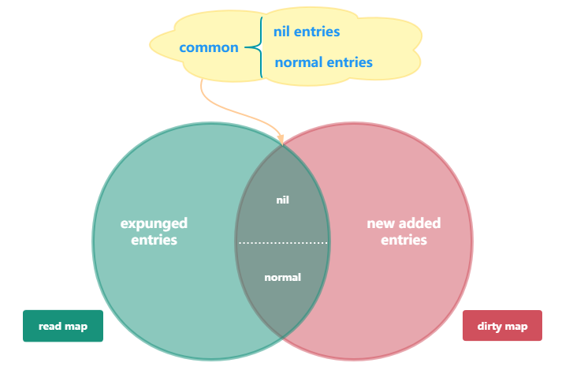
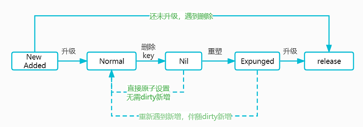

## 2. sync.map

golang官方的原生map是不支持并发读写的，直接并发的读写很容易触发panic。解决的办法有两个：

- 使用锁（sync.Mutex）或读写锁（sync.RWMutex）配合map

- 使用Go 语言在 2017 年发布的 Go 1.9 中正式加入了并发安全的字典类型sync.Map

### 2.1 核心思想&架构

如果要保证并发的安全，最朴素的想法就是使用锁，但这意味着要把并发的操作强制串行化，性能自然就会下降。

除了使用锁，使用原子操作（atomic）也可以达到类似并发安全的目的。

sync.Map的设计非常巧妙，充分利用了atmoic和mutex的配合。

#### 2.1.1 核心思想

**核心原则就是，尽量使用原子操作，最大程度上减少了锁的使用，从而接近了“lock free"的效果。**

核心点：

- 使用了两个原生的map作为存储介质，分别是read map和dirty map（只读字典和脏字典）

- 只读字典使用atomic.Value来承载，保证原子性和高性能；脏字典则需要用互斥锁来保护，保证了互斥

- 只读字典和脏字典中的键值对集合并不是实时同步的，它们在某些时间段内可能会有不同

- 无论是read还是dirty，本质上都是map[interface{}]*entry类型，这里的entry其实就是Map的value的容器

- entry的本质，是一层封装，可以表示具体值的指针，也可以表示key已删除的状态（即逻辑假删除）

通过这种设计，规避了原生map无法并发安全delete的问题，同时在变更某个键所对应的值的时候，就也可以使用原子操作了

```go
type Map struct {
   mu sync.Mutex

   // read map是被atomic包托管的，这意味着它本身Load是并发安全的（但是它的Store操作需要锁mu的保护）
   // read map中的entries可以安全地并发更新，但是对于expunged entry，在更新前需要经它unexpunge化并存入dirty
   //（这句话，在Store方法的第一种特殊情况中，使用e.unexpungeLocked处有所体现）
   read atomic.Value // readOnly

   // 关于dirty map必须要在锁mu的保护下，进行操作。它仅仅存储 non-expunged entries
   // 如果一个 expunged entries需要存入dirty，需要先进行unexpunged化处理
   // 如果dirty map是nil的，则对dirty map的写入之前，需要先根据read map对dirty map进行浅拷贝初始化
   dirty map[interface{}]*entry

   // 每当读取的是时候，read中不存在，需要去dirty查看，miss自增，到一定程度会触发dirty=>read升级转储
   // 升级完毕之后，dirty置空 &miss清零 &read.amended置false
   misses int
}

// 这是一个被原子包atomic.Value托管了的结构，内部仍然是一个map[interface{}]*entry
// 以及一个amended标记位，如果为真，则说明dirty中存在新增的key，还没升级转储，不存在于read中
type readOnly struct {
   m       map[interface{}]*entry
   amended bool // true if the dirty map contains some key not in m.
}

// 这是一个容器，可以存储任意的东西，因为成员p是unsafe.Pointer(*interface{})
// sync.Map中的值都不是直接存入map的，都是在entry的包裹下存入的
type entry struct {
   // entry的p可能的状态：
   // e.p == nil：entry已经被标记删除，不过此时还未经过read=>dirty重塑，此时可能仍然属于dirty（如果dirty非nil）
   // e.p == expunged：entry已经被标记删除，经过read=>dirty重塑，不属于dirty，仅属于read，下一次dirty=>read升级，被彻底清理
   // e.p == 普通指针：此时entry是一个不同的存在状态，属于read，如果dirty非nil，也属于dirty
   p unsafe.Pointer // *interface{}
}
```

#### 2.1.2 架构设计图



- read map由于是原子包托管，主要负责高性能，但是无法保证拥有全量的key（因为对于新增key，会首先加到dirty中），所以read某种程度上，类似于一个key的快照
- dirty map拥有全量的key，当Store操作要新增一个之前不存在的key的时候，预先是增加自dirty中的
- 在查找指定的key的时候，总会先去只读字典中寻找，并不需要锁定互斥锁。只有当read中没有，但dirty中可能会有这个key的时候，才会在锁的保护下去访问dirty
- 在存储键值对的时候，只要read中已存有这个key，并且该键值对未被标记为“expunged”，就会把新值存到里面并直接返回，这种情况下也不需要用到锁
- **expunged和nil，都表示标记删除，但是它们是有区别的，简单说expunged是read独有的，而nil则是read和dirty共有的**
- **read和dirty的关系，是一直在动态变化的，可能存在重叠，也可能是某某一方为空；重叠的公共部分，由分为两种情况，nil和normal**
- **read和dirty之间是会互相转换的，在dirty中查找key对次数足够多的时候，sync.Map会把dirty直接作为read，即触发dirty=>read升级。同时在某些情况，也会出现read=>dirty的重塑**

#### 2.1.3 总结

1. **dirty和read互转，分别在什么样的时机下会进行？** 

- dirty=>read：随着load的miss不断自增，达到阈值后触发升级转储（完毕之后，dirty置空 &miss清零 &read.amended置false）
- read=>dirty：当有read中不存在的新key需要增加且read和dirty一致的时候，触发重塑，且read.amended置true（然后再在dirty新增）。 重塑的过程，会将nil状态的entry，全部挤压到expunged状态中，同时将非expunged的entry浅拷贝到dirty中，这样可以避免read的key无限的膨胀（存在大量逻辑删除的key）。 最终，在dirty再次升级为read的时候，这些逻辑删除的key就可以一次性丢弃释放了（因为是直接覆盖上去）

2. **read从何而来，存在的意义又是什么？**

- read由 dirty 升级而来，是利用了atomic.Store一次性覆盖，而不是一点点的set操作出来的。所以，read更像是一个快照，read中key的集合不能被改变（注意，这里说的read的key不可改变，不代表指定的key的value不可改变，value是可以通过原子CAS来进行更改的），所以其中的键的集合有时候可能是不全的。
- 相反，脏字典中的键值对集合总是完全的，但是其中不会包含expunged的键值对。
- read的存在价值，在于加速读性能（通过原子操作避免了锁）

3. **entry的p可能的状态，有哪些？**

- e.p == nil：entry已经被标记删除，不过此时还未经过read=>dirty重塑，此时可能仍然属于dirty（如果dirty非nil）
- e.p == expunged：entry已经被标记删除，经过read=>dirty重塑，不属于dirty，仅仅属于read，下一次dirty=>read升级，会被彻底清理（因为升级的操作是直接覆盖，read中的expunged会被自动释放回收）
- e.p == 普通指针：此时entry是一个普通的存在状态，属于read，如果dirty非nil，也属于dirty。对应架构图中的normal状态

4. **删除操作的细节，e.p到底是设置成了nil还是expunged？**

- 如果key不在read中，但是在dirty中，则直接delete
- 如果key在read中，则逻辑删除，e.p赋值为nil(后续在重塑的时候，nil会变成expunged)

5. **什么时候e.p由nil变成expunged？**

- read=>dirty重塑的时候，此时read中仍然是nil的，会变成expunged，表示这部分key等待被最终丢弃（expunged是最终态，等待被丢弃，除非又出现了重新store的情况）
- 最终丢弃的时机：就是dirty=>read升级的时候，dirty的直接粗暴覆盖，会使得read中的所有成员都被丢弃，包括expunged。

6. **既然nil也表示标记删除，那么再设计出一个expunged的意义是什么？**

expunged是有存在意义的，它作为删除的最终状态（待释放），这样nil就可以作为一种中间状态。如果仅仅使用nil，那么，在read=>dirty重塑的时候，可能会出现如下的情况：

- 如果nil在read浅拷贝至dirty的时候仍然保留entry的指针（即拷贝完成后，对应键值下read和dirty中都有对应键下entry e的指针，且e.p = nil）那么之后在dirty=>read升级key的时候对应entry的指针仍然会保留。那么最终；的合集会越来越大，存在大量nil的状态，永远无法得到清理的机会。
- 如果nil在read浅拷贝时不进入dirty，那么之后store某个Key键的时候，可能会出现read和dirty不同步的情况，即此时read中包含dirty不包含的键，那么之后用dirty替换read的时候就会出现数据丢失的问题。
- 如果nil在read浅拷贝时直接把read中对应键删除（从而避免了不同步的问题），但这又必须对read加锁，违背了read读写不加锁的初衷。

综上，为了保证read作为快照的性质（不能单独删除或新增key），同时要避免Map中nil的key不断膨胀等多个前提要求，才设计成了expungd的状态。

7. **对于一个entry，从生到死的状态机图**




