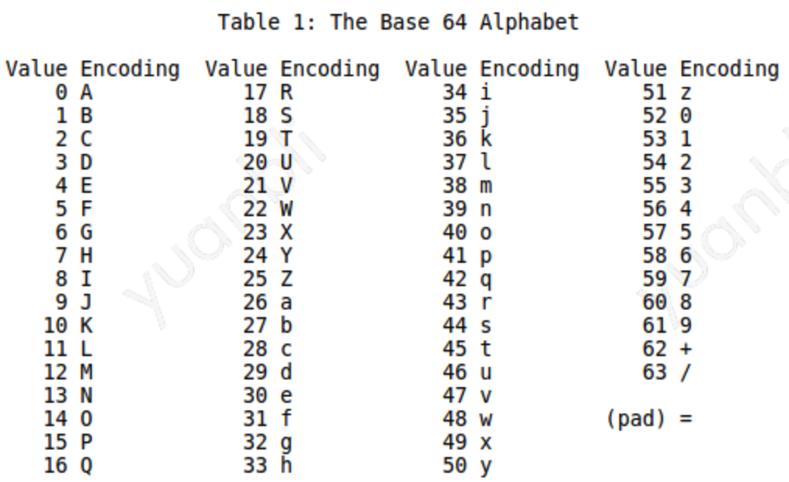

Protobuf 的编码是基于变种的 Base128。

### 0x01 Base 64

计算机之间传输数据时，数据本质上是一串字符流。TCP协议可以保证被发送的字节流正确到达目的地，但数据到达目标机器后，由于不同机器采用的字符集不同等原因，不能保证目标机可以正确解析字节流。

Base 64 最初设计 是用于在邮件嵌入文件，可以将任何形式的字节流编码为安全的字节流，下边是Base 64 的工作原理：

假设有四个字节，表示要传输的二进制数据：

10100010     00001001    11000010    11010011 

首先将这个字节流按每6个 bit 为一组进行分组，剩下少于6 bits 的低位补0:

101000     100000    100111   000010  110100  110000

然后在每一组6 bit 的高位补两个0:

00101000     00100000    00100111   00000010  00110100  00110000

Base 64 编码是按照6 bits为一组进行编码，每3个字节的原始数据要用4个字节来存储。编码后的长度要为4的整数倍，不足4字节的部分要用pad补齐，所以最终编码后结果为`ognC0w==`。

任意的字节流均可使用Base 64 进行编码，编码之后所有字节均可以用数字、字母和+ / =号进行表示，这些都是可以被正常显示的 ascii 字符，保证了编码之后的字节流能被正确的复制、传播、解析。

