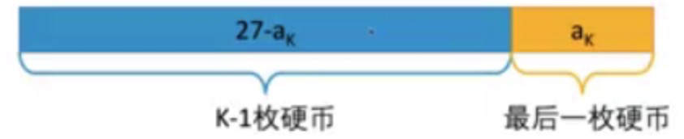

## 1. **动态规划题目特点**

**计数**

- 有多少种方式走到右下角
- 有多少种方法选出k个数使得和为Sum

**求最大最小值**

- 从左上角走到右下角路径最大数字和
- 最长上升子序列长度

**求存在性**

- 取石子游戏，先手是否必胜
- 能不能选出k个数使得和为Sum

## 2. 动态规划解题步骤

**确定状态**

- 动态规划问题一般都需要创建一个数组，数组每个元素 **f[i]** 代表什么含义
- 确定状态的两个关键：**最后一步、子问题**

**转移方程**

- 写出数组元素 **f[i]** 的计算表达式

**初始条件和边界情况**

- 数组的初始条件
- 数组的边界情况，及程序终止条件

**计算顺序**

- 操作数组的顺序

## 3. 简单题型

### 3.1 零钱兑换

**问题描述**

- 有三种硬币，分别面值为2元、5元、7元，每种硬币最够多
- 买一本书要27元
- 如何用最少的硬币组合正好付清？

**问题分析**

确定状态：f(x)表示最少用多少枚硬币可以拼出 x 元



转移方程：*f[x] = min{ f[x - 2] + 1, f[x - 5] + 1, f[x - 7] + 1 }*

初始条件和边界情况：

- 初始条件：f[0] = 0

- 无法拼出来的就设置值为正无穷大，遍历完数组即结束程序

计算顺序：计算当前元素需要多少个硬币拼成，需要借助前置结果，则正序遍历数组

**代码**

```go
func min(a, b int) int {
	if a < b {
		return a
	}
	return b
}

func coinChange(coins []int, amount int) int {
    dp := make([]int, amount + 1) //动态规划数组
    dp[0] = 0
    for i := 1; i < len(dp); i++ {
        dp[i] = math.MaxInt32
        for j := 0; j < len(coins); j++ {
            if i - coins[j] >= 0 && dp[i - coins[j]] != math.MaxInt32 {
                dp[i] = min(dp[i - coins[j]] + 1, dp[i])
            }
        }
    }
    if dp[amount] == math.MaxInt32 {
        return -1
    }
    return dp[amount]
}
```

### 3.2 跳跃游戏

**问题描述**

- 有 n 块石头分别在 x 轴的 0, 1, ... , n-1位置
- 一只青蛙在石头0，向跳到石头 n-1
- 如果青蛙在第 i 块石头上，最多可以向右跳距离 a[i]
- 请问青蛙是否能跳到石头 n-1

**问题分析**

确定状态：f[i] 表示是否可以达到石头 i

- 最后一步：需要从第 i 个石头跳到第 n-1个石头，i < n-1。此时必定可以到达石头 i，且最后一步满足最大距离
- 子问题：只需要考虑是否可以到达上一块石头以及上一步是否可以跳到当前石头

转移方程：*f[i] = OR(f[j] AND j + a[j] >= i) | 0<=i<j*

初始状态和边界情况：

- 初始状态：f[0] = true
- 边界情况：遍历 dp 数组完成即结束程序

计算顺序：从左往右遍历 dp 数组

**代码**

```go
func canJump(nums []int) bool {
    dp := make([]bool, len(nums))
    dp[0] = true
    for i := 1; i < len(dp); i++ {
        for j := 0; j < i; j++ {
            if dp[j] && nums[j] + j >= i {
                dp[i] = true
            }
        }
    }
    return dp[len(dp) - 1]
}
```

### 3.3 不同路径

**问题描述**

- 给定m行n列的网格，有一个机器人从左上角(0, 0)出发，每一步可以向下或者向右走一步
- 问有多少种不同的方式走到右下角？

**问题分析**

1. 确定状态：f[m\][n]表示机器人走到 (m, n) 有多少种方式

- 最后一步：机器人需要通过最后一步(向下或者向右)才能走到右下角，即前一步坐标为(m-2, n-1)或(m-1, n-2)
- 子问题：如果机器人有 X 种方式从左上角走到(m-2, n-1)，有 Y 种方式从左上角走到(m-1, n-2)，则机器人就有X + Y 种方式走到(m-1, n-1)

2. 转移方程：f[m\][n] = f[m-1\][n] + f[m\][n-1]

3. 初始条件和边界情况：

- 初始条件：f[0\][j] = 1并且 f[i\][0] = 1。即第一行和第一列的格子只有一种方式可以到达
- 边界条件：遍历二维数组结束

4. 计算顺序：从左往右、从上往下、逐行逐列计算

**代码**

```go
func uniquePaths(m int, n int) int {
    //golang 二维数组声明方式
  	dp := make([][]int, m)
    for i := range dp {
        dp[i] = make([]int, n)
        dp[i][0] = 1
    }
    for j := 0; j < n; j++ {
        dp[0][j] = 1
    }
    for i := 1; i < m; i++ {
        for j := 1; j < n; j++ {
            dp[i][j] = dp[i-1][j] + dp[i][j-1]
        }
    }
    return dp[m-1][n-1]
}
```

### 3.4 不同路径2

**问题描述**

- 给定m行n列的网格，有一个机器人从左上角(0, 0)出发，每一步可以向下或者向右走一步
- 网格中有些地方有障碍，不能通过障碍
- 问有多少种不同的方式走到右下角？

**问题分析**

1. 确定状态：f[m\][n]表示机器人走到 (m, n) 有多少种方式

- 最后一步：机器人需要通过最后一步(向下或者向右)才能走到右下角，即前一步坐标为(m-2, n-1)或(m-1, n-2)
- 子问题：如果机器人有 X 种方式从左上角走到(m-2, n-1)，有 Y 种方式从左上角走到(m-1, n-2)，则机器人就有X + Y 种方式走到(m-1, n-1)

2. 转移方程：f[m\][n] = f[m-1\][n] + f[m\][n-1]

3. 初始条件和边界情况：

- 初始条件：

  *f[0\][j] = f[0\][j-1]*	第一行

  *f[i\][0] = f[i-1\][0]*	第一列

  *f[i\][j] = 0*			   有障碍

  *f[0\][0] = 1*			  第一步

  *f[i\][j] = f[m-1\][n] + f[m\][n-1]*	其他情况

- 边界情况：遍历二维数组结束

4. 计算顺序：从左往右、从上往下、逐行逐列计算

**代码**

```go
func uniquePathsWithObstacles(obstacleGrid [][]int) int {
    m := len(obstacleGrid)
    n := len(obstacleGrid[0])
    if m == 0 || n == 0 {
        return 0
    }
    // 定义二维数组
    dp := make([][]int, m)
    for idx, _ := range dp {
        dp[idx] = make([]int, n)
    }
    for i := 0; i < m; i++ {
        for j := 0; j < n; j++ {
            // 障碍
            if obstacleGrid[i][j] == 1 {
                dp[i][j] = 0
                continue
            }
            // 起点
            if i == 0 && j == 0{
                dp[i][j] = 1
                continue
            }
            // 其余位置
            dp[i][j] = 0
            if i > 0 {
                dp[i][j] += dp[i-1][j]
            }
            if j > 0 {
                dp[i][j] += dp[i][j-1]
            }
        }
    }
    return dp[m-1][n-1]
}
```

### 3.5 粉刷房子

**问题描述**

- 一排 N 栋房子，每栋房子要粉刷成3种颜色中的一种：红、蓝、绿
- 任何两栋相邻房子不能漆成同样的颜色
- 第 i 栋房子染成红色、蓝色、绿色的花费分别为cost[i\][0]、cost[i\][1]、cost[i\][2]

**问题分析**

1. 确定状态：dp[i\][0]、dp[i\][1]、dp[i\][2]表示粉刷第i栋房子成红色、蓝色、绿色的最小花费

- 最后一步：房子N-1一定染为三种颜色中的一种
  - 如果N-1是红色，N-2就是蓝色或者绿色
  - 如果N-1是绿色，N-2就是红色或者蓝色
  - 如果N-1是蓝色，N-2就是红色或者绿色
- 需要记录粉刷前N栋房子最小花费，即记录油漆前N-1栋房子分别为红、蓝、绿时的最小话费

2. 转移方程：

   红色：f[i\][0] = min{f[i-1\][1] + cost[i-1\][0], f[i-1\][2] + cost[i-1\][0]}

   蓝色：f[i\][1] = min{f[i-1\][0] + cost[i-1\][1], f[i-1\][2] + cost[i-1\][1]}

   绿色：f[i\][2] = min{f[i-1\][0] + cost[i-1\][2], f[i-1\][1] + cost[i-1\][2]}

3. 初始条件和边界情况

- 初始条件：不粉刷任何房子则 f[0\][0] = f[0\][1] = f[0\][2] = 0
- 无边界情况

4. 计算顺序：从左往右按照每个房子粉刷三个颜色计算

**代码**

```go
func minCost(cost [][]int) int{
  m := len(cost)
  if m == 0 {
    return 0
  }
  dp := make([][]int, m+1)
  for idx, _ := range cost {
    dp[idx] = make([]int, 3)
  }
  dp[0][0] = 0
  dp[0][1] = 0
  dp[0][2] = 0
  for i := 1; i <= m; i++ {
    // 枚举将i-1栋房子染成三种颜色
    for j := 0; j < 3; j++ {
      f[i][j] = math.MinInt64
      // 当第i-1栋房子为对应颜色的时候 枚举第i-2栋房子对应颜色 算出最低价格 
      for k := 0; k < 3; k++ {
        if j != k {
          f]i][j] = min(f[i][j], f[i-1][k] + cost[i-1][j])
        }
      }
    }
  }
  return min(f[m][0], min(f[m][1], f[m][2]))
}

func min(a, b int) int {
	if a < b {
		return a
	}
	return b
}
```

### 3.6 最小路径和

**问题描述**

- 给定m行n列的网格，每个格子(i, j)里都有一个非负数 A[i\][j]
- 求一个从左上角(0, 0)到右下角的路径，每一步只能向下、向右走一步
- 使得路径上格子里的数字之和最小，输出最小数字和

**问题分析**

1. 确定状态：f[i\][j] 表示走到格子(i ,j)时路径最小和
2. 转移方程：f[i\][j] = min{ f[i-1\][j], f[i\][j-1] } + a[i\][j]
3. 初始条件和边界情况

- 初始条件：f[0\][0] = a[0\][0]
- 边界情况：f[i\][0] = f[0\][j] = a[i\][j]

4. 计算顺序：正序遍历数组

**代码**

```go
func minPathSum(grid [][]int) int {
    m := len(grid)
    if m == 0 {
        return 0
    }
    n := len(grid[0])
    if n == 0 {
        return 0
    }
    dp := make([][]int, m)
    for idx, _ := range dp {
        dp[idx] = make([]int, n)
    }
    for i := 0; i < m; i++ {
        for j := 0; j < n; j++ {
            if i == 0 && j == 0 {
                dp[i][j] = grid[i][j]
                continue
            }
            t := math.MaxInt
            if i > 0 {
                t = min(t, dp[i-1][j])
            }
            if j > 0 {
                t = min(t, dp[i][j-1])
            }
            dp[i][j] = t + grid[i][j]
        }
    }
    return dp[m-1][n-1]
}

func min(a, b int) int {
	if a < b {
		return a
	}
	return b
}
```

### 3.7 解码方法

**问题描述**

- 有一段由 A～Z 组成的字母串信息被加密成数字串
- 加密方式为：A->1、B->2、...、Z->26
- 给定加密后数字串S[0...N-1]，请问有多少种方式解密字符串

**问题分析**

1. 确定状态：f[i]表示前 i 位数字有几种解密方式

- 最后一步：当前位和前一位一共有几种解密方式

2. 转移方式：f[i] = f[i-1] | s[i-1]对应一个字母 + f[i-2] | s[i-2]s[i-1]对应一个字母

3. 初始条件和边界情况

- 初始条件：f[0] = 1，空串有一种方式解密
- 边界情况：i = 1，则只看当前数字即可

4. 计算顺序：f[0]、f[1]、...、f[n]

```go
func numDecodings(s string) int {
    if s[0] == '0' && len(s) == 0 {
        return 0
    }
    dp := make([]int, len(s) + 1)
    dp[0] = 1
    for i:= 1; i <= len(s); i++ {
        if s[i-1] != '0' {
            dp[i] += dp[i-1]
        }
        if i > 1 && s[i-2] != '0' && ((s[i-2]-'0')*10+(s[i-1]-'0') <= 26) {
            dp[i] += dp[i-2]
        }
    }
    return dp[len(s)]
}
```

### 3.8 最长连续递增子序列

**问题描述**

- 给定a[0], ... , a[n-1]
- 找到最长连续子序列 i, i+1, ... , j，使得a[i] < a[i+1] < ... < a[j]
- 输出序列长度 j - i + 1

**问题分析**

1. 确定状态：f[j] 表示以 a[j] 结尾的最长连续递增子序列的长度

- 最长连续上升子序列即位 a[j]
- 子序列长度大于1，那么最优策略中 a[j] 前一个元素 a[j-1] < a[j]

2. 转移方程：f[j] = max{ 1,  f[j-1] + 1 | j>0 && a[j-1] < a[j]}
3. 初始条件和边界值

- 无初始条件
- j > 0 && a[j] > a[j-1]

4. 计算顺序：遍历数组

```go
func findLengthOfLCIS(nums []int) int {
    if len(nums) == 1 {
        return 1
    }
    respMax := 0
    dp := make([]int, len(nums))
    dp[0] = 1
    for i := 1; i < len(nums); i++ {
        dp[i] = 1
        if nums[i] > nums[i-1] {
            dp[i] = dp[i-1] + 1
        }
        respMax = max(respMax, dp[i])
    }
    return respMax
}

func max(a, b int) int {
	if a > b {
		return a
	}
	return b
}
```

### 3.9 乘积最大子序列

**问题描述**

- 给定*a[0], ..., a[n-1]*
- 找到最长连续子序列 *i, i+1, i+2, ..., j*，使得 *a[i] \* a[i+1] \*... \* a[j]* 最大

**问题分析**

1. 确定状态：f[i] 表示以 i 结束的最大子序列，g[i] 表示以 i 结束的最小子序列

- 最后一步：前边的最大子序列和最后一个数字比较或相乘得到最大子序列。需要区分正负两种情况
- 子问题：求以 a[j] 结尾的最大子序列，变成了需要求 a[j - 1] 结尾的最大/最小连续子序列

2. 转移方程：

- 最大子序列：*f[i] = max{a[i], max{a[i] \* f[i-1], a[i] \* g[i-1]} | j>0 }*
- 最小子序列：*g[i] = min{a[i], min{a[i] \* f[i-1], a[i] \* g[i-1]} | j>0 }*

3. 初始状态和边界情况：

- 初始状态：f[0] = g[0] = a[0]
- 边界情况：遍历 dp 数组完成即结束程序，并且获取最大子序列乘积

4. 计算顺序：从左往右遍历 dp 数组

**代码**

```go
func min(a, b int) int {
	if a < b {
		return a
	}
	return b
}
func max(a, b int) int {
	if a > b {
		return a
	}
	return b
}

func maxProduct(nums []int) int {
    if len(nums) == 0 {
        return 0
    }
    f := make([]int, len(nums)) //最大连续子序列乘积
    g := make([]int, len(nums)) //最小连续子序列乘积
    f[0] = nums[0]
    g[0] = nums[0]
    resp := nums[0]
    for i := 1; i < len(nums); i++ {
        f[i] = max(nums[i], max(f[i-1]*nums[i], g[i-1]*nums[i]))
        g[i] = min(nums[i], min(f[i-1]*nums[i], g[i-1]*nums[i]))
        resp = max(resp, f[i])
    }
    return resp
}
```

### 3.10 比特位计数

**问题描述**

- 给定N，要求输出 0、1、...、N 的每个数的二进制里表示1的个数
- 返回一个长度为 `n + 1` 的数组

**问题分析**

1. 确定状态：f[i] 表示 i 的二进制表示有多少个1

- 最后一步：观察一个数最后一个二进制位（最低位），去掉它，观察剩下多少个1

  170 = 10101010	170的二进制表示里有4个1

  85 = 1010101	   85的二进制表示里有4个1	

- 子问题：求N的二进制有多少个1，需要知道N的二进制去掉最后一位，即N mod 2 有多少个1

2. 转移方程：f[i] = f[i>>1] + (i mod 2)
3. 初始状态和边界情况

- 初始状态：f[0] = 0
- 无边界条件

4. 计算顺序：f[0]、f[1]、...、f[N]

**代码**

```go
func countBits(n int) []int {
    dp := make([]int, n+1)
    if n == 0 {
        return dp
    }
    dp[0] = 0
    for i := 1; i <= n; i++ {
        // i >> 1 右移一位
        dp[i] = dp[i >> 1] + i%2
    }
    return dp
}
```

### 3.11 打家劫舍

**问题描述**

- 一排N栋房子(0 ~ N-1)，房子 i 里有 A[i] 个金币
- 一个窃贼想选择一些房子偷金币，但是不能偷挨着的两家邻居
- 最多可以偷多少金币

**问题分析**

1. 确定状态：f[i] 表示前 i-1 房子最多偷多少金币

- 最后一步：可能偷或不偷最后一栋房子N-1

  情况一：不偷房子N-1，最优策略就是前N-1栋房子的最优策略

  情况二：偷房子N-1，需要知道N-1栋房子最多偷多少金币，并且保证不偷N-2栋房子

2. 转移方程：f[i] = max{f[i-1], f[i-2] + A[i-1]} 
3. 初始状态和边界情况

- 初始状态：f[0] = 0	f[1] = A[0]	f[2] = max(A[0], A[1])
- 无边界条件

4. 计算顺序：f[0]、f[1]、...、f[N]

```go
func rob(nums []int) int {
    n := len(nums)
    if n == 0 {
        return 0
    }
    if n == 1 {
        return nums[0]
    }
    dp := make([]int, n+1)
    dp[0] = 0
    dp[1] = nums[0]
    dp[2] = max(nums[0], nums[1])
    for i := 3; i <= n; i++ {
        dp[i] = max(dp[i-1], dp[i-2] + nums[i-1])
    }
    return dp[n]
}

func max(a, b int) int {
	if a > b {
		return a
	}
	return b
}
```

### 3.12 打家劫舍2

**问题描述**

- 有一圈N栋房子，房子 i-1 里有 A[i] 个金币
- 一个窃贼想偷金币，但不能偷挨着的两家邻居，即房子 0 和 房子 N-1 成了邻居，不能同时偷盗
- 最多可以偷多少金币

**问题分析**

不偷房子 0 就可以转换为房子 1～N-1 的**打家劫舍1**

不偷房子 N-1 就可以转换为房子 0～N-2 的**打家劫舍1**

1. 确定状态：f[i] 表示前 i-1 房子最多偷多少金币

- 最后一步：可能偷或不偷最后一栋房子N-1

  情况一：不偷房子N-1，最优策略就是前N-1栋房子的最优策略

  情况二：偷房子N-1，需要知道N-1栋房子最多偷多少金币，并且保证不偷N-2栋房子

2. 转移方程：f[i] = max{f[i-1], f[i-2] + A[i-1]} 
3. 初始状态和边界情况

- 初始状态：f[0] = 0	f[1] = A[0]	f[2] = max(A[0], A[1])
- 无边界条件

4. 计算顺序：f[0]、f[1]、...、f[N]

**代码**

```go
func rob(nums []int) int {
	n := len(nums)
	if n == 0 {
		return 0
	}
	if n == 1 {
		return nums[0]
	}
  // 切片表达式为：[),左闭右开区间
	respCoin_1 := robV1(nums[0:n-1]) // 0 ~ n-2
	respCoin_2 := robV1(nums[1:n]) // 1 ~ n-1
	return max(respCoin_1, respCoin_2)
}

func robV1(nums []int) int {
	n := len(nums)
	if n == 0 {
		return 0
	}
	if n == 1 {
		return nums[0]
	}
	dp := make([]int, n+1)
	dp[0] = 0
	dp[1] = nums[0]
	dp[2] = max(nums[0], nums[1])
	for i := 3; i <= n; i++ {
		dp[i] = max(dp[i-1], dp[i-2] + nums[i-1])
	}
	return dp[n]
}

func max(a, b int) int {
	if a > b {
		return a
	}
	return b
}
```

### 3.13 买卖股票的最佳时机

**问题描述**

- 已知后面 N 天一支股票每天的价格 p0、p1、...、pN+1
- 最多可以买卖一次，求最大利润

**问题分析**

minV 表示股票前 i 天的最低价格

```go
func maxProfit(prices []int) int {
    n := len(prices)
    if n == 0 {
        return 0
    }
    resp := 0
    minV := prices[0]
    for i := 1; i < n; i++ {
        resp = max(resp, prices[i] - minV)
        if prices[i] < minV {
            minV = prices[i]
        }
    }
    return resp
}

func max(a, b int) int {
	if a > b {
		return a
	}
	return b
}
```

### 3.14 买卖股票的最佳时机2

**问题描述**

- 已知后面 N 天一支股票每天的价格 p0、p1、...、pN+1
- 可以买卖任意多次，求最大利润

**问题分析**

最优策略为如果今天价格比明天的低，就今天买明天卖(贪心)

```go
func maxProfit(prices []int) int {
    n := len(prices)
    if n == 0 {
        return 0
    }
    resp := 0
    for i := 1; i < n; i++ {
        if prices[i] > prices[i-1] {
            resp += prices[i] - prices[i-1]
        }
    }
    return resp
}
```

### 3.15 最长上升子序列

**问题描述**

- 给定a[0]、a[1]、...、a[n-1]
- 找到最长子序列使得a[0] < a[1] < ... < a[n-1]，输出子序列长度
- 输入：[4, 2, 4, 5, 7]    输出：4(子序列2, 4, 5, 7)

**问题分析**

1. 确定状态：f[i] 表示以 a[i]  结尾的最长上升子序列长度

- 最后一步：一定有最后一个元素a[j]

  情况一：最长上升子序列就是 { a[j] }，答案就是1

  情况二：子序列长度大于1，最优策略中 a[j] 前一个元素是 a[i]，且 a[i] < a[j]

2. 转移方程：f[i] = max{ 1, f[j] + 1 | i < j && a[j] < a[i] }
3. 初始状态和边界情况

- 无初始状态
- 边界条件：i > 0 && a[i] > a[j]

4. 计算顺序：f[0]、f[1]、...、f[N]

**代码**

```go
func lengthOfLIS(nums []int) int {
    n := len(nums)
    if n == 0 {
        return 0
    }
    resp := 1
    dp := make([]int, n)
    dp[0] = 1
    for i := 1; i < n; i++ {
        dp[i] = 1
        for j := 0; j < i; j++ {
            if nums[i] > nums[j] {
                dp[i] = max(dp[i], dp[j] + 1)
            }
        }
        resp = max(resp, dp[i])
    }
    return resp
}

func max(a, b int) int {
	if a > b {
		return a
	}
	return b
}
```

### 最长上升子序列的个数

**问题描述**

- 给定一个未排序的整数数组 `nums` ， *返回最长递增子序列的个数* 

**代码**

```go
func findNumberOfLIS(nums []int) int {
    n := len(nums)
    if n == 0 {
        return 0
    }
    // dp[i]表示以nums[i]结尾的递增子序列长度
    // cnt[i]表示以nums[i]结尾的递增子序列数量
    dp := make([]int, n)
    cnt := make([]int, n)
    maxLen, res := 0, 0
    for i := 0; i < n; i++ {
        dp[i] = 1
        cnt[i] = 1
        for j := 0; j < i; j++ {
            if nums[i] > nums[j] && dp[j]+1 > dp[i]{
                dp[i] = dp[j]+1
                cnt[i] = cnt[j]
            }else if dp[j]+1 == dp[i] {
                cnt[i] += cnt[j]
            }
        }
        if dp[i] > maxLen {
            res = cnt[i]
            maxLen = dp[i]
        }else if dp[i] == maxLen {
            res += cnt[i]
        }
    }
    return res
}
```

### 3.16 俄罗斯套娃信封问题

**问题描述**

- 给定N个信封的长度和宽度
- 如果一个信封的长和宽都分别小于另一个信封的长和宽，则该信封可以放入另一个信封
- 问最多嵌套多少个信封
- 输入：[ [5,4], [6,4], [6,7], [2,3] ]    输出：3 ([2,3] => [5,4] => [6,7])

**问题分析**

先根据信封的长进行升序排序

1. 确定状态：f[i] 表示以第 i 个信封为最外层信封时最多的嵌套层数

2. 转移方程：f[i] = max{ 1, f[i-1] + 1 | 信封 j 能放在信封 i-1 里 }
3. 初始状态和边界情况

- 无初始状态：
- 无边界条件

4. 计算顺序：f[0]、f[1]、...、f[N-1]

**代码**

```go
func maxEnvelopes(envelopes [][]int) int {
    n := len(envelopes)
    if n == 0 {
        return 0
    }
    // 根据长度进行排序
    sort.Slice(envelopes,func(i,j int)bool{
       return  envelopes[i][0]<envelopes[j][0]
    })
    resp := 0
    dp := make([]int, n)
    dp[0] = 1
    for i := 0; i < n; i++ {
        dp[i] = 1
        for j := 0; j < i; j++ {
            if envelopes[i][0] > envelopes[j][0] && envelopes[i][1] > envelopes[j][1] {
                dp[i] = max(dp[i], dp[j] + 1)
            }
        }
        resp = max(resp, dp[i])
    }
    return resp
}

func max(a, b int) int {
	if a > b {
		return a
	}
	return b
}
```

### 3.17 完全平方数

**问题描述**

- 给定一个正整数n
- 问最少可以将 n 分成几个完全平方数 (1, 4, 9, ...) 之和

**问题分析**

1. 确定状态：f[i] 表示 i 最少可以被分成多个完全平方数

2. 转移方程：f[i] = min{ f[i-j^2] + 1 } | 1 <= j*j <=i
3. 初始状态和边界情况

- 初始状态：f[0] = 0
- 无边界条件

4. 计算顺序：f[0]、f[1]、...、f[N]

**代码**

```go
func numSquares(n int) int {
    dp := make([]int, n+1)
    for i := 1; i <= n; i++ {
        dp[i] = i
        for j := 1; j*j <= i; j++ {
            dp[i] = min(dp[i], dp[i-j*j] + 1)
        }
    }
    return dp[n]
}

func min(a, b int) int {
	if a < b {
		return a
	}
	return b
}
```

### 3.18 分割回文串

**问题描述**

- 给定一个字符串 S[0 ... N-1]
- 要求将这个字符串划分为若干段，每一段都是一个回文串，
- 求最少划分多少次

**问题分析**

1. 确定状态：f[i] 表示S前 i 个字符[0, i-1]最少可以划分为多少个回文串

- 最后一步，关注最优策略中最后一段回文串，设为S[j, N-1]
- 子问题，需要找到S前 j 个字符[0, j-1]最少可以划分成几个回文串

2. 转移方程：f[i] = min{ f[j] + 1 | s[j, i-1]是回文串} | 0 <= j < i

3. 初始状态和边界情况

- 初始状态：f[0] = 0
- 无边界条件

4. 计算顺序：f[0]、f[1]、...、f[N]

**代码**

```go
func minCut(s string) int {
  n := len(s)
  if n == 0 {
    return 0
  }
  isPalin := calcPalin(s)
  dp := make([]int, n+1)
  dp[0] = 0
  for i := 1; i <= n; i++ {
    dp[i] = math.MaxInt32
    for j := 0; j < i; j++ {
      if (isPalin[j][i-1]) {
        dp[i] = min(dp[i], dp[j] + 1)
      }
    }
  }
  return dp[n] - 1
}

// 判断数组那部分区间为回文串
func calcPalin(s string) [][]bool {
  n := len(s)
  isPalin := make([][]bool, n)
  for idx, _ := range isPalin {
    isPalin[idx] = make([]bool, n)
  }
  for c := 0; c < n; c++ {
    i := c
    j := c
    for i >= 0 && j < n && s[i] == s[j] {
      isPalin[i][j] = true
      i--
      j++
    }
  }
  for c := 0; c < n; c++ {
    i := c
    j := c + 1
    for i >= 0 && j < n && s[i] == s[j] {
      isPalin[i][j] = true
      i--
      j++
    }
  }
  return isPalin
}

func min(a, b int) int {
	if a < b {
		return a
	}
	return b
}
```

### 3.19 背包问题

**问题描述**

- 给定N个物品，重量分别为正整数A1、A1、...、An
- 一个背包最大承受重量为M
- 最多可以带走多少重量的物品

**问题分析**

1. 确定状态：f[i\][w] 表示能否用前 i 个物品拼出重量 w

2. 转移方程：f[i\][w] = f[i-1\][w] OR f[i-1\][w-Ai-1]
3. 初始状态和边界情况

- 初始状态：f[0\][0] = true  f[0\][1 ... M] = false
- 边界条件： f[i-1\][w-Ai-1] 需保证 w >= Ai-1

4. 计算顺序：顺序计算二维数组

**代码**

```go
func backPack(m int, A []int) int {
  n := len(A)
  if n == 0 {
    return 0
  }
  dp := make([][]int, n+1)
  for idx, _ := range dp {
    dp[idx] = make([]int, m+1)
  }
  f[0][0] = true
  // 0个物品无法拼出任何重量
  for i := 1; i <= m; i++ {
    dp[0][i] = false
  }
  for i := 1; i <= n; i++ {
    for j := 0; j<= m; j++ {
      dp[i][j] = dp[i-1][j]
      if j >= A[i-1] {
        dp[i][j] |= dp[i-1][j-A[i-1]]
      }
    }
  }
  res := 0
  for i := m; i >= 0; --i {
    if dp[n][i] = true {
      res = i
      break
    }
  }
  return res
}
```


### 3. 22 背包问题4 

**问题描述**

- 给定n个正整数：A0、A1、...、An-1，一个正整数target
- 求有多少种组合加起来是target
- 每个 Ai 只能用多次

**问题分析**

**该问题类似于零钱兑换**

1. 确定状态：f[i\]表示有多少种组合可以拼出重量 i

2. 转移方程：f[i\] = f[i-A0] + f[i-A1] + ... + f[i-An-1]
3. 初始状态和边界情况

- 初始状态：f[0\] = 1
- 无边界条件

4. 计算顺序：顺序计算一维数组

**代码**

```go
func backPack(m int, A []int) int {
  dp := make([]int, m+1)
  dp[0] = 1
  for i := 1; i <= m; i++ {
    f[i] = 0
    for j := 0; j < len(A); j++ {
      if i >= A[j] {
        dp[i] += dp[i - A[j]]
      }
    }
  }
  return dp[m]
}
```

### 3. 23 背包问题5

**问题描述**

- 给定n个正整数：A0、A1、...、An-1，一个正整数target
- 求有多少种组合加起来是target
- 每个 Ai 只能用一次

**问题分析**

1. 确定状态：f[i\][w] 表示用前 i 个物品有多少种方式拼出重量 w

2. 转移方程：f[i\][w] = f[i-1\][w] + f[i-1\][w-Ai-1]
3. 初始状态和边界情况

- 初始状态：f[0\][0] = 1  f[0\][1 ... M] = 0
- 边界条件： f[i-1\][w-Ai-1] 需保证 w >= Ai-1

4. 计算顺序：顺序计算二维数组

**代码**

```go
func backPack(target int, A []int) int {
  n := len(A)
  if n == 0 {
    return 0
  }
  dp := make([][]int, n+1)
  for idx, _ := range dp {
    dp[idx] = make([]int, target+1)
  }
  f[0][0] = true
  // 0个物品无法拼出任何重量
  for i := 1; i <= mtarget; i++ {
    dp[0][i] = false
  }
  for i := 1; i <= n; i++ {
    for j := 0; j<= target; j++ {
      dp[i][j] = dp[i-1][j]
      if j >= A[i-1] {
        dp[i][j] += dp[i-1][j-A[i-1]]
      }
    }
  }
	return dp[n][target]
}
```

### 3.24 最长公共子序列

**问题描述**

- 给定两个字符串 text1 和 text2，返回这两个字符串的最长公共子序列的长度
- 如果不存在 公共子序列 ，返回 0 
- 一个字符串的 子序列 是指这样一个新的字符串：它是由原字符串在不改变字符的相对顺序的情况下删除某些字符（也可以不删除任何字符）后组成的新字符串
- 例如，"ace" 是 "abcde" 的子序列，但 "aec" 不是 "abcde" 的子序列
- 两个字符串的 公共子序列 是这两个字符串所共同拥有的子序列

**问题分析**

1. 确定状态：dp[i\][j]表示 text1 的前 i 个数和 text2 的前 j 个数最长公共子序列
2. 转移方程：

```go
if text1[i-1] == text2[j-1] {
	dp[i][j] = dp[i-1][j-1] + 1
}else {
	dp[i][j] = max(dp[i-1][j], dp[i][j-1])
}
```

3. 初始状态和边界情况

- 初始状态：dp[i\][j]= 0 | i == 0 || j == 0
- 无边界条件

4. 计算顺序：顺序计算二维数组

**代码**

```go
// 动态规划 dp[i][j] 表示 text1 的前 i 个数和 text2 的前 j 个数最长公共子序列
func longestCommonSubsequence(text1 string, text2 string) int {
    m, n := len(text1), len(text2)
    // 初始条件: dp[i][j] = 0 | i == 0 || j == 0
    dp := make([][]int, m+1)
    for i := 0; i < m+1; i++ {
        dp[i] = make([]int, n+1)
    }
    for i := 1; i <= m; i++ {
        for j := 1; j <= n; j++ {
            if text1[i-1] == text2[j-1] {
                dp[i][j] = dp[i-1][j-1] + 1
            }else {
                dp[i][j] = max(dp[i-1][j], dp[i][j-1])
            }
        }
    }
    return dp[m][n]
}

func max(x, y int) int {
    if x > y {
        return x
    }
    return y
}
```


**问题描述**

- 

**问题分析**

1. 确定状态：

2. 转移方程：
3. 初始状态和边界情况

- 初始状态：
- 无边界条件

4. 计算顺序：f[0]、f[1]、...、f[N]

**代码**

```go
```


