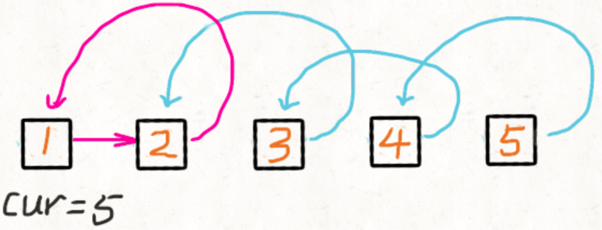

```go
/**
 * Definition for singly-linked list.
 * type ListNode struct {
 *     Val int
 *     Next *ListNode
 * }
 */
```

## 1. 双指针

### 1.1 环形链表

```go
func hasCycle(head *ListNode) bool {
    if head == nil {
        return false
    }
    pre := head
    last := head.Next
    for i := 0; last != nil && last.Next != nil; i ++ {
        if pre == last {
            return true
        }
        pre = pre.Next
        last = last.Next.Next
    }
    return false
}
```

### 1.2 相交链表

两个链表不相交的时候，指针 p1 移动了 m+n次、指针 p2 移动了 n+m 次之后，两个指针会同时变成空值 nil。

```go
func getIntersectionNode(headA, headB *ListNode) *ListNode {
    if headA == nil || headB == nil {
        return nil
    }
    p1 := headA
    p2 := headB
    for p1 != p2 {
        if p1 == nil {
            p1 = headB
        }else {
            p1 = p1.Next
        }
        if p2 == nil {
            p2 = headA
        }else {
            p2 = p2.Next
        }
    }
    return p1
}
```

### 1.3 删除链表倒数第N个节点

考虑删除head节点的情况。

```go
func removeNthFromEnd(head *ListNode, n int) *ListNode {
    if head == nil {
        return nil
    }
    pre, last := head, head
    for i := 0; i < n; i++ {
        last = last.Next
    }
    //删除head节点则返回head.Next
    if last == nil {
        return head.Next
    }
    for last.Next != nil {
        pre = pre.Next
        last = last.Next
    }
    pre.Next = pre.Next.Next
    return head
}
```

## 2. 经典问题

### 2.1 翻转列表-递归

递归的两个条件：

- 终止条件是当前节点或者下一个节点==null
- 在函数内部，改变节点的指向，其实就是 head 的下一个节点指向head

```
head.next.next = head
```



```go
func reverseList(head *ListNode) *ListNode {
    if head == nil || head.Next == nil {
        return head
    }
    newHead := reverseList(head.Next)
    //将节点的下一个节点指向当前节点，即改变指向顺序
    head.Next.Next = head
    head.Next = nil
    return newHead
}
```

### 2.2 移除链表元素

递归移除链表指定元素

```go
func removeElements(head *ListNode, val int) *ListNode {
    if head == nil {
        return nil
    }
    head.Next = removeElements(head.Next, val)
    if head.Val == val {
        return head.Next
    }else {
        return head
    }
}
```

### 2.3 奇偶链表

```go
func oddEvenList(head *ListNode) *ListNode {
   	if head == nil || head.Next == nil {
		return head
	}
  //p1 p2 存储奇偶链表当前处理节点
  //of 存储偶链表表头节点
	p1, p2, of := head, head.Next, head.Next
	for p2 != nil && p2.Next != nil{
		tmp := p2.Next
		p1.Next = tmp
		p2.Next = tmp.Next
		tmp.Next = of

		p1 = p1.Next
		p2 = p2.Next
	}
	return head
}
```

### 2.4 回文链表

```go
// getListMidNode 获取链表中间节点
func getListMidNode(head *ListNode) *ListNode {
    low, fast := head, head.Next
    for fast != nil && fast.Next != nil {
        low = low.Next
        fast = fast.Next.Next
    }
    return low
}

// reversalList 翻转链表
func reversalList(head *ListNode) *ListNode{
    if head == nil || head.Next == nil {
        return head
    }
    newhead := reversalList(head.Next)
    head.Next.Next = head
    head.Next = nil
    return newhead
}

// judgePalindrome 判断是否为回文链表
func judgePalindrome(head, mid *ListNode) bool {
    for mid != nil {
        if head.Val != mid.Val {
            return false
        }
        head = head.Next
        mid = mid.Next
    }
    return true
}

func isPalindrome(head *ListNode) bool {
    if head == nil || head.Next == nil {
        return true
    }
    // 1、通过快慢指针获取后半段链表头节点
    mid := getListMidNode(head)
    // 2、 翻转后半段链表
    mid.Next = reversalList(mid.Next)
    // 3、比较前后两部分链表
    return judgePalindrome(head, mid.Next)
}
```

### 2.5 合并两个有序链表

```go
func mergeTwoLists(list1 *ListNode, list2 *ListNode) *ListNode {
    if list1 == nil {
        return list2
    }
    if list2 == nil {
        return list1
    }
    if list1.Val < list2.Val {
        list1.Next = mergeTwoLists(list1.Next, list2)
        return list1
    } else {
        list2.Next = mergeTwoLists(list1, list2.Next)
        return list2
    }
}
```

### 2.6 两数相加

```go
func addTwoNumbers(l1 *ListNode, l2 *ListNode) *ListNode {
    if l1 == nil {
        return l2
    }
    if l2 == nil {
        return l1
    }
    cur := &ListNode{}
    pre := &ListNode{
        Val : -1,
        Next: cur,
    }
    upNum := 0
    for l1 != nil || l2 != nil {
        var val int
        if l1 != nil {
            val = val + l1.Val
        }
        if l2 != nil {
            val = val + l2.Val
        }
        cur.Val = (val + upNum) % 10
        upNum = (val + upNum) / 10
        if l1 != nil {
            l1 = l1.Next
        }
        if l2 != nil {
            l2 = l2.Next
        }
        if l1 != nil || l2 != nil {
            cur.Next = &ListNode{}
            cur = cur.Next
        }
    }
    if upNum != 0 {
        cur.Next = &ListNode{
            Val : upNum,
            Next: nil,
        }
    }
    return pre.Next
}
```
### 2.7 旋转链表

```go
func rotateRight(head *ListNode, k int) *ListNode {
    if head == nil || k == 0{
        return head
    }
    low, fast := head, head
    for i := 0; i < k; i++ {
        fast = fast.Next
        if fast == nil {
            fast = head
        }
    }
    //无需旋转
    if fast == low {
        return fast
    }
    for fast.Next != nil {
        fast = fast.Next
        low = low.Next
    }
    ret := low.Next
    fast.Next = head
    low.Next = nil
    return ret
}
```

### 2.8 LRU

**问题描述**

- 设计和构建一个“最近最少使用”缓存，该缓存会删除最近最少使用的项目
- 缓存应该从键映射到值(允许你插入和检索特定键对应的值)，并在初始化时指定最大容量
- 当缓存被填满时，它应该删除最近最少使用的项目

**代码**

```go
type LRUCache struct {
    size int
    capacity int
    cache map[int]*DLinkedNode
    head, tail *DLinkedNode
}

func initDLinkedNode(key, value int) *DLinkedNode {
    return &DLinkedNode{
        key: key,
        value: value,
    }
}

// 双向链表
type DLinkedNode struct {
    key, value int
    prev, next *DLinkedNode
}

func Constructor(capacity int) LRUCache {
    l := LRUCache{
        cache: map[int]*DLinkedNode{},
        head: initDLinkedNode(0, 0),
        tail: initDLinkedNode(0, 0),
        capacity: capacity,
    }
    l.head.next = l.tail
    l.tail.prev = l.head
    return l
}

func (this *LRUCache) Get(key int) int {
    if _, ok := this.cache[key]; !ok {
        return -1
    }
    node := this.cache[key]
    this.moveToHead(node)
    return node.value
}

func (this *LRUCache) Put(key int, value int)  {
    if _, ok := this.cache[key]; !ok {
        node := initDLinkedNode(key, value)
        this.cache[key] = node
        this.addToHead(node)
        this.size++
        if this.size > this.capacity {
            removed := this.removeTail()
            delete(this.cache, removed.key)
            this.size--
        }
    } else {
        node := this.cache[key]
        node.value = value
        this.moveToHead(node)
    }
}

func (this *LRUCache) addToHead(node *DLinkedNode) {
    node.prev = this.head
    node.next = this.head.next
    this.head.next.prev = node
    this.head.next = node
}

func (this *LRUCache) removeNode(node *DLinkedNode) {
    node.prev.next = node.next
    node.next.prev = node.prev
}

func (this *LRUCache) moveToHead(node *DLinkedNode) {
    this.removeNode(node)
    this.addToHead(node)
}

func (this *LRUCache) removeTail() *DLinkedNode {
    node := this.tail.prev
    this.removeNode(node)
    return node
}
```

