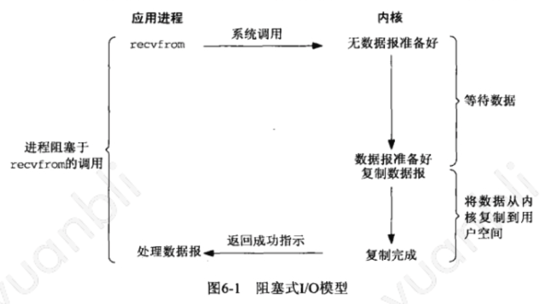
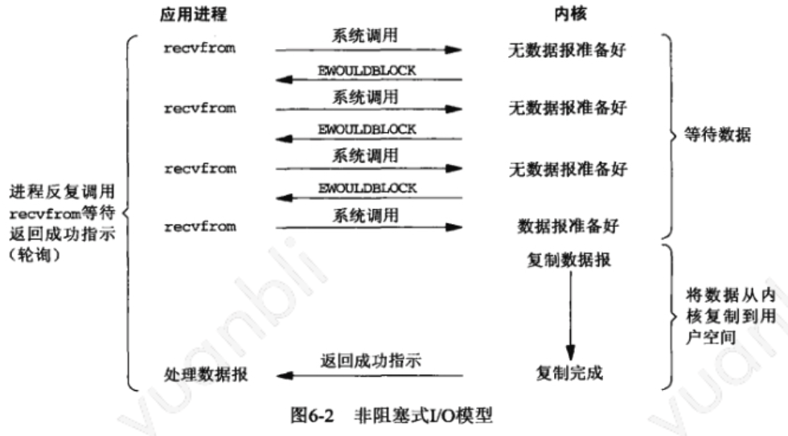
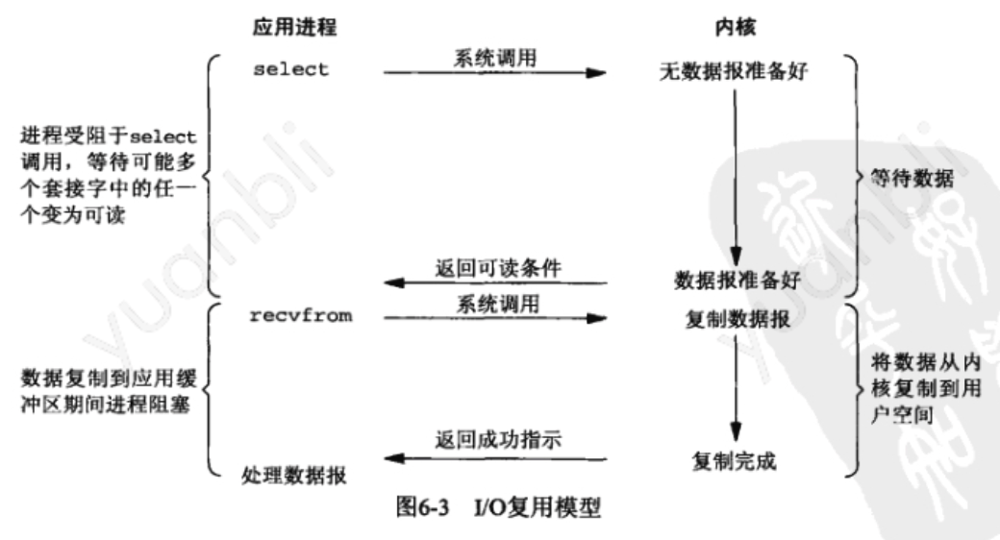
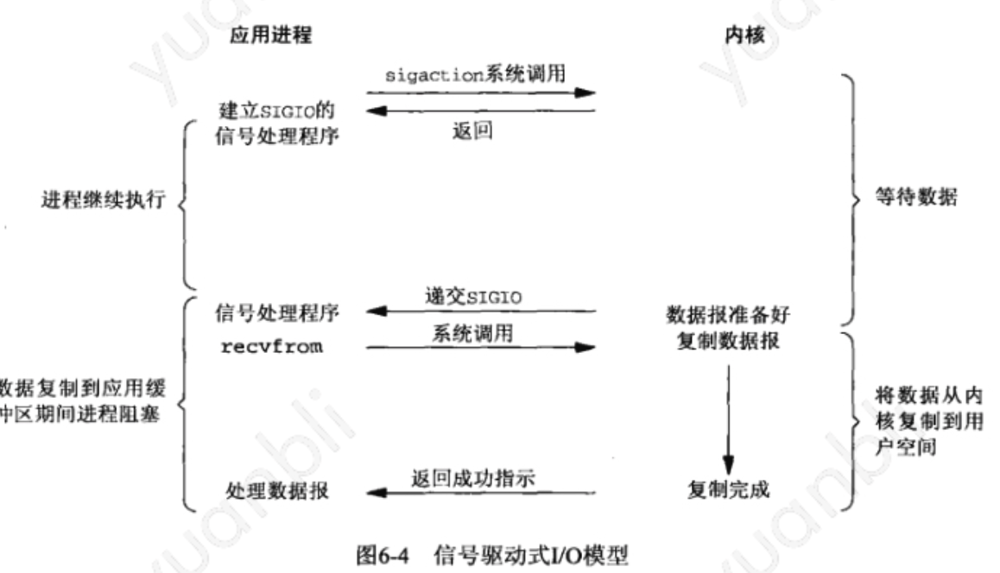
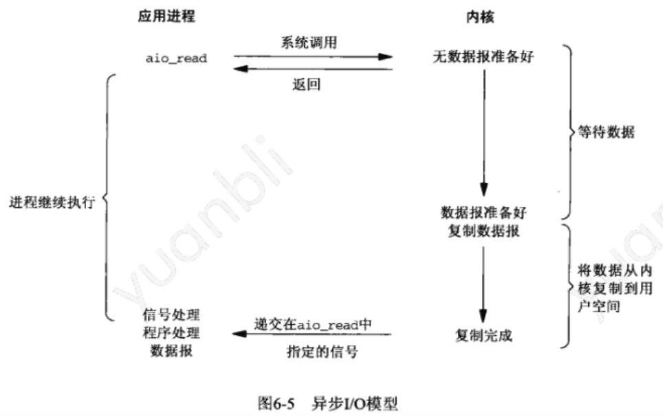
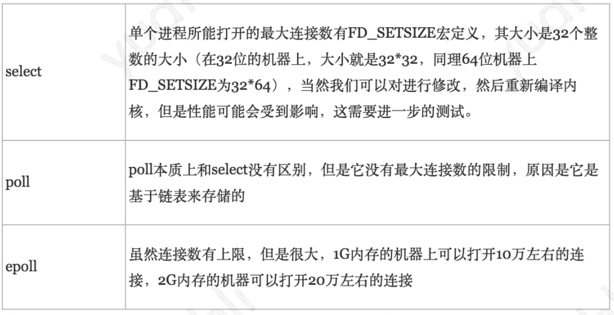
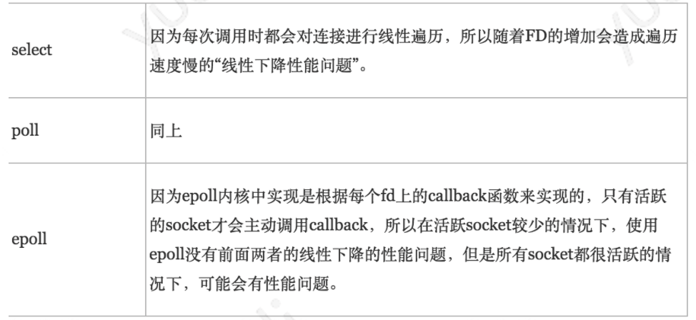
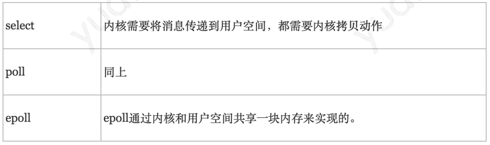

Select、Poll、Epoll都是IO多路复用的机制，可以监视多个描述符的读/写等事件，一旦某个描述符就绪（一般是读或者写事件发生了），就能够将发生的事件通知给关心的应用程序去处理该事件。

本质上，select、poll、epoll本质上都是同步I/O，IO模型有以下五种：

- blocking IO - 阻塞IO
- nonblocking IO - 非阻塞IO
- IO multiplexing - IO多路复用
- signal driven IO - 信号驱动IO 
- asynchronous IO - 异步IO

其中前面4种IO都可以归类为synchronous IO - 同步IO。

**POSIX(可移植操作系统接口)把同步IO操作定义为导致进程阻塞直到IO完成的操作，反之则是异步IO。**

### 1. 用户空间与内核空间

现在操作系统都是采用虚拟存储器，那么对32位操作系统而言，它的**虚拟地址空间为4G**（一个进程能够访问的地址最大是4G）。操作系统的核心是内核，独立于普通的应用程序，可以访问受保护的内存空间，也有访问底层硬件设备的所有权限。为了保证用户进程不能直接操作内核，保证内核的安全，操作系统将虚拟空间划分为两个部分：

- 内核空间
- 用户空间

如何分配这两个空间的大小也是有讲究的，如windows 32位操作系统，默认的用户空间：内核空间的比例是1:1;而在32位Linux系统中的默认比例是3:1（3G用户空间，1G内核空间）

### 2. 进程切换

为了控制进程的执行，内核必须要有能力挂起正在CPU上运行的进程，并恢复以前挂起的某个进程的执行。这种行为成为进程的切换。任何进程都是在操作系统内核的支持下运行的，是与内核紧密相关的。进程切换的过程，会经过下面这些变化：

1、保存处理机上下文，包括程序计数器和其他寄存器。

2、更新PCB信息。

3、将进程的PCB移入相应的队列，如就绪、在某事件阻塞等队列。

4、选择另外一个进程执行，并更新PCB

5、更新内存管理的数据结构。

6、恢复处理机上下文

### 3. IO - 同步、异步、阻塞、非阻塞

下面以network IO中的read读操作为切入点，来讲述同步（synchronous） IO和异步（asynchronous） IO、阻塞（blocking） IO和非阻塞（non-blocking）IO的异同。一般情况下，一次网络IO读操作会涉及：

**两个系统对象**：

(1) 用户进程(线程)Process

(2) 内核对象kernel

**两个处理阶段**：

(1) Waiting for the data to be ready - 等待数据准备好
(2) Copying the data from the kernel to the process - 将数据从内核空间的buffer拷贝到用户空间进程的buffer

O模型的异同点就是区分在这两个系统对象、两个处理阶段的不同上。

#### 3.1 同步IO - 阻塞 Blocking IO

**网络模型：**在这个模型中，应用程序为了执行这个recv操作，会调用相应的一个system call，将系统控制权交给内核，然后就进行等待，内核开始执行这个system call，执行完毕后会向应用程序返回响应，应用程序得到响应后，就不再阻塞，并进行后面的工作。

**优点**：能够及时返回数据，无延迟。

**缺点：**对用户来说处于等待就要付出性能代价。

#### 3.2 同步IO 之 非阻塞 NonBlocking IO

**网络模型：**当用户进程发出recv操作时，调用相应的system call，这个system call会立即从内核中返回。但是在返回的这个时间点，内核中的数据可能还没有准备好，也就是说内核只是很快就返回了system call，只有这样才不会阻塞用户进程，对于应用程序，虽然这个IO操作很快就返回了，但是它并不知道这个IO操作是否真的成功了，为了知道IO操作是否成功，应用程序需要主动的循环去问内核。

**优点：**能够在等待的时间里去做其他的事情。

**缺点：**任务完成的响应延迟增大了，因为每过一段时间去轮询一次read操作，而任务可能在两次轮询之间的任意时间完成，这对导致整体数据吞吐量的降低。

#### 3.3 同步IO - 多路复用 IO multiplexing

**网络模型：**和第二种一样，调用system call后，并不等待内核的返回结果而是立即返回。虽然返回结果的调用函数是异步的方式，但应用程序会被像select、poll和epoll等具有多个文件描述符的函数阻塞住，一直等到这个system call有结果返回，再通知应用程序。

IO复用模型使用select函数等可以为多个文件描述符提供通知。举个例子：例如有一万个并发的read请求，但是网络上仍然没有数据，此时这一万个read会同时各自阻塞，现在用select、poll、epoll这样的函数来专门负责阻塞同时监听这一万个请求的状态，一旦有数据到达了就负责通知，这样就将一万个等待和阻塞转化为一个专门的函数来负责与管理。

**异步与同步的区别在于：**同步是需要应用程序主动地循环去询问是否有数据，而异步是通过像select等IO多路复用函数来同时检测多个事件句柄来告知应用程序是否有数据。

**高并发的程序一般使用同步非阻塞模式**，而不是**多线程+同步阻塞模式**。要理解这点，先弄明白并发和并行的区别：比如去某部门办事需要依次去几个窗口，办事大厅的人数就是并发数，而窗口的个数就是并行度。就是说并发是同时进行的任务数（如同时服务的http请求），而并行数就是可以同时工作的物理资源数量（如cpu核数）。通过合理调度任务的不同阶段，并发数可以远远大于并行度。这就是区区几个CPU可以支撑上万个用户并发请求的原因。在高并发的情况下，为每个用户请求创建一个进程或者线程的开销非常大。而同步非阻塞方式可以把多个IO请求丢到后台去，这样一个CPU就可以服务大量的并发IO请求。

IO多路复用在阻塞到select阶段时，用户进程是主动等待并调用select函数来获取就绪状态消息，并且其进程状态为阻塞。所以**IO多路复用是同步阻塞模式**。

以recv函数为例，这里在调用recv前先调用select或者poll，这2个系统调用都可以在内核准备好数据(网络数据到达内核)时告知用户进程，这个时候再调用recv一定是有数据的。因此这一过程中它是**阻塞于select或poll**，而没有阻塞于recv。

这种IO模型比较特别，因为它能同时监听多个文件描述符(fd)。这个时候C同学来装水，发现有一排水龙头，舍管阿姨告诉他这些水龙头都还没有水，等有水了告诉他。于是等啊等(select调用中)，过了一会阿姨告诉他有水了，但不知道是哪个水龙头有水，自己看吧。于是C同学一个个打开，往杯子里装水(recv)。这里再顺便说说鼎鼎大名的epoll(高性能的代名词啊)，epoll也属于IO复用模型，主要区别在于舍管阿姨会告诉C同学哪几个水龙头有水了，不需要一个个打开看。

#### 3.4 信号驱动IO模型

应用程序提交read请求，调用system call，然后内核开始处理相应的IO操作，而同时，应用程序并不等内核返回响应，就会开始执行其他的处理操作，当内核执行完毕，返回read响应，就会产生一个信号或执行一个基于线程的回调函数来完成这次IO处理过程。在这里IO的读写操作是在IO事件发生之后由应用程序来完成。

通过调用sigaction注册信号函数，等内核数据准备好的时候系统中断当前程序，执行信号函数(在这里面调用recv)。D同学让舍管阿姨等有水的时候通知他(注册信号函数)，没多久D同学得知有水了，跑去装水。是不是很像异步IO？很遗憾，它还是同步IO。

#### 3.5 异步IO - asynchronous IO

异步IO与上面的异步概念是一样的， 当一个异步过程调用发出后，调用者不能立刻得到结果，实际处理这个调用的函数在完成后，通过状态、通知和回调来通知调用者的输入输出操作。**异步IO的工作机制是**：告知内核启动某个操作，并让内核在整个操作完成后通知我们，这种模型与信号驱动的IO区别在于，**信号驱动IO是由内核通知我们何时可以启动一个IO操作，这个IO操作由用户自定义的信号函数来实现，而异步IO模型是由内核告知我们IO操作何时完成。**

比如调用aio_read，让内核等数据准备好，并且复制到用户进程空间后执行事先指定好的函数。E同学让舍管阿姨将杯子装满水后通知他。整个过程E同学都可以做别的事情(没有recv)，这才是真正的异步IO。

### 4. Linux的socket 事件wakeup callback机制

linux(2.6+)内核的事件wakeup callback机制，这是IO多路复用机制存在的本质。

Linux通过socket睡眠队列来管理所有等待socket的某个事件的process，同时通过wakeup机制来异步唤醒整个睡眠队列上等待事件的process，通知process相关事件发生。

通常情况，socket的事件发生的时候，其会顺序遍历socket睡眠队列上的每个process节点，调用每个process节点挂载的callback函数。在遍历的过程中，如果遇到某个节点是排他的，那么就终止遍历，总体上会涉及两大逻辑：

- 睡眠等待逻辑：涉及select、poll、epoll_wait的阻塞等待逻辑

[1] select、poll、epoll_wait陷入内核，判断监控的socket是否有关心的事件发生了，如果没，则为当前process构建一个wait_entry节点，然后插入到监控socket的sleep_list

[2] 进入循环的schedule直到关心的事件发生了

[3] 关心的事件发生后，将当前process的wait_entry节点从socket的sleep_list中删除。

- 唤醒逻辑：

[1] socket的事件发生了，然后socket顺序遍历其睡眠队列，依次调用每个wait_entry节点的callback函数

[2] 直到完成队列的遍历或遇到某个wait_entry节点是排他的才停止。

[3] 一般情况下callback包含两个逻辑：

​	1. wait_entry自定义的私有逻辑；

​	2. 唤醒的公共逻辑，主要用于将该wait_entry的process放入CPU的就绪队列，让CPU随后可以调度其执行

就上面的两大逻辑，分别阐述select、poll、epoll的异同，为什么epoll能够比select、poll高效。

### 5. IO多路复用原理详解

目前支持I/O多路复用的系统调用有 `select，pselect，poll，epoll。`与多进程和多线程技术相比，`I/O多路复用技术的最大优势是系统开销小，系统不必创建进程/线程`，也不必维护这些进程/线程，从而大大减小了系统的开销。

**使用场景**

IO多路复用是指内核一旦发现进程指定的一个或者多个IO条件准备读取，它就通知该进程。IO多路复用适用如下场合：

1）当客户处理多个描述符时（一般是交互式输入和网络套接口），必须使用I/O复用。

2）当一个客户同时处理多个套接口时，这种情况是可能的，但很少出现。

3）如果一个TCP服务器既要处理监听套接口，又要处理已连接套接口，一般也要用到I/O复用。

4）如果一个服务器即要处理TCP，又要处理UDP，一般要使用I/O复用。

5）如果一个服务器要处理多个服务或多个协议，一般要使用I/O复用。

#### 5.1 **select**、poll、epoll简介

epoll跟select都能提供多路I/O复用的解决方案。在现在的Linux内核里有都能够支持，`其中epoll是Linux所特有，而select则应该是POSIX所规定`，一般操作系统均有实现。

##### 5.1.1 Select基本原理

**基本原理：**select 函数监视的文件描述符分3类，分别是writefds、readfds、和exceptfds。调用后**select函数会阻塞**，直到有描述符就绪（有数据 可读、可写、或者有except），或者超时（timeout指定等待时间，如果立即返回设为null即可），函数返回。当select函数返回后，可以通过遍历fdset，来找到就绪的描述符。

select目前几乎在所有的平台上支持，`其良好跨平台支持也是它的一个优点`。`select的一个缺点在于单个进程能够监视的文件描述符的数量存在最大限制`，在Linux上一般为1024，`可以通过修改宏定义甚至重新编译内核的方式提升这一限制`，但是这样也会造成效率的降低。

`select本质上是通过设置或者检查存放fd标志位的数据结构来进行下一步处理`。这样所带来的缺点是：

1. select最大的缺陷就是单个进程所打开的FD是有一定限制的，它由FD_SETSIZE设置，默认值是1024

   `具体数目可以cat /proc/sys/fs/file-max察看`。32位机默认是1024个、64位机默认是2048

2. 对socket进行扫描时是线性扫描，即采用轮询的方法，效率较低

   当套接字比较多的时候，每次select()都要通过遍历FD_SETSIZE个Socket来完成调度，不管哪个Socket是活跃的，都遍历一遍。这会浪费很多CPU时间。`如果能给套接字注册某个回调函数，当他们活跃时，自动完成相关操作，那就避免了轮询`，这正是epoll与kqueue做的。

3. 需要维护一个用来存放大量fd的数据结构，这样会使得用户空间和内核空间在传递该结构时复制开销大

##### 5.1.2 poll基本原理

**基本原理：**`poll本质上和select没有区别，它将用户传入的数组拷贝到内核空间`，然后查询每个fd对应的设备状态，如果设备就绪则在设备等待队列中加入一项并继续遍历，如果遍历完所有fd后没有发现就绪设备，则挂起当前进程，直到设备就绪或者主动超时，被唤醒后它又要再次遍历fd。这个过程经历了多次无谓的遍历。

**它没有最大连接数的限制，**`原因是它是基于链表来存储的`，但是同样存在缺点：

`大量的fd的数组被整体复制于用户态和内核地址空间之间`，而不管这样的复制是不是有意义。

`poll还有一个特点是“水平触发”`，如果报告了fd后，没有被处理，那么下次poll时会再次报告该fd。

从上面看，select和poll都需要在返回后，`通过遍历文件描述符来获取已经就绪的socket`。事实上，`同时连接的大量客户端在一时刻可能只有很少的处于就绪状态`，因此随着监视的描述符数量的增长，其效率也会线性下降。

##### 5.1.3 epoll基本原理

epoll是在2.6内核中提出的，是之前的select和poll的增强版本。相对于select和poll来说，epoll更加灵活，没有描述符限制。`epoll使用一个文件描述符管理多个描述符，将用户关系的文件描述符的事件存放到内核的一个事件表中，这样在用户空间和内核空间的copy只需一次`。

**基本原理：**`epoll支持水平触发和边缘触发，最大的特点在于边缘触发，它只告诉进程哪些fd刚刚变为就绪态，并且只会通知一次`。还有一个特点是，`epoll使用“事件”的就绪通知方式`，通过epoll_ctl注册fd，`一旦该fd就绪，内核就会采用类似callback的回调机制来激活该fd`，epoll_wait便可以收到通知。

**epoll的优点：**

`1. 没有最大并发连接的限制`，能打开的FD的上限远大于1024（1G的内存上能监听约10万个端口）

`2. 效率提升，不是轮询的方式，不会随着FD数目的增加效率下降`

只有活跃可用的FD才会调用callback函数；`即Epoll最大的优点就在于它只管你“活跃”的连接，而跟连接总数无关`，因此在实际的网络环境中，Epoll的效率就会远远高于select和poll。

`3. 内存拷贝`，利用mmap()文件映射内存加速与内核空间的消息传递；`即epoll使用mmap减少复制开销`。

**epoll**对文件描述符的操作有两种模式：`LT（level trigger）和ET（edge trigger）`。LT模式是默认模式，LT模式与ET模式的区别如下：

1. **LT模式：**当epoll_wait检测到描述符事件发生并将此事件通知应用程序，`应用程序可以不立即处理该事件`。下次调用epoll_wait时，会再次响应应用程序并通知此事件。

   `LT(level triggered)是缺省的工作方式，并且同时支持block和no-block socket`。在这种做法中，内核告诉你一个文件描述符是否就绪了，然后你可以对这个就绪的fd进行IO操作。`如果你不作任何操作，内核还是会继续通知你的`

2. **ET模式：**当epoll_wait检测到描述符事件发生并将此事件通知应用程序，`应用程序必须立即处理该事件`。如果不处理，下次调用epoll_wait时，不会再次响应应用程序并通知此事件。

   `ET(edge-triggered)是高速工作方式，只支持no-block socket`。在这种模式下，当描述符从未就绪变为就绪时，内核通过epoll告诉你。然后它会假设你知道文件描述符已经就绪，并且不会再为那个文件描述符发送更多的就绪通知，直到你做了某些操作导致那个文件描述符不再为就绪状态了(比如，你在发送，接收或者接收请求，或者发送接收的数据少于一定量时导致了一个EWOULDBLOCK 错误），但是请注意，如果一直不对这个fd作IO操作(从而导致它再次变成未就绪)，内核不会发送更多的通知(only once)。

**在select/poll中，**`进程只有在调用一定的方法后，内核才对所有监视的文件描述符进行扫描`，而epoll事先通过epoll_ctl()来注册一个文件描述符，`一旦基于某个文件描述符就绪时，内核会采用类似callback的回调机制`，迅速激活这个文件描述符，当进程调用epoll_wait()时便得到通知。`此处去掉了遍历文件描述符，而是通过监听回调的的机制。这正是epoll的魅力所在。`

##### 5.1.4 select、poll、epoll区别

1. **支持一个进程所能打开的最大连接数**

2. **FD剧增后带来的IO效率问题**

3. **消息传递方式**

综上，选择select，poll，epoll时要根据具体的使用场合以及这三种方式自身特点：

1、表面上看epoll的性能最好，`但是在连接数少并且连接都十分活跃的情况下，select和poll的性能可能比epoll好`，毕竟epoll的通知机制需要很多函数回调。

2.select低效是因为每次它都需要轮询。但低效也是相对的，视情况而定，也可通过良好的设计改善。

