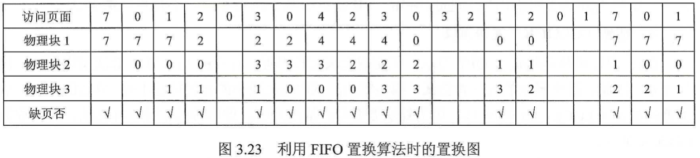

**(一)内存管理概念**

- 内存管理的概念
- 交换与覆盖
- 连续分配管理方式、非连续分配管理方式
- 分页管理方式、分段管理方式、段页式管理方式

**(二)虚拟内存管理**

- 虚拟内存
- 请求分页管理方式、页面置换算法、页面分配策略
- 工作集
- 抖动

## 1.1 内存管理概念

1. 为什么要进行内存管理?
2. 页式管理中每个页表项大小的下限如何决定?
3. 多级页表解决了什么问题?又会带来什么问题?

### 1.1.1 内存管理的基本原理和要求

**操作系统对内存的划分和动态分配，就是内存管理的概念。**

内存管理(MemoryManagement)是操作系统设计中最重要和最复杂的内容之一。虽然计算机硬件技术一直在飞速发展，内存容量也在不断增大，但仍然不可能将所有用户进程和系统所需要的全部程序与数据放入主存，因此操作系统必须对内存空间进行合理的划分和有效的动态分配。

内存管理的功能有：

- 内存空间的分配与回收。由操作系统完成主存储器空间的分配和管理，使程序员摆脱存储分配的麻烦，提高编程效率
- 地址转换。在多道程序环境下，程序中的逻辑地址与内存中的物理地址不可能一致，因此存储管理必须提供地址变换功能，把逻辑地址转换成相应的物理地址
- 内存空间的扩充。利用虚拟存储技术或自动覆盖技术，从逻辑上扩充内存
- 存储保护。保证各道作业在各自的存储空间内运行，互不干扰

#### 1. 程序装入和链接

创建进程首先要将程序和数据装入内存。将用户源程序变为可在内存中执行的程序，通常需要以下几个步骤: 

- 编译。由编译程序将用户源代码编译成若干目标模块
- 链接。由链接程序将编译后形成的一组目标模块及所需的库函数链接在一起，形成一个完整的装入模块
- 装入。 由装入程序将装入模块装入内存运行

#### 2. 逻辑地址空间与物理地址空间

编译后,每个目标模块都从0号单元开始编址,这称为该目标模块的相对地址(或逻辑地址)。当链接程序将各个模块链接成一个完整的可执行目标程序时，链接程序顺序依次按各个模块的相对地址构成统一的从0号单元开始编址的逻辑地址空间。

用户程序和程序员只需知道逻辑地址,进程可以有相同的逻辑地址，因为这些相同的逻辑地址可以映射到主存的不同位置。物理地址空间是指内存中物理单元的集合，它是地址转换的最终地址，进程在运行时执行指令和访问数据，最后都要通过物理地址从主存中存取。**当装入程序将可执行代码装入内存时，必须通过地址转换将逻辑地址转换成物理地址，这个过程称为地址重定位。**

#### 3. 内存保护

内存分配前，需要保护操作系统不受用户进程的影响，同时保护用户进程不受其他用户进程的影响。内存保护可采取两种方法:

1) 在CPU中设置一对上、下限寄存器，存放用户作业在主存中的下限和上限地址，每当CPU要访问一个地址时，分别和两个寄存器的值相比，判断有无越界。

2) 采用重定位寄存器(或基址寄存器)和界地址寄存器( 又称限长寄存器)来实现这种保护。重定位寄存器含最小的物理地址值，界地址寄存器含逻辑地址的最大值。每个逻辑地址值必须小于界地址寄存器。内存管理机构动态地将逻辑地址与界地址寄存器进行比较，若未发生地址越界，则加上重定位寄存器的值后映射成物理地址，再送交内存单元，如图下图所示。

当CPU调度程序选择进程执行时，派遣程序会初始化重定位寄存器和界地址寄存器。每个逻辑地址都需要与这两个寄存器进行核对，以保证操作系统和其他用户程序及数据不被该进程的运行影响。

实现内存保护需要重定位寄存器和界地址寄存器，因此要注意两者的区别。重定位寄存器是用来“加”的，逻辑地址加上重定位寄存器中的值就能得到物理地址。界地址寄存器是用来“比”的，通过比较界地址寄存器中的值与逻辑地址的值来判断是否越界。

### 1.1.2 覆盖与交换

**覆盖与交换技术是在多道程序环境下用来扩充内存的两种方法。**

#### 1. 覆盖
早期的计算机系统中，主存容量很小，虽然主存中仅存放一-道用户程序，但存储空间放不下用户进程的现象也经常发生，这一矛盾可以用覆盖技术来解决。

覆盖的基本思想如下：由于程序运行时并非任何时候都要访问程序及数据的各个部分(尤其是大程序)，因此可把用户空间分成一个固定区和若干覆盖区。将经常活跃的部分放在固定区，其余部分按调用关系分段。”首先将那些即将要访问的段放入覆盖区，其他段放在外存中，在需要调用前，系统再将其调入覆盖区，替换覆盖区中原有的段。

覆盖技术的特点是，打破了必须将一个进程的全部信息装入主存后才能运行的限制，但当同时运行程序的代码量大于主存时仍不能运行，此外，内存中能够更新的地方只有覆盖区的段，不在覆盖区中的段会常驻内存。

#### 2. 交换

交换(对换)的基本思想是，把处于等待状态(或在CPU调度原则下被剥夺运行权利)的程序从内存移到辅存，把内存空间腾出来，这一过程又称换出，把准备好竞争CPU运行的程序从辅存移到内存，这一过程又称换入。

例如，有一个CPU采用时间片轮转调度算法的多道程序环境。时间片到，内存管理器将刚刚执行过的进程换出，将另一进程换入刚刚释放的内存空间。同时，CPU调度器可以将时间片分配给其他已在内存中的进程。每个进程用完时间片都与另一进程交换。 在理想情况下，内存管理器的交换过程速度足够快，总有进程在内存中可以执行。

- 若换出进程， 则必须确保该进程完全处于空闲状态。
- 交换空间通常作为磁盘的一整块，且独立于文件系统，因此使用起来可能很快。
- 交换通常在有许多进程运行且内存空间吃紧时开始启动，而在系统负荷降低时就暂停。
- 普通的交换使用不多，但交换策略的某些变体在许多系统(如UNIX系统)中仍发挥作用。

交换技术主要在不同进程(或作业)之间进行，而覆盖则用于同一个程序或进程中。由于覆盖技术要求给出程序段之间的覆盖结构，使得其对用户和程序员不透明，所以对于主存无法存放用户程序的矛盾，现代操作系统是通过虚拟内存技术来解决的，覆盖技术则已成为历史，而交换技术在现代操作系统中仍具有较强的生命力。

### 1.1.3 内存连续分配管理方式

连续分配方式是指为一个用户程序分配-一个连续的内存空间，譬如某用户需要1GB的内存空间，连续分配方式就在内存空间中为用户分配- -块连续的1GB 空间。连续分配方式主要包括单一连续分配、 固定分区分配和动态分区分配。

#### 1. 单一连续分配
内存在此方式下分为系统区和用户区，系统区仅供操作系统使用，通常在低地址部分，用户区是为用户提供的、除系统区之外的内存空间。这种方式无须进行内存保护。因为内存中永远只有一道程序，因此肯定不会因为访问越界而干扰其他程序。

- 优点：简单、无外部碎片，可以采用覆盖技术，不需要额外的技术支持
- 缺点：只能用于单用户、单任务的操作系统中，有内部碎片，存储器的利用率极低

#### 2. 固定分区分配
固定分区分配是最简单的--种多道程序存储管理方式，它将用户内存空间划分为若干固定大小的区域，每个分区只装入一道作业。当有空闲分区时，便可再从外存的后备作业队列中选择适当大小的作业装入该分区，如此循环。
固定分区分配在划分分区时有两种不同的方法，如下图所示：

- 分区大小相等：用于利用一台计算机去控制多个相同对象的场合，缺乏灵活性。

- 分区大小不等：划分为多个较小的分区、适量的中等分区和少量大分区。

为便于内存分配，通常将分区按大小排队，并为之建立一张分区说明表，其中各表项包括每个分区的始址、大小及状态(是否已分配)，如图3.5(a)所示。当有用户程序要装入时，便检索该表，以找到合适的分区给予分配并将其状态置为“已分配”，未找到合适分区时，则拒绝为该用户程序分配内存。存储空间的分配情况如下图所示。

这种分区方式存在两个问题: 

- 一是程序可能太大而放不进任何一个分区中，这时用户不得不使用覆盖技术来使用内存空间
- 二是主存利用率低，当程序小于固定分区大小时，也占用一个完整的内存分区空间，这样分区内部就存在空间浪费，这种现象称为内部碎片

固定分区是可用于多道程序设计的最简单的存储分配，无外部碎片，但不能实现多进程共享一个主存区，所以存储空间利用率低。固定分区分配很少用于现在通用的操作系统中，但在某些用于控制多个相同对象的控制系统中仍发挥着一定 的作用。

#### 3. 动态分区分配

动态分区分配又称可变分区分配，是一种动态划分内存的分区方法。这种分区方法不预先划分内存，而是在进程装入内存时，根据进程的大小动态地建立分区，并使分区的大小正好适合进程的需要。因此，系统中分区的大小和数目是可变的。

如上图所示，系统有64MB内存空间，其中低8MB固定分配给操作系统，其余为用户可用内存。开始时装入前三个进程，它们分别分配到所需的空间后，内存只剩下4MB,进程4无法装入。在某个时刻，内存中没有一个就绪进程，CPU 出现空闲，操作系统就换出进程2，换入进程4。由于进程4比进程2小，这样在主存中就产生了一个6MB的内存块。之后CPU又出现空闲，而主存无法容纳进程2，操作系统就换出进程1，换入进程2。

动态分区在开始分配时是很好的，但之后会导致内存中出现许多小的内存块。随着时间的推移，内存中会产生越来越多的碎片，内存的利用率随之下降。这些小的内存块称为外部碎片，指在所有分区外的存储空间会变成越来越多的碎片，这与固定分区中的内部碎片正好相对。

克服外部碎片可以通过紧凑(Compaction)技术来解决，即操作系统不时地对进程进行移动和整理。但这需要动态重定位寄存器的支持，且相对费时。紧凑的过程实际上类似于Windows系统中的磁盘整理程序，只不过后者是对外存空间的紧凑。

在进程装入或换入主存时，若内存中有多个足够大的空闲块，则操作系统必须确定分配哪个内存块给进程使用，这就是动态分区的分配策略。考虑以下几种算法:

1) 首次适应(First Fit)算法。空闲分区以地址递增的次序链接。分配内存时顺序查找，找到大小能满足要求的第一个空闲分区
2) 最佳适应(Best Fit)算法。空闲分区按容量递增的方式形成分区链，找到第一个能满足要求的空闲分区

3) 最坏适应(Worst Fit)算法。又称最大适应(Largest Fit)算法，空闲分区以容量递减的次序链接，找到第一个能满足要求的空闲分区，即挑选出最大的分区
4) 邻近适应(NextFit) 算法。又称循环首次适应算法，由首次适应算法演变而成。不同之处是，分配内存时从上次查找结束的位置开始继续查找

以上三种内存分区管理方法有一个共同特点，即用户进程(或作业)在主存中都是连续存放的。这里对它们进行比较和总结。

### 1.1.4 非连续分配管理方式

非连续分配允许一个程序分散地装入不相邻的内存分区。在连续分配管理方式中，我们发现，即使内存有超过1GB的空闲空间，但若没有连续的1GB空间，则需要1GB空间的作业仍然是无法运行的，但若采用非连续分配管理方式，则作业所要求的1GB内存空间可以分散地分配在内存的各个区域，当然，这也需要额外的空间去存储它们( 分散区域)的索引，使得非连续分配方式的存储密度低于连续存储方式的。

非连续分配管理方式根据分区的大小是否固定，分为分页存储管理方式和分段存储管理方式。

在分页存储管理方式中，又根据运行作业时是否要把作业的所有页面都装入内存才能运行，分为基本分页存储管理方式和请求分页存储管理方式。下面介绍基本分页存储管理方式。

#### 1. 分页存储管理方式

固定分区会产生内部碎片，动态分区会产生外部碎片，这两种技术对内存的利用率都比较低。我们希望内存的使用能尽量避免碎片的产生，这就引入了分页的思想：把主存空间划分为大小相等且固定的块，块相对较小，作为主存的基本单位。每个进程也以块为单位进行划分，进程在执行时，以块为单位逐个申请主存中的块空间。

**分页存储的几个基本概念：**

- 页面和页面

  进程中的块称为页(Page)， 内存中的块称为页框( Page Frame，或页帧)。外存也以同样的单位进行划分，直接称为块(Block)。 进程在执行时需要申请主存空间，即要为每个页面分配主存中的可用页框，这就产生了页和页框的一对应。

  为方便地址转换，页面大小应是2的整数幂。同时页面大小应该适中，页面太小会使进程的页面数过多，这样页表就会过长，占用大量内存，而且也会增加硬件地址转换的开销，降低页面换入/换出的效率;页面过大又会使页内碎片增多，降低内存的利用率。所以页面的大小应该适中，要在空间效率和时间效率之间权衡。

- 地址结构

  分页存储管理的逻辑地址结构如下图所示：

地址结构包含两部分：前一部分为页号P，后一部分为页内偏移量W。地址长度为32位，其中0~11位为页内地址，即每页大小为4KB; 12~31位为页号，地址空间最多允许2^20页。

- 页表

  为了便于在内存中找到进程的每个页面所对应的物理块，系统为每个进程建立一张页表，它记录页面在内存中对应的物理块号，页表一般存放在内存中。

  页表是由页表项组成的，页表项与地址都由两部分构成，而且第一部分都是页号，但页表项的第二部分是物理内存中的块号，而地址的第二部分是页内偏移；页表项的第二部分与地址的第二部分共同组成物理地址。

  在配置页表后，进程执行时，通过查找该表，即可找到每页在内存中的物理块号。可见，页表的作用是实现从页号到物理块号的地址映射，如下图所示。

**基本地址变换机构**
地址变换机构的任务是将逻辑地址转换为内存中的物理地址。地址变换是借助于页表实现的。下图给出了分页存储管理系统中的地址变换机构。

在系统中通常设置一个页表寄存器(PTR)， 存放页表在内存的起始地址F和页表长度M。进程未执行时，页表的始址和长度存放在进程控制块中，当进程执行时，才将页表始址和长度存入页表寄存器。设页面大小为L，逻辑地址A到物理地址E的变换过程如下(逻辑地址、页号、每页的长度都是十进制数): 

①计算页号P (P=A/L)和页内偏移量W (W= A%L)

②比较页号P和页表长度M,若P≥M，则产生越界中断，否则继续执行

③页表中页号P对应的页表项地址=页表始址F+页号Px页表项长度，取出该页表项内容b，即为物理块号。要注意区分页表长度和页表项长度。页表长度的值是指一共有多少页，页表项长度是指页地址占多大的存储空间

④计算E=bxL+W，用得到的物理地址E去访问内存。

**具有快表的地址变换机构**

由上面介绍的地址变换过程可知，若页表全部放在内存中，则存取一-个数据或一条指令至少要访问两次内存：

- 第一次是访问页表，确定所存取的数据或指令的物理地址

- 第二次是根据该地址存取数据或指令

显然，这种方法比通常执行指令的速度慢了一半。为此，在地址变换机构中增设- -个 具有并行查找能力的高速缓冲存储器一快表，又称相联存储器(TLB),用来存放当前访问的若干页表项，以加速地址变换的过程。与此对应，主存中的页表常称为慢表。具有快表的地址变换机构如下图所示。

在具有快表的分页机制中，地址的变换过程如下:
①CPU给出逻辑地址后，由硬件进行地址转换，将页号送入高速缓存寄存器，并将此页号与快表中的所有页号进行比较

②若找到匹配的页号，说明所要访问的页表项在快表中，则直接从中取出该页对应的页框号，与页内偏移量拼接形成物理地址。这样，存取数据仅一次访存便可实现

③若未找到匹配的负号，则需要访问主存中的页表，在读出页表项后，应同时将其存入快表，以便后面可能的再次访问。但若快表已满，则必须按照-定的算法对旧的页表项进行替换

一般快表的命中率可达90%以上，这样分页带来的速度损失就可降低至10%以下。快表的有效性基于局部性原理。

**两级页表**

由于引入了分页管理，进程在执行时不需要将所有页调入内存页框，而只需将保存有映射关系的页表调入内存。但是，我们仍然需要考虑页表的大小。以32位逻辑地址空间、页面大小4KB、页表项大小4B为例，若要实现进程对全部逻辑地址空间的映射,则每个进程需要2^20即约100万个页表项。也就是说，每个进程仅页表这一项就需要 4MB主存空间，这显然是不切实际的。

为了压缩页表，根据进一步延伸页表映射的思想，就可得到二级分页，即使用层次结构的页表：将页表的10 页空间也进行地址映射，建立上一级页表，用于存储页表的映射关系。这里对页表的10个页面进行映射只需要10个页表项，所以上一级页表只需要1页就已足够(可以存储210= 1024个页表项)。在进程执行时，只需要将这一页的上一级页表调入内存即可，进程的页表和进程本身的页面可在后面的执行中再调入内存。

#### 2. 分段存储管理方式

分页管理方式是从计算机的角度考虑设计的，目的是提高内存的利用率，提升计算机的性能。分页通过硬件机制实现，对用户完全透明。分段管理方式的提出则考虑了用户和程序员，以满足方便编程、信息保护和共享、动态增长及动态链接等多方面的需要。

**分段**

段式管理方式按照用户进程中的自然段划分逻辑空间。例如，用户进程由主程序、两个子程序、栈和一段数据组成，于是可以把这个用户进程划分为5段，每段从0开始编址，并分配一段连续的地址空间(段内要求连续，段间不要求连续，因此整个作业的地址空间是二维的)，其逻辑地址由段号S与段内偏移量W两部分组成。在下图中，段号为16位，段内偏移量为16位，因此-一个作业最多有216 = 65536段，最大段长为64KB。

**段表**

每个进程都有一张逻辑空间与内存空间映射的段表，其中每个段表项对应进程的一段， 段表项记录该段在内存中的始址和长度。段表的内容如下图所示。

配置段表后，执行中的进程可通过查找段表，找到每段所对应的内存区。可见，段表用于实现从逻辑段到物理内存区的映射，如下图所示。

**地址变换机构**

分段系统的地址变换过程如下图所示。为了实现进程从逻辑地址到物理地址的变换功能，在系统中设置了段表寄存器，用于存放段表始址F和段表长度M。从逻辑地址A到物理地址E之间的地址变换过程如下:

①从逻辑地址A中取出前几位为段号S，后几位为段内偏移量W

②比较段号S和段表长度M,若S≥M,则产生越界中断，否则继续执行。

③段表中段号S对应的段表项地址 = 段表始址F+段号Sx段表项长度，取出该段表项的前几位得到段长C。若段内偏移量≥C,则产生越界中断，否则继续执行。段表项实际上只有两部分，前几位是段长，后几位是始址。

④取出段表项中该段的始址b，计算E=b+ W,用得到的物理地址E去访问内存。

**段的共享与保护**

在分段系统中，段的共享是通过两个作业的段表中相应表项指向被共享的段的同一个物理副本来实现的。当一个作业正从共享段中读取数据时，必须防止另一个作业修改此共享段中的数据。不能修改的代码称为纯代码或可重入代码(它不属于临界资源)，这样的代码和不能修改的数据可以共享，而可修改的代码和数据不能共享。

与分页管理类似，分段管理的保护方法主要有两种：

- 一种是存取控制保护

- 另一种是地址越界保护

地址越界保护将段表寄存器中的段表长度与逻辑地址中的段号比较，若段号大于段表长度，则产生越界中断;再将段表项中的段长和逻辑地址中的段内偏移进行比较，若段内偏移大于段长，也会产生越界中断。分页管理中的地址越界保护只需要判断页号是否越界，页内偏移是不可能越界的。

与页式管理不同，段式管理不能通过给出-一个整数便确定对应的物理地址，因为每段的长度是不固定的，无法通过整数除法得出段号，无法通过求余得出段内偏移，所以段号和段内偏移一定要显式给出(段号，段内偏移)，因此分段管理的地址空间是二维的。

#### 3. 段页式存储方式

页式存储管理能有效地提高内存利用率，而分段存储管理能反映程序的逻辑结构并有利于段的共享。将这两种存储管理方法结合起来，便形成了段页式存储管理方式。

段分成若干大小固定的页。对内存空间的管理仍然和分页存储管理一-样， 将其分成若干和页面大小相同的存储块，对内存的分配以存储块为单位，如下图所示。

在段页式系统中，作业的逻辑地址分为三部分:段号、页号和页内偏移量，如下图所示。

为了实现地址变换，系统为每个进程建立一张段表， 每个分段有一张页表。 段表表项中至少包括段号、页表长度和页表始址，页表表项中至少包括页号和块号。此外，系统中还应有一个段表寄存器，指出作业的段表始址和段表长度(段表寄存器和页表寄存器的作用都有两个，一是在段表或页表中寻址，二是判断是否越界)。

在进行地址变换时，首先通过段表查到页表始址，然后通过页表找到页帧号，最后形成物理地址。如下图所示，进行一次访问实际需要三次访问主存，这里同样可以使用快表来加快查找速度，其关键字由段号、页号组成，值是对应的页帧号和保护码。

结合上面对段式管理和页式管理的地址空间的分析，可以得出结论：段页式管理的地址空间是二维的。

## 1.2 虚拟内存

1) 为什么要引入虚拟内存?
2) 虚拟内存空间的大小由什么因素决定?
3) 虚拟内存是怎么解决问题的?会带来什么问题?

### 1.2.1 虚拟内存基本概念

#### 1. 传统存储管理方式的特征

上边讨论的各种内存管理策略都是为了同时将多个进程保存在内存中，以便允许进行多道程序设计。它们都具有以下两个共同的特征: 

- 一次性

  作业必须一次性全部装入内存后，才能开始运行。这会导致两种情况：

  ①当作业很大而不能全部被装入内存时，将使该作业无法运行

  ②当大量作业要求运行时，由于内存不足以容纳所有作业，只能使少数作业先运行，导致多道程序度的下降

- 驻留性

  作业被装入内存后，就一直驻留在内存中，其任何部分都不会被换出，直至作业运行结束。运行中的进程会因等待I/O而被阻塞，可能处于长期等待状态

由以上分析可知，许多在程序运行中不用或暂时不用的程序(数据)占据了大量的内存空间，而一些需要运行的作业又无法装入运行，显然浪费了宝贵的内存资源。

#### 2. 局部性原理
要真正理解虚拟内存技术的思想，首先须了解著名的局部性原理。BillJoy(SUN公司CEO)说过：“在研究所时，我经常开玩笑地说高速缓存是计算机科学中唯一重要的思想。 事实上，高速缓存技术确实极大地影响了计算机系统的设计。“ 快表、页高速缓存及虚拟内存技术从广义上讲，都属于高速缓存技术。这个技术所依赖的原理就是局部性原理。局部性原理既适用于程序结构，又适用于数据结构。

局部性原理表现在以下两个方面：

- 时间局部性

  程序中的某条指令一 旦执行，不久后该指令可能再次执行；某数据被访问过，不久后该数据可能再次被访问。产生时间局部性的典型原因是程序中存在着大量的循环操作。

- 空间局部性

  一旦程序访问了 某个存储单元，在不久后，其附近的存储单元也将被访问，即程序在一段时间内所访问的地址，可能集中在一定的范围之内，因为指令通常是顺序存放、顺序执行的，数据也一般是以向量、数组、表等形式簇聚存储的。

时间局部性通过将近来使用的指令和数据保存到高速缓冲存储器中，并使用高速缓存的层次结构实现。空间局部性通常使用较大的高速缓存,并将预取机制集成到高速缓存控制逻辑中实现。虚拟内存技术实际上建立了“内存-外存”的两级存储器结构，利用局部性原理实现高速缓存。

#### 3. 虚拟存储器的定义和特征

基于局部性原理，在程序装入时，将程序的一部分装入内存，而将其余部分留在外存，就可启动程序执行。在程序执行过程中，当所访问的信息不在内存时，由操作系统将所需要的部分调入内存，然后继续执行程序。另一方面，操作系统将内存中暂时不使用的内容换出到外存上，从而腾出空间存放将要调入内存的信息。这样，系统好像为用户提供了一个比实际内存大得多的存储器，称为虚拟存储器。

之所以将其称为虛拟存储器，是因为这种存储器实际上并不存在，只是由于系统提供了部分装入、请求调入和置换功能后(对用户完全透明)，给用户的感觉是好像存在一个比实际物理内存大得多的存储器。虚拟存储器的大小由计算机的地址结构决定，并不是内存和外存的简单相加。

虚拟存储器有以下三个主要特征：

- 多次性

  多次性是指无须在作业运行时一次性地全部装入内存，而允许被分成多次调入内存运行

- 对换性
	
	对换性是指无须在作业运行时一直常驻内存，而允许在作业的运行过程中，进行换进和换出
	
- 虚拟性
	
	虚拟性是指从逻辑上扩充内存的容量，使用户所看到的内存容量远大于实际的内存容量

#### 4. 虚拟内存技术的实现

虚拟内存技术允许将一个作业分多次调入内存。采用连续分配方式时，会使相当一部分内存空间都处于暂时或“永久”的空闲状态，造成内存资源的严重浪费，而且也无法从逻辑上扩大内存容量。因此，虚拟内存的实现需要建立在离散分配的内存管理方式的基础上。

虚拟内存的实现有以下三种方式:

- 请求分页存储管理
- 请求分段存储管理
- 请求段页式存储管理

- 定容量的内存和外存
- 页表机制(或段表机制)，作为主要的数据结构
- 中断机构， 当用户程序要访问的部分尚未调入内存时，则产生中断 
- 地址变换机构，逻辑地址到物理地址的变换

### 1.2.2 请求分页管理方式

请求分页系统建立在基本分页系统基础之上，为了支持虚拟存储器功能而增加了请求调页功能和页面置换功能。请求分页是目前最常用的一种实现虚拟存储器的方法。

在请求分页系统中，只要求将当前需要的一部分页面装入内存，便可以启动作业运行。在作业执行过程中，当所要访问的页面不在内存中时，再通过调页功能将其调入，同时还可通过置换功能将暂时不用的页面换出到外存上，以便腾出内存空间。

为了实现请求分页，系统必须提供一定的硬件支持。除了需要一定容量的内存及外存的计算机系统，还需要有页表机制、缺页中断机构和地址变换机构。

#### 1. 页表机制

请求分页系统的页表机制不同于基本分页系统，请求分页系统在一个作业运行之前不要求全部一次性调入内存，因此在作业的运行过程中，必然会出现要访问的页面不在内存中的情况，如何发现和处理这种情况是请求分页系统必须解决的两个基本问题。为此，在请求页表项中增加了4个字段，如下图所示。

- 状态位P。用于指示该页是否已调入内存，供程序访问时参考

- 访问字段A。用于记录本页在--段时间内被访问的次数,或记录本页最近已有多长时间未被访问，供置换算法换出页面时参考

- 修改位M。标识该页在调入内存后是否被修改过

- 外存地址。用于指出该页在外存上的地址，通常是物理块号，供调入该页时参考

#### 2. 缺页中断机构

在请求分页系统中，每当所要访问的页面不在内存中时，便产生一个缺页中断，请求操作系统将所缺的页调入内存。此时应将缺页的进程阻塞(调页完成唤醒)，若内存中有空闲块，则分配一个块，将要调入的页装入该块，并修改页表中的相应页表项，若此时内存中没有空闲块，则要淘汰某页(若被淘汰页在内存期间被修改过，则要将其写回外存)。

缺页中断作为中断，同样要经历诸如保护CPU环境、分析中断原因、转入缺页中断处理程序、恢复CPU环境等几个步骤。但与一般的中断相比，它有以下两个明显的区别:

- 在指令执行期间而非一条指令执行完后产生和处理中断信号，属于内部中断。

- 一条指令在执行期间，可能产生多次缺页中断。

#### 3. 地址变换机构

请求分页系统中的地址变换机构，是在分页系统地址变换机构的基础上，为实现虚拟内存，又增加了某些功能而形成的。如下图所示，在进行地址变换时，先检索快表：

- 若找到要访问的页，则修改页表项中的访问位(写指令还需要重置修改位)，然后利用页表项中给出的物理块号和页内地址形成物理地址
- 若未找到该页的页表项，则应到内存中去查找页表，再对比页表项中的状态位P，看该页是否已调入内存，未调入则产生缺页中断，请求从外存把该页调入内存

### 1.2.3 页面置换算法

进程运行时，若其访问的页面不在内存中而需将其调入，但内存已无空闲空间时，就需要从内存中调出一页程序或数据，送入磁盘的对换区。

选择调出页面的算法就称为页面置换算法。好的页面置换算法应有较低的页面更换频率，也就是说，应将以后不会再访问或以后较长时间内不会再访问的页面先调出。

常见的置换算法有以下4种：

#### 1. 最佳(OPT)置换算法

最佳(Optimal,OPT)置换算法选择的被淘汰页面是以后永不使用的页面，或是在最长时间内不再被访问的页面，以便保证获得最低的缺页率。然而，由于人们目前无法预知进程在内存下的若干页面中哪个是未来最长时间内不再被访问的，因而该算法无法实现。

最长时间不被访问和以后被访问次数最小是不同的概念。可以看到，发生缺页中断次数为9，页面置换次数为6。

#### 2. 先进先出(FIFO) 页面置换算法

优先淘汰最早进入内存的页面，即在内存中驻留时间最久的页面。该算法实现简单，只需把调入内存的页面根据先后次序链接成队列，设置一个指针总指向最早的页面。但该算法与进程实际运行时的规律不适应，因为在进程中，有的页面经常被访问。

FIFO算法还会产生所分配的物理块数增大而页故障数不减反增的异常现象，这由Belady于1969年发现，因此称为Belady异常。只有FIFO算法可能出现Belady异常，LRU和OPT算法永远不会出现Belady异常。

如下图所示，页面访问顺序为3,2,1,0,3,2,4,3,2,1,0,4。若采用FIFO置换算法，当分配的物理块为3个时，缺页次数为9次;当分配的物理块为4个时，缺页次数为10 次。分配给进程的物理块增多，但缺页次数不减反增。

#### 3. 最近最久未使用(LRU)置换算法

选择最近最长时间未访问过的页面予以淘汰，它认为过去一段时间内未访问过的页面，在最近的将来可能也不会被访问。该算法为每个页面设置一一个访问字段，来记录页面自上次被访问以来所经历的时间，淘汰页面时选择现有页面中值最大的予以淘汰。

再对上面的实例采用LRU算法进行页面置换，如图3.25所示。进程第一次对页面2访问时，将最近最久未被访问的页面7置换出去。然后在访问页面3时，将最近最久未使用的页面1换出。

LRU算法根据各页以前的情况，是“向前看”的，而最佳置换算法则根据各页以后的使用情况，是“向后看”的。

LRU算法的性能较好，但需要寄存器和栈的硬件支持。LRU是堆栈类的算法。理论上可以证明，堆栈类算法不可能出现Belady异常。FIFO算法基于队列实现，不是堆栈类算法。

#### 4. 时钟(CLOCK)置换算法

LRU算法的性能接近于OPT算法，但实现起来比较困难，且开销大; FIFO 算法实现简单，但性能差。因此，操作系统的设计者尝试了很多算法，试图用比较小的开销接近LRU算法的性能，这类算法都是CLOCK算法的变体。因为算法要循环扫描缓冲区，像时钟的指针一样转动，所以称为CLOCK算法。

简单的CLOCK算法给每帧关联一一个附加位， 称为使用位。当某页首次装入主存时，将该帧的使用位设置为1; 当该页随后再被访问到时，其使用位也被置为1。对于页替换算法，用于替换的候选帧集合可视为一个循环缓冲区，并有一个指针与之相关联。当某一页 被替换时，该指针被设置成指向缓冲区中的下一帧。当需要替换一页时，操作系统扫描缓冲区，以查找使用位被置为0的一帧。每当遇到一个使用位为1的帧时，操作系统就将该位重新置为0;若在这个过程开始时，缓冲区中所有帧的使用位均为0，则选择遇到的第一一个帧替换; 若所有帧的使用位均为1,
则指针在缓冲区中完整地循环一周，把所有使用位都置为0，并停留在最初的位置上，替换该帧中的页。由于该算法循环检查各页面的情况，因此称CLOCK算法，又称最近未用( Not RecentlyUsed，NRU)算法。

### 1.2.4 页面分配策略

#### 1. 驻留集大小

对于分页式的虚拟内存，在进程准备执行时，不需要也不可能把一个进程的所有页都读入主存。因此，操作系统必须决定读取多少页，即决定给特定的进程分配几个页框。给一个进程分配的物理页框的集合就是这个进程的驻留集。需要考虑以下几点:

- 分配给一个进程的存储量越小，任何时候驻留在主存中的进程数就越多，从而可以提高处理机的时间利用效率

- 若一个进程在主存中的页数过少，则尽管有局部性原理，页错误率仍然会相对较高

- 若页数过多，则由于局部性原理，给特定的进程分配更多的主存空间对该进程的错误率没有明显的影响

基于这些因素，现代操作系统通常采用三种策略: 

**固定分配局部置换**

它为每个进程分配一定数目的物理块，在整个运行期间都不改变。若进程在运行中发生缺页，则只能从该进程在内存中的页面中选出一页换出，然后调入需要的页面。实现这种策略时，难以确定应为每个进程分配的物理块数目：太少会频繁出现缺页中断，太多又会使CPU和其他资源利用率下降。

**可变分配全局置换**

这是最易于实现的物理块分配和置换策略，它为系统中的每个进程分配一定数目的物理块，操作系统自身也保持一个空闲物理块队列。当某进程发生缺页时，系统从空闲物理块队列中取出一个物理块分配给该进程，并将欲调入的页装入其中。这种方法比固定分配局部置换更加灵活，可以动态增加进程的物理块，但也存在弊端，如它会盲目地给进程增加物理块，从而导致系统多道程序的并发能力下降。

**可变分配局部置换**

它为每个进程分配一定数目的物理块，当某个进程发生缺页时，只允许从该进程在内存的页面中选出一页换出，因此不会影响其他进程的运行。若进程在运行中频繁地缺页，则系统再为该进程分配若干物理块，直至该进程缺页率趋于适当程度;反之，若进程运行中的缺页率特别低，则可适当减少分配给该进程的物理块。比起可变分配全局置换，这种方法不仅可以动态增加进程物理块的数量，还能动态减少进程物理块的数量，在保证进程不会过多地调页的同时，也保持了系统的多道程序并发能力。当然它需要更复杂的实现，也需要更大的开销，但对比频繁地换入/换出所浪费的计算机资源，这种牺牲是值得的。

#### 2. 调入页面的时机

为确定系统将进程运行时所缺的页面调入内存的时机，可采取以下两种调页策略：

**预调页策略**

根据局部性原理，一次调入若干相邻的页可能会比一次调入一页更高效。但若调入的一批页面中大多数都未被访问，则又是低效的。因此，需要采用以预测为基础的预调页策略，将预计在不久之后便会被访问的页面预先调入内存。但目前预调页的成功率仅约50%。因此这种策略主要用于进程的首次调入，由程序员指出应先调入哪些页。

**请求调页策略**

进程在运行中需要访问的页面不在内存而提出请求，由系统将所需页面调入内存。由这种策略调入的页一定会被访问，且这种策略比较易于实现，因此在目前的虚拟存储器中大多采用此策略。它的缺点是每次只调入-页，调入/调出页面数多时会花费过多的I/O开销。

预调入实际上就是运行前的调入，请求调页实际上就是运行期间调入。一般情况下，两种调页策略会同时使用。

#### 3. 从何处调入页面

请求分页系统中的外存分为两部分:用于存放文件的文件区和用于存放对换页面的对换区。对换区通常采用连续分配方式，而文件区采用离散分配方式，因此对换区的磁盘I/O速度比文件区的更快。这样，从何处调入页面就存在三种情况:

**系统拥有足够的对换区空间**

可以全部从对换区调入所需页面，以提高调页速度。为此，在进程运行前，需将与该进程有关的文件从文件区复制到对换区。

**系统缺少足够的对换区空间**

凡不会被修改的文件都直接从文件区调入；而当换出这些页面时，由于它们未被修改而不必再将它们换出。但对于那些可能被修改的部分，在将它们换出时须调到对换区，以后需要时再从对换区调入(因为读的速度比写的速度快)。

**UNIX方式**

与进程有关的文件都放在文件区，因此未运行过的页面都应从文件区调入。曾经运行过但又被换出的页面，由于放在对换区，因此下次调入时应从对换区调入。进程请求的共享页面若被其他进程调入内存，则无须再从对换区入。

### 1.2.5 抖动

在页面置换过程中，一种最糟糕的情形是，刚刚换出的页面马上又要换入主存，刚刚换入的页面马上又要换出主存，这种频繁的页面调度行为称为抖动。若一个进程在换页上用的时间多于执行时间，则这个进程就在抖动。

频繁发生缺页中断(抖动)的主要原因是，某个进程频繁访问的页面数目高于可用的物理页帧数目。虚拟内存技术可在内存中保留更多的进程以提高系统效率。在稳定状态，几乎主存的所有空间都被进程块占据，处理机和操作系统可以直接访问到尽可能多的进程。然而，如果管理不当，那么处理机的大部分时间都将用于交换块，即请求调入页面的操作，而不是执行进程的指令，因此会大大降低系统效率。

