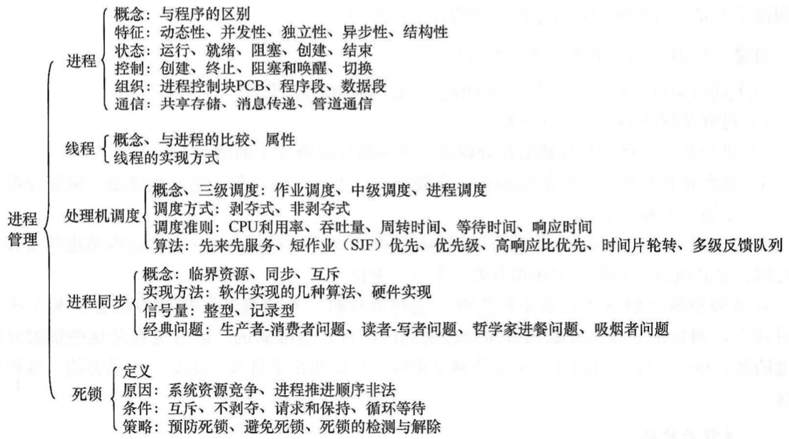

1. 进程与线程

   进程的概念；进程的状态与转换

   进程控制；进程组织

   进程通信；线程概念与多线程模型

2. 处理机调度调度的基本准则

   调度方式；典型调度算法

3. 进程同步

   进程同步的基本概念

   实现临界区互斥的基本方法

   信号量；管程；经典同步问题

4. 死锁

   死锁的概念；死锁处理策略

   死锁预防；死锁避免；死锁的检测和解除

## 1. 进程与线程

1. 为什么要引入进程?

2. 什么是进程?进程由什么组成?

3. 进程是如何解决问题的?

### 1.1进程 的概念和特征
#### 1.1.1 进程

在多道程序环境下，允许多个程序并发执行，此时它们将失去封闭性，并具有间断性及不可再现性的特征。为此引入了进程(Process)的概念，以便更好地描述和控制程序的并发执行，实现操作系统的**并发性和共享性**。

为了使参与并发执行的程序(含数据)能独立地运行，必须为进程配置一个专门的数据结构，称为**进程控制块( Process Control Block，PCB)** 。系统利用PCB来描述进程的基本情况和运行状态，进而控制和管理进程。相应地，**由程序段、相关数据段和PCB三部分构成了进程**。所谓创建进程，实质上是创建进程中的PCB；而撤销进程，实质上是撤销进程的PCB。**进程是系统进行资源分配和调度的单位。**

#### 1.1.2. 进程的特征
进程是由多道程序的并发执行而引出的，它和程序是两个截然不同的概念。

进程的基本特征如下：

1. 动态性

   进程是程序的一次执行，它有着创建、活动、暂停、终止等过程，具有一定的生命周期，是动态地产生、变化和消亡的。

   动态性是进程最基本的特征

2. 并发性

   指多个进程实体同时存于内存中，能在一段时间内同时运行。并发性是进程的重要特征，同时也是操作系统的重要特征。引入进程的目的就是为了使程序能与其他进程的程序并发执行，以提高资源利用率

3. 独立性

   指进程实体是一个能独立运行、独立获得资源和独立接受调度的基本单位

4. 异步性

   由于进程的相互制约，使得进程具有执行的间断性，即进程按各自独立的、不可预知的速度向前推进。异步性会导致执行结果的不可再现性，为此在操作系统中必须配置相应的进程同步机制

5. 结构性

   每个进程都配置一个PCB。从结构上看，进程实体是由程序段、数据段和进程控制块三部分组成的

