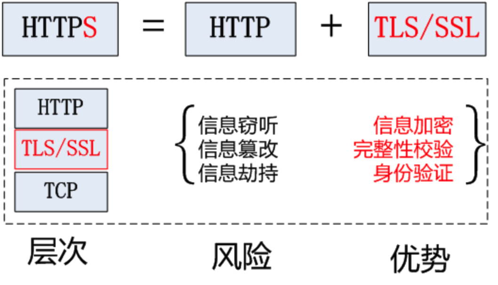
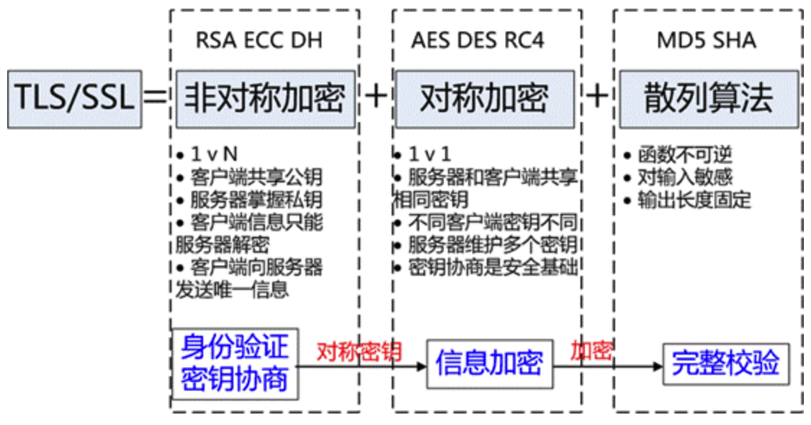
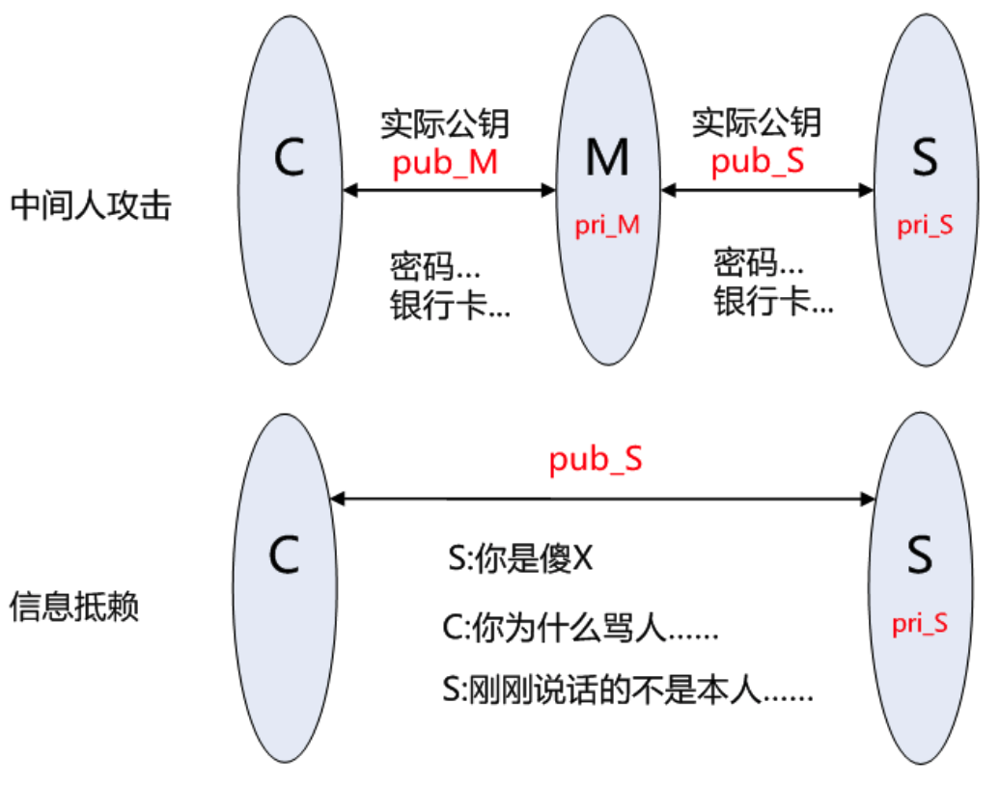
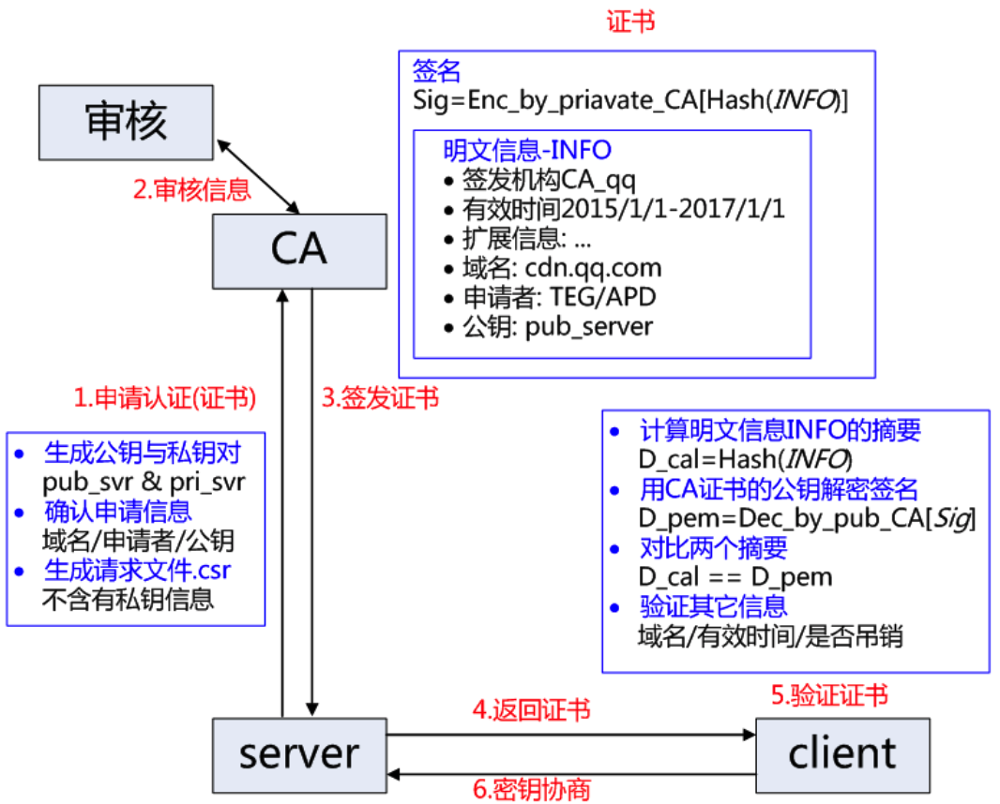
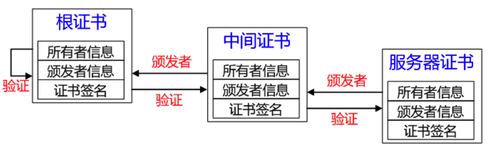
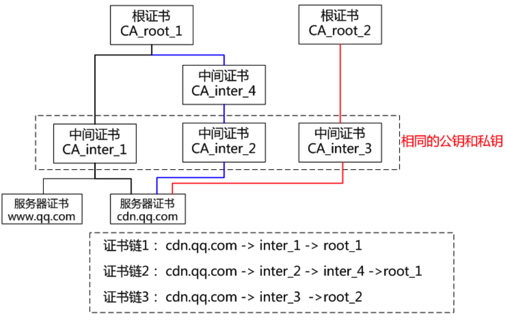
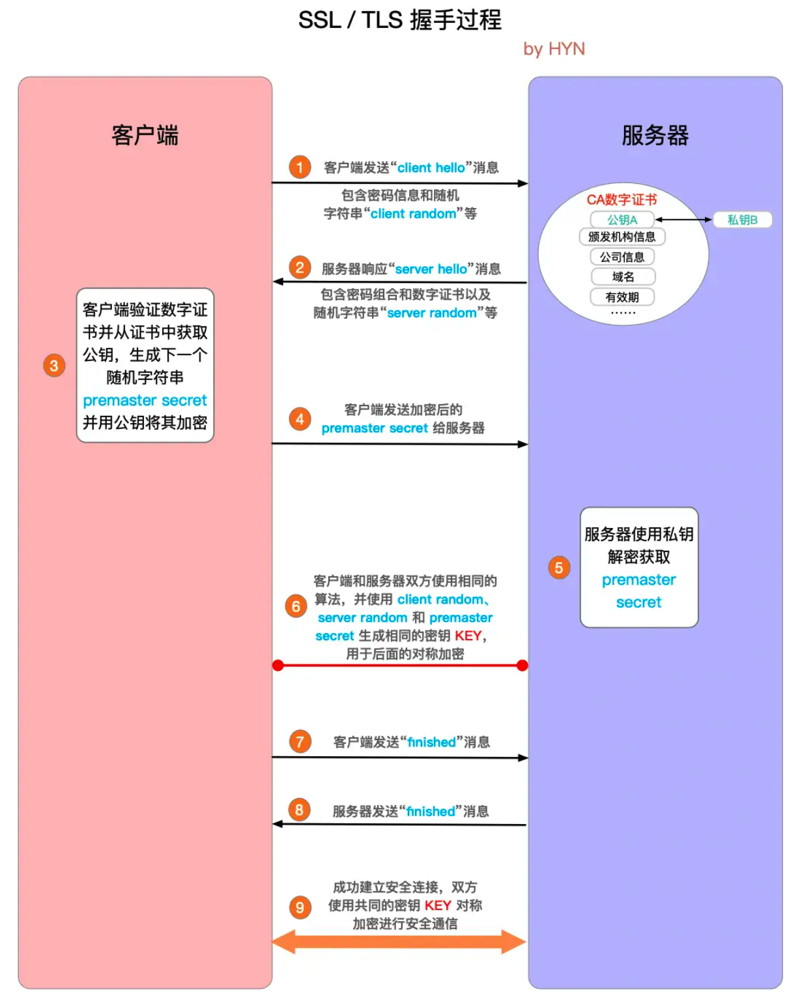

### 1. HTTPS基础

HTTPS是使用TLS/SSL加密的HTTP协议。

HTTP协议采用明文传输信息，存在信息窃听、信息篡改和信息劫持的风险，而协议TLS/SSL具有身份验证、信息加密和完整性校验的功能，可以避免此类问题。

TLS/SSL全称安全传输层协议Transport Layer Security, 是介于TCP和HTTP之间的一层安全协议，不影响原有的TCP协议和HTTP协议，所以使用HTTPS基本上不需要对HTTP页面进行太多的改造。

### 2. TLS/SSL原理

HTTPS协议的主要功能基本都依赖于TLS/SSL协议。

TLS/SSL的功能实现主要依赖于三类基本算法：

- 非对称加密，实现身份认证和密钥协商

- 对称加密，采用协商的密钥对数据加密

- 散列函数Hash，验证信息的完整性

**散列函数Hash**

常见的有MD5、SHA1、SHA256，该类函数特点是函数单向不可逆、对输入非常敏感、输出长度固定，针对数据的任何修改都会改变散列函数的结果，用于防止信息篡改并验证数据的完整性。

在信息传输过程中，散列函数不能单独实现信息防篡改，因为明文传输，中间人可以修改信息之后重新计算信息摘要，因此需要对传输的信息以及信息摘要进行加密。

**对称加密**

常见的有AES-CBC、DES、3DES、AES-GCM等，相同的密钥可以用于信息的加密和解密，掌握密钥才能获取信息，能够防止信息窃听，通信方式是1对1。

对称加密的优势是信息传输1对1，需要共享相同的密码，密码的安全是保证信息安全的基础，服务器和N个客户端通信，需要维持N个密码记录，且缺少修改密码的机制。

**非对称加密**

即常见的RSA算法，还包括ECC、DH等算法，算法特点是，密钥成对出现，一般称为公钥(公开)和私钥(保密)，公钥加密的信息只能私钥解开，私钥加密的信息只能公钥解开。

非对称加密的特点是信息传输1对多，服务器只需要维持一个私钥就能够和多个客户端进行加密通信，但服务器发出的信息能够被所有的客户端解密，且该算法的计算复杂，加密速度慢。

结合三类算法的特点，TLS的基本工作方式是，客户端使用非对称加密与服务器进行通信，实现身份验证并协商对称加密使用的密钥，然后对称加密算法采用协商密钥对信息以及信息摘要进行加密通信，不同的节点之间采用的对称密钥不同，从而可以保证信息只能通信双方获取。

掌握公钥的不同客户端之间不能互相解密信息，只能和掌握私钥的服务器进行加密通信，服务器可以实现1对多的通信，客户端也可以用来验证掌握私钥的服务器身份。

### 3. PKI(公钥基础设施)体系

#### 3.1 RSA身份验证的隐患

身份验证和密钥协商是TLS的基础功能，要求的前提是合法的服务器掌握着对应的私钥。但RSA算法无法确保服务器身份的合法性，因为公钥并不包含服务器的信息，存在安全隐患，如：中间人攻击和信息抵赖。

#### 3.2 身份验证-CA和证书

解决上述身份验证问题的关键是确保获取的公钥途径是合法的，能够验证服务器的身份信息，为此需要引入权威的第三方机构CA。CA负责核实公钥的拥有者的信息，并颁发认证"证书"，同时能够为使用者提供证书验证服务，即PKI体系。

基本的原理为，CA负责审核信息，然后对关键信息利用私钥进行"签名"，公开对应的公钥，客户端可以利用公钥验证签名。CA也可以吊销已经签发的证书，基本的方式包括CRL和OCSP。CA使用具体的流程如下：

1. 服务方S向第三方机构CA提交公钥、组织信息、个人信息(域名)等信息并申请认证

2. CA通过线上、线下等多种手段验证申请者提供信息的真实性，如组织是否存在、企业是否合法，是否拥有域名的所有权等

3. 如信息审核通过，CA会向申请者签发认证文件-证书

   **证书包含以下信息：**申请者公钥、申请者的组织信息和个人信息、签发机构CA的信息、有效时间、证书序列号等信息的明文，同时包含一个签名

   **签名的产生算法：**首先，使用散列函数计算公开的明文信息的信息摘要，然后，采用CA的私钥对信息摘要进行加密，密文即签名

4. 客户端C向服务器S发出请求时，S返回证书文件
5. 客户端C读取证书中的相关的明文信息，采用相同的散列函数计算得到信息摘要，然后，利用对应CA的公钥解密签名数据，对比证书的信息摘要，如果一致，则可以确认证书的合法性，即公钥合法
6. 客户端然后验证证书相关的域名信息、有效时间等信息
7. 客户端会内置信任CA的证书信息(包含公钥)，如果CA不被信任，则找不到对应CA证书，证书也会被判定非法

在这个过程注意几点：

1. 申请证书不需要提供私钥，确保私钥永远只能服务器掌握
2. 证书的合法性仍然依赖于非对称加密算法，证书主要是增加了服务器信息以及签名
3. 内置CA对应的证书称为根证书，颁发者和使用者相同，自己为自己签名，即自签名证书
4. 证书=公钥+申请者与颁发者信息+签名

#### 3.3 证书链

如CA根证书和服务器证书中间增加一级证书机构，即中间证书，证书的产生和验证原理不变，只是增加一层验证，只要最后能够被任何信任的CA根证书验证合法即可。

1. 服务器证书server.pem的签发者为中间证书机构inter，inter根据证书inter.pem验证server.pem确实为自己签发的有效证书
2. 中间证书inter.pem的签发CA为root，root根据证书root.pem验证inter.pem为自己签发的合法证书
3. 客户端内置信任CA的root.pem证书，因此服务器证书server.pem的被信任

服务器证书、中间证书与根证书在一起组合成一条合法的证书链，证书链的验证是自下而上的信任传递的过程。

**二级证书结构存在的优势：**

1. 减少根证书结构的管理工作量，可以更高效的进行证书的审核与签发
2. 根证书一般内置在客户端中，私钥一般离线存储，一旦私钥泄露，则吊销过程非常困难，无法及时补救
3. 中间证书结构的私钥泄露，则可以快速在线吊销，并重新为用户签发新的证书
4. 证书链四级以内一般不会对HTTPS的性能造成明显影响

**证书链有以下特点：**

1. 同一本服务器证书可能存在多条合法的证书链

   因为证书的生成和验证基础是公钥和私钥对，如果采用相同的公钥和私钥生成不同的中间证书，针对被签发者而言，该签发机构都是合法的CA，不同的是中间证书的签发机构不同

2. 不同证书链的层级不一定相同，可能二级、三级或四级证书链

中间证书的签发机构可能是根证书机构也可能是另一个中间证书机构，所以证书链层级不一定相同。

#### 3.4 证书吊销

CA机构能够签发证书，同样也存在机制宣布以往签发的证书无效。证书使用者不合法，CA需要废弃该证书；或者私钥丢失，使用者申请让证书无效。主要存在两类机制：CRL与OCSP。

1. **CRL**

Certificate Revocation List, 证书吊销列表，一个单独的文件。该文件包含了CA已经吊销的证书序列号(唯一)与吊销日期，同时该文件包含生效日期并通知下次更新该文件的时间，当然该文件必然包含CA私钥的签名以验证文件的合法性。

证书中一般会包含一个URL地址CRL Distribution Point，通知使用者去哪里下载对应的CRL以校验证书是否吊销。该吊销方式的优点是不需要频繁更新，但是不能及时吊销证书，因为CRL更新时间一般是几天，这期间可能已经造成了极大损失。

2. **OCSP**

Online Certificate Status Protocol, 证书状态在线查询协议，一个实时查询证书是否吊销的方式。请求者发送证书的信息并请求查询，服务器返回正常、吊销或未知中的任何一个状态。证书中一般也会包含一个OCSP的URL地址，要求查询服务器具有良好的性能。部分CA或大部分的自签CA(根证书)都是未提供CRL或OCSP地址的，对于吊销证书会是一件非常麻烦的事情。

### 4. TLS/SSL握手过程

SSL 和 TLS 协议可以为通信双方提供识别和认证通道，从而保证通信的机密性和数据完整性。SSL 已经逐渐被 TLS 取代。TLS 握手是启动 HTTPS 通信的过程，类似于 TCP 建立连接时的三次握手。 在 TLS 握手的过程中，通信双方交换消息以相互验证，相互确认，并确立它们所要使用的加密算法以及会话密钥 (用于对称加密的密钥)。可以说，TLS 握手是 HTTPS 通信的基础部分。

#### 4.1 TLS握手过程

 TLS 握手的目的是建立安全连接，那么通信双方在这个过程中做了如下事情：

- 商定双方通信所使用的的 TLS 版本 (例如 TLS1.0, 1.2, 1.3等等)
- 确定双方所要使用的密码组合
- 客户端通过服务器的公钥和数字证书上的数字签名验证服务端的身份
- 生成会话密钥，该密钥将用于握手结束后的对称加密

1. **"client hello"消息：**客户端通过发送"client hello"消息向服务器发起握手请求，该消息包含了客户端所支持的 TLS 版本和密码组合以供服务器进行选择，还有一个"client random"随机字符串。

2. **"server hello"消息：**服务器发送"server hello"消息对客户端进行回应，该消息包含了数字证书，服务器选择的密码组合和"server random"随机字符串。

3. **验证：**客户端对服务器发来的证书进行验证，确保对方的合法身份，验证过程可以细化为以下几个步骤：

   - 检查数字签名

   - 验证证书链 (这个概念下面会进行说明)

   - 检查证书的有效期

   - 检查证书的撤回状态 (撤回代表证书已失效)

4. **"premaster secret"字符串：**客户端向服务器发送另一个随机字符串"premaster secret (预主密钥)"，这个字符串是经过服务器的公钥加密过的，只有对应的私钥才能解密。
5. **使用私钥：**服务器使用私钥解密"premaster secret"。
6. **生成共享密钥**：客户端和服务器均使用 client random，server random 和 premaster secret，并通过相同的算法生成相同的共享密钥 **KEY**。
7. **客户端就绪：**客户端发送经过共享密钥 **KEY**加密过的"finished"信号。
8. **服务器就绪：**服务器发送经过共享密钥 **KEY**加密过的"finished"信号。
9. **达成安全通信：**握手完成，双方使用对称加密进行安全通信。

#### 4.2 会话缓存握手过程

为了加快建立握手的速度，减少协议带来的性能降低和资源消耗，TLS协议有两类会话缓存机制：会话标识**session ID**与会话记录**session ticket**

**session ID**

由服务器端支持，协议中的标准字段，因此基本所有服务器都支持，服务器端保存会话ID以及协商的通信信息，Nginx中1M内存约可以保存4000个session ID机器相关信息，占用服务器资源较多

1. 如果客户端和服务器之间曾经建立了连接，服务器会在握手成功后返回session ID，并保存对应的通信参数在服务器中
2. 如果客户端再次需要和该服务器建立连接，则在client_hello中session ID中携带记录的信息，发送给服务器
3. 服务器根据收到的session ID检索缓存记录，如果没有检索到货缓存过期，则按照正常的握手过程进行
4. 如果检索到对应的缓存记录，则返回change_cipher_spec与encrypted_handshake_message信息，两个信息作用类似，encrypted_handshake_message是到当前的通信参数与master_secret的hash值
5. 如果客户端能够验证通过服务器加密数据，则客户端同样发送change_cipher_spec与encrypted_handshake_message信息
6. 服务器验证数据通过，则握手建立成功，开始进行正常的加密数据通信

**session ticket**

需要服务器和客户端都支持，属于一个扩展字段，将协商的通信信息加密之后发送给客户端保存，密钥只有服务器知道，占用服务器资源很少

1. 如果客户端和服务器之间曾经建立了连接，服务器会在new_session_ticket数据中携带加密的session_ticket信息，客户端保存
2. 如果客户端再次需要和该服务器建立连接，则在client_hello中扩展字段session_ticket中携带加密信息，一起发送给服务器
3. 服务器解密sesssion_ticket数据，如果能够解密失败，则按照正常的握手过程进行
4. 如果解密成功，则返回change_cipher_spec与encrypted_handshake_message信息，两个信息作用与session ID中类似
5. 如果客户端能够验证通过服务器加密数据，则客户端同样发送change_cipher_spec与encrypted_handshake_message信息
6. 服务器验证数据通过，则握手建立成功，开始进行正常的加密数据通信

### 5. HTTPS性能与优化

#### 5.1 HTTPS性能损耗

HTTPS协议的性能损耗主要体现如下：

**1. 增加延时**

分析前面的握手过程，一次完整的握手至少需要两端依次来回两次通信，至少增加延时2*RTT(往返时延)，利用会话缓存从而复用连接，延时也至少1*RTT。

**2. 消耗较多的CPU资源**

除数据传输之外，HTTPS通信主要包括对对称加解密、非对称加解密(服务器主要采用私钥解密数据)；压测TS8机型的单核CPU：对称加密算法AES-CBC-256吞吐量600Mbps，非对称RSA私钥解密200次/s。不考虑其它软件层面的开销，10G网卡为对称加密需要消耗CPU约17核，24核CPU最多接入HTTPS连接4800；

静态节点当前10G网卡的TS8机型的HTTP单机接入能力约为10w/s，如果将所有的HTTP连接变为HTTPS连接，则明显RSA的解密最先成为瓶颈。因此，RSA的解密能力是当前困扰HTTPS接入的主要难题。

#### 5.2 HTTPS接入优化

**1. CDN接入**

HTTPS增加的延时主要是传输延时RTT，RTT的特点是节点越近延时越小，CDN天然离用户最近，因此选择使用CDN作为HTTPS接入的入口，将能够极大减少接入延时。CDN节点通过和业务服务器维持长连接、会话复用和链路质量优化等可控方法，极大减少HTTPS带来的延时。

**2. 会话缓存**

虽然前文提到HTTPS即使采用会话缓存也要至少1*RTT的延时，但是至少延时已经减少为原来的一半，明显的延时优化；同时，基于会话缓存建立的HTTPS连接不需要服务器使用RSA私钥解密获取Pre-master信息，可以省去CPU的消耗。

**3. 硬件加速**

为接入服务器安装专用的SSL硬件加速卡，作用类似GPU，释放CPU，能够具有更高的HTTPS接入能力且不影响业务程序的。

**4. 远程解密**

本地接入消耗过多的CPU资源，浪费了网卡和硬盘等资源，考虑将最消耗CPU资源的RSA解密计算任务转移到其它服务器，如此则可以充分发挥服务器的接入能力，充分利用带宽与网卡资源。远程解密服务器可以选择CPU负载较低的机器充当，实现机器资源复用，也可以是专门优化的高计算性能的服务器。当前也是CDN用于大规模HTTPS接入的解决方案之一。

**5. SPDY/HTTP2**

前面的方法分别从减少传输延时和单机负载的方法提高HTTPS接入性能，但是方法都基于不改变HTTP协议的基础上提出的优化方法，SPDY/HTTP2利用TLS/SSL带来的优势，通过修改协议的方法来提升HTTPS的性能，提高下载速度等。
