## 1. 分层模型


### 1.1 应用层（Application Layer）

 应用层的本质是规定了应用程序之间如何相互传递报文， 以 HTTP 协议为例，它规定了 ：

- 报文的类型，是请求报文还是响应报文
- 报文的语法，报文分为几段，各段是什么含义、用什么分隔，每个部分的每个字段什么什么含义
- 进程应该以什么样的时序发送报文和处理响应报文

 HTTP 客户端和 HTTP 服务端的首要工作就是根据 HTTP 协议的标准组装和解析 HTTP 数据包，每个 HTTP 报文格式由三部分组成： 

- 起始行（start line），起始行根据是请求报文还是响应报文分为「请求行」和「响应行」。这个例子中起始行是`GET / HTTP/1.1`，表示这是一个 `GET` 请求，请求的 URL 为`/`，协议版本为`HTTP 1.1`，起始行最后会有一个空行`CRLF（\r\n)`与下面的首部分隔开
- 首部（header），首部采用形如`key:value`的方式，比如常见的`User-Agent`、`ETag`、`Content-Length`都属于 HTTP 首部，每个首部直接也是用空行分隔
- 可选的实体（entity），实体是 HTTP 真正要传输的内容，比如下载一个图片文件，传输的一段 HTML等


除了我们熟知的 HTTP 协议，还有下面这些非常常用的应用层协议

- 域名解析协议 DNS
- 收发邮件 SMTP 和 POP3 协议
- 时钟同步协议 NTP
- 网络文件共享协议 NFS

### 1.2 传输层（Transport Layer）

传输层的作用是为两台主机之间的「应用进程」提供端到端的逻辑通信，相隔几千公里的两台主机的进程就好像在直接通信一样。 

 虽然是叫传输层，但是并不是将数据包从一台主机传送到另一台，而是对「传输行为进行控制」 ，  TCP 协议就被称为传输控制协议（Transmission Control Protocol），为下面两层协议提供数据包的重传、流量控制、拥塞控制等。 


 传输层用端口号来标识不同的应用程序，主机收到数据包以后根据目标端口号将数据包传递给对应的应用程序进行处理。如下图中，目标端口号为 80，百度的服务器就根据这个目标端口号将请求交给监听 80 端口的应用程序（可能是 Nginx 等负载均衡器）处理 


### 1.3 网络互连层（Internet Layer）

 网络互连层提供了主机到主机的通信，将传输层产生的的数据包封装成分组数据包发送到目标主机，并提供路由选择的能力：


IP 协议是网络层的主要协议，TCP 和 UDP 都是用 IP 协议作为网络层协议。**这一层的主要作用是给包加上源地址和目标地址，将数据包传送到目标地址。**

IP 协议是一个无连接的协议，也不具备重发机制，这也是 TCP 协议复杂的原因之一就是基于了这样一个「不靠谱」的协议。

### 1.4 数据链路层

 以太网、Wifi、蓝牙工作在这一层，提供了主机连接到物理网络需要的硬件和相关的协议。

该层不做重点讨论。

 整体的分层图如下图所示 ：


**分层的好处是什么呢？**

分层的本质是通过分离关注点而让复杂问题简单化，通过分层可以做到：

- 各层独立：限制了依赖关系的范围，各层之间使用标准化的接口，各层不需要知道上下层是如何工作的，增加或者修改一个应用层协议不会影响传输层协议
- 灵活性更好：比如路由器不需要应用层和传输层，分层以后路由器就可以只用加载更少的几个协议层
- 易于测试和维护：提高了可测试性，可以独立的测试特定层，某一层有了更好的实现可以整体替换掉
- 能促进标准化：每一层职责清楚，方便进行标准化

## 2. TCP概述

 TCP 是一个可靠的（reliable）、面向连接的（connection-oriented）、基于字节流（byte-stream）、全双工的（full-duplex）协议。 

### 2.1 TCP 是面向连接的协议

- 面向连接（connection-oriented）：面向连接的协议要求正式发送数据之前需要通过「握手」建立一个**逻辑**连接，结束通信时也是通过有序的四次挥手来断开连接
- 无连接（connectionless）：无连接的协议则不需要

**三次握手**

 建立连接的过程是通过「三次握手」来完成的，顾名思义，通过三次数据交换建立一个连接。 **通过三次握手协商好双方后续通信的起始序列号、窗口缩放大小等信息。** 


### 2.2. TCP 协议是可靠的

IP 是一种无连接、不可靠的协议：它尽最大可能将数据报从发送者传输给接收者，但并不保证包到达的顺序会与它们被传输的顺序一致，也不保证包是否重复，甚至都不保证包是否会达到接收者。

TCP 要想在 IP 基础上构建可靠的传输层协议，必须有一个复杂的机制来保障可靠性。 主要有下面几个方面：

- 对每个包提供校验和
- 包的序列号解决了接收数据的乱序、重复问题
- 超时重传
- 流量控制、拥塞控制

**校验和（checksum）** 

每个 TCP 包首部中都有两字节用来表示校验和，防止在传输过程中有损坏。如果收到一个校验和有差错的报文，TCP 不会发送任何确认直接丢弃它，等待发送端重传。


**包的序列号保证了接收数据的乱序和重复问题** 

假设我们往 TCP 套接字里写 3000 字节的数据导致 TCP发送了 3 个数据包，每个数据包大小为 1000 字节：第一个包序列号为[1~1001)，第二个包序列号为 [1001~2001)，第三个包序号为[2001~3001)


假如因为网络的原因导致第二个、第三个包先到接收端，第一个包最后才到，接收端也不会因为他们到达的顺序不一致把包弄错，TCP 会根据他们的序号进行重新的排列然后把结果传递给上层应用程序。

如果 TCP 接收到重复的数据，可能的原因是超时重传了两次但这个包并没有丢失，接收端会收到两次同样的数据，它能够根据包序号丢弃重复的数据。

**超时重传** 

TCP 发送数据后会启动一个定时器，等待对端确认收到这个数据包。如果在指定的时间内没有收到 ACK 确认，就会重传数据包，然后等待更长时间，如果还没有收到就再重传，在多次重传仍然失败以后，TCP 会放弃这个包。

**流量控制、拥塞控制** 

### 2.3 TCP 是面向字节流的协议

TCP 是一种字节流（byte-stream）协议，流的含义是没有固定的报文边界。

假设你调用 2 次 write 函数往 socket 里依次写 500 字节、800 字节。write 函数只是把字节拷贝到内核缓冲区，最终会以多少条报文发送出去是不确定的，如下图所示


当接收方从 TCP 套接字读数据时，它是没法得知对方每次写入的字节是多少的。接收端可能分2 次每次 650 字节读取，也有可能先分三次，一次 100 字节，一次 200 字节，一次 1000 字节进行读取。

### 2.4 TCP 是全双工的协议

在 TCP 中发送端和接收端可以是客户端/服务端，也可以是服务器/客户端，通信的双方在任意时刻既可以是接收数据也可以是发送数据，每个方向的数据流都独立管理序列号、滑动窗口大小、MSS 等信息。

### 2.5 总结

TCP 是一个可靠的（reliable）、面向连接的（connection-oriented）、基于字节流（byte-stream）、全双工（full-duplex）的协议。发送端在发送数据以后启动一个定时器，如果超时没有收到对端确认会进行重传，接收端利用序列号对收到的包进行排序、丢弃重复数据，TCP 还提供了流量控制、拥塞控制等机制保证了稳定性。


## 3. TCP报文首部

TCP报文头部是支撑 TCP 复杂功能的基石。 完整的 TCP 头部如下图所示


### 3.1 源端口号、目标端口号

TCP 的报文里是没有源 ip 和目标 ip 的，因为那是 IP 层协议的事情，TCP 层只有源端口和目标端口。

源 IP、源端口、目标 IP、目标端口构成了 TCP 连接的「四元组」。一个四元组可以唯一标识一个连接。

### 3.2 序列号（Sequence number）

TCP 是面向字节流的协议，通过 TCP 传输的字节流的每个字节都分配了序列号，序列号（Sequence number）指的是本报文段第一个字节的序列号。


序列号加上报文的长度，就可以确定传输的是哪一段数据。序列号是一个 32 位的无符号整数，达到 2^32-1 后循环到 0。

在 SYN 报文中，序列号用于交换彼此的初始序列号，在其它报文中，序列号用于保证包的顺序。

因为网络层（IP 层）不保证包的顺序，TCP 协议利用序列号来解决网络包乱序、重复的问题，以保证数据包以正确的顺序组装传递给上层应用。

如果发送方发送的是四个报文序列号分别是1、2、3、4，但到达接收方的顺序是 2、4、3、1，接收方就可以通过序列号的大小顺序组装出原始的数据。

### 3.3 初始序列号（Initial Sequence Number, ISN）

在建立连接之初，通信双方都会各自选择一个序列号，称之为初始序列号。在建立连接时，通信双方通过 SYN 报文交换彼此的 ISN，三次握手过程如下图所示:


### 3.4 确认号（Acknowledgment number, ACK）

TCP 使用确认号（Acknowledgment number, ACK）来告知对方下一个期望接收的序列号，小于此确认号的所有字节都已经收到。


关于确认号有几个注意点：

- 不是所有的包都需要确认的
- 不是收到了数据包就立马需要确认的，可以延迟一会再确认
- ACK 包本身不需要被确认，否则就会无穷无尽死循环了
- 确认号永远是表示小于此确认号的字节都已经收到

### 3.5 TCP Flags

TCP 有很多种标记，有些用来发起连接同步初始序列号，有些用来确认数据包，还有些用来结束连接。TCP 定义了一个 8 位的字段用来表示 flags，最常见的有下面这几个：

- SYN（Synchronize）：用于发起连接数据包同步双方的初始序列号
- ACK（Acknowledge）：确认数据包
- RST（Reset）：这个标记用来强制断开连接，通常是之前建立的连接已经不在了、包不合法、或者实在无能为力处理
- FIN（Finish）：通知对方我发完了所有数据，准备断开连接，后面我不会再发数据包给你了。
- PSH（Push）：告知对方这些数据包收到以后应该马上交给上层应用，不能缓存起来


### 3.6 窗口大小（Window Size）


可以看到用于表示窗口大小的"Window Size" 只有 16 位，也就是最大窗口大小是 65535 字节（64KB）。

因此TCP 协议引入了「TCP 窗口缩放」选项 作为窗口缩放的比例因子，比例因子值的范围是 0 ~ 14，其中最小值 0 表示不缩放，最大值 14。比例因子可以将窗口扩大到原来的 2 的 n 次方，比如窗口大小缩放前为 1050，缩放因子为 7，则真正的窗口大小为 1050 * 128 = 134400，如下图所示


### 3.7 可选项


可选项的格式入下所示


常用的选项有以下几个：

- MSS：最大段大小选项，是 TCP 允许的从对方接收的最大报文段
- SACK：选择确认选项
- Window Scale：窗口缩放选项

## 4. 数据包大小对网络的影响：MTU 与 MSS


### 4.1 最大传输单元（Maximum Transmission Unit, MTU）

数据链路层传输的帧大小是有限制的，不能把一个太大的包直接塞给链路层，这个限制被称为**「最大传输单元（Maximum Transmission Unit, MTU）」**

下图是以太网的帧格式，以太网的帧最小的帧是 64 字节，除去 14 字节头部和 4 字节 CRC 字段，有效荷载最小为 46 字节。最大的帧是 1518 字节，除去 14 字节头部和 4 字节 CRC，有效荷载最大为 1500，这个值就是以太网的 MTU。因此如果传输 100KB 的数据，至少需要 （100 * 1024 / 1500) = 69 个以太网帧。

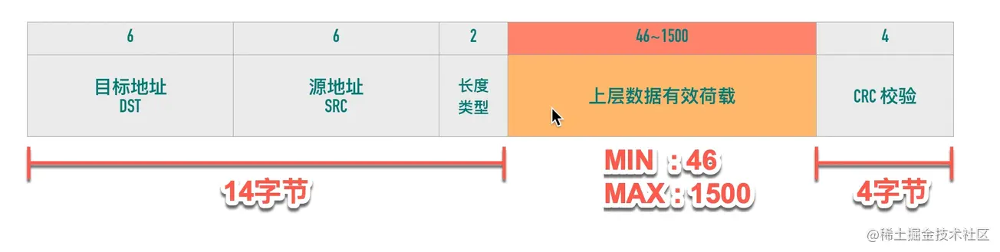

不同的数据链路层的 MTU 是不同的。通过`netstat -i` 可以查看网卡的 mtu。

### 4.2 IP分段

IPv4 数据报的最大大小为 65535 字节，这已经远远超过了以太网的 MTU，而且有些网络还会开启巨帧（Jumbo Frame）能达到 9000 字节。 当一个 IP 数据包大于 MTU 时，IP 会把数据报文进行切割为多个小的片段(小于 MTU），使得这些小报文可以通过链路层进行传输。

IP 头部中有一个表示分片偏移量的字段，用来表示该分段在原始数据报文中的位置，如下图所示

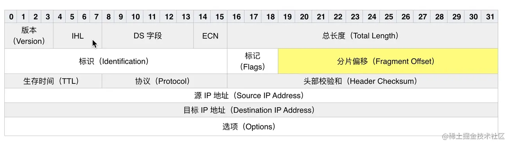

IP 协议不会对丢包进行重传，那么 IP 分段中有分片丢失、损坏的话，目标主机将没有办法将分段的数据包重组为一个完整的数据包，依赖于传输层是否进行重传。

利用 IP 包分片的策略，有一种对应的网络攻击方式`IP fragment attack`，就是一直传`More fragments = 1`的包，导致接收方一直缓存分片，从而可能导致接收方内存耗尽。

**网络中的木桶效应：路径 MTU**

一个包从发送端传输到接收端，中间要跨越很多个网络，每条链路的 MTU 都可能不一样，这个**通信过程中最小的 MTU 称为「路径 MTU（Path MTU）」。**

路径 MTU 就跟木桶效应是一个道理，木桶的盛水量由最短的那条短板决定，路径 MTU 也是由通信链条中最小的 MTU 决定。

### 4.3 TCP 最大段大小（Max Segment Size，MSS）

TCP 为了避免被发送方分片，会主动把数据分割成小段再交给网络层，最大的分段大小称之为 MSS（Max Segment Size）。

***MSS = MTU - IP header头大小 - TCP 头大小***

这样一个 MSS 的数据恰好能装进一个 MTU 而不用分片。

在以太网中 TCP 的 MSS = 1500（MTU） - 20（IP 头大小） - 20（TCP 头大小）= 1460

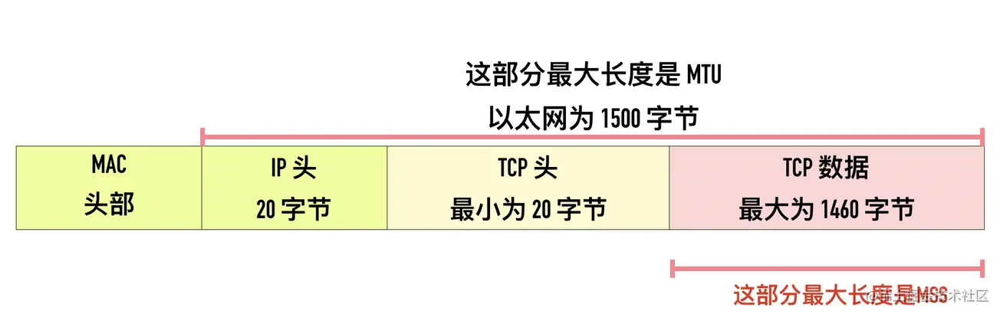

## 5. 端口号

分层结构中每一层都有一个唯一标识，比如链路层的 MAC 地址，IP 层的 IP 地址，传输层是用端口号。

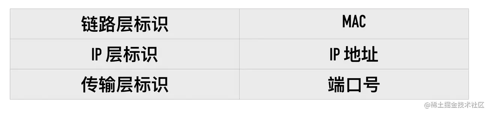

TCP 用两字节的整数来表示端口，一台主机最大允许 65536 个端口号的。TCP 首部中端口号如下图黄色高亮部分。

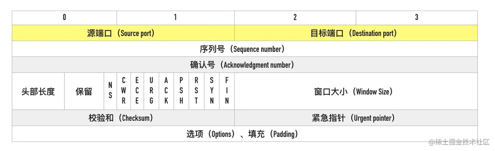

有了 IP 协议，数据包可以顺利的被传输到对应 IP 地址的主机，当主机收到一个数据包时，根据端口号把这个数据包交给哪个应用程序进行处理。

传输层就是用端口号来区分同一个主机上不同的应用程序的。操作系统为有需要的进程分配端口号，当目标主机收到数据包以后，会根据数据报文首部的目标端口号将数据发送到对应端口的进程。

主动发起的客户端进程也需要开启端口，会把自己的端口放在首部的源端口（source port）字段中，以便对方知道要把数据回复给谁。

### 5.1 端口号分类

端口号被划分成以下 3 种类型：

- 熟知端口号（well-known port）
- 已登记的端口（registered port）
- 临时端口号（ephemeral port）

**熟知端口号（well-known port）**

熟知端口号由专门的机构由 IANA 分配和控制，范围为 0~1023。为了能让客户端能随时找到自己，服务端程序的端口必须要是固定的。很多熟知端口号已经被用就分配给了特定的应用，比如 HTTP 使用 80端口，HTTPS 使用 443 端口，ssh 使用 22 端口。

**已登记的端口（registered port）**

已登记的端口不受 IANA 控制，不过由 IANA 登记并提供它们的使用情况清单。它的范围为 1024～49151。

为什么是 49151 这样一个魔数？ 其实是取的端口号最大值 65536 的 3/4 减 1 （49151 = 65536 * 0.75 - 1）。可以看到已登记的端口占用了大约 75% 端口号的范围。

已登记的端口常见的端口号有：

- MySQL：3306
- Redis：6379
- MongoDB：27017

**临时端口号（ephemeral port）**

如果应用程序没有调用 bind() 函数将 socket 绑定到特定的端口上，那么 TCP 和 UDP 会为该 socket 分配一个唯一的临时端口。IANA 将 49152～65535 范围的端口称为临时端口（ephemeral port）或动态端口（dynamic port），也称为私有端口（private port），这些端口可供本地应用程序临时分配端口使用。

不同的操作系统实现会选择不同的范围分配临时端口，在 Linux 上能分配的端口范围由 /proc/sys/net/ipv4/ip_local_port_range 变量决定，一般 Linux 内核端口范围为 32768~60999

## 6.  TCP 11 种状态变迁

TCP 之所以复杂，是因为它是一个有状态的协议。

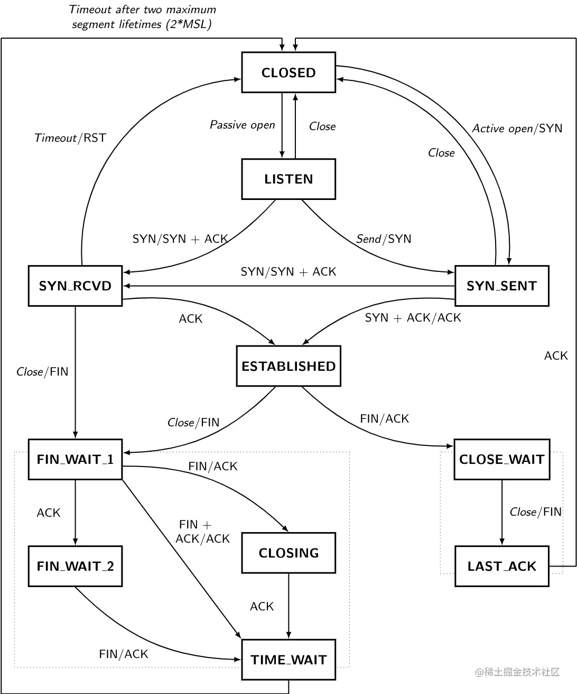

**1. CLOSED**

这个状态是一个「假想」的状态，是 TCP 连接还未开始建立连接或者连接已经彻底释放的状态。因此`CLOSED`状态也无法通过 `netstat` 或者 `ss` 等工具看到。

从图中可以看到，从 CLOSE 状态转换为其它状态有两种可能：主动打开（Active Open）和被动打开（Passive Open）

- 被动打开：一般来说，服务端会监听一个特定的端口，等待客户端的新连接，同时会进入`LISTEN`状态，这种被称为「被动打开」
- 主动打开：客户端主动发送一个`SYN`包准备三次握手，被称为「主动打开（Active Open）」

**2. LISTEN**

一端（通常是服务端）调用 bind、listen 系统调用监听特定端口时进入到`LISTEN`状态，等待客户端发送 `SYN` 报文三次握手建立连接。

**3. SYN-SENT**

客户端发送 `SYN` 报文等待 `ACK` 的过程进入 `SYN-SENT`状态。同时会开启一个定时器，如果超时还没有收到`ACK`会重发 SYN。

**4. SYN-RCVD**

服务端收到`SYN`报文以后会回复 `SYN+ACK`，然后等待对端 ACK 的时候进入`SYN-RCVD`。

**5. ESTABLISHED**

`SYN-SENT`或者`SYN-RCVD`状态的连接收到对端确认`ACK`以后进入`ESTABLISHED`状态，连接建立成功。

`ESTABLISHED`状态的连接有两种可能的状态转换方式:

- 调用 close 等系统调用主动关闭连接，这个时候会发送 FIN 包给对端，同时自己进入`FIN-WAIT-1`状态
- 收到对端的 FIN 包，执行被动关闭，收到 `FIN` 包以后会回复 `ACK`，同时自己进入`CLOSE-WAIT`状态

**6. FIN-WAIT-1**

主动关闭的一方发送了 FIN 包，等待对端回复 ACK 时进入`FIN-WAIT-1`状态。

`FIN_WAIT1`状态的切换如下几种情况

- 当收到 `ACK` 以后，`FIN-WAIT-1`状态会转换到`FIN-WAIT-2`状态
- 当收到 `FIN` 以后，会回复对端 `ACK`，`FIN-WAIT-1`状态会转换到`CLOSING`状态
- 当收到 `FIN+ACK` 以后，会回复对端 `ACK`，`FIN-WAIT-1`状态会转换到`TIME_WAIT`状态，跳过了`FIN-WAIT-2`状态

**7. FIN-WAIT-2**

处于 `FIN-WAIT-1`状态的连接收到 ACK 确认包以后进入`FIN-WAIT-2`状态，这个时候主动关闭方的 FIN 包已经被对方确认，等待被动关闭方发送 FIN 包。

**8. CLOSE-WAIT**

当有一方想关闭连接的时候，调用 close 等系统调用关闭 TCP 连接会发送 FIN 包给对端，这个被动关闭方，收到 FIN 包以后进入`CLOSE-WAIT`状态。

**9. TIME-WAIT**

`TIME-WAIT`可能是所有状态中面试问的最频繁的一种状态了。这个状态是收到了被动关闭方的 FIN 包，发送确认 ACK 给对端，开启 2MSL 定时器，定时器到期时进入 `CLOSED` 状态，连接释放。

**10. LAST-ACK**

`LAST-ACK` 顾名思义等待最后的 ACK。是被动关闭的一方，发送 FIN 包给对端等待 ACK 确认时的状态。

**11. CLOSING**

`CLOSING`状态在「同时关闭」的情况下出现。这里的同时关闭中的「同时」其实并不是时间意义上的同时，而是指的是在发送 FIN 包还未收到确认之前，收到了对端的 FIN 的情况。

## 7. 建立/断开连接

### 7.1 建立连接

#### 7.1.1 三次握手

三次握手的过程如下图所示：

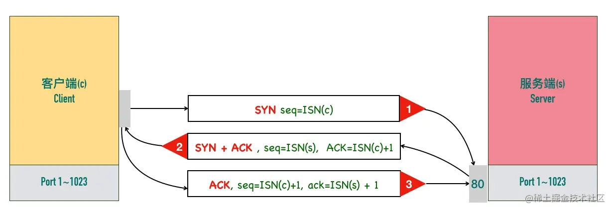

三次握手的最重要的是交换彼此的 ISN（初始序列号）。

1. 客户端发送的一个段是 SYN 报文，这个报文只有 SYN 标记被置位。


SYN 报文不携带数据，但是它占用一个序号，下次发送数据序列号要加一。客户端会随机选择一个数字作为初始序列号（ISN）

**为什么 SYN 段不携带数据却要消耗一个序列号呢？**

不占用序列号的段是不需要确认的，比如 ACK 段。SYN 段需要对方的确认，需要占用一个序列号。凡是消耗序列号的 TCP 报文段，一定需要对端确认。如果这个段没有收到确认，会一直重传直到达到指定的次数为止。

2. 服务端收到客户端的 SYN 段以后，将 SYN 和 ACK 标记都置位。

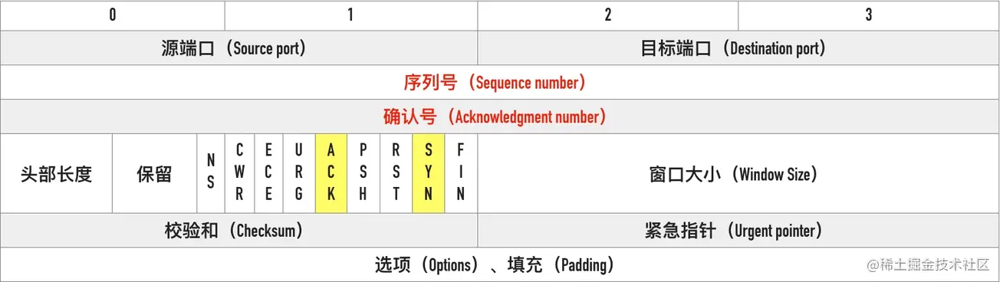

SYN 标记的作用与步骤 1 中的一样，也是同步服务端生成的初始序列号。ACK 用来告知发送端之前发送的 SYN 段已经收到了。

「确认号」字段指定了发送端下次发送段的序号，这里等于客户端 ISN 加一。 与前面类似 SYN + ACK 端虽然没有携带数据，但是因为 SYN 段需要被确认，所以它也要消耗一个序列号。

3. 客户端发送三次握手最后一个 ACK 段

这个 ACK 段用来确认收到了服务端发送的 SYN 段。因为这个 ACK 段不携带任何数据，且不需要再被确认，这个 ACK 段不消耗序列号。

除了交换彼此的初始序列号，三次握手的另一个重要作用是交换一些辅助信息，比如最大段大小（MSS）、窗口大小（Win）、窗口缩放因子（WS)、是否支持选择确认（SACK_PERM）等。

#### 7.1.2 初始序列号（Initial Sequence Number, ISN）

初始的序列号并非从 0 开始，通信双方各自生成，一般情况下两端生成的序列号不会相同。生成的算法是 ISN 随时间而变化，会递增的分配给后续的 TCP 连接的 ISN。

**ISN 能设置成一个固定值呢？**

答案是不能，TCP 连接四元组（**源 IP、源端口号、目标 IP、目标端口号**）唯一确定，所以就算所有的连接 ISN 都是一个固定的值，连接之间也是不会互相干扰的。但是会有几个严重的问题

1. 出于安全性考虑

   如果被知道了连接的ISN，很容易构造一个在对方窗口内的序列号，源 IP 和源端口号都很容易伪造，这样一来就可以伪造 RST 包，将连接强制关闭掉了。如果采用动态增长的 ISN，要想构造一个在对方窗口内的序列号难度就大很多了

2. 开启 SO_REUSEADDR 后端口允许重用

   收到一个包以后不知道新连接的还是旧连接的包因为网络的原因姗姗来迟，造成数据的混淆。如果采用动态增长的 ISN，那么可以保证两个连接的 ISN 不会相同，不会串包

#### 7.1.3 三次握手的状态变化

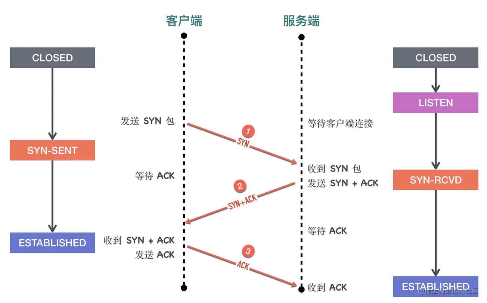

对于客户端而言：

- 初始的状态是处于 `CLOSED` 状态。CLOSED 并不是一个真实的状态，而是一个假想的起点和终点
- 客户端调用 connect 以后会发送 SYN 同步报文给服务端，然后进入 `SYN-SENT` 阶段，客户端将保持这个阶段直到它收到了服务端的确认包
- 如果在 `SYN-SENT` 状态收到了服务端的确认包，它将发送确认服务端 SYN 报文的 ACK 包，同时进入 ESTABLISHED 状态，表明自己已经准备好发送数据

对于服务端而言：

- 初始状态同样是 `CLOSED` 状态
- 在执行 bind、listen 调用以后进入 `LISTEN `状态，等待客户端连接
- 当收到客户端的 SYN 同步报文以后，会回复确认同时发送自己的 SYN 同步报文，这时服务端进入 `SYN-RCVD` 阶段等待客户端的确认
- 当收到客户端的确认报文以后，进入`ESTABLISHED` 状态。这时双方可以互相发数据了

### 7.2 断开连接

#### 7.2.1 四次挥手

最常见的四次挥手的过程下图所示

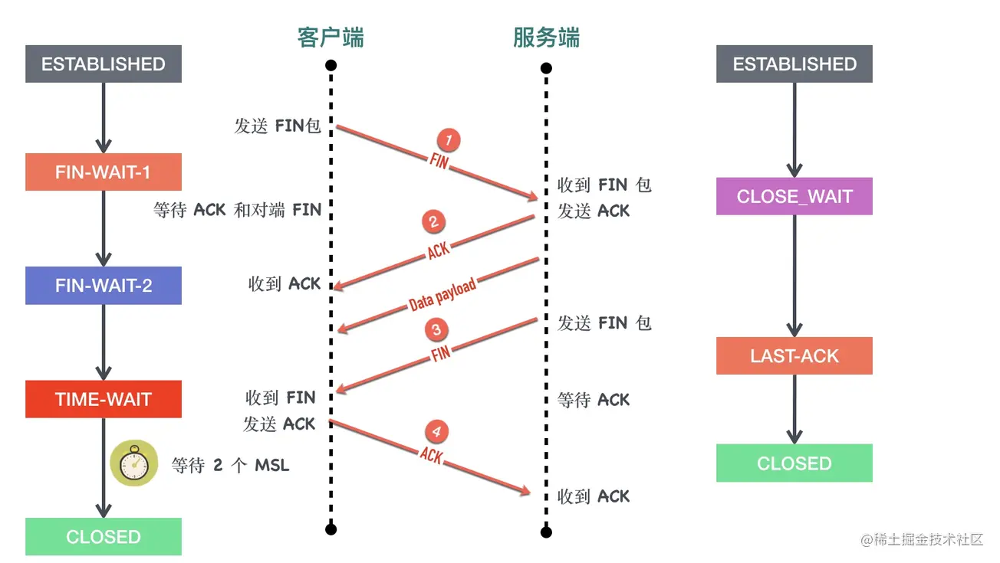

1. 客户端调用 `close` 方法，执行「主动关闭」，会发送一个 FIN 报文给服务端，从这以后客户端不能再发送数据给服务端了，客户端进入`FIN-WAIT-1`状态。FIN 报文其实就是将 FIN 标志位设置为 1。

   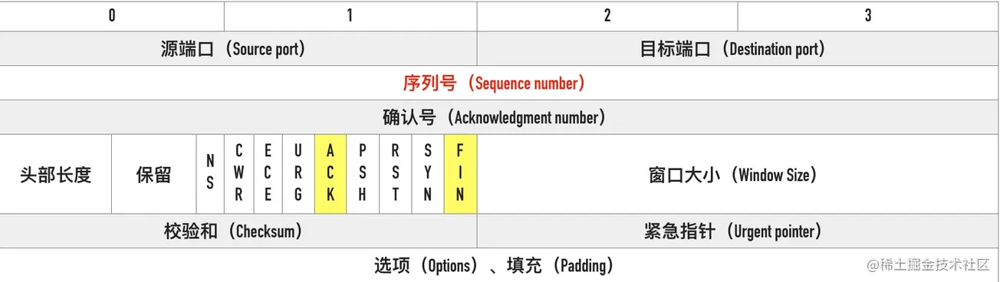

   FIN 段是可以携带数据的，比如客户端可以在它最后要发送的数据块可以“捎带” FIN 段。当然也可以不携带数据。不管 FIN 段是否携带数据，都需要消耗一个序列号。

   客户端发送 FIN 包以后不能再发送数据给服务端，但是还可以接受服务端发送的数据。这个状态就是「半关闭（half-close）」

   主动发起关闭的一方称为「主动关闭方」，另外一方称为「被动关闭方」

2. 服务端收到 FIN 包以后回复确认 ACK 报文给客户端，服务端进入 `CLOSE_WAIT`，客户端收到 ACK 以后进入`FIN-WAIT-2`状态。

3. 服务端也没有数据要发送了，发送 FIN 报文给客户端，然后进入`LAST-ACK` 状态，等待客户端的 ACK。同前面一样如果 FIN 段没有携带数据，也需要消耗一个序列号。

4. 客户端收到服务端的 FIN 报文以后，回复 ACK 报文用来确认第三步里的 FIN 报文，进入`TIME_WAIT`状态，等待 2 个 MSL 以后进入 `CLOSED`状态。服务端收到 ACK 以后进入`CLOSED`状态。

#### 7.2.2 为什么需要四次挥手

三次可以当然可以，因为有**延迟确认**的存在，把第二步的 ACK 经常会跟随第三步的 FIN 包一起捎带会对端。

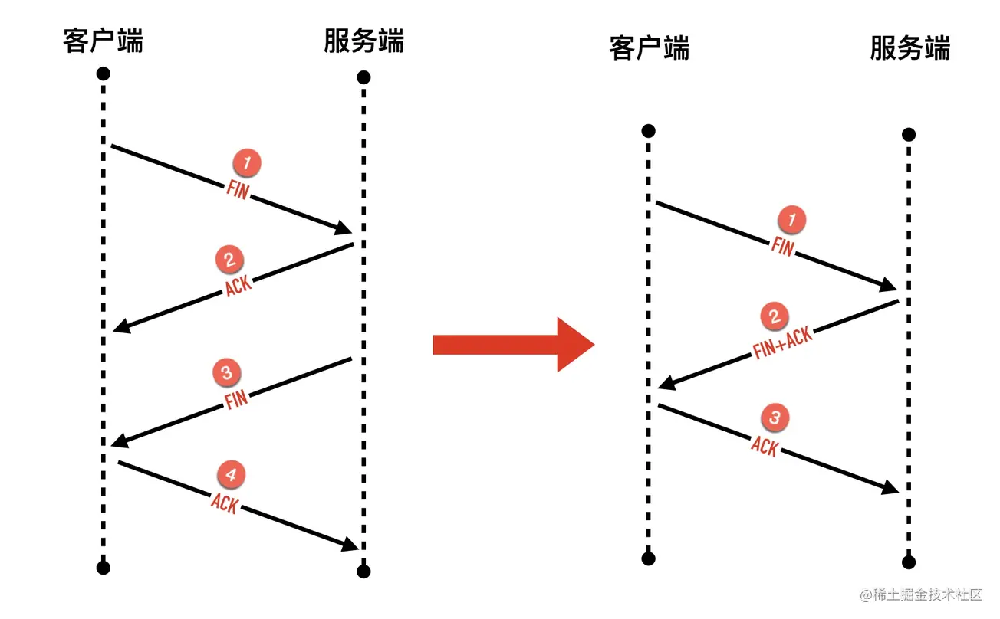

其实这个行为跟应用层有比较大的关系，因为发送 FIN 包以后，会进入半关闭（half-close）状态，表示自己不会再给对方发送数据了。因此如果服务端收到客户端发送的 FIN 包以后，只表示客户端不会再给自己发送数据了，但是服务端这个时候可以给客户端发送数据。

在这种情况下，如果不及时发送 ACK 包，死等服务端这边发送数据，可能会造成客户端不必要的重发 FIN 包，如下图所示。

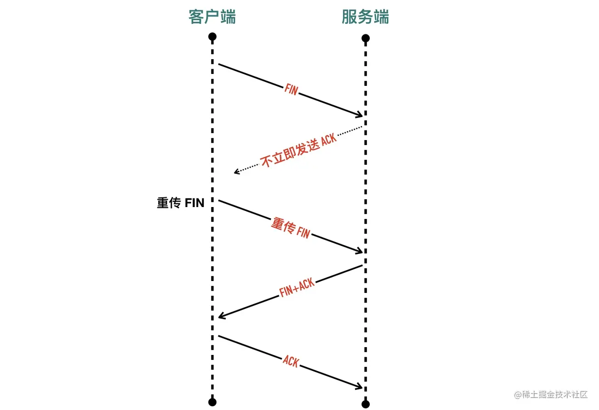

如果服务端确定没有什么数据需要发给客户端，那么当然是可以把 FIN 和 ACK 合并成一个包，四次挥手的过程就成了三次。

#### 7.2.3 握手可以变为四次吗？

理论上完全是可以，把三次握手的第二次的 SYN+ACK 拆成先回 ACK 包，再发 SYN 包就变成了「四次握手」

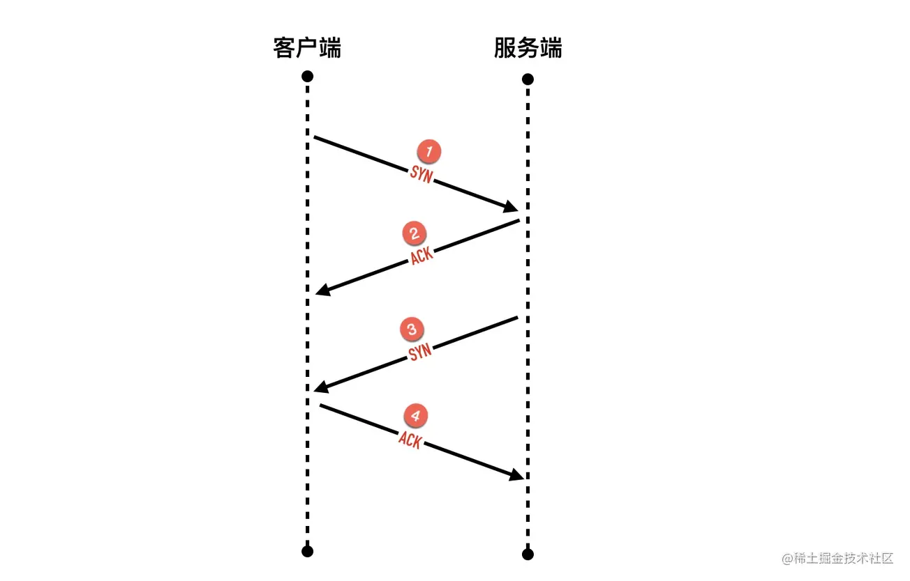

与 FIN 包不同的是，一般情况下，SYN 包都不携带数据，收到客户端的 SYN 包以后不用等待，可以立马回复 SYN+ACK。

### 7.3 全连接队列、半连接队列、 backlog

#### 7.3.1. 半连接队列、全连接队列基本概念

backlog 参数跟 listen 函数有关，listen 函数的定义如下：

```c
int listen(int sockfd, int backlog);
```

当服务端调用 listen 函数时，TCP 的状态被从 CLOSE 状态变为 LISTEN，于此同时内核创建了两个队列：

- 半连接队列（Incomplete connection queue），又称 SYN 队列
- 全连接队列（Completed connection queue），又称 Accept 队列

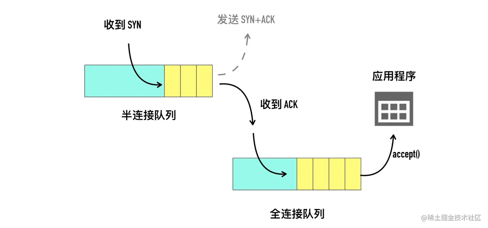

#### 7.3.2 半连接队列（SYN Queue）

当客户端发起 SYN 到服务端，服务端收到以后会回 ACK 和自己的 SYN。这时服务端这边的 TCP 从 listen 状态变为 SYN_RCVD (SYN Received)，此时会将这个连接信息放入「半连接队列」，半连接队列也被称为 SYN Queue，存储的是 "inbound SYN packets"。

#### 7.3.3 全连接队列（Accept Queue）

「全连接队列」包含了服务端所有完成了三次握手，但是还未被应用调用 accept 取走的连接队列。此时的 socket 处于 ESTABLISHED 状态。每次应用调用 accept() 函数会移除队列头的连接。如果队列为空，accept() 通常会阻塞。全连接队列也被称为 Accept 队列。

你可以把这个过程想象生产者、消费者模型。内核是一个负责三次握手的生产者，握手完的连接会放入一个队列。我们的应用程序是一个消费者，取走队列中的连接进行下一步的处理。这种生产者消费者的模式，在生产过快、消费过慢的情况下就会出现队列积压。

**全连接队列的大小**

全连接队列的大小是 listen 传入的 backlog 和 somaxconn 中的较小值。

### 7.4 TIME_WAIT

**只有主动断开的那一方才会进入 TIME_WAIT 状态**，且会持续 2 个 MSL（Max Segment Lifetime）。

#### 7.4.1 MSL（报文最大生存时间）

MSL：Max Segment Lifetime（报文最大生存时间）是 TCP 报文在网络中的最大生存时间。这个值与 IP 报文头的 TTL 字段有密切关系。

IP 报文头中有一个 8 位的存活时间字段（Time to live, TTL）如下图。 这个存活时间存储的不是具体的时间，而是一个 IP 报文最大可经过的路由数，每经过一个路由器，TTL 减 1，当 TTL 减到 0 时这个 IP 报文会被丢弃。

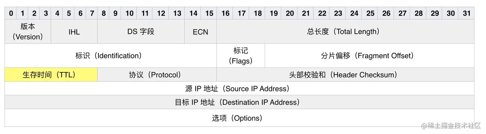

TTL 经过路由器不断减小的过程如下图所示，假设初始的 TTL 为 12，经过下一个路由器 R1 以后 TTL 变为 11，后面每经过一个路由器以后 TTL 减 1。

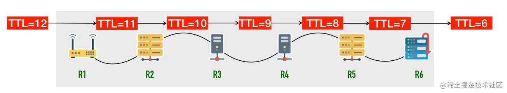

从上面可以看到 TTL 说的是「跳数」限制而不是「时间」限制，尽管如此我们依然假设**最大跳数的报文在网络中存活的时间不可能超过 MSL 秒**。

#### 7.4.2 TIME_WAIT存在的原因

1. 数据报文可能在发送途中延迟但最终会到达，因此要等已被发送但还未被接受重复报文段在网络中过期失效，这样可以避免用**相同**源端口和目标端口创建新连接时收到旧连接姗姗来迟的数据包，造成数据错乱

2. 确保可靠实现 TCP 全双工终止连接。关闭连接的四次挥手中，最终的 ACK 由主动关闭方发出，如果这个 ACK 丢失，对端（被动关闭方）将重发 FIN，如果主动关闭方不维持 TIME_WAIT 直接进入 CLOSED 状态，则无法重传 ACK，被动关闭方因此不能及时可靠释放

- 1 个 MSL 确保四次挥手中主动关闭方最后的 ACK 报文最终能达到对端

- 1 个 MSL 确保对端没有收到 ACK 重传的 FIN 报文可以到达

   2MS = 去向 ACK 消息最大存活时间（MSL) + 来向 FIN 消息的最大存活时间（MSL）

#### 7.4.3 TIME_WAIT 的问题

在一个非常繁忙的服务器上，如果有大量 TIME_WAIT 状态的连接会出现以下问题

1. 连接表无法复用

   因为处于 TIME_WAIT 的连接会存活 2MSL（60s），意味着相同的TCP 连接四元组（源端口、源 ip、目标端口、目标 ip）在一分钟之内都没有办法复用。

2. socket 结构体内存占用

## 8. TCP如何保证可靠

TCP 要想在 IP 基础上构建可靠的传输层协议，必须有一个复杂的机制来保障可靠性。 主要有下面几个方面：

- 对每个包提供校验和
- 包的序列号解决了接收数据的乱序、重复问题
- 超时重传
- 流量控制、拥塞控制

### 8.1 超时重传、快速重传、SACK

#### 8.1.1 超时重传

超时重传示意图如下：

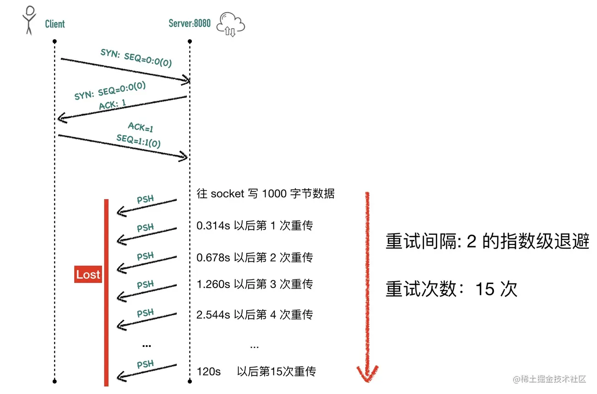

**ACK 是表示这之前的包都已经全部收到**

如果发送 5000 个字节的数据包，因为 MSS 的限制每次传输 1000 个字节，分 5 段传输，如下图：


数据包 1 发送的数据正常到达接收端，接收端回复 ACK 1001，表示 seq 为1001之前的数据包都已经收到，下次从1001开始发。 数据包 2（10001：2001）因为某些原因未能到达服务端，其他包正常到达，这时接收端也不能 ack 3 4 5 数据包，因为数据包 2 还没收到，接收端只能回复 ack 1001。

第 2 个数据包重传成功以后服务器才会回复5001，表示seq 为 5001 之前的数据包都已经收到了。

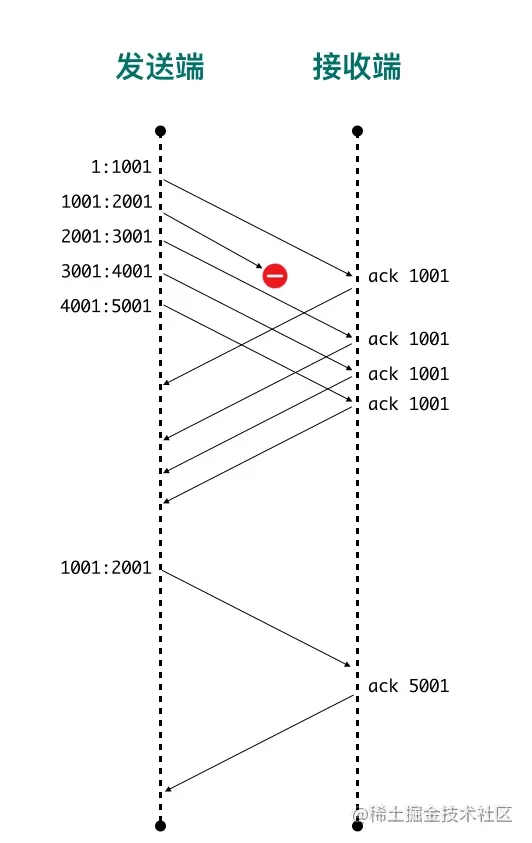

#### 8.1.2 快速重传机制、SACK

**快速重传**

当发送端收到 3 个或以上重复 ACK，就意识到之前发的包可能丢了，于是马上进行重传，不用等到超时再重传。

**SACK**

这个有一个问题，发送 3、4、5 包收到的全部是 ACK=1001，快速重传解决了一个问题：需要重传。因为除了 2 号包，3、4、5 包也有可能丢失，那到底是只重传数据包 2 还是重传 2、3、4、5 所有包呢？

SACK 会在回复 ACK 的时候将目前已经收到包的区间和目前收到的最大连续的包序号一起回复，这样发送方就知道该重传那个数据包了。

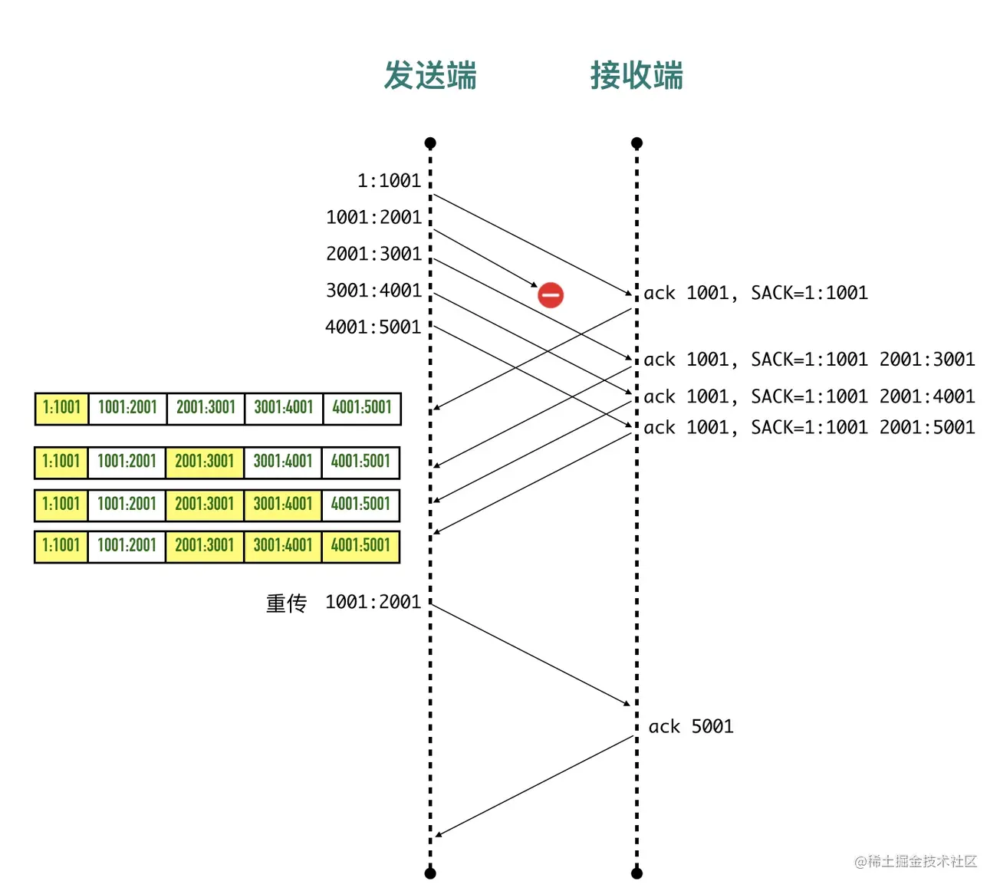

#### 8.1.3 重传间隔

- **超时重传的时间（Retransmission TimeOut，RTO）**

- **往返时延（Round-Trip Time RTT）**

计算 RTO 的经典方法和标准方法的计算方式：

- 经典方法：适用 RTT 波动较小的情况
- 标准方法：对 RTT 波动较大的情况下有更好的适应效果

**「重传二义性」**

当客户收到重传过的某个请求的一个应答时，它不能区分该应答对应哪一次请求。

- 如果用第一次发送数据的时间和收到 ACK 的时间来算 RTT，RTT 时间明显是大于实际值
- 如果用第二次发送数据的时间和收到 ACK 的时间差值来算 RTT，RTT 时间明显小于实际值

由此引入了 Karn 算法解决重传二义性：

- 重传情况下不用测量的 RTT 来更新 SRTT 和 RTTVAR
- 出现重传时 RTO 采用指数级退避的方式，直到后续包出现不需要重传就可以收到确认为止

### 8.2 滑动窗口

如果从 socket 的角度来看TCP 的滑动窗口，是下面这样的：

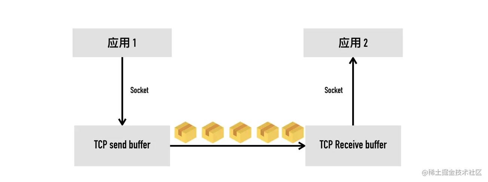

TCP 会把要发送的数据放入发送缓冲区（Send Buffer)，接收到的数据放入接收缓冲区（Receive Buffer），应用程序会不停的读取接收缓冲区的内容进行处理。

流量控制做的事情就是，如果接收缓冲区已满，发送端应该停止发送数据。

为了控制发送端的速率，接收端会告知客户端自己接收窗口（rwnd），也就是接收缓冲区中空闲的部分。

TCP 在收到数据包回复的 ACK 包里会带上自己接收窗口的大小，接收端需要根据这个值调整自己的发送策略。

#### 8.2.1 TCP包状态分类

从 TCP 角度而言，数据包的状态可以分为如下图的四种：

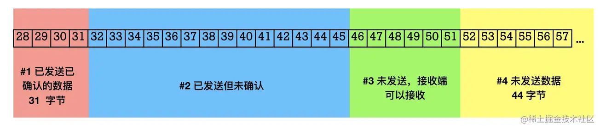

- 粉色部分#1 (Bytes Sent and Acknowledged)：表示已发送且已收到 ACK 确认的数据包。
- 蓝色部分#2 (Bytes Sent but Not Yet Acknowledged)：表示已发送但未收到 ACK 的数据包。发送方不确定这部分数据对端有没有收到，如果在一段时间内没有收到 ACK，发送端需要重传这部分数据包。
- 绿色部分#3 (Bytes Not Yet Sent for Which Recipient Is Ready)：表示未发送但接收端已经准备就绪可以接收的数据包（有空间可以接收）
- 黄色部分#4 (Bytes Not Yet Sent，Not Ready to Receive)：表示还未发送，且这部分接收端没有空间接收

#### 8.2.2 发送窗口（send window）与可用窗口（usable window）

**发送窗口**

TCP 滑动窗口的核心概念，它表示了在某个时刻一端能拥有的最大未确认的数据包大小（最大在途数据），发送窗口是发送端被允许发送的最大数据包大小，其大小等于上图中 #2 区域和 #3 区域加起来的总大小

**可用窗口**

发送端还能发送的最大数据包大小，它等于发送窗口的大小减去在途数据包大小，是发送端还能发送的最大数据包大小，对应于上图中的 #3 号区域。

窗口的左边界表示**成功发送并已经被接收方确认的最大字节序号**，窗口的右边界是**发送方当前可以发送的最大字节序号**，滑动窗口的大小等于右边界减去左边界。

如下图所示

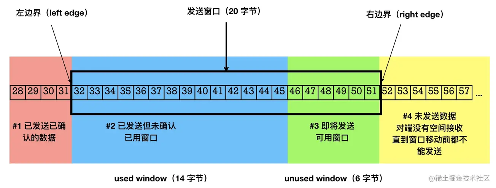

#### 8.2.3 TCP window full

如果三次握手中接收端告诉它的接收窗口为 4000，这个时候发送端发送 5000 个字节的数据：

因为 MSS 为 1000，每次发包的大小为 1000，总共发了 4 次以后在途数据包字节数为 4000，再发数据就会超过接收窗口的大小了，于是发送端暂停改了发送，等待在途数据包的确认。

#### 8.2.4 TCP Zero Window

TCP 包中 `win=` 表示接收窗口的大小，表示接收端还有多少缓冲区可以接收数据，当窗口变成 0 时，表示接收端不能暂时不能再接收数据了。 

发送端的滑动窗口变为 0 了，经过一段时间接收端从高负载中缓过来，可以处理更多的数据包，如果发送端不知道这个情况，它就会永远等待了。于是乎，TCP 又设计了零窗口探测的机制（Zero window probe），用来向接收端探测窗口大小。**零窗口探测包**其实就是一个 ACK 包。

**这两者都是发送速率控制的手段**

- TCP Window Full 是站在**发送端**角度说的，表示在途字节数等于对方接收窗口的情况，此时发送端不能再发数据给对方直到发送的数据包得到 ACK。
- TCP zero window 是站在**接收端**角度来说的，是接收端接收窗口满，告知对方不能再发送数据给自己。

### 8.3 拥塞控制

 TCP 利用滑动窗口来做流量控制，流量控制这种机制确实可以防止发送端向接收端过多的发送数据，但是它只关注了发送端和接收端自身的状况，而没有考虑整个网络的通信状况。于是出现了拥塞处理。

拥塞处理主要涉及到下面这几个算法

- 慢启动（Slow Start）
- 拥塞避免（Congestion Avoidance）
- 快速重传（Fast Retransmit）和快速恢复（Fast Recovery）

为了实现上面的算法，TCP 的每条连接都有两个核心状态值：

- 拥塞窗口（Congestion Window，cwnd）
- 慢启动阈值（Slow Start Threshold，ssthresh）

#### 8.3.1拥塞窗口（Congestion Window，cwnd）

拥塞窗口指的是在收到对端 ACK 之前自己还能传输的最大 MSS 段数。

**拥塞窗口与接收窗口（rwnd）的区别：**

- 接收窗口（rwnd）是**接收端**的限制，是接收端还能接收的数据量大小
- 拥塞窗口（cwnd）是**发送端**的限制，是发送端在还未收到对端 ACK 之前还能发送的数据量大小

 TCP 头部的 window 字段其实讲的接收窗口（rwnd）大小。

拥塞窗口初始值等于操作系统的一个变量 initcwnd，最新的 linux 系统 initcwnd 默认值等于 10。

**拥塞窗口与发送窗口（Send Window）的关系：**

真正的发送窗口大小 = 「接收端接收窗口大小」 与 「发送端自己拥塞窗口大小」 两者的最小值

如果接收窗口比拥塞窗口小，表示接收端处理能力不够。如果拥塞窗口小于接收窗口，表示接收端处理能力 ok，但网络拥塞。

**发送端能发送多少数据，取决于两个因素：**

- 对方能接收多少数据（接收窗口）
- 自己为了避免网络拥塞主动控制不要发送过多的数据（拥塞窗口）

发送端和接收端不会交换 cwnd 这个值，这个值是维护在发送端本地内存中的一个值，发送端和接收端最大的在途字节数（未经确认的）数据包大小只能是 rwnd 和 cwnd 的最小值。

拥塞控制的算法的本质是控制拥塞窗口（cwnd）的变化。

##### 1. 慢启动

 为了避免在缓慢的移动网络中因为发送的数据过多，造成更大的网络延迟，每个 TCP 连接都有一个拥塞窗口的限制，最初这个值很小，随着时间的推移，每次发送的数据量如果在不丢包的情况下，“慢慢”的递增，这种机制被称为「慢启动」

这个算法的过程如下：

- **第一步**

  三次握手以后，双方通过 ACK 告诉了对方自己的接收窗口（rwnd）的大小，之后就可以互相发数据了

- **第二步**

  通信双方各自初始化自己的「拥塞窗口」（Congestion Window，cwnd）大小

- **第三步**

  cwnd 初始值较小时，每收到一个 ACK，cwnd + 1，每经过一个 RTT，cwnd 变为之前的两倍

 在初始拥塞窗口为 10 的情况下，拥塞窗口随时间的变化关系如下图 ：

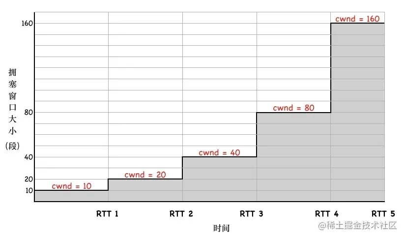

**慢启动阈值 ssthresh **

慢启动拥塞窗口（cwnd）肯定不能无止境的指数级增长下去，否则拥塞控制就变成了「拥塞失控」了，它的阈值称为「慢启动阈值」（Slow Start Threshold，ssthresh），ssthresh 就是一道刹车，让拥塞窗口别涨那么快。

- 当 cwnd < ssthresh 时，拥塞窗口按指数级增长（慢启动）
- 当 cwnd > ssthresh 时，拥塞窗口按线性增长（拥塞避免）

##### 2. 拥塞避免（Congestion Avoidance）

 当 cwnd > ssthresh 时，拥塞窗口进入「拥塞避免」阶段，在这个阶段，每一个往返 RTT，拥塞窗口大约增加 1 个 MSS 大小，直到检测到拥塞为止。 

与慢启动的区别在于

- 慢启动的做法是 RTT 时间内每收到一个 ACK，拥塞窗口 cwnd 就加 1，也就是每经过 1 个 RTT，cwnd 翻倍
- 拥塞避免的做法保守的多，每经过一个RTT 才将拥塞窗口加 1，不管期间收到多少个 ACK、

 前面介绍的慢启动和拥塞避免是 1988 年提出的拥塞控制方案，在 1990 年又出现了两种新的拥塞控制方案：「快速重传」和「快速恢复」 

##### 3. 快速重传（Fast Retransmit)

 当接收端收到一个不按序到达的数据段时，TCP 立刻发送 1 个重复 ACK，而不用等有数据捎带确认，当发送端收到 3 个或以上重复 ACK，就意识到之前发的包可能丢了，于是马上进行重传，不用等到重传定时器超时再重传。 

##### 4. 快速恢复

当收到三次重复 ACK 时，进入快速恢复阶段。解释为网络轻度拥塞。

- 拥塞阈值 ssthresh 降低为 cwnd 的一半：ssthresh = cwnd / 2
- 拥塞窗口 cwnd 设置为 ssthresh
- 拥塞窗口线性增加