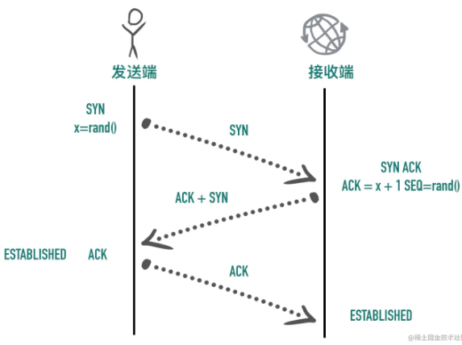

## 1. 分层模型

### 1.1 应用层（Application Layer）

 应用层的本质是规定了应用程序之间如何相互传递报文， 以 HTTP 协议为例，它规定了 ：

- 报文的类型，是请求报文还是响应报文
- 报文的语法，报文分为几段，各段是什么含义、用什么分隔，每个部分的每个字段什么什么含义
- 进程应该以什么样的时序发送报文和处理响应报文

 HTTP 客户端和 HTTP 服务端的首要工作就是根据 HTTP 协议的标准组装和解析 HTTP 数据包，每个 HTTP 报文格式由三部分组成： 

- 起始行（start line），起始行根据是请求报文还是响应报文分为「请求行」和「响应行」。这个例子中起始行是`GET / HTTP/1.1`，表示这是一个 `GET` 请求，请求的 URL 为`/`，协议版本为`HTTP 1.1`，起始行最后会有一个空行`CRLF（\r\n)`与下面的首部分隔开
- 首部（header），首部采用形如`key:value`的方式，比如常见的`User-Agent`、`ETag`、`Content-Length`都属于 HTTP 首部，每个首部直接也是用空行分隔
- 可选的实体（entity），实体是 HTTP 真正要传输的内容，比如下载一个图片文件，传输的一段 HTML等

除了我们熟知的 HTTP 协议，还有下面这些非常常用的应用层协议

- 域名解析协议 DNS
- 收发邮件 SMTP 和 POP3 协议
- 时钟同步协议 NTP
- 网络文件共享协议 NFS

### 1.2 传输层（Transport Layer）

传输层的作用是为两台主机之间的「应用进程」提供端到端的逻辑通信，相隔几千公里的两台主机的进程就好像在直接通信一样。 

 虽然是叫传输层，但是并不是将数据包从一台主机传送到另一台，而是对「传输行为进行控制」 ，  TCP 协议就被称为传输控制协议（Transmission Control Protocol），为下面两层协议提供数据包的重传、流量控制、拥塞控制等。 

 传输层用端口号来标识不同的应用程序，主机收到数据包以后根据目标端口号将数据包传递给对应的应用程序进行处理。如下图中，目标端口号为 80，百度的服务器就根据这个目标端口号将请求交给监听 80 端口的应用程序（可能是 Nginx 等负载均衡器）处理 

### 1.3 网络互连层（Internet Layer）

 网络互连层提供了主机到主机的通信，将传输层产生的的数据包封装成分组数据包发送到目标主机，并提供路由选择的能力：

IP 协议是网络层的主要协议，TCP 和 UDP 都是用 IP 协议作为网络层协议。**这一层的主要作用是给包加上源地址和目标地址，将数据包传送到目标地址。**

IP 协议是一个无连接的协议，也不具备重发机制，这也是 TCP 协议复杂的原因之一就是基于了这样一个「不靠谱」的协议。

### 1.4 数据链路层

 以太网、Wifi、蓝牙工作在这一层，提供了主机连接到物理网络需要的硬件和相关的协议。

该层不做重点讨论。

 整体的分层图如下图所示 ：

**分层的好处是什么呢？**

分层的本质是通过分离关注点而让复杂问题简单化，通过分层可以做到：

- 各层独立：限制了依赖关系的范围，各层之间使用标准化的接口，各层不需要知道上下层是如何工作的，增加或者修改一个应用层协议不会影响传输层协议
- 灵活性更好：比如路由器不需要应用层和传输层，分层以后路由器就可以只用加载更少的几个协议层
- 易于测试和维护：提高了可测试性，可以独立的测试特定层，某一层有了更好的实现可以整体替换掉
- 能促进标准化：每一层职责清楚，方便进行标准化

## 2. TCP概述

 TCP 是一个可靠的（reliable）、面向连接的（connection-oriented）、基于字节流（byte-stream）、全双工的（full-duplex）协议。 

### 2.1 TCP 是面向连接的协议

- 面向连接（connection-oriented）：面向连接的协议要求正式发送数据之前需要通过「握手」建立一个**逻辑**连接，结束通信时也是通过有序的四次挥手来断开连接
- 无连接（connectionless）：无连接的协议则不需要

**三次握手**

 建立连接的过程是通过「三次握手」来完成的，顾名思义，通过三次数据交换建立一个连接。 **通过三次握手协商好双方后续通信的起始序列号、窗口缩放大小等信息。** 

### 2.2. TCP 协议是可靠的

IP 是一种无连接、不可靠的协议：它尽最大可能将数据报从发送者传输给接收者，但并不保证包到达的顺序会与它们被传输的顺序一致，也不保证包是否重复，甚至都不保证包是否会达到接收者。

TCP 要想在 IP 基础上构建可靠的传输层协议，必须有一个复杂的机制来保障可靠性。 主要有下面几个方面：

- 对每个包提供校验和
- 包的序列号解决了接收数据的乱序、重复问题
- 超时重传
- 流量控制、拥塞控制

**校验和（checksum）** 

每个 TCP 包首部中都有两字节用来表示校验和，防止在传输过程中有损坏。如果收到一个校验和有差错的报文，TCP 不会发送任何确认直接丢弃它，等待发送端重传。

**包的序列号保证了接收数据的乱序和重复问题** 

假设我们往 TCP 套接字里写 3000 字节的数据导致 TCP发送了 3 个数据包，每个数据包大小为 1000 字节：第一个包序列号为[1~1001)，第二个包序列号为 [1001~2001)，第三个包序号为[2001~3001)

假如因为网络的原因导致第二个、第三个包先到接收端，第一个包最后才到，接收端也不会因为他们到达的顺序不一致把包弄错，TCP 会根据他们的序号进行重新的排列然后把结果传递给上层应用程序。

如果 TCP 接收到重复的数据，可能的原因是超时重传了两次但这个包并没有丢失，接收端会收到两次同样的数据，它能够根据包序号丢弃重复的数据。

**超时重传** 

TCP 发送数据后会启动一个定时器，等待对端确认收到这个数据包。如果在指定的时间内没有收到 ACK 确认，就会重传数据包，然后等待更长时间，如果还没有收到就再重传，在多次重传仍然失败以后，TCP 会放弃这个包。

**流量控制、拥塞控制** 

### 2.3 TCP 是面向字节流的协议

TCP 是一种字节流（byte-stream）协议，流的含义是没有固定的报文边界。

假设你调用 2 次 write 函数往 socket 里依次写 500 字节、800 字节。write 函数只是把字节拷贝到内核缓冲区，最终会以多少条报文发送出去是不确定的，如下图所示

当接收方从 TCP 套接字读数据时，它是没法得知对方每次写入的字节是多少的。接收端可能分2 次每次 650 字节读取，也有可能先分三次，一次 100 字节，一次 200 字节，一次 1000 字节进行读取。

### 2.4 TCP 是全双工的协议

在 TCP 中发送端和接收端可以是客户端/服务端，也可以是服务器/客户端，通信的双方在任意时刻既可以是接收数据也可以是发送数据，每个方向的数据流都独立管理序列号、滑动窗口大小、MSS 等信息。

### 2.5 总结

TCP 是一个可靠的（reliable）、面向连接的（connection-oriented）、基于字节流（byte-stream）、全双工（full-duplex）的协议。发送端在发送数据以后启动一个定时器，如果超时没有收到对端确认会进行重传，接收端利用序列号对收到的包进行排序、丢弃重复数据，TCP 还提供了流量控制、拥塞控制等机制保证了稳定性。

## 3. TCP报文首部

TCP报文头部是支撑 TCP 复杂功能的基石。 完整的 TCP 头部如下图所示

### 3.1 源端口号、目标端口号

TCP 的报文里是没有源 ip 和目标 ip 的，因为那是 IP 层协议的事情，TCP 层只有源端口和目标端口。

源 IP、源端口、目标 IP、目标端口构成了 TCP 连接的「四元组」。一个四元组可以唯一标识一个连接。

### 3.2 序列号（Sequence number）

TCP 是面向字节流的协议，通过 TCP 传输的字节流的每个字节都分配了序列号，序列号（Sequence number）指的是本报文段第一个字节的序列号。

序列号加上报文的长度，就可以确定传输的是哪一段数据。序列号是一个 32 位的无符号整数，达到 2^32-1 后循环到 0。

在 SYN 报文中，序列号用于交换彼此的初始序列号，在其它报文中，序列号用于保证包的顺序。

因为网络层（IP 层）不保证包的顺序，TCP 协议利用序列号来解决网络包乱序、重复的问题，以保证数据包以正确的顺序组装传递给上层应用。

如果发送方发送的是四个报文序列号分别是1、2、3、4，但到达接收方的顺序是 2、4、3、1，接收方就可以通过序列号的大小顺序组装出原始的数据。

### 3.3 初始序列号（Initial Sequence Number, ISN）

在建立连接之初，通信双方都会各自选择一个序列号，称之为初始序列号。在建立连接时，通信双方通过 SYN 报文交换彼此的 ISN，三次握手过程如下图所示:

### 3.4 确认号（Acknowledgment number, ACK）

TCP 使用确认号（Acknowledgment number, ACK）来告知对方下一个期望接收的序列号，小于此确认号的所有字节都已经收到。

关于确认号有几个注意点：

- 不是所有的包都需要确认的
- 不是收到了数据包就立马需要确认的，可以延迟一会再确认
- ACK 包本身不需要被确认，否则就会无穷无尽死循环了
- 确认号永远是表示小于此确认号的字节都已经收到

### 3.5 TCP Flags

TCP 有很多种标记，有些用来发起连接同步初始序列号，有些用来确认数据包，还有些用来结束连接。TCP 定义了一个 8 位的字段用来表示 flags，最常见的有下面这几个：

- SYN（Synchronize）：用于发起连接数据包同步双方的初始序列号
- ACK（Acknowledge）：确认数据包
- RST（Reset）：这个标记用来强制断开连接，通常是之前建立的连接已经不在了、包不合法、或者实在无能为力处理
- FIN（Finish）：通知对方我发完了所有数据，准备断开连接，后面我不会再发数据包给你了。
- PSH（Push）：告知对方这些数据包收到以后应该马上交给上层应用，不能缓存起来

### 3.6 窗口大小（Window Size）

可以看到用于表示窗口大小的"Window Size" 只有 16 位，也就是最大窗口大小是 65535 字节（64KB）。

因此TCP 协议引入了「TCP 窗口缩放」选项 作为窗口缩放的比例因子，比例因子值的范围是 0 ~ 14，其中最小值 0 表示不缩放，最大值 14。比例因子可以将窗口扩大到原来的 2 的 n 次方，比如窗口大小缩放前为 1050，缩放因子为 7，则真正的窗口大小为 1050 * 128 = 134400，如下图所示

### 3.7 可选项

可选项的格式入下所示

常用的选项有以下几个：

- MSS：最大段大小选项，是 TCP 允许的从对方接收的最大报文段
- SACK：选择确认选项
- Window Scale：窗口缩放选项

## 4. 数据包大小对网络的影响：MTU 与 MSS

### 4.1 最大传输单元（Maximum Transmission Unit, MTU）

数据链路层传输的帧大小是有限制的，不能把一个太大的包直接塞给链路层，这个限制被称为「最大传输单元（Maximum Transmission Unit, MTU）」

test

