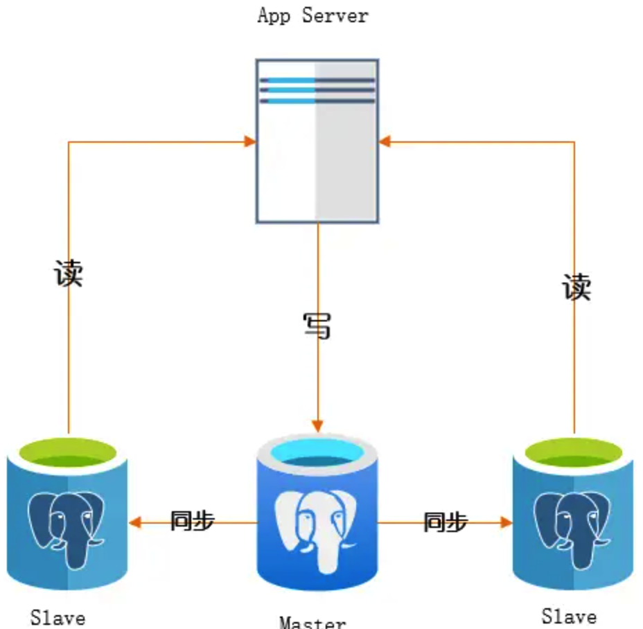
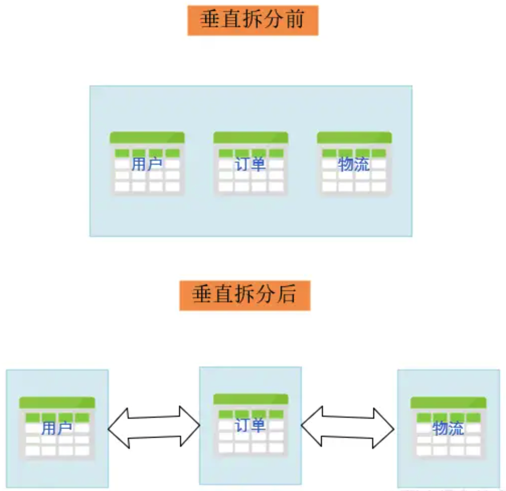
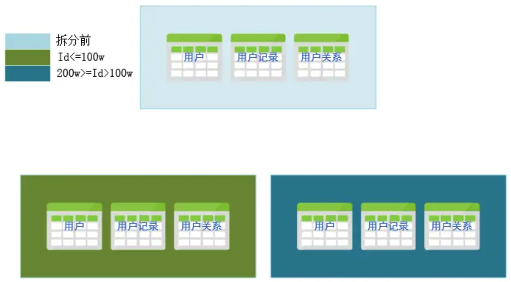
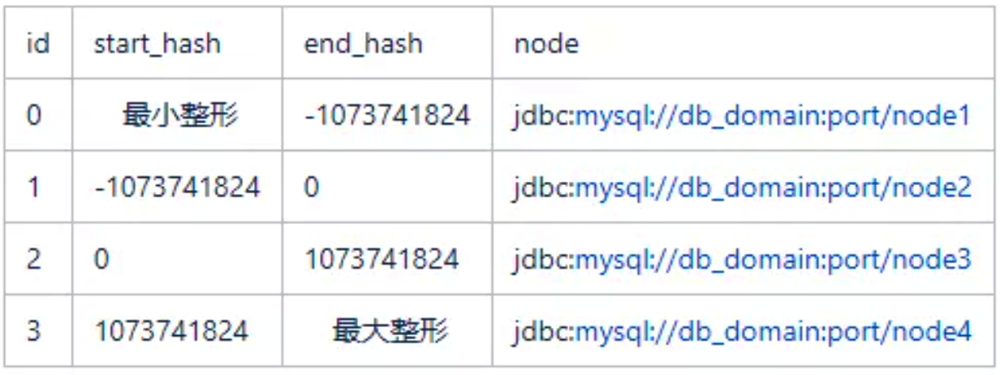
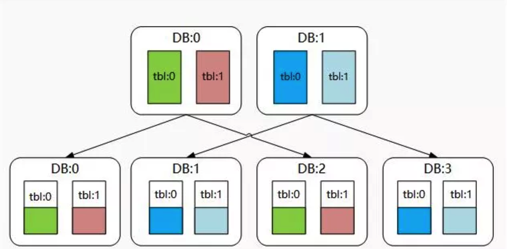
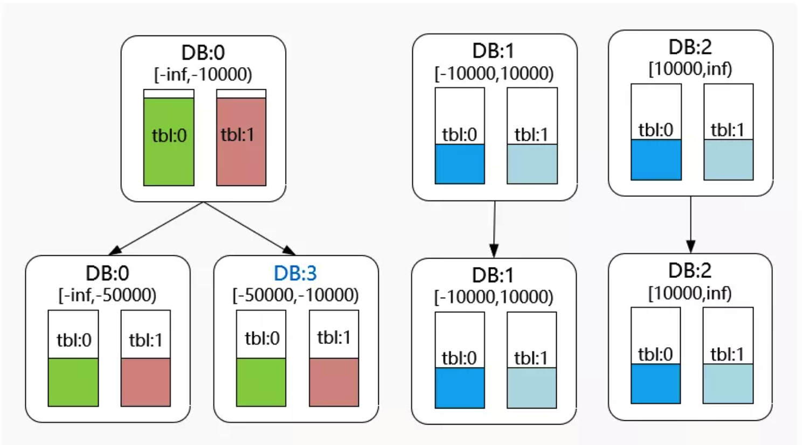

## 1. 分库分表相关概念

### 1.1 读写分离

读写分离，就是将数据库分为主从库，一个主库*Master*用于写数据，多个从苦*Slaver*进行轮询读取数据的过程，主从库之间通过某种通讯机制进行数据同步。



大多数的数据操作都是读多写少，随着数据增长，数据库的读会首先成为瓶颈。如果希望线性提升数据库的读性能和写性能，就需要让读写操作尽量互不影响。读写分离意味着将结构进行分散，数据量大并且高并发的场景需要考虑以下问题：

1. 如何保证 *Master* 的高可用，故障转移，熔断限流等
2. 读写操作的区分规则，代码层面如何处理读写命令，尽量无业务入侵
3. 数据一致性的容忍度。虽然数据同步，但由于网络不确定性，所以数据不是强一致性的

### 1.2 分库

数据库垂直拆分，水平拆分统称分库。是指按照特定条件和维度，将同一个数据库中的数据拆分到多个数据库上达到分散单库负载的效果。变相降低了数据集的大小，以空间换取时间提升性能。

#### 1.2.1 垂直拆分

按照业务对数据库中的表进行分组，同组的放到一个库里。需要根据实际业务将大业务拆分为小业务。如商城的整个业务中的用户相关表、订单相关表、物流相关表各自独立拆分成相应数据库。



垂直拆分后带来了一些优势：

- 业务清晰，指责单一
- 易维护，易扩展
- 数据服务化

同时也有一些负面作用：

- 提高了整个应用的复杂度，而且会形成跨库事务
- 引发“木桶效应”，任何一个短板都可能影响整个系统
- 部分表关系不能联表，只能通过服务互相调用来维系

#### 1.2.2 水平拆分

数据库垂直拆分后遇到单机数据库性能瓶颈之后，就需要考虑水平拆分了。垂直拆分后数据业务清晰且职责单一，更方便制定水平拆分标准。比如对用户系统进行水平拆分，可以根据用户注册时间区间、用户区域或者用户ID范围、*hash*等条件将数据拆分。



水平拆分带来的好处：

- 单个库的数据量可控
- 单条记录保证了数据完整性
- 数据可以联表查询
- 避免了跨库事务

但是也带来了一些负面作用：

- 拆分规则对编码有一定影响
- 不同业务分区的交互需要统筹设计

### 1.3 分表

分表可以分为垂直拆分和水平拆分。

#### 1.3.1 数据表垂直拆分

垂直拆分就是纵向的把表中的列分为多个表，把表从宽变窄，一般遵循以下几个点拆分：

- 冷热分离，把常用列放在一个表中，不常用的放在一个表
- 大字段列独立存放
- 关联关系的列紧密的放在一起

#### 1.3.2 数据表水平拆分

表的水平拆分和库的数据拆分思想一致，只不过粒度不同。表结构维持不变，即拆分后数据集的并集等于拆分前的数据集。

## 2. 水平分库分表技巧

### 2.1 分库分表需考虑的点

#### 2.1.1 方案可持续性

在进行分库分表的时候，需要尽可能做到随着业务数据量级和业务流量未来进一步升高达到新的量级的时候，分库分表方案可以持续使用。

假定当前我们分库分表的方案为10库100表，那么未来某个时间点，若10个库仍然无法应对用户的流量压力，或者10个库的磁盘使用即将达到物理上限时，我们的方案能够进行平滑扩容。

#### 2.1.2 数据偏斜问题

良好的分库分表方案，数据应该是需要比较均匀的分散在各个库表中的，如果数据出现偏移问题，可能会导致以下问题：

- 某个数据库实例，部分表数据很多，而其他表数据寥寥无几，业务上表现是延迟忽高忽低
- 数据库集群中，部分集群磁盘使用增长很快，而部分集群磁盘增长却很缓满，这种情况会给后续扩容带来步调不一致，无法统一操作的问题

### 2.2 常见分库分表方案

#### 2.2.1 Range分库分表

该策略根据数据范围划分数据的存放位置，如：

可以把订单表按照年份为单位，每年的数据存放在单独的库(表)中。

```java
public static String rangeShardByYear(String orderId) {
	int year = Interger.parseInt(orderid.substring(0, 4));
	return "t_order_" + year;
}
```

通过数据的范围进行分库分表，是最朴实的方案，可以和其他分库分表方案灵活结合使用。一些业界流行的分布式数据库，也是基于Range方式进行，将不同范围内的 [StartKey, EndKey) 灵活分配到不同的Region上。

该方案实现简单，但是也有缺点：

- 数据热点问题。如订单表，当前年度所在库表属于热点数据，需要承载大部分IO和计算资源
- 新库新表的追加问题。需要提前将新库建立
- 业务上的交叉范围内数据处理复杂。

#### 2.2.2 Hash分库分表

Hash分库分表是最大众最普通的方案。先介绍几个常见的错误案例：

##### 错误案例

**1. 非互质关系导致的数据偏斜问题**

```java
public static ShardCfg shard(String userId) {
	int hash = userId.hashCode();
  // 对库数量取余结果为库序号
  int dbIdx = Math.abs(hash % DB_CNT);
  // 对表数量取余结果为表序号
  int tblIdx = Math.abs(hash % TBL_CNT);
  return new ShardCfg(dbIdx, tblIdx);
}
```

用Hash值分别对分库数和分表数取余，得到库序号和表序号。但是可能存在数据偏斜，以10库100表为例，如果一个Hash对100取余为0，那么对10取余也必然为0。

这样就意味着0库里边的0表才可能有数据，其他库中的0表永远为空。

如果分库数和分表数不仅互质，而且分表数为奇数(例如10库101表)，则理论上可以使用该方案。

**2. 扩容难以持续**

把10库100表看成共1000个逻辑表，将求得的Hash值对1000取余，得到一个介于[0, 999) 中的数，然后将这个数二次均分到每个库每个表中：

```java
public static ShardCfg shard(String userId) {
  // 计算hash
  int hash = userId.hashCode();
  // 总分片数
  int sumSlot = DB_CNT * TBL_CNT;
  // 分片序号
  int slot = Math.abs(hash % sumSlot);
  // 计算库序号和表序号的错误案例
  int dbIdx = slot % DB_CNT;
  int tblIdx = slot / DB_CNT;
  return new ShardCfg(dbIdx, tblIdx);
}
```

该方案可以巧妙的解决数据偏斜的问题，只要Hash值足够均匀，那么理论上分配序号也会足够平均，于是每个库和表中的数据量也能保持较均衡的状态。

但该方案存在一个较大的问题，那就是在计算表序号的时候，依赖总库的数量，后续使用翻倍扩容法扩容时，会出现扩容前后数据不在一个表中的情况。

假设扩容前Hash为1986的数据应该存放在6库98表，但是翻倍扩容成20库100表后，它分配到了6库99表，表序号发生了偏移。这样的话，我们在后续在扩容的时候，不仅要基于库迁移数据，还要基于表迁移数据，非常麻烦且易错。

上述两个错误案例中

##### 1. 标准的二次分片法

上述错误案例二整体思路正确，只是最后计算库序号和表序号的时候，使用了库数量作为影响表序号的因子，导致扩容时表序号偏移而无法进行。实际上只需要换种写法，就能得到一个较简单的分库分表方案：

```java
public static ShardCfg shard2(String userId) {
  // 计算hash
  int hash = userId.hashCode();
  // 总分片数
  int sumSlot = DB_CNT * TBL_CNT;
  // 分片序号
  int slot = Math.abs(hash % sumSlot);
  // 重新修改二次求值方案
  int dbIdx = slot / TBL_CNT;
  int tblIdx = slot % TBL_CNT;
  return new ShardCfg(dbIdx, tblIdx);
}
```

该方案仅仅修改了通过分配序号重新计算库序号和表序号的逻辑，使用该方法通过翻倍扩容后，表序号一定维持不变，库序号可能改变。

**方案缺点**

- 翻倍扩容前期操作性高，但是分库数很大时，每次扩容都非常耗费资源
- 连续的分片键Hash值大概率散落在相同库中，某些业务可能存在库热点

##### 2. 关系表冗余

可以将分片键对应库的关系通过关系表记录，该表被称为“路由关系表”。

```java
public static ShardCfg shard(String userId) {
  int tblIdx = Math.abs(userId.hashCode() % TBL_CNT);
  // 从缓存获取
  Integer dbIdx = loadFromCache(userId);
  if (null == dbIdx) {
    // 从路由表获取
    dbIdx = loadFromRouteTable(userId);
    if (null != dbIdx) {
      // 保存到缓存
      saveRouteCache(userId, dbIdx);
    }
  }
  if (null == dbIdx) {
      // 实现计算对应关系逻辑
      dbIdx = selectRandomDbIdx();
      saveToRouteTable(userId, dbIdx);
      saveRouteCache(userId, dbIdx);
    }
    return new ShardCfg(dbIdx, tblIdx);
}
```

 该方案还是通过常规的Hash算法计算表序号，而计算库序号时，则从路由表读取数据。由于每次数据查询时，都需要读取路由表，因此将分片键和库序号对应关系记录在缓存中提升性能。

**selectRandomDbIdx**方法用于生成该分片键对应的存储库序号，可以动态配置。例如为每个库指定一个权重，权重大的被选中的概率更高。

该方案还有个优点，就是理论上后续进行扩容的时候，仅需要挂载上新的数据库节点，将权重配置成较大值即可，无需进行任何的数据迁移即可完成。

该方案也存在缺陷，在某些场景不适用：

- 每次读取数据需要访问路由表，虽然使用了缓存，但是还是有一定的性能损耗。

- 路由关系表的存储方面，有些场景并不合适。例如上述案例中用户id的规模大概是在10亿以内，我们用单库百表存储该关系表即可。但如果例如要用文件MD5摘要值作为分片键，因为样本集过大，无法为每个md5值都去指定关系（也可以使用md5前N位来存储关系）
- 饥饿占位问题

##### 3. 基因法

错误案例1中，是因为库序号和表序号计算逻辑里公约数这个因子影响库表的独立性。所以可以使用相对独立的Hash值来计算库序号和表序号：

```java
public static ShardCfg shard(String userId) {
  int dbIdx = Math.abs(userId.substring(0, 4).hashCode % DB_CNT);
  int tblIdx = Math.abs(userId.hashCode() % TBL_CNT);
  return new ShardCfg(dbIdx, tblIdx);
}
```

计算库序号的时候做了部分改动，我们使用分片键的前四位作为Hash值来计算库序号。

这也是一种常用的方案，我们称为基因法，即使用原分片键中的某些基因（例如前四位）作为库的计算因子，而使用另外一些基因作为表的计算因子。该方案也是网上不少的实践方案或者是其变种，看起来非常巧妙的解决了问题，然而在实际生成过程中还是需要慎重。

该方案并不是一定不行，而是我们在采用的时候，要综合分片键的样本规则，选取的分片键前缀位数，库数量，表数量，四个变量对最终的偏斜率都有影响。

##### 4. 剔除公因数法

很多场景下希望相邻的Hash能分到不同库中。如N库单表的时候，计算库号一般直接用Hash值对库数量取余。

```java
public static ShardCfg shard(String userId) {
        int dbIdx = Math.abs(userId.hashCode() % DB_CNT);
        // 计算表序号时先剔除掉公约数的影响
        int tblIdx = Math.abs((userId.hashCode() / TBL_CNT) % TBL_CNT);
        return new ShardCfg(dbIdx, tblIdx);
}
```

##### 5. 一致性Hash法

一致性Hash算法也是一种比较流行的集群数据分区算法，比如RedisCluster即是通过一致性Hash算法，使用16384个虚拟槽节点进行每个分片数据的管理。

通常会将每个实际节点的配置持久化在一个配置项或者是数据库中，应用启动时或者是进行切换操作的时候会去加载配置。配置一般包括一个[StartKey,Endkey)的左闭右开区间和一个数据库节点信息，例如：



```java

private TreeMap<Long, Integer> nodeTreeMap = new TreeMap<>();
 
@Override
public void afterPropertiesSet() {
    // 启动时加载分区配置
    List<HashCfg> cfgList = fetchCfgFromDb();
    for (HashCfg cfg : cfgList) {
        nodeTreeMap.put(cfg.endKey, cfg.nodeIdx);
    }
}
 
public ShardCfg shard(String userId) {
    int hash = userId.hashCode();
    int dbIdx = nodeTreeMap.tailMap((long) hash, false).firstEntry().getValue();
    int tblIdx = Math.abs(hash % 100);
    return new ShardCfg(dbIdx, tblIdx);
}
```

这种形式和上文描述的Range分表非常相似，Range分库分表方式针对分片键本身划分范围，而一致性Hash是针对分片键的Hash值进行范围配置。

## 3. 常见扩容方案

### 3.1 翻倍扩容法

翻倍扩容的主要思想是每次扩容，库的数量均翻倍处理，而翻倍的数据源通常由原数据源通过主从复制方式得到的从库升级成主库提供服务的方式，故也称为从库升级法。

理论上，经过翻倍扩容法后，我们会多一倍的数据库用来存储数据和应对流量，原先数据库的磁盘使用量也将得到一半空间的释放。




### 3.2 一致性Hash扩容

假如当前数据库节点DB0负载或磁盘使用过大需要扩容，我们通过扩容可以达到例如下图的效果。扩容前配置了三个Hash分段，发现[-Inf，-10000）范围内的的数据量过大或者压力过高时，需要对其进行扩容。




