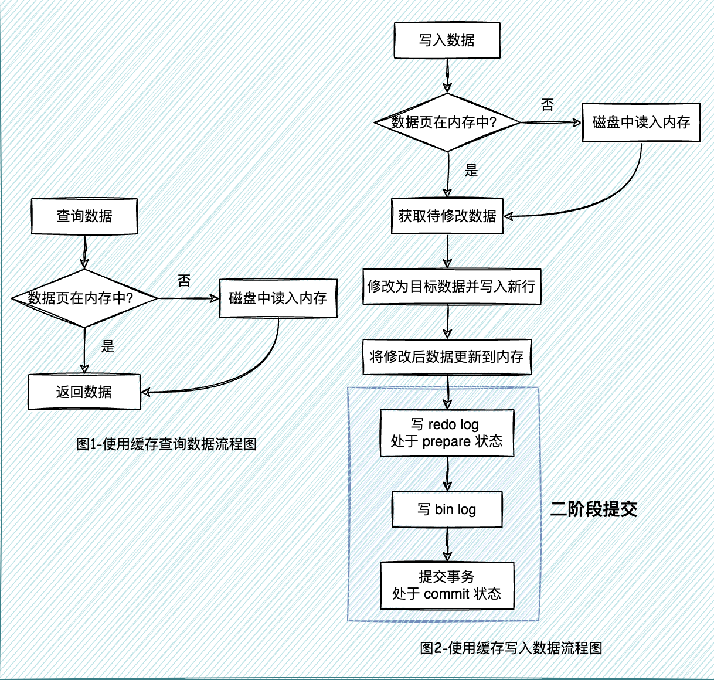

## 1. MySQL体系结构和存储引擎

MySQL的基本架构示意图:

MySQL可以分为Server层和存储引擎层两部分：

- Server层包括连接器、查询缓存、分析器、优化器、执行器等，涵盖MySQL的大多数核心服务功能，以及所有的内置函数（如日期、时间、数学和加密函数等），所有跨存储引擎的功能都在这一层实现，比如存储过程、触发器、视图等。

- 存储引擎层负责数据的存储和提取。其架构模式是插件式的，支持InnoDB、MyISAM、Memory等多个存储引擎。现在最常用的存储引擎是InnoDB，它从MySQL 5.5.5版本开始成为了默认存储引擎。

### 1.1 InnoDB存储引擎

InnoDB存储引擎体系架构如下图所示：

#### 1.1.1 后台线程

**Master Thread：**

是核心的后台线程，主要负责：

- 将缓冲池中的数据异步刷新到磁盘
- 保证数据的一致性，包括脏页的刷新、合并插人缓冲(INSERT BUFFER)、UNDO页的回收等

**lO Thread：**

主要是负责异步IO请求的回调(call back)处理
InnoDB 1.0版本之前共有4个IO Thread，分别是：write、read、insert buffer和 logI0 thread

**Purge Thread：**

主要负责回收已经使用并分配的undo页

- InnoDB 1.1版本之前，purge操作仅在InnoDB存储引擎的Master Thread中完成
- InnoDB 1.1版本开始，purge操作可以独立到单独的线程中进行，以此来减轻Master Thread的工作，从而提高CPU的使用率以及提升存储引擎的性能

**Page Cleaner Thread：**

InnoDB 1.2.x版本中引入该线程，将之前版本中脏页的刷新操作都放入到单独的线程中来完成。目的是为了减轻原Master Thread的工作及对于用户查询线程的阻塞，进一步提高InnoDB存储引擎的性能。

#### 1.1.2 内存

##### 1. **缓冲池**

InnoDB存储引擎是基于磁盘存储的，并将记录按照页的方式进行管理。由于CPU速度与磁盘速度之间的鸿沟，基于磁盘的数据库系统通常使用缓冲池技术来提高数据库的整体性能。

- 查询缓存：首先将从磁盘读到的页存放在缓冲池中，这个过程称为将页“FIX”在缓冲池中。下一次再读相同的页时，首先判断该页是否在缓冲池中。若在缓冲池中，称该页在缓冲池中被命中，直接读取该页。否则，读取磁盘上的页。

- 写入缓存：首先修改在缓冲池中的页，然后再以一定的频率刷新到磁盘上。这里需要注意的是，页从缓冲池刷新回磁盘的操作并不是在每次页发生更新时触发，而是通过一种称为Checkpoint的机制刷新回磁盘。同样，这也是为了提高数据库的整体性能。

综上所述，缓冲池的大小直接影响着数据库的整体性能。

具体来看，缓冲池中缓存的数据页类型有：索引页、数据页、undo 页、插入缓冲(insert buffer)、自适应哈希索引(adaptive hash index)、InnoDB 存储的锁信息(lock info)、数据字典信息( data dictionary) 等。

不能简单地认为，缓冲池只是缓存索引页和数据页，它们只是占缓冲池很大的一.部分而已。下图显示了InnoDB存储引擎中内存的结构情况。

##### 2. **缓冲池页面管理算法**

在InnoDB存储引擎中，缓冲池是一个很大的内存区域，其中存放各种类型的页，在InnoDB存储引擎中，缓冲池中页的大小默认为16KB，同样使用LRU算法对缓冲池进行管理。在InnoDB的存储引擎中，LRU列表中还加入了midpoint位置。新读取到的页，虽然是最新访问的页，但并不是直接放入到LRU列表的首部，而是放入到LRU列表的midpoint位置。

这个算法在InnoDB存储引擎下称为midpoint insertion strategy。在默认配置下，该位置在LRU列表长度的5/8处。因为若直接将读取到的页放入到LRU的首部，那么某些SQL操作可能会使缓冲池中的页被刷新出，从而影响缓冲池的效率。如果页被放入LRU列表的首部，那么非常可能将所需要的热点数据页从LRU列表中移除，而在下一次需要读取该页时，InnoDB存储引擎需要再次访问磁盘。

**Free List**

**Flush List**

