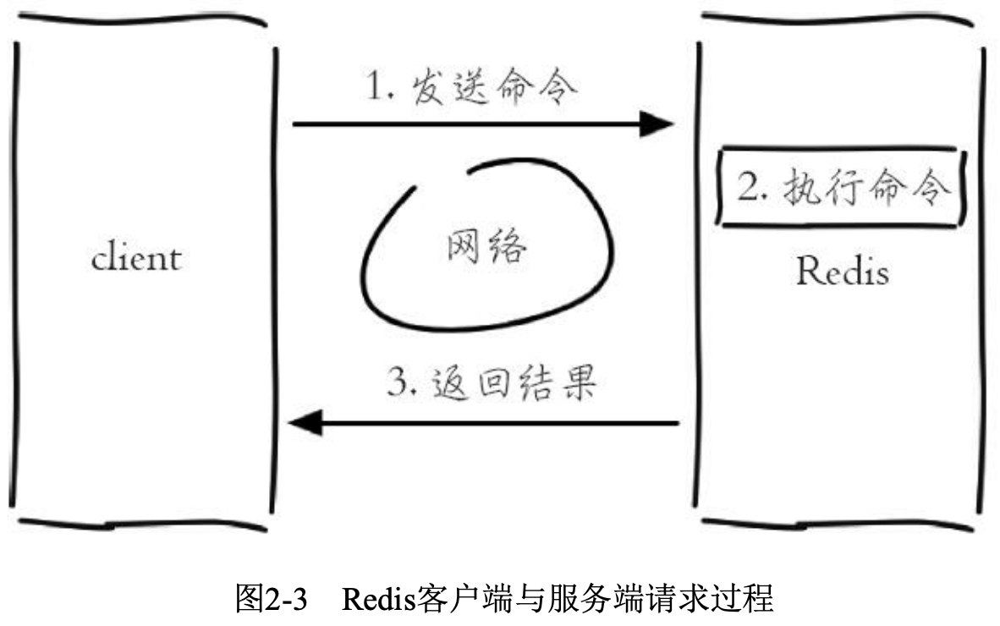
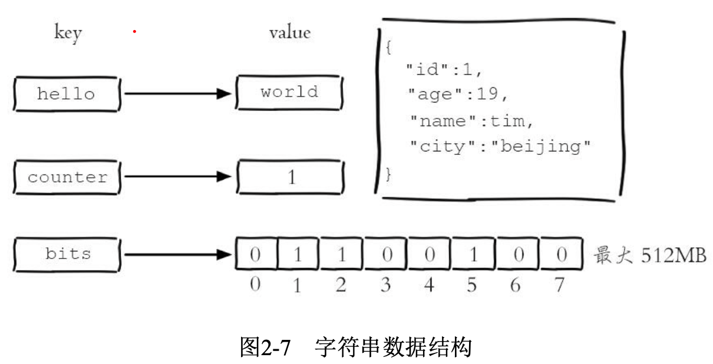
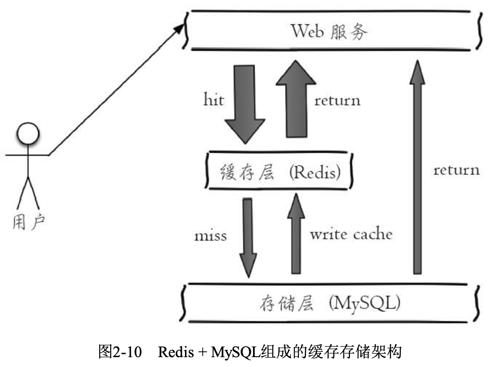
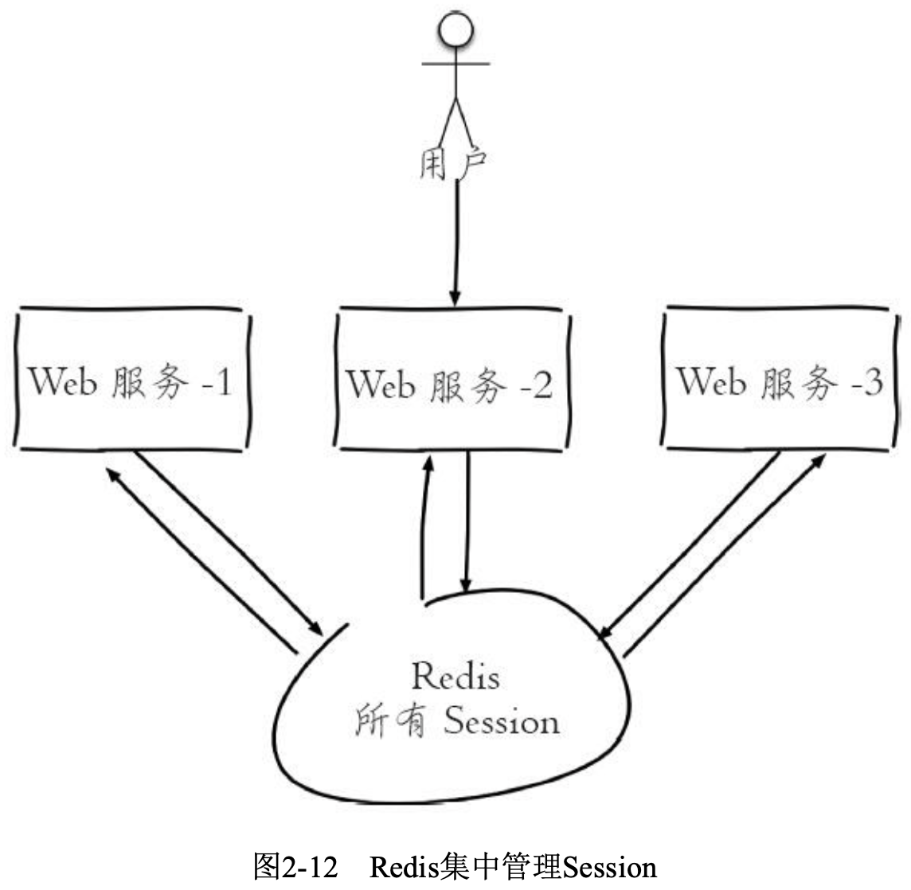

## 1. 概述

### 1.1 Redis特性

- **速度快**

  Redis执行命令的速度非常快，官方给出的数字是读写性 能可以达到10万/秒。

  Redis速度快的原因可以大致归纳为以下两点:

  1. Redis的所有数据都是存放在内存中的
  2. Redis使用了单线程架构，预防了多线程可能产生的竞争问题

- **基于键值对的数据结构服务器**

  主要提供了5种数据结 构:字符串、哈希、列表、集合、有序集合，同时在字符串的基础之上演变 出了位图(Bitmaps)和HyperLogLog两种神奇的“数据结构”，并且Redis3.2版本中加入有关GEO(地理信息定位)的数据结构 geospatial。

- **功能丰富、简单稳定**

  1. 提供了键过期功能，可以用来实现缓存
  2. 提供了发布订阅功能，可以用来实现消息系统。
  3. 支持Lua脚本功能，可以利用Lua创造出新的Redis命令。
  4. 提供了简单的事务功能，能在一定程度上保证事务特性。
  5. 提供了流水线(Pipeline)功能，这样客户端能将一批命令一次性传到 Redis，减少了网络的开销。

- **持久化**

  Redis提供了两种持久化方式:RDB和 AOF，即可以用两种策略将内存的数据保存到硬盘中。

- **主从复制**

- **高可用、分布式**

  Redis从2.8版本正式提供了高可用实现Redis Sentinel，它能够保证Redis 节点的故障发现和故障自动转移。Redis从3.0版本正式提供了分布式实现 Redis Cluster，它是Redis真正的分布式实现，提供了高可用、读写和容量的 扩展性。

### 1.2 Redis使用场景

- **缓存**

  Redis提供了 键值过期时间设置，并且也提供了灵活控制最大内存和内存溢出后的淘汰策略。

- **排行榜系统**

  Redis提供了列表 和有序集合数据结构，合理地使用这些数据结构可以很方便地构建各种排行 榜系统。

- **计数器应用**

  Redis的原子操作天然支持计数功能而且计数的性能也非常好，可以说是计数器系统的重要选择。

- **社交网络**

  赞/踩、粉丝、共同好友/喜好、推送、下拉刷新等是社交网站的必备功能，由于社交网站访问量通常比较大，而且传统的关系型数据不太适合保存 这种类型的数据，Redis提供的数据结构可以相对比较容易地实现这些功 能。

- **消息队列系统**

  消息队列系统可以说是一个大型网站的必备基础组件，因为其具有业务 解耦、非实时业务削峰等特性。Redis提供了发布订阅功能和阻塞队列的功能，虽然和专业的消息队列比还不够足够强大，但是对于一般的消息队列功 能基本可以满足。

## 2. 常用API及理解

### 2.1 概述

1. Redis的命令有上百个，如果纯靠死记硬背比较困难，但是如果理解Redis的一些机制，会发现这些命令有很强的通用性。
2. Redis不是万金油，有些数据结构和命令 必须在特定场景下使用，一旦使用不当可能对Redis本身或者应用本身造成 致命伤害。

#### 2.1.1 全局命令

Redis有5种数据结构，它们是键值对中的值，对于键来说有一些通用的命令。

```shell
# 数据库相关命令
127.0.0.1:6379> select 3 //切换到3号数据库
OK
127.0.0.1:6379> flushdb //清空数据库
OK
127.0.0.1:6379[3]> DBSIZE //查看当前数据库键总数
(integer) 0

# 键相关命令
127.0.0.1:6379> keys * //查看所有数据库键
1) "name"
127.0.0.1:6379> exists key  // 查看键是否存在 键存在则返回1，不存在则返回0
(integer) 1
127.0.0.1:6379> del key [key ...]  // 删除键 成功返回1 键不存在返回0
(integer) 1
127.0.0.1:6379> type a  // 查看键类型
string
127.0.0.1:6379> object encoding key  // 查看键 
"embstr"

# 键过期时间相关命令
127.0.0.1:6379> expire key seconds  // 给键设置过期时间
(integer) 1
127.0.0.1:6379> ttl key  // 查看键过期时间 大于等于0-键剩余的过期时间 1-键没设置过期时间 2-键不存在
(integer) 7
```

#### 2.1.2 数据结构和内部编码

type命令实际返回的就是当前键的数据结构类型，它们分别是: 

- string(字符串)

- hash(哈希)

- list(列表)

- set(集合)

- zset(有序集合)

但这些只是Redis对外的数据结构，实际上每种数据结构都有自己底层的内部编码实现，而且是多种实现


Redis这样设计有两个好处：

1. 可以改进内部编码，而对外的数据 结构和命令没有影响，这样一旦开发出更优秀的内部编码，无需改动外部数 据结构和命令，例如Redis3.2 提供了quicklist，结合了ziplist和linkedlist两者的优势，为列表类型提供了一种更为优秀的内部编码实现，而对外部用户来 说基本感知不到。

2. 多种内部编码实现可以在不同场景下发挥各自的优 势，例如ziplist比较节省内存，但是在列表元素比较多的情况下，性能会有所下降，这时候Redis会根据配置选项将列表类型的内部实现转换为linkedlist。

#### 2.1.3 单线程架构

Redis使用了单线程架构和I/O多路复用模型来实现高性能的内存数据库服务。

1. **单线程模型**

Redis客户端与服务端的模型可以简化成图2-3，每次客户端调用都经历 了发送命令、执行命令、返回结果三个过程。



Redis是单线程来处理命令的，所以一 条命令从客户端达到服务端不会立刻被执行，所有命令都会进入一个队列中，然后逐个被执行。这就 是Redis单线程的基本模型。但是像发送命令、返回结果、命令排队肯定不像描述的这么简单，**Redis使用了I/O多路复用技术来解决I/O的问题**。

2. **为什么单线程还能这么快**

为什么Redis使用单线程模型会达到每秒万级别的处理能力呢？可以将其归结为三点：

- 纯内存访问，Redis将所有数据放在内存中，内存的响应时长大 约为100纳秒，这是Redis达到每秒万级别访问的重要基础

- 非阻塞I/O，Redis使用epoll作为I/O多路复用技术的实现，再加上 Redis自身的事件处理模型将epoll中的连接、读写、关闭都转换为事件，不在网络I/O上浪费过多的时间，如下图所示


- 单线程避免了线程切换和竞态产生的消耗

单线程的优点：

- 单线程可以简化数据结构和算法的实现。如果对高级编程语言熟悉的读者应该了解并发数据结构实现不但困难而且开发测试比较麻烦
- 单线程避免了线程切换和竞态产生的消耗，对于服务端开发来说，锁和线程切换通常是性能杀手

单线程的缺点：

- 对于每个命令的执行时间是有要求的。如果某个命令执行过长，会造成其他命令的阻塞，对于Redis这种高性能的服务 来说是致命的，所以Redis是面向快速执行场景的数据库

### 2.2 字符串

字符串类型是Redis最基础的数据结构。键都是字符串类型，而且 其他几种数据结构都是在字符串类型基础上构建的。值最大不能 超过512MB。



#### 2.2.1 命令

1. **常用命令**

```shell
# 设置值 set
# set key value [ex seconds] [px milliseconds] [nx|xx]
# set命令有几个选项:
# ex seconds:为键设置秒级过期时间
# px milliseconds:为键设置毫秒级过期时间
# nx:键必须不存在，才可以设置成功，用于添加; xx:与nx相反，键必须存在，才可以设置成功，用于更新。
127.0.0.1:6379> set key value
OK

# 设置值 setex/setnx 和ex、nx作用一致
# setex key seconds value 
# setnx key value 因为redis单线程 可以用作分布式锁
127.0.0.1:6379> setnx key value # 0-失败 1-成功
(integer) 0

# 批量设置值
# mset key value [key value ...]
127.0.0.1:6379> mset key1 value1 key2 value2 key3 value3
OK

# 获取值 get
# get key
127.0.0.1:6379> get key # 不存在则返回 nil
"value"

# 批量获取值
# mget key [key ...]
127.0.0.1:6379> mget key1 key2
1) "1"
2) "2"

# 计数
# incr key
# 值不是整数，返回错误
# 值是整数，返回自增后的结果
# 键不存在，按照值为0自增，返回结果为1
127.0.0.1:6379> exists key 
(integer) 0 
127.0.0.1:6379> incr key 
(integer) 1
# 除了incr命令，Redis提供了decr(自减)、incrby(自增指定数字)、 decrby(自减指定数字)、incrbyfloat(自增浮点数)
# decr key
# incrby key increment 
# decrby key decrement 
# incrbyfloat key increment
```

2. **不常用命令**

```shell
# 追加值 向字符串尾部追加值
# append key value
127.0.0.1:6379> get key
"redis"
127.0.0.1:6379> append key world 
(integer) 10
127.0.0.1:6379> get key 
"redisworld"

# 获取字符串长度 中文占3个字节
# strlen key
strlen key
127.0.0.1:6379> get key 
"redisworld" 
127.0.0.1:6379> strlen key 
(integer) 10

# 设置并返回原值
# getset key value
127.0.0.1:6379> getset hello world 
(nil)
127.0.0.1:6379> getset hello redis 
"world"

# 获取部分字符串
# getrange key start end
127.0.0.1:6379> getrange key 0 4
"redis"
```

#### 2.2.2 内部编码

字符串类型的内部编码有3种：

- int：8个字节的长整型

- embstr：小于等于39个字节的字符串

- raw：大于39个字节的字符串

Redis会根据当前值的类型和长度决定使用哪种内部编码实现。

```shell
# 整数类型
127.0.0.1:6379> set key 8653
OK
127.0.0.1:6379> object encoding key 
"int"

# 小于等于39个字节的字符串:embstr 
127.0.0.1:6379> set key "hello,world" 
OK
127.0.0.1:6379> object encoding key 
"embstr"


#大于39个字节的字符串:raw
127.0.0.1:6379> set key "one string greater than 39 byte........." 
OK
127.0.0.1:6379> object encoding key
"raw"
127.0.0.1:6379> strlen key
(integer) 40
```

#### 2.2.3 经典使用场景

1. **缓存功能**

比较典型的缓存使用场景，其中Redis作为缓存层，MySQL作 为存储层，绝大部分请求的数据都是从Redis中获取。由于Redis具有支撑高 并发的特性，所以缓存通常能起到加速读写和降低后端压力的作用。



设计合理的键名，有 利于防止键冲突和项目的可维护性，比较推荐的方式是使用 “业务名-对象名-id[属性]” 作为键名。可以在能描 述键含义的前提下适当减少键的长度，从而减少由于键过长的内存浪费。

2. **计数**

许多应用都会使用Redis作为计数的基础工具，它可以实现快速计数、 查询缓存的功能，同时数据可以异步落地到其他数据源。

```java
// 视频播放数就会自增1
long incrVideoCounter(long id) { 
  key = "video:playCount:" + id; 
  return redis.incr(key);
}
```

3. **共享Session**

一个分布式Web服务将用户的Session信息(例如用户登录信息)保存在各自服务器中，这样会造成一个问题，出于负载均衡的考虑，分布式服务会将用户的访问均衡到不同服务器上，用户刷新一次访问可能会发现需要重新登录，这个问题是用户无法容忍的。


为了解决这个问题，可以使用Redis将用户的Session进行集中管理，如下图所示，在这种模式下只要保证Redis是高可用和扩展性的，每次用户更新或者查询登录信息都直接从Redis中集中获取。



4. **限速**

很多应用出于安全的考虑，会在每次进行登录时，让用户输入手机验证 码，从而确定是否是用户本人。但是为了短信接口不被频繁访问，会限制用 户每分钟获取验证码的频率。此功能可以使用Redis来实现。

```java
phoneNum = "138xxxxxxxx";
key = "shortMsg:limit:" + phoneNum;
// SET key value EX 60 NX
isExists = redis.set(key,1,"EX 60","NX"); 
if(isExists != null || redis.incr(key) <=5){
	// 通过 
}else{
	// 限速 
}
```

上述就是利用Redis实现了限速功能，例如一些网站限制一个IP地址不能在一秒钟之内访问超过n次也可以采用类似的思路。

### 2.3 哈希


