## 0. 概述

### 0.1 Redis特性

- **速度快**

  Redis执行命令的速度非常快，官方给出的数字是读写性 能可以达到10万/秒。

  Redis速度快的原因可以大致归纳为以下两点:

  1. Redis的所有数据都是存放在内存中的
  2. Redis使用了单线程架构，预防了多线程可能产生的竞争问题

- **基于键值对的数据结构服务器**

  主要提供了5种数据结 构:字符串、哈希、列表、集合、有序集合，同时在字符串的基础之上演变 出了位图(Bitmaps)和HyperLogLog两种神奇的“数据结构”，并且Redis3.2版本中加入有关GEO(地理信息定位)的数据结构 geospatial。

- **功能丰富、简单稳定**

  1. 提供了键过期功能，可以用来实现缓存
  2. 提供了发布订阅功能，可以用来实现消息系统。
  3. 支持Lua脚本功能，可以利用Lua创造出新的Redis命令。
  4. 提供了简单的事务功能，能在一定程度上保证事务特性。
  5. 提供了流水线(Pipeline)功能，这样客户端能将一批命令一次性传到 Redis，减少了网络的开销。

- **持久化**

  Redis提供了两种持久化方式:RDB和 AOF，即可以用两种策略将内存的数据保存到硬盘中。

- **主从复制**

- **高可用、分布式**

  Redis从2.8版本正式提供了高可用实现Redis Sentinel，它能够保证Redis 节点的故障发现和故障自动转移。Redis从3.0版本正式提供了分布式实现 Redis Cluster，它是Redis真正的分布式实现，提供了高可用、读写和容量的 扩展性。

### 0.2 Redis使用场景

- **缓存**

  Redis提供了 键值过期时间设置，并且也提供了灵活控制最大内存和内存溢出后的淘汰策略。

- **排行榜系统**

  Redis提供了列表 和有序集合数据结构，合理地使用这些数据结构可以很方便地构建各种排行 榜系统。

- **计数器应用**

  Redis的原子操作天然支持计数功能而且计数的性能也非常好，可以说是计数器系统的重要选择。

- **社交网络**

  赞/踩、粉丝、共同好友/喜好、推送、下拉刷新等是社交网站的必备功能，由于社交网站访问量通常比较大，而且传统的关系型数据不太适合保存 这种类型的数据，Redis提供的数据结构可以相对比较容易地实现这些功 能。

- **消息队列系统**

  消息队列系统可以说是一个大型网站的必备基础组件，因为其具有业务 解耦、非实时业务削峰等特性。Redis提供了发布订阅功能和阻塞队列的功能，虽然和专业的消息队列比还不够足够强大，但是对于一般的消息队列功 能基本可以满足。

## 1. 基本数据结构

### 1.1 简单动态字符串 SDS

Redis自己构建了一种名为简单动态字符串(simple dynamic string，SDS)的抽象类型，并将 SDS 用作 Redis 的默认字符串表示。

在 Redis 里面，C 字符串只会作为字符串字面量(string literal)用在一些无须对字符串 值进行修改的地方，比如：

- 打印日志
- 表示被修改的字符串值
- 字符串值的键值对在底层都是由 SDS
- AOF 模块中的 AOF 缓冲区，以及客户端状态中的输入缓冲区

#### 1.1.1 SDS 的定义

```c
struct sdshdr {
	// 记录buf数组中已使用字节的数量 
  // 等于SDS所保存字符串的长度 
  int len;
	// 记录buf数组中未使用字节的数量 
  int free;
	// 字节数组，用于保存字符串 
  char buf[];
};
```

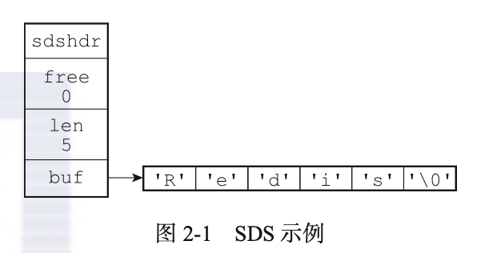

- free 属性的值为 0，表示这个 SDS 没有分配任何未使用空间
- len 属性的值为 5，表示这个 SDS 保存了一个五字节长的字符串
- buf 属性是一个 char 类型的数组，数组的前五个字节分别保存了 'R'、'e'、'd'、'i'、's' 五个字符，最后一个字节则保存了空字符 '\0'

#### 1.1.2 SDS 与 C 字符串的区别

C 语言使用长度为 N+1 的字符数组来表示长度为 N 的字符串，并且字符数组的最后一个元素总是空字符 '\0'。

C 语言使用的这种简单的字符串表示方式，并不能满足 Redis 对字符串在安全性、效率以及功能方面的要求，接下来的内容将详细
对比 C 字符串和 SDS 之间的区别，并说明 SDS 比 C 字符串更适用于 Redis 的原因。

**1. 常数复杂度获取字符串长度**

因为 C 字符串并不记录自身的长度信息，所以为了获取一个 C 字符串的长度，程序必须遍历整个字符串，对遇到的每个字符进行计数，直到遇到代表字符串结尾的空字符为止，这个操作的复杂度为 *O*(*N*)。

SDS 在 len 属性中记录了 SDS 本身的长度，所以获取一个 SDS 长度的复杂度仅为 *O*(1)。

**2. 杜绝缓冲区溢出**

除了获取字符串长度的复杂度高之外，C 字符串不记录自身长度带来的另一个问题是容易造成缓冲区溢出(buffer overflow)。

举个例子，<string.h>/strcat函数可以将 src 字符串中的内容拼接到 dest 字符串的末尾:

```c
char *strcat(char *dest, const char *src);
```

如果执行该函数前 dest 字符串没有足够的内存保存 src 字符串，就会产生缓冲区溢出。

SDS 的空间分配策略完全杜绝了发生缓冲区溢出的可能性：当 SDS API 需要对 SDS 进行修改时，API 会先检查 SDS 的空间是否满足修改所需的要求，如果不 满足的话，API 会自动将 SDS 的空间扩展至执行修改所需的大小，然后才执行实际的修改 操作，所以使用 SDS 既不需要手动修改 SDS 的空间大小，也不会出现前面所说的缓冲区溢出问题。

**3. 减少修改字符串时带来的内存重分配次数**

因为 C 字符串并不记录自身的长度，所以对于一个包含了 N 个 字符的 C 字符串来说，这个 C 字符串的底层实现总是一个 N+1 个字符长的数组。所以每次增长或者缩短一个 C 字符串，程序都总要对保存这个 C 字符串的数组进行一次内存重分配操作:

- 如果程序执行的是增长字符串的操作，比如拼接操作(append)，那么在执行这个操 作之前，程序需要先通过内存重分配来扩展底层数组的空间大小——如果忘了这一 步就会产生缓冲区溢出。
- 如果程序执行的是缩短字符串的操作，比如截断操作(trim)，那么在执行这个操作 之后，程序需要通过内存重分配来释放字符串不再使用的那部分空间——如果忘了这一步就会产生内存泄漏。

为了避免 C 字符串的这种缺陷，**SDS 通过未使用空间解除了字符串长度和底层数组长度之间的关联：**在 SDS 结构体中，使用 free 属性记录数组里面未使用的字节。

通过未使用空间，SDS 实现了空间预分配和惰性空间释放两种优化策略。

**空间预分配**

空间预分配用于优化 SDS 的字符串增长操作：当 SDS 的 API 对一个 SDS 进行修改，并且需要对 SDS 进行空间扩展的时候，程序不仅会为 SDS 分配修改所必须要的空间，还会 为 SDS 分配额外的未使用空间。

额外分配的未使用空间数量由以下公式决定：

- 如果对 SDS 进行修改之后，SDS 的长度(也即是len属性的值)将小于1MB，那么程序分配和 len 属性同样大小的未使用空间，这时 SDS len 属性的值将和 free 属性的值相同

- 如果对 SDS 进行修改之后，SDS 的长度将大于等于 1MB，那么程序会分配 1MB 的未使用空间

通过空间预分配策略，Redis 可以减少连续执行字符串增长操作所需的内存重分配次数。

**惰性空间释放**

惰性空间释放用于优化 SDS 的字符串缩短操作：当 SDS 的 API 需要缩短 SDS 保存的 字符串时，程序并不立即使用内存重分配来回收缩短后多出来的字节，而是使用 free 属性 将这些字节的数量记录起来，并等待将来使用。

通过惰性空间释放策略，SDS 避免了缩短字符串时所需的内存重分配操作，并为将来可 能有的增长操作提供了优化。

与此同时，SDS 也提供了相应的 API，可以在有需要时释放 SDS 的未使用空间，所以不用担心惰性空间释放策略会造成内存浪费。

**4. 二进制安全**

C 字符串中的字符必须符合某种编码(比如 ASCII)，并且除了字符串的末尾之外，字符串里面不能包含空字符，否则最先被程序读入的空字符将被误认为是字符串结尾，这些限制使得 C 字符串只能保存文本数据，而不能保存像图片、音频、视频、压缩文件这样的二进制数据。

SDS 的 API 都是二进制安全的(binary-safe)，所有 SDS API 都会以处理二进制的方式来处理 SDS 存放在 buf 数组里的数据， 程序不会对其中的数据做任何限制、过滤、或者假设，数据在写入时是什么样的，它被读取时就是什么样。

### 1.2 链表 List

链表提供了高效的节点重排能力，以及顺序性的节点访问方式，并且可以通过增删节点来灵活地调整链表的长度。
Redis 使用的 C 语言并没有内置这种数据结构，所以 Redis 构建了自己的链表实现。链表在 Redis 中的应用非常广泛，比如：

- 列表键的底层实现之一就是链表
- 发布与订阅、慢查询、监视器等功能也用到了链表
- Redis 服务器本身还使用链表来保存多个客户端的状态信息，以及使用链表来构建客户端输出缓冲区。

#### 1.2.1 链表和链表节点的实现

链表节点结构体：

```c
typedef struct listNode {
  // 前置节点
  struct listNode * prev;
  // 后置节点
  struct listNode * next;
  // 节点的值 
  void *value;
}listNode;
```

链表结构体：

```c
typedef struct list { 
  // 表头节点
	listNode *head; 
  // 表尾节点
	listNode *tail;
	// 链表所包含的节点数量
	unsigned long len; 
  // 节点值复制函数
	void *(*dup)(void *ptr); 
  // 节点值释放函数
	void (*free)(void *ptr); 
  // 节点值对比函数
	int (*match)(void *ptr,void *key); 
} list;
```

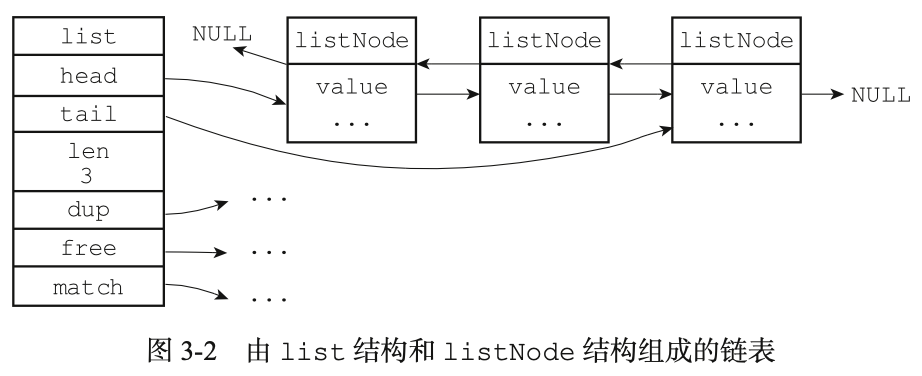

list 结构为链表提供了表头指针 head、表尾指针 tail，以及链表长度计数器 len， 而 dup、free 和 match 成员则是用于实现多态链表所需的类型特定函数:

- dup 函数用于复制链表节点所保存的值
- free 函数用于释放链表节点所保存的值;

- match 函数则用于对比链表节点所保存的值和另一个输入值是否相等。

Redis 的链表实现的特性可以总结如下:

- 双端：链表节点带有 prev 和 next 指针，获取某个节点的前置节点和后置节点的 复杂度都是 *O*(1)。

- 无环：表头节点的 prev 指针和表尾节点的 next 指针都指向 NULL，对链表的访 问以 NULL 为终点。

- 带表头指针和表尾指针：通过 list 结构的 head 指针和 tail 指针，程序获取链 表的表头节点和表尾节点的复杂度为 *O*(1)。
- 带链表长度计数器：程序使用 list 结构的 len 属性来对 list 持有的链表节点进 行计数，程序获取链表中节点数量的复杂度为 *O*(1)。
- 多态：链表节点使用 void* 指针来保存节点值，并且可以通过 list 结构的 dup、 free、match 三个属性为节点值设置类型特定函数，所以链表可以用于保存各种不 同类型的值。

### 1.3 字典 dict

字典，又称为符号表(symbol table)、关联数组(associative array)或映射(map)，是用于保存键值对(key-value pair) 的抽象数据结构。字典在Redis中的应用相当广泛，比如：

- Redis的数据库就是使用字典来作为底层实现
- 对数据库的增、删、查、改操作也是构建在对字典的操作之上的
- 字典还是哈希键的底层实现之一，当一个哈希键包含的键值对比较多，又或者键值对中的元素都是比较长的字符串时，Redis就会使用字典作为哈希键的底层实现

#### 1.3.1 字典实现

哈希结构体：

```c
typedef struct dictht {
     // 哈希表数组
     dictEntry **table;
     // 哈希表大小
     unsigned long size;
     //哈希表大小掩码，用于计算索引值
     //总是等于size-1
     unsigned long sizemask;
     // 该哈希表已有节点的数量
     unsigned long used;
} dictht; 
```

哈希节点结构体：

```c
typedef struct dictEntry {
    //键
    void *key;
    //值
    union{
        void *val;
        uint64_tu64;
        int64_ts64;
    } v;
    //指向下个哈希表节点，形成链表，解决hash冲突
    struct dictEntry *next;
} dictEntry; 
```

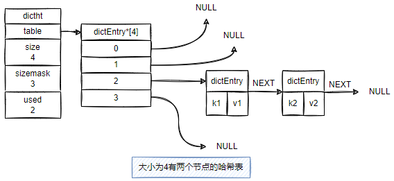

字典结构体：

```c
typedef struct dict {
     // 类型特定函数
     dictType *type;
     // 私有数据
     void *privdata;
     // 哈希表
     dictht ht[2];
     // rehash索引
     //当rehash不在进行时，值为-1
     in trehashidx;
} dict; 
```

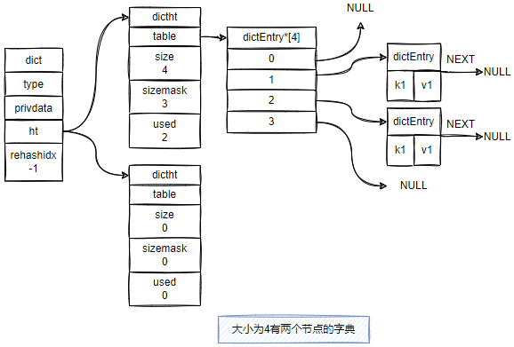

#### 1.3.2 哈希算法

当要将一个新的键值对添加到字典里面时，需要先根据键计算出哈希值和索引值，然后根据索引值，将包含新键值对的哈希表节点放到哈希表数组的指定索引上面。计算哈希和索引方法如下：

1. 使用字典设置的哈希函数，计算键key的哈希值
2. 使用哈希表的sizemask属性和哈希值

#### 1.3.3 解决键冲突

当有两个或以上数量的键被分配到了哈希表数组的同一个索引上面时，我们称这些键发生了冲突（collision）。
Redis的哈希表使用链地址法（separate chaining）来解决键冲 突，每个哈希表节点都有一个next指针，多个哈希表节点可以用next指针构成一个单向链表，被分配到同一个索引上的多个节点可以用这个单向链表连接起来，这就解决了键冲突的问题。 

#### 1.3.4 rehash

随着操作的不断执行，哈希表保存的键值对会逐渐地增多或者减 少，为了让哈希表的负载因子（load factor）维持在一个合理的范围 之内，当哈希表保存的键值对数量太多或者太少时，程序需要对哈希表的大小进行相应的扩展或者收缩。扩展和收缩哈希表的工作可以通过执行rehash（重新散列）操作来完成，Redis对字典的哈希表执行rehash的步骤如下：

1. 为字典的ht[1]哈希表分配空间，这个哈希表的空间大小取决于要执行的操作，以及ht[0]当前包含的键值对数量：如果执行的是扩展操作，那么ht[1]的大小为第一个大于等于ht[0].used*2的2^n；如果执行的是收缩操作，那么ht[1]的大小为第一个大于等于ht[0].used的2^n
2. 将保存在ht[0]中的所有键值对rehash到ht[1]上面：rehash指 的是重新计算键的哈希值和索引值，然后将键值对放置到ht[1]哈希表的指定位置上。
3. 当ht[0]包含的所有键值对都迁移到了ht[1]之后（ht[0]变为空表），释放ht[0]，将ht[1]设置为ht[0]，并在ht[1]新创建一个空白哈希表，为下一次rehash做准备。

#### 1.3.5 渐进式rehash

扩展或收缩哈希表需要将ht[0]里面的所有键值对rehash到ht[1]里面，但是，这个rehash动作并不是一次性、集中式地完成的，而是分多次、渐进式地完成的。

这样做的原因在于，如果一次性将这些键值对全部rehash到ht[1]的话，庞大的计算量可能会导致服务器在一段时间内停止服务。

以下是哈希表渐进式rehash的详细步骤：

1. 为ht[1]分配空间，让字典同时持有ht[0]和ht[1]两个哈希表
2. 在字典中维持一个索引计数器变量rehashidx，并将它的值设置为0，表示rehash工作正式开始
3. 在rehash进行期间，每次对字典执行添加、删除、查找或者更 新操作时，程序除了执行指定的操作以外，还会顺带将ht[0]哈希表在rehashidx索引上的所有键值对rehash到ht[1]，当rehash工作完成之后，程序将rehashidx属性的值增一
4. 随着字典操作的不断执行，最终在某个时间点上，ht[0]的所 有键值对都会被rehash至ht[1]，这时程序将rehashidx属性的值设为-1，表示rehash操作已完成

### 1.4 跳表 skiplist

跳跃表（skiplist）是一种有序数据结构，它通过在每个节点中维持多个指向其他节点的指针，从而达到快速访问节点的目的。

跳跃表支持平均O（logN）、最坏O（N）复杂度的节点查找，还可以通过顺序性操作来批量处理节点。在大部分情况下，跳跃表的效率可以和平衡树相媲美，并且因为跳跃表的实现比平衡树要来得更为简单，所以有不少程序都使用跳跃表来代替平衡树。

Redis只在两个地方用到了跳跃表：

- 实现有序集合键

- 在集群节点中用作内部数据结构

#### 1.4.1 跳表实现

跳表结构体：

```c
typedef struct zskiplist {
    //表头节点和表尾节点
    structz skiplistNode *header, *tail;
    //表中节点的数量
    unsigned long length;
    //表中层数最大的节点的层数
    int level;
} zskiplist;
```

跳表节点结构体：

```c
typedef struct zskiplistNode {
    //层
    struct zskiplistLevel {
        //前进指针
        struct zskiplistNode *forward;
        //跨度
        unsigned int span;
    } level[];
    //后退指针
    struct zskiplistNode *backward;
    //分值
    double score;
    //成员对象
    robj *obj;
} zskiplistNode;
```

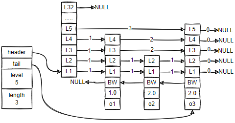

#### 1.4.2 跳表结构体字段

**1.层**

跳跃表节点的level数组可以包含多个元素，每个元素都包含一个指向其他节点的指针，程序可以通过这些层来加快访问其他节点的速度，一般来说，层的数量越多，访问其他节点的速度就越快。

每次创建一个新跳跃表节点的时候，程序都根据幂次定律(power law，越大的数出现的概率越小)随机生成一个介于1和32之间的值作 为level数组的大小，这个大小就是层的“高度”。

**2.前进指针**

每个层都有一个指向表尾方向的前进指针，用于从表头向表尾方向访问节点。如上图跳跃表所示，遍历跳跃表中所有节点的路径:

1. 迭代程序首先访问跳跃表的第一个节点(表头)，然后从第四层的前进指针移动到表中的第二个节点。 
2. 在第二个节点时，程序沿着第二层的前进指针移动到表中的第三个节点。
3. 在第三个节点时，程序同样沿着第二层的前进指针移动到表中的第四个节点。
4. 当程序再次沿着第四个节点的前进指针移动时，它碰到一个NULL，程序知道这时已经到达了跳跃表的表尾，于是结束这次遍历。

**3.跨度**

层的跨度(level[i].span属性)用于记录两个节点之间的距离:两个节点之间的跨度越大，它们相距得就越远。指向NULL的所有前进指针的跨度都为0，因为它们没有连向任何节点。

**4.后退指针**

节点的后退指针(backward属性)用于从表尾向表头方向访问节 点:跟可以一次跳过多个节点的前进指针不同，因为每个节点只有一 个后退指针，所以每次只能后退至前一个节点。

图5-6用虚线展示了如果从表尾向表头遍历跳跃表中的所有节点: 程序首先通过跳跃表的tail指针访问表尾节点，然后通过后退指针访 问倒数第二个节点，之后再沿着后退指针访问倒数第三个节点，再之后遇到指向NULL的后退指针，于是访问结束。

**5.分值和成员**

节点的分值(score属性)是一个double类型的浮点数，跳跃表中的所有节点都按分值从小到大来排序。节点的成员对象(obj属性)是一个指针，它指向一个字符串对象，而字符串对象则保存着一个SDS值。

在同一个跳跃表中，各个节点保存的成员对象必须是唯一的，但是多个节点保存的分值却可以是相同的:分值相同的节点将按照成员 对象在字典序中的大小来进行排序，成员对象较小的节点会排在前面 (靠近表头的方向)，而成员对象较大的节点则会排在后面(靠近表尾的方向)。 

### 1.5 整数集合

整数集合(intset)是Redis用于保存整数值的集合抽象数据结构，它可以保存类型为int16_t、int32_t或者int64_t的整数值，并且保证集合中不会出现重复元素。 

整数集合(intset)是集合键的底层实现之一，当一个集合只包含整数值元素，并且这个集合的元素数量不多时，Redis就会使用整数集合作为集合键的底层实现。 

#### 1.5.1 整数集合实现

```c
typedef struct intset {
    //编码方式
    uint32_t encoding;
    //集合包含的元素数量
    uint32_t length;
    //升序保存元素的数组
    int8_t contents[];
} intset;
```

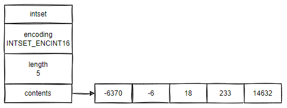

- 如果encoding属性的值为INTSET_ENC_INT16，那么contents就 是一个int16_t类型的数组，数组里的每个项都是一个int16_t类型的 整数值(最小值为-32768，最大值为32767)
- 如果encoding属性的值为INTSET_ENC_INT32，那么contents就 是一个int32_t类型的数组，数组里的每个项都是一个int32_t类型的 整数值(最小值为-2147483648，最大值为2147483647)
- 如果encoding属性的值为INTSET_ENC_INT64，那么contents就 是一个int64_t类型的数组，数组里的每个项都是一个int64_t类型的整数值(最小值为-9223372036854775808，最大值为9223372036854775807)

#### 1.5.2 升级

每当我们要将一个新元素添加到整数集合里面，并且新元素的类 型比整数集合现有所有元素的类型都要长时，整数集合需要先进行升级(upgrade)，然后才能将新元素添加到整数集合里面，升级整数集合并添加新元素共分为三步进行：

1. 根据新元素的类型，扩展整数集合底层数组的空间大小，并为新元素分配空间
2. 将底层数组现有的所有元素都转换成与新元素相同的类型，并将类型转换后的元素放置到正确的位上，而且在放置元素的过程中，需要继续维持底层数组的有序性质不变
3. 将新元素添加到底层数组里面

#### 1.5.3 升级的优点

 **1. 提升灵活性**

因为C语言是静态类型语言，为了避免类型错误，我们通常不会将两种不同类型的值放在同一个数据结构里面。
但是，因为整数集合可以通过自动升级底层数组来适应新元素， 所以我们可以随意地将int16_t、int32_t或者int64_t类型的整数添加到集合中，而不必担心出现类型错误，这种做法非常灵活。

**2. 节约内存**

整数集合现在的做法既可以让集合能同时保存三种不同类型的值，又可以确保升级操作只会在有需要的时候进行，这可以尽量节省内存。 

### 1.6 压缩列表

压缩列表(ziplist)是列表键和哈希键的底层实现之一：

- 当一个列表键只包含少量列表项，并且每个列表项要么就是小整数值，要么就是长度比较短的字符串，那么就使用压缩列表来做列表键的底层实现
- 当一个哈希键只包含少量键值对，比且每个键值对的键和值要么就是小整数值，要么就是长度比较短的字符串，那么就会使用压缩列表来做哈希键的底层实现

#### 1.6.1 压缩列表的实现

压缩列表是Redis为了节约内存而开发的，是由一系列特殊编码的连续内存块组成的顺序型(sequential)数据结构。一个压缩列表可以包含任意多个节点(entry)，每个节点可以保存一个字节数组或者一个整数值。 

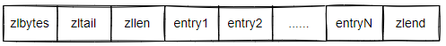

#### 1.6.2 压缩列表结构体字段

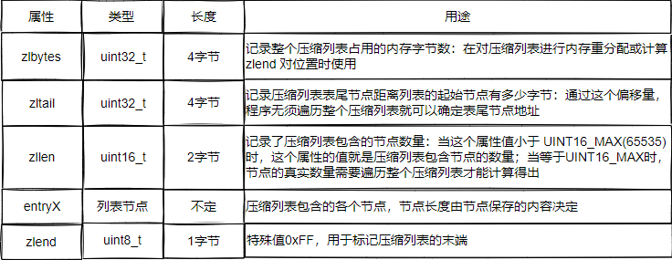

## 2. 常用对象

### 2.1 概述

1. Redis的命令有上百个，如果纯靠死记硬背比较困难，但是如果理解Redis的一些机制，会发现这些命令有很强的通用性。
2. Redis不是万金油，有些数据结构和命令 必须在特定场景下使用，一旦使用不当可能对Redis本身或者应用本身造成 致命伤害。

#### 2.1.1 全局命令

Redis有5种数据结构，它们是键值对中的值，对于键来说有一些通用的命令。

```shell
# 数据库相关命令
127.0.0.1:6379> select 3 //切换到3号数据库
OK
127.0.0.1:6379> flushdb //清空数据库
OK
127.0.0.1:6379[3]> DBSIZE //查看当前数据库键总数
(integer) 0

# 键相关命令
127.0.0.1:6379> keys * //查看所有数据库键
1) "name"
127.0.0.1:6379> exists key  // 查看键是否存在 键存在则返回1，不存在则返回0
(integer) 1
127.0.0.1:6379> del key [key ...]  // 删除键 成功返回1 键不存在返回0
(integer) 1
127.0.0.1:6379> type a  // 查看键类型
string
127.0.0.1:6379> object encoding key  // 查看键 
"embstr"

# 键过期时间相关命令
127.0.0.1:6379> expire key seconds  // 给键设置过期时间
(integer) 1
127.0.0.1:6379> ttl key  // 查看键过期时间 大于等于0-键剩余的过期时间 1-键没设置过期时间 2-键不存在
(integer) 7
```

#### 2.1.2 数据结构和内部编码

type命令实际返回的就是当前键的数据结构类型，它们分别是: 

- string(字符串)

- hash(哈希)

- list(列表)

- set(集合)

- zset(有序集合)

但这些只是Redis对外的数据结构，实际上每种数据结构都有自己底层的内部编码实现，而且是多种实现

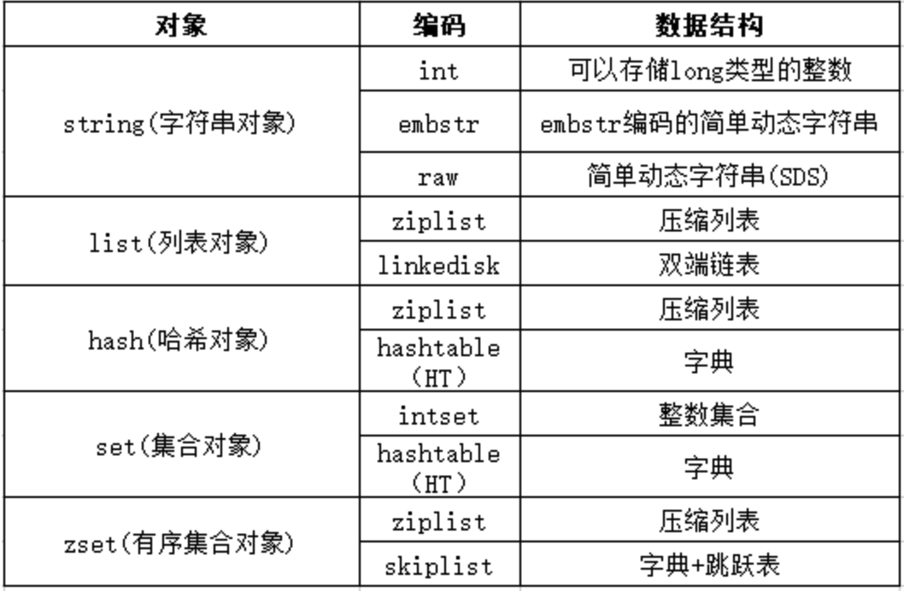

Redis这样设计有两个好处：

1. 可以改进内部编码，而对外的数据 结构和命令没有影响，这样一旦开发出更优秀的内部编码，无需改动外部数 据结构和命令，例如Redis3.2 提供了quicklist，结合了ziplist和linkedlist两者的优势，为列表类型提供了一种更为优秀的内部编码实现，而对外部用户来 说基本感知不到。

2. 多种内部编码实现可以在不同场景下发挥各自的优 势，例如ziplist比较节省内存，但是在列表元素比较多的情况下，性能会有所下降，这时候Redis会根据配置选项将列表类型的内部实现转换为linkedlist。

#### 2.1.3 单线程架构

Redis使用了单线程架构和I/O多路复用模型来实现高性能的内存数据库服务。

1. **单线程模型**

Redis客户端与服务端的模型可以简化成图2-3，每次客户端调用都经历 了发送命令、执行命令、返回结果三个过程。

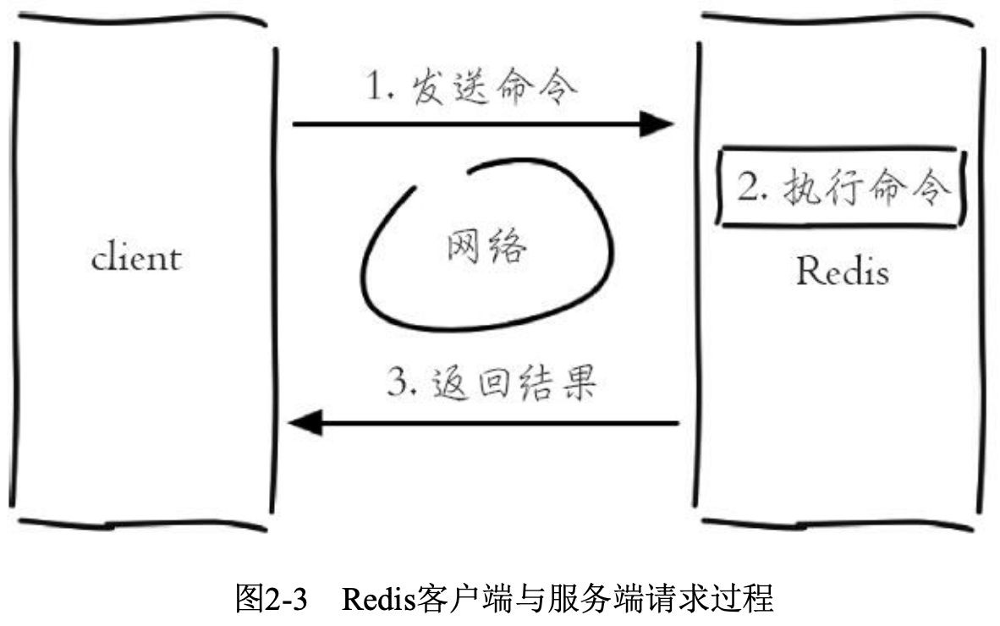

Redis是单线程来处理命令的，所以一 条命令从客户端达到服务端不会立刻被执行，所有命令都会进入一个队列中，然后逐个被执行。这就 是Redis单线程的基本模型。但是像发送命令、返回结果、命令排队肯定不像描述的这么简单，**Redis使用了I/O多路复用技术来解决I/O的问题**。

2. **为什么单线程还能这么快**

为什么Redis使用单线程模型会达到每秒万级别的处理能力呢？可以将其归结为三点：

- 纯内存访问，Redis将所有数据放在内存中，内存的响应时长大 约为100纳秒，这是Redis达到每秒万级别访问的重要基础

- 非阻塞I/O，Redis使用epoll作为I/O多路复用技术的实现，再加上 Redis自身的事件处理模型将epoll中的连接、读写、关闭都转换为事件，不在网络I/O上浪费过多的时间，如下图所示

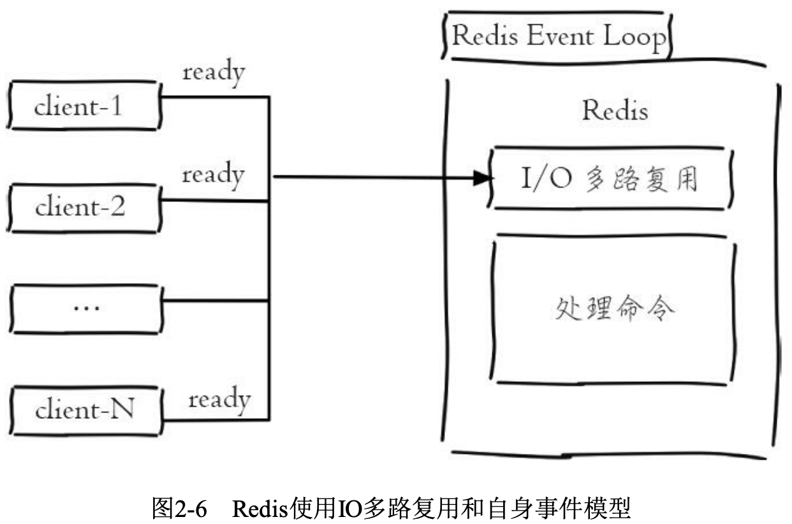

- 单线程避免了线程切换和竞态产生的消耗

单线程的优点：

- 单线程可以简化数据结构和算法的实现。如果对高级编程语言熟悉的读者应该了解并发数据结构实现不但困难而且开发测试比较麻烦
- 单线程避免了线程切换和竞态产生的消耗，对于服务端开发来说，锁和线程切换通常是性能杀手

单线程的缺点：

- 对于每个命令的执行时间是有要求的。如果某个命令执行过长，会造成其他命令的阻塞，对于Redis这种高性能的服务 来说是致命的，所以Redis是面向快速执行场景的数据库

### 2.2 字符串

字符串类型是Redis最基础的数据结构。键都是字符串类型，而且 其他几种数据结构都是在字符串类型基础上构建的。值最大不能 超过512MB。

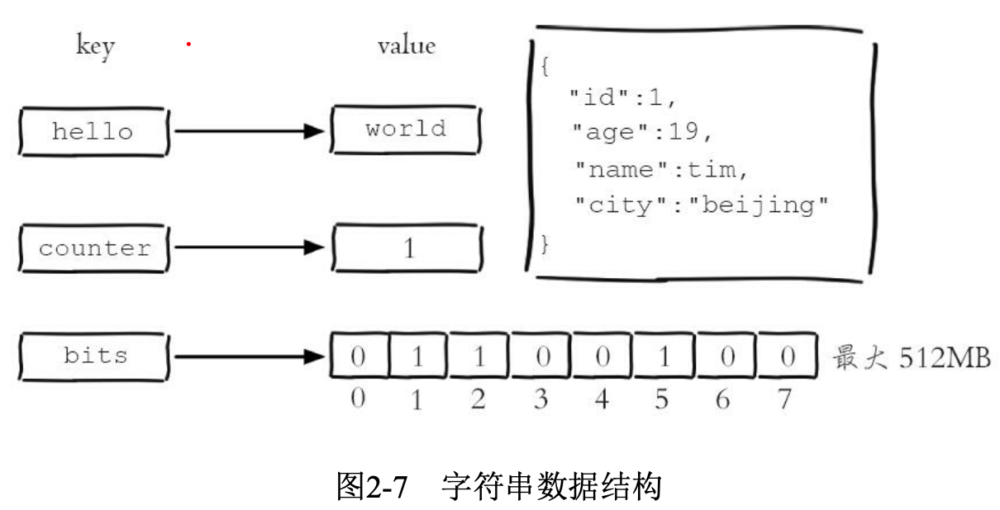

#### 2.2.1 命令

1. **常用命令**

```shell
# 设置值 set
# set key value [ex seconds] [px milliseconds] [nx|xx]
# set命令有几个选项:
# ex seconds:为键设置秒级过期时间
# px milliseconds:为键设置毫秒级过期时间
# nx:键必须不存在，才可以设置成功，用于添加; xx:与nx相反，键必须存在，才可以设置成功，用于更新。
127.0.0.1:6379> set key value
OK

# 设置值 setex/setnx 和ex、nx作用一致
# setex key seconds value 
# setnx key value 因为redis单线程 可以用作分布式锁
127.0.0.1:6379> setnx key value # 0-失败 1-成功
(integer) 0

# 批量设置值
# mset key value [key value ...]
127.0.0.1:6379> mset key1 value1 key2 value2 key3 value3
OK

# 获取值 get
# get key
127.0.0.1:6379> get key # 不存在则返回 nil
"value"

# 批量获取值
# mget key [key ...]
127.0.0.1:6379> mget key1 key2
1) "1"
2) "2"

# 计数
# incr key
# 值不是整数，返回错误
# 值是整数，返回自增后的结果
# 键不存在，按照值为0自增，返回结果为1
127.0.0.1:6379> exists key 
(integer) 0 
127.0.0.1:6379> incr key 
(integer) 1
# 除了incr命令，Redis提供了decr(自减)、incrby(自增指定数字)、 decrby(自减指定数字)、incrbyfloat(自增浮点数)
# decr key
# incrby key increment 
# decrby key decrement 
# incrbyfloat key increment
```

2. **不常用命令**

```shell
# 追加值 向字符串尾部追加值
# append key value
127.0.0.1:6379> get key
"redis"
127.0.0.1:6379> append key world 
(integer) 10
127.0.0.1:6379> get key 
"redisworld"

# 获取字符串长度 中文占3个字节
# strlen key
strlen key
127.0.0.1:6379> get key 
"redisworld" 
127.0.0.1:6379> strlen key 
(integer) 10

# 设置并返回原值
# getset key value
127.0.0.1:6379> getset hello world 
(nil)
127.0.0.1:6379> getset hello redis 
"world"

# 获取部分字符串
# getrange key start end
127.0.0.1:6379> getrange key 0 4
"redis"
```

#### 2.2.2 内部编码

字符串类型的内部编码有3种：

- int：8个字节的长整型

- embstr：小于等于39个字节的字符串

- raw：大于39个字节的字符串

Redis会根据当前值的类型和长度决定使用哪种内部编码实现。

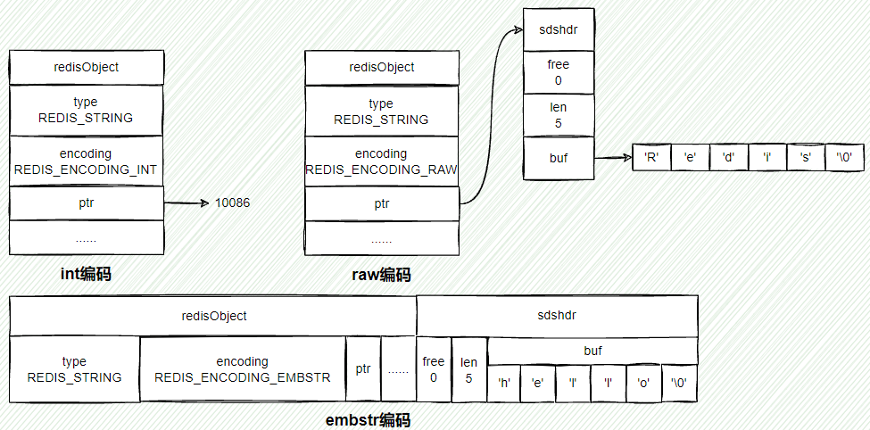

```shell
# 整数类型
127.0.0.1:6379> set key 8653
OK
127.0.0.1:6379> object encoding key 
"int"

# 小于等于39个字节的字符串:embstr 
127.0.0.1:6379> set key "hello,world" 
OK
127.0.0.1:6379> object encoding key 
"embstr"


#大于39个字节的字符串:raw
127.0.0.1:6379> set key "one string greater than 39 byte........." 
OK
127.0.0.1:6379> object encoding key
"raw"
127.0.0.1:6379> strlen key
(integer) 40
```

#### 2.2.3 经典使用场景

1. **缓存功能**

比较典型的缓存使用场景，其中Redis作为缓存层，MySQL作 为存储层，绝大部分请求的数据都是从Redis中获取。由于Redis具有支撑高 并发的特性，所以缓存通常能起到加速读写和降低后端压力的作用。

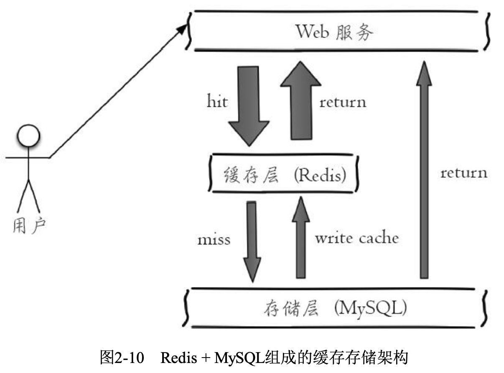

设计合理的键名，有 利于防止键冲突和项目的可维护性，比较推荐的方式是使用 “业务名-对象名-id[属性]” 作为键名。可以在能描 述键含义的前提下适当减少键的长度，从而减少由于键过长的内存浪费。

2. **计数**

许多应用都会使用Redis作为计数的基础工具，它可以实现快速计数、 查询缓存的功能，同时数据可以异步落地到其他数据源。

```java
// 视频播放数就会自增1
long incrVideoCounter(long id) { 
  key = "video:playCount:" + id; 
  return redis.incr(key);
}
```

3. **共享Session**

一个分布式Web服务将用户的Session信息(例如用户登录信息)保存在各自服务器中，这样会造成一个问题，出于负载均衡的考虑，分布式服务会将用户的访问均衡到不同服务器上，用户刷新一次访问可能会发现需要重新登录，这个问题是用户无法容忍的。

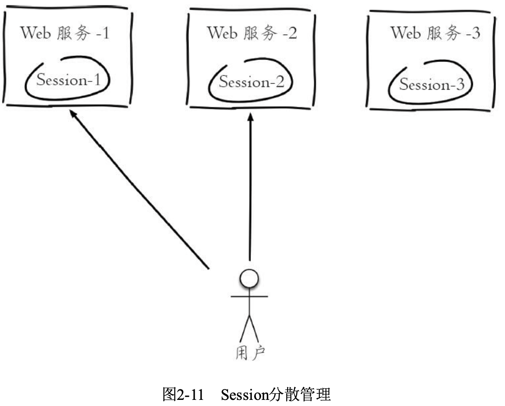

为了解决这个问题，可以使用Redis将用户的Session进行集中管理，如下图所示，在这种模式下只要保证Redis是高可用和扩展性的，每次用户更新或者查询登录信息都直接从Redis中集中获取。

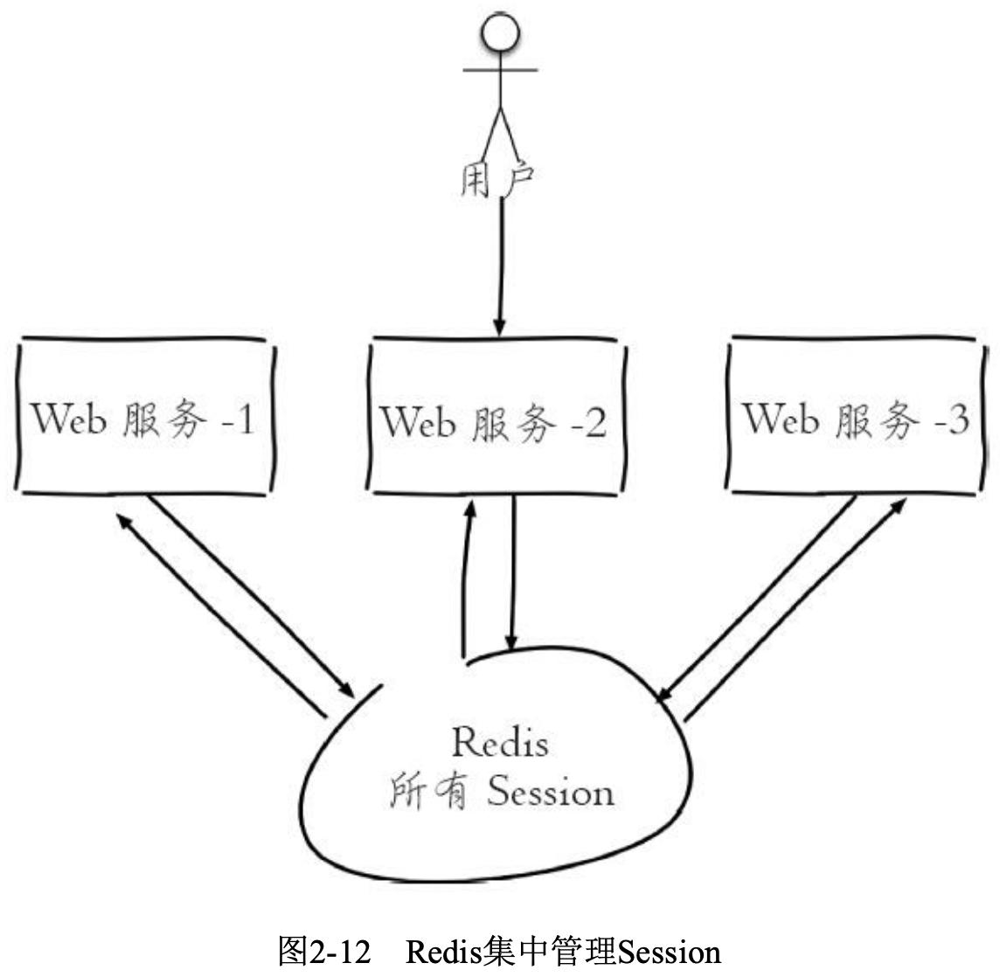

4. **限速**

很多应用出于安全的考虑，会在每次进行登录时，让用户输入手机验证 码，从而确定是否是用户本人。但是为了短信接口不被频繁访问，会限制用 户每分钟获取验证码的频率。此功能可以使用Redis来实现。

```java
phoneNum = "138xxxxxxxx";
key = "shortMsg:limit:" + phoneNum;
// SET key value EX 60 NX
isExists = redis.set(key,1,"EX 60","NX"); 
if(isExists != null || redis.incr(key) <=5){
	// 通过 
}else{
	// 限速 
}
```

上述就是利用Redis实现了限速功能，例如一些网站限制一个IP地址不能在一秒钟之内访问超过n次也可以采用类似的思路。

### 2.3 哈希 hash

在Redis中，哈希类型是指键值本身又是一个键值对结构，形如value={{field1，value1}，...{fieldN，valueN}}。

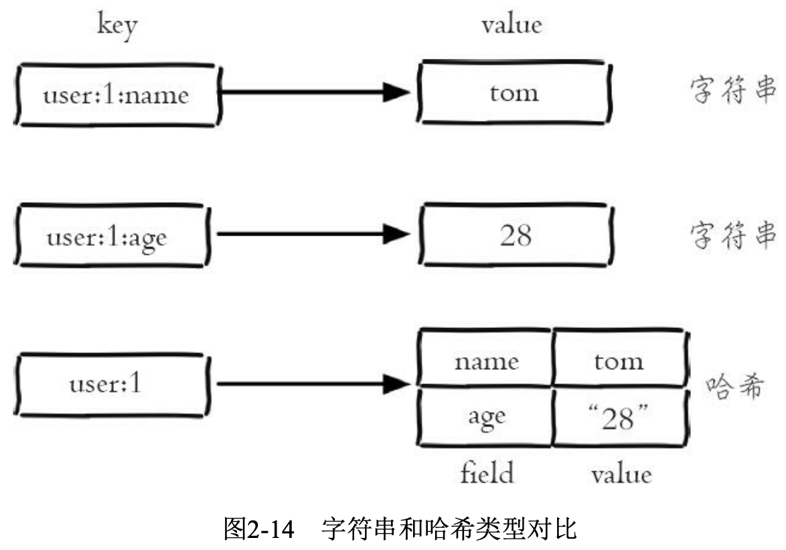

#### 2.3.1 命令

```shell
# 设置值 hset
# hset key field value
127.0.0.1:6379> hset key field value
(integer) 1

# 获取值 hget
# hget key field
127.0.0.1:6379> hget key field  # 不存在返回 nil
"tom"

# 删除值 hdel
# hdel key field [field ...]
127.0.0.1:6379> hdel key field
(integer) 1
127.0.0.1:6379> hdel key field
(integer) 0

# 计算field数量 hlen
# hlen key
127.0.0.1:6379> hlen key
(integer) 3

# 批量设置或获取field-value hmset hmget
# hmset key field value [field value ...]
127.0.0.1:6379> hmset key field1 value1 field2 value2
# hmget key field [field ...]
127.0.0.1:6379> hmget key field1 field2
1) "value1"
2) "value2"

# 判断field是否存在 hexists
# hexists key field
127.0.0.1:6379> hexists key field  # 存在返回1 不存在返回0
(integer) 1

# 获取所有field hkeys
# hkeys key
127.0.0.1:6379> hkeys key
1) "field1"
2) "field2"

# 获取所有value hvals
# hvals key
127.0.0.1:6379> hvals key
1) "value1"
2) "value2"

# 获取所有field-value hgetall
# hgetall key
127.0.0.1:6379> hgetall key
1) "field1"
2) "value1"
3) "field2"
4) "value2"
```

#### 2.3.2 内部编码

哈希类型的内部编码有两种：

- ziplist(压缩列表)

  **当哈希类型元素个数小于 hash-max-ziplist-entries 配置(默认512个)、同时所有值都小于hash-max-ziplist-value配置(默认64 字节)时，**Redis会使用ziplist作为哈希的内部实现，ziplist使用更加紧凑的结构实现多个元素的连续存储，所以在节省内存方面比hashtable更加优秀。

- hashtable(哈希表)

  当哈希类型无法满足ziplist的条件时，Redis会使用hashtable作为哈希的内部实现，因为此时ziplist的读写效率会下降，而hashtable的读写时间复杂度为O(1)。

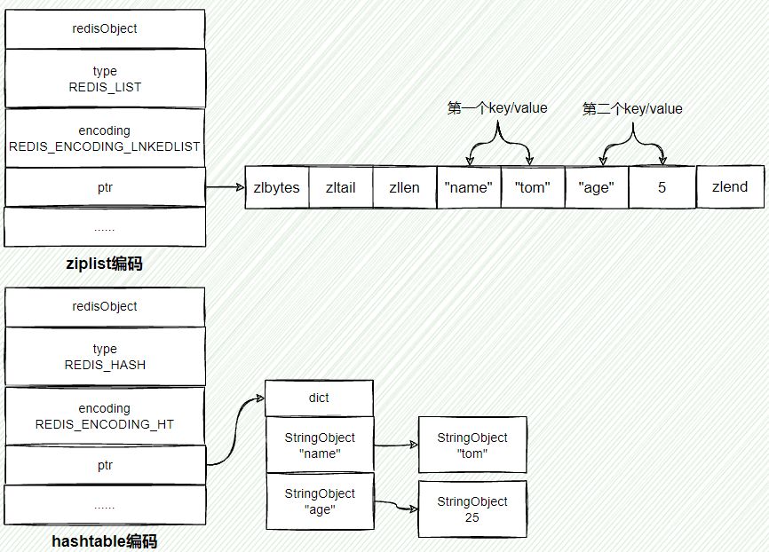

 **编码转换**

当哈希对象可以同时满足以下两个条件时，哈希对象使用ziplist编码：

- 哈希对象保存的所有键值对的键和值的字符串长度都小于64字节

- 哈希对象保存的键值对数量小于512个

不能满足这两个条件的哈希对象需要使用hashtable编码 

```shell
# 内部编码为ziplist
127.0.0.1:6379> hmset hashkey f1 v1 f2 v2 
OK
127.0.0.1:6379> object encoding hashkey 
"ziplist"

# 当有value大于64字节，内部编码会由ziplist变为hashtable
127.0.0.1:6379> hset hashkey f3 "one string is bigger than 64 byte......" 
OK
127.0.0.1:6379> object encoding hashkey
"hashtable"

# 当field个数超过512，内部编码也会由ziplist变为hashtable
127.0.0.1:6379> hmset hashkey f1 v1 f2 v2 f3 v3 ...... f513 v513
OK
127.0.0.1:6379> object encoding hashkey 
"hashtable"
```

#### 2.3.3 使用场景

关系型数据表记录的两条用户信息，用户的属性作为表的列，每条用户信息作为行。 如果将其用哈希类型存储在更新操作上会更加便捷。可以将每个用户的id定义为键后缀，多对field- value对应每个用户的属性。

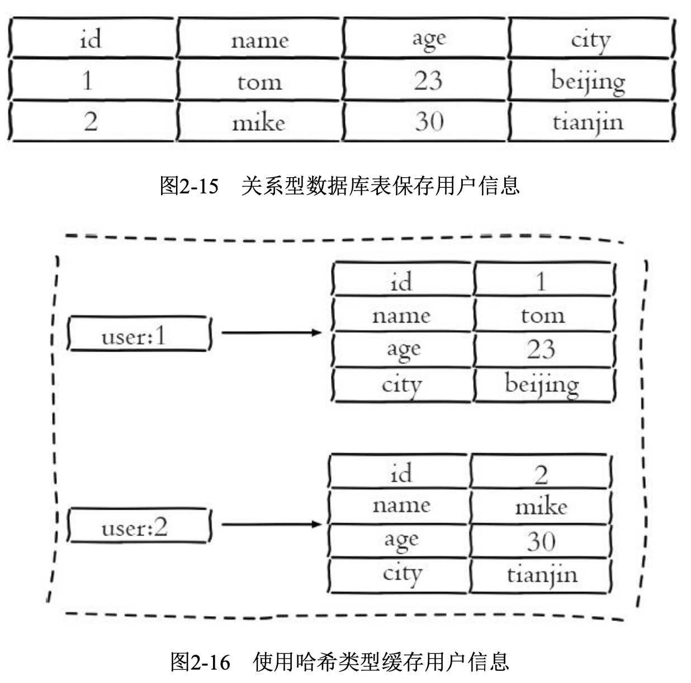

需要注意的是哈希类型和关系型数据库有两点不同之处：

- 哈希类型是稀疏的，而关系型数据库是完全结构化的，例如哈希类型每个键可以有不同的field，而关系型数据库一旦添加新的列，所有行都要为其设置值(即使为NULL)

- 关系型数据库可以做复杂的关系查询，而Redis去模拟关系型复杂查询开发困难，维护成本高

常用的缓存用户信息的三种方法如下：

1. 原生字符串类型：每个属性一个键

```shell
set user:1:name tom
set user:1:age 23
set user:1:city beijing
```

 - 优点：简单直观，每个属性都支持更新操作
 - 缺点：占用过多的键，内存占用量较大，同时用户信息内聚性比较差

2. 序列化字符串类型：将用户信息序列化后用一个键保存

```shell
set user:1 serialize(userInfo)
```

- 优点：简化编程，如果合理的使用序列化可以提高内存的使用效率

- 缺点：序列化和反序列化有一定的开销，同时每次更新属性都需要把全部数据取出进行反序列化，更新后再序列化到Redis中。

3. 哈希类型：每个用户属性使用一对field-value，但是只用一个键保存

```shell
hmset user:1 name tom age 23 city beijing
```

- 优点：简单直观，如果使用合理可以减少内存空间的使用

- 缺点：要控制哈希在ziplist和hashtable两种内部编码的转换，hashtable会消耗更多内存

### 2.4 列表

列表(list)类型是用来存储多个有序的字符串。在Redis中，可 以对列表两端插入(push)和弹出(pop)，还可以获取指定范围的元素列 表、获取指定索引下标的元素等。列表是一种比 较灵活的数据结构，它可以充当栈和队列的角色，在实际开发上有很多应用场景。

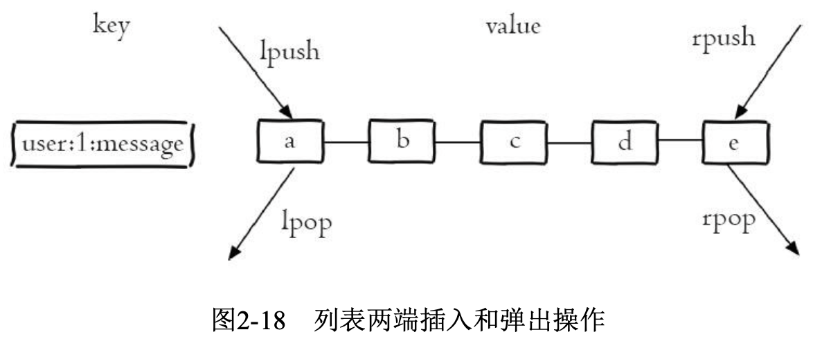

列表类型有两个特点：

1. 列表中的元素是有序的，这就意味着可以通过索引下标获取某个元素或者某个范围内的元素列表

2. 第二、列表中的元素可以是重复的

#### 2.4.1 命令

```shell
# 从左边插入数据 rpush
# rpush key value [value ...]
127.0.0. 1:6379> rpush listkey a b c
(integer) 3
# 从右边插入数据 lpush
# lpush key value [value ...]
127.0.0. 1:6379> lpush listkey a b c
# 向某个元素前/后插入元素 linsert
# linsert key before|after pivot value
127.0.0.1:6379> linsert listkey before b insert # a insert b c
(integer) 4

# 获取范围内元素 lrange
# lrange key start end
127.0.0.1:6379> lrange listkey 1 3 
1) "insert"
2) "b"
3) "c"
# 获取指定下标元素 lindex
# lindex key index
127.0.0.1:6379> lindex listkey -1 # 获取最后一个元素
"c"
# 获取链表长度 llen
# llen key
127.0.0.1:6379> llen listkey
(integer) 4

# 从链表左侧弹出元素 lpop
# lpop key
127.0.0.1:6379>t lpop listkey
"a"
127.0.0.1:6379> lrange listkey 0 -1 
1) "insert"
2) "b" 
3) "c"
# 从列表右侧弹出 rpop
# rpop key
127.0.0.1:6379>t rpop listkey
"c"
127.0.0.1:6379> lrange listkey 0 -1 
1) "insert"
2) "b" 
# 删除指定元素 lrem
# lrem key count value
# count>0，从左到右，删除最多count个元素
# count<0，从右到左，删除最多count绝对值个元素
# count=0，删除所有
127.0.0.1:6379> lrem listkey 4 a # 从列表左边开始删除4个为a的元素
(integer) 4
# 按照范围截取链表 ltrim
# ltrim key start end
127.0.0.1:6379> ltrim listkey 1 3 # 保留第2～4个元素
OK

# 修改指定元素
# lset key index newValue
127.0.0.1:6379> lset listkey 2 update 
OK
127.0.0.1:6379> lrange listkey 0 -1 
1) "insert"
2) "b"
3) "update"

# 阻塞操作
# blpop key [key ...] timeout 
# brpop key [key ...] timeout
# key[key...]:多个列表的键。
# timeout:阻塞时间(单位:秒)
```

#### 2.4.2 内部编码

列表类型的内部编码有两种：

- ziplist(压缩列表)

  当列表的**元素个数小于list-max-ziplist-entries配置 (默认512个)，同时列表中每个元素的值都小于list-max-ziplist-value配置时 (默认64字节)，**Redis会选用ziplist来作为列表的内部实现来减少内存的使用

- linkedlist(链表)

  当列表类型无法满足ziplist的条件时，Redis会使用 linkedlist作为列表的内部实现

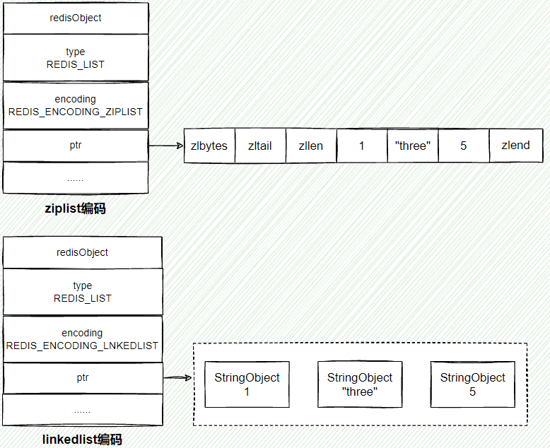

 **编码转换条件** 

当列表对象可以同时满足以下两个条件时，列表对象使用ziplist编码：

- 列表对象保存的所有字符串元素的长度都小于64字节
- 列表对象保存的元素数量小于512个；不能满足这两个条件的列表对象需要使用linkedlist编码

```shell
# 当元素个数较少且没有大元素时，内部编码为ziplist
127.0.0.1:6379> rpush listkey e1 e2 e3 
(integer) 3
127.0.0.1:6379> object encoding listkey 
"ziplist"

# 当元素个数超过512个，内部编码变为linkedlist
127.0.0.1:6379> rpush listkey e4 e5 ...... e512 e513 
(integer) 513
127.0.0.1:6379> object encoding listkey
"linkedlist"

# 或者当某个元素超过64字节，内部编码也会变为linkedlist
127.0.0.1:6379> rpush listkey "one string is bigger than 64 byte......."
(integer) 1
127.0.0.1:6379> object encoding listkey
"linkedlist"
```

#### 2.4.3 使用场景

1. **消息队列**

Redis的lpush+brpop命令组合即可实现阻塞队列，生产者客户端使用lrpush从列表左侧插入元素，多个消费者客户端使用brpop命令阻塞式的“抢”列表尾部的元素，多个客户端保证了消费的负载均衡和高可用性。

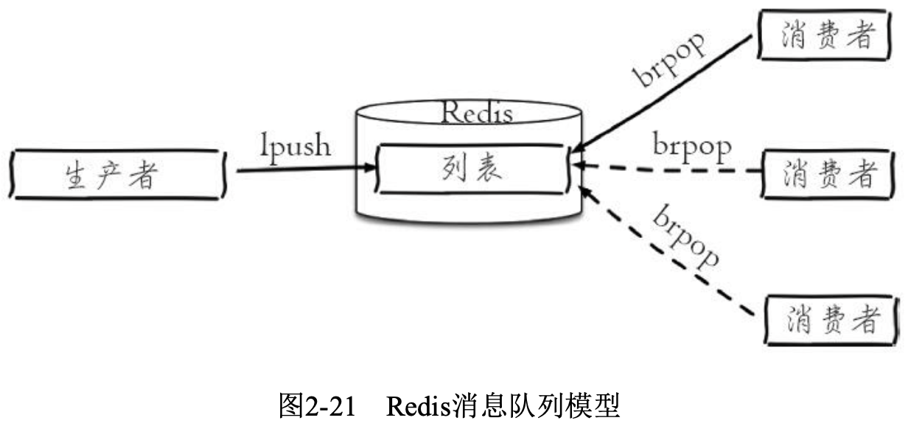

2. **文章列表**

每个用户有属于自己的文章列表，现需要分页展示文章列表。此时可以考虑使用列表，因为列表不但是有序的，同时支持按照索引范围获取元素。

- 每篇文章使用哈希结构存储，例如每篇文章有3个属性title、timestamp、content

```shell
hmset acticle:1 title xx timestamp 1476536196 content xxxx ...
```

- 向用户文章列表添加文章，user:{id}:articles作为用户文章列表的键，值为哈希存储文章的key

```shell
lpush user:1:acticles article:1 article:3 ...
lpush user:k:acticles article:5...
```

- 分页获取用户文章列表，例如下面伪代码获取用户id=1的前10篇文章

```shell
articles = lrange user:1:articles 0 9 
for article in {articles}
hgetall {article}
```

**lpush+lpop=Stack(栈)** 

**lpush+rpop=Queue(队列)** 

**lpsh+ltrim=Capped Collection(有限集合)** 

**lpush+brpop=Message Queue(消息队列)**

### 2.5 集合 set

集合(set)类型也是用来保存多个的字符串元素，但和列表类型不一 样的是，集合中不允许有重复元素，并且集合中的元素是无序的，不能通过索引下标获取元素。一个集合最多可以存储232-1个元 素。Redis除了支持集合内的增删改查，同时还支持多个集合取交集、并集、差集。

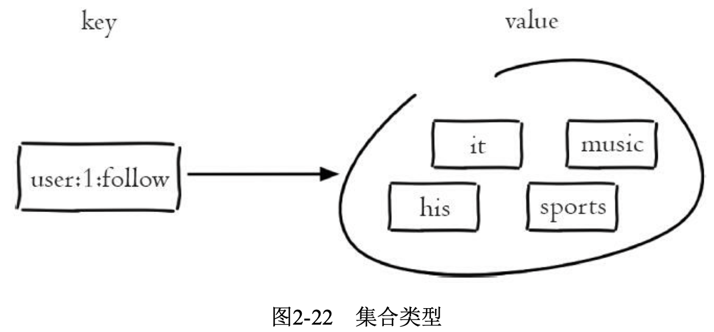

#### 2.5.1 命令

```shell
# 添加元素 返回结果为添加成功的元素个数 sadd
# sadd key element [element ...]
127.0.0.1:6379> exists myset 
(integer) 0
127.0.0.1:6379> sadd myset a b c 
(integer) 3
127.0.0.1:6379> sadd myset a b 
(integer) 0

# 删除元素 返回结果为成功删除元素个数 srem
# srem key element [element ...]
127.0.0.1:6379> srem myset a b 
(integer) 2
127.0.0.1:6379> srem myset delete 
(integer) 0

# 计算元素数量 scard
# scard key
127.0.0.1:6379> scard myset 
(integer) 1

# 判断元素是否在集合中 sismember
# sismember key element
127.0.0.1:6379> sismember myset c
(integer) 1

# 随机从集合中返回指定数量个元素 srandmember
# 仅返回 srandmember key [count] 不指定count 则为1
# 返回并删除 spop key [count] 不指定count 则为1
127.0.0.1:6379> srandmember set 2 
1) "a"
2) "c"
127.0.0.1:6379> srandmember myset "d"

# 求多集合交集 sinter key [key ...]
# 求多集合并集 suinon key [key ...]
# 求多集合差集 sdiff key [key ...]
```

#### 2.5.2 内部编码

集合类型的内部编码有两种：

- intset(整数集合)

  当集合中的**元素都是整数且元素个数小于set-max- intset-entries配置(默认512个)时，Redis会选用intset来作为集合的内部实 现**，从而减少内存的使用

- hashtable(哈希表)

  当集合类型无法满足intset的条件时，Redis会使 用hashtable作为集合的内部实现

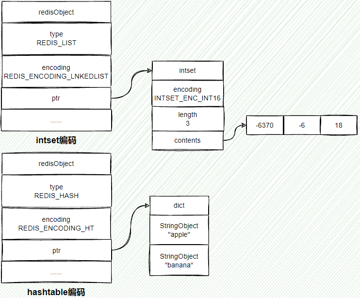

 **编码的转换** 

当集合对象可以同时满足以下两个条件时，对象使用intset编码：

- 集合对象保存的所有元素都是整数值集合

- 对象保存的元素数量不超过512个

不能满足这两个条件的集合对象需要使用hashtable编码。 

```shell
# 当元素个数较少且都为整数时，内部编码为intset
127.0.0.1:6379> sadd setkey 1 2 3 4 
(integer) 4
127.0.0.1:6379> object encoding setkey 
"intset"

# 当元素个数超过512个，内部编码变为hashtable
127.0.0.1:6379> sadd setkey 1 2 3 4 5 6 ... 512 513 
(integer) 513
127.0.0.1:6379> scard setkey
(integer) 513
127.0.0.1:6379> object encoding listkey 
"hashtable"

# 当某个元素不为整数时，内部编码也会变为hashtable
127.0.0.1:6379> sadd setkey a 
(integer) 1
127.0.0.1:6379> object encoding setkey 
"hashtable"
```

#### 2.5.3 使用场景

集合类型比较典型的使用场景是标签(tag)。例如一个用户可能对娱 乐、体育比较感兴趣，另一个用户可能对历史、新闻比较感兴趣，这些兴趣 点就是标签。有了这些数据就可以得到喜欢同一个标签的人，以及用户的共 同喜好的标签，这些数据对于用户体验以及增强用户黏度比较重要。例如一个电子商务的网站会对不同标签的用户做不同类型的推荐，比如对数码产品 比较感兴趣的人，在各个页面或者通过邮件的形式给他们推荐最新的数码产品，通常会为网站带来更多的利益。

### 2.6 有序集合 zset

它保留了集合不能有重复成员的特性， 但不同的是，有序集合中的元素可以排序，它给每个元素设置一个分数(score)作为排序的依据。如下图所示：

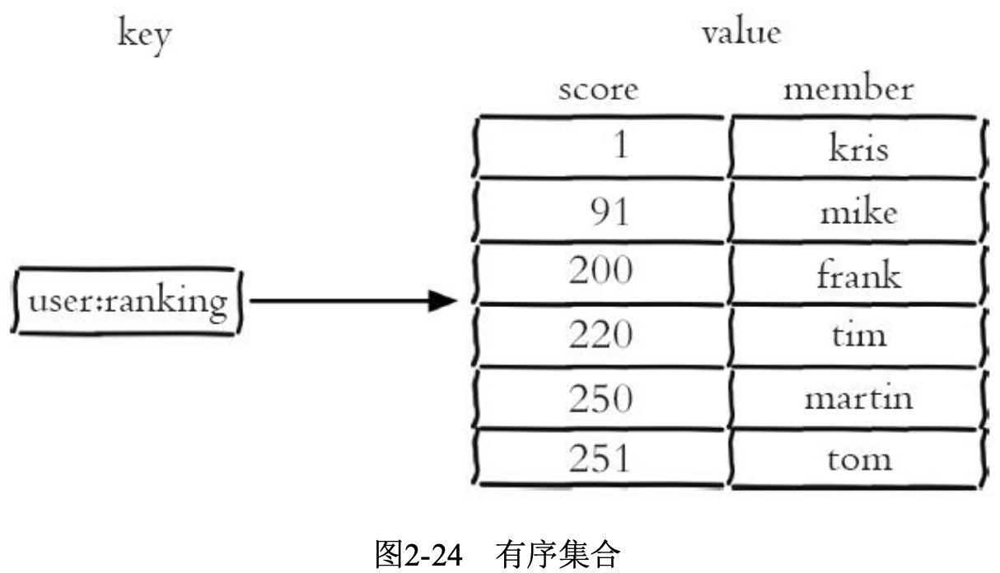

有序集合中的元素不能重复，但是score可以重复，下表给出了列表、集合、有序集合三者的异同点：

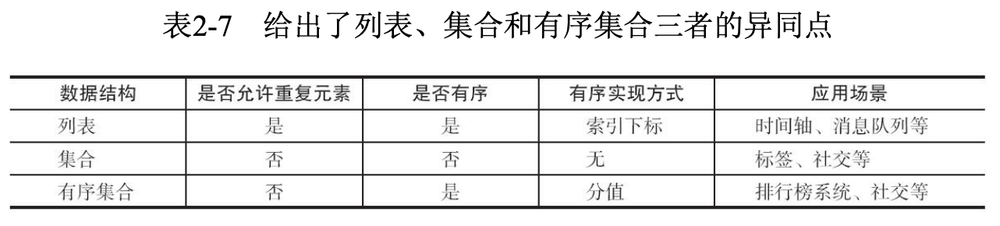

#### 2.6.1 命令

```shell
# 添加元素 zadd
# zadd key score member [score member ...]
127.0.0.1:6379> zadd key 251 value
(integer) 1

# 获取成员个数 zcard
# zcard key
127.0.0.1:6379> zcard key
(integer) 5

# 获取元素分数 zscore
# zscore key member
127.0.0.1:6379> zscore key value 
"251"

# 计算成员的排名
# 升序 zrank key member
# 降序 zrevrank key member

# 删除元素 zrem
# zrem key member [member ...]
127.0.0.1:6379> zrem key value
(integer) 1

# 增加成员的分数 zincrby
# zincrby key increment member
127.0.0.1:6379> zincrby key 9 value  # 增加9分
"260"

# 返回指定分数排名元素
# zrange key [start end] [withscores]
# zrevrange key [start end] [withscores]

# 返回指定分数内元素
# zrangebyscore key min max [withscores] [limit offset count]
# zrevrangebyscore key max min [withscores] [limit offset count]

# 交集
# zinterstore destination numkeys key [key ...] [weights weight [weight ...]] [aggregate sum|min|max]
# destination:交集计算结果保存到这个键
# numkeys:需要做交集计算键的个数
# key[key...]:需要做交集计算的键
# weights weight[weight...]:每个键的权重，在做交集计算时，每个键中的每个member会将自己分数乘以这个权重，每个键的权重默认是1
# aggregate sum|min|max:计算成员交集后，分值可以按照sum(和)、 min(最小值)、max(最大值)做汇总，默认值是sum

# 并集
# zunionstore destination numkeys key [key ...] [weights weight [weight ...]] [aggregate sum|min|max]
```

#### 2.6.2 内部编码

有序集合的编码可以是ziplist或者skiplist：

- ziplist编码的压缩列表对象使用压缩列表作为底层实现，每个集合元素使用两个紧挨在一起的压缩列表节点来保存，第一个节点保存元素的成员（member），而第二个元素则保存元素的分值（score）。压缩列表内的集合元素按分值从小到大进行排序，分值较小的元素被放置在靠近表头的方向，而分值较大的元素则被放置在靠近表尾的方向
- skiplist编码的有序集合对象使用zset结构作为底层实现，一个zset结构同时包含一个字典和一个跳跃表

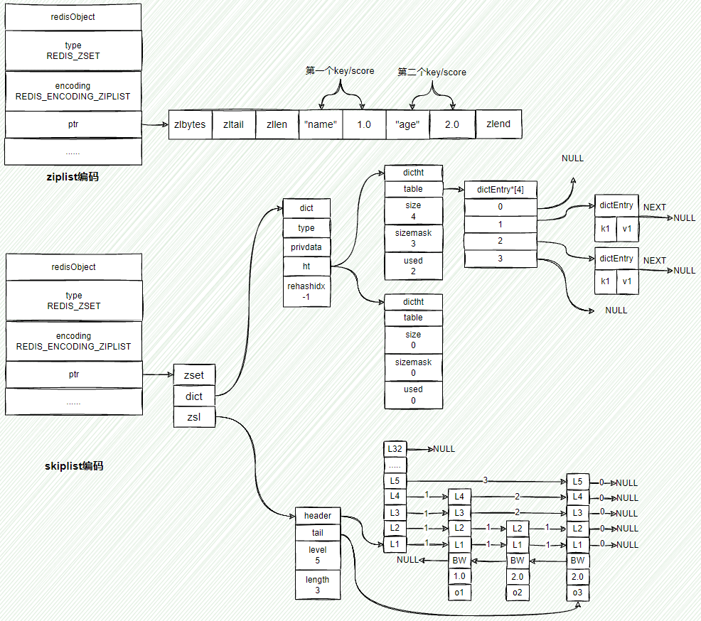

当有序集合对象可以同时满足以下两个条件时，对象使用ziplist编码：

- 有序集合保存的元素数量小于128个
- 有序集合保存的所有元素成员的长度都小于64字节

不能满足以上两个条件的有序集合对象将使用skiplist编码

```shell
# 当元素个数较少且每个元素较小时，内部编码为skiplist
127.0.0.1:6379> zadd zsetkey 50 e1 60 e2 30 e3 
(integer) 3
127.0.0.1:6379> object encoding zsetkey 
"ziplist"

# 当元素个数超过128个，内部编码变为ziplist
127.0.0.1:6379> zadd zsetkey 50 e1 60 e2 30 e3 12 e4 ...... 84 e129 
(integer) 129
127.0.0.1:6379> object encoding zsetkey
"skiplist"

# 当某个元素大于64字节时，内部编码也会变为hashtable
127.0.0.1:6379> zadd zsetkey 20 "one string is bigger than 64 byte............. ..................."
(integer) 1
127.0.0.1:6379> object encoding zsetkey
"skiplist"
```

#### 2.6.3 使用场景

有序集合比较典型的使用场景就是**排行榜系统**。例如视频网站需要对用 户上传的视频做排行榜，榜单的维度可能是多个方面的：按照时间、按照播放数量、按照获得的赞数。

## 3. 持久化

### 3.1 键过期时间

通过EXPIRE命令或者PEXPIRE命令，客户端可以以秒或者毫秒精度为数据库中的某个键设置生存时间(Time To Live，TTL)，在经过指定的秒数或者毫秒数之后，服务器就会自动删除生存时间为0的键:

```shell
redis> SET key value
OK
redis> EXPIRE key 5
(integer) 1
redis> GET key  // 5秒之内
"value"
redis> GET key // 5 秒之后
(nil)
```

#### 1. 设置过期时间

- EXPIRE<key><ttl>：用于将键key的生存时间设置为ttl秒

- PEXPIRE<key><ttl>：用于将键key的生存时间设置为ttl毫秒

- EXPIREAT<key><timestamp>：用于将键key的过期时间设置为 timestamp所指定的秒数时间戳

- PEXPIREAT<key><timestamp>：用于将键key的过期时间设置 为timestamp所指定的毫秒数时间戳

#### 2. 保存过期时间

redisDb结构的expires字典保存了数据库中所有键的过期时间， 我们称这个字典为过期字典:

- 过期字典的键是一个指针，这个指针指向键空间中的某个键对象(也即是某个数据库键)

- 过期字典的值是一个long long类型的整数，这个整数保存了键所指向的数据库键的毫秒精度的UNIX时间戳💺过期时间

#### 3. 过期键删除策略

Redis 提供了三种不同的过期键删除策略：

1. 定时删除：在设置键的过期时间的同时，创建一个定时器 (timer)，让定时器在键的过期时间来临时，立即执行对键的删除操作。

- **优点：**

  内存最友好：通过使用定时器，定时删除策 略可以保证过期键会尽可能快地被删除，并释放过期键所占用的内存。

- **缺点：**

  CPU时间最不友好：在过期键比较多的情况下，删除过期键这一行为可能会占用相当一部 分CPU时间，在内存不紧张但是CPU时间非常紧张的情况下，将CPU时间用在删除和当前任务无关的过期键上，无疑会对服务器的响应时间和吞吐量造成影响。

2. 惰性删除：放任键过期不管，但是每次从键空间中获取键时， 都检查取得的键是否过期，如果过期的话，就删除该键；如果没有过期，就返回该键。

- **优点**

  CPU时间最友好：程序只会在取出键时才 对键进行过期检查，这可以保证删除过期键的操作只会在非做不可的情况下进行，并且删除的目标仅限于当前处理的键，这个策略不会在删除其他无关的过期键上花费任何CPU时间。

- **缺点**

  内存最不友好：如果一个键已经过期，而这个键又仍然保留在数据库中，那么只要这个过期键不被删除，它所占用的内存就不会释放。

3. 定期删除：每隔一段时间，程序就对数据库进行一次检查，删除里面的过期键。至于要删除多少过期键，以及要检查多少个数据库，则由算法决定。

   **定期删除策略是前两种策略的一种整合和折中：**

- 定期删除策略每隔一段时间执行一次删除过期键操作，并通过限制删除操作执行的时长和频率来减少删除操作对CPU时间的影响。

- 通过定期删除过期键，定期删除策略有效地减少了因为过期键而带来的内存浪费。

  **定期删除策略的难点是确定删除操作执行的时长和频率：**

- 如果删除操作执行得太频繁，或者执行的时间太长，定期删除策略就会退化成定时删除策略，以至于将CPU时间过多地消耗在删除过 期键上面

- 如果删除操作执行得太少，或者执行的时间太短，定期删除策略会和惰性删除策略一样，出现浪费内存的情况

#### 4. Redis的过期键删除策略

Redis服务器实际使用的是惰性删除和定期删除两种策略：通过配合使用这两种删除策略，服务器可以很好地在合理使用CPU 时间和避免浪费内存空间之间取得平衡。

**惰性删除策略的实现**

过期键的惰性删除策略由db.c/expireIfNeeded函数实现：

所有读写数据库的Redis命令在执行之前都会调用expireIfNeeded函数对输入键进行检查:

- 如果输入键已经过期，那么expireIfNeeded函数将输入键从数据库中删除

- 如果输入键未过期，那么expireIfNeeded函数不做动作

**定期删除策略的实现**

过期键的定期删除策略由redis.c/activeExpireCycle函数实现：

每当Redis的服务器周期性操作redis.c/serverCron函数执行时， activeExpireCycle函数就会被调用，它在规定的时间内，分多次遍历服务器中的各个数据库，从数据库的expires字典中随机检查一部分键 的过期时间，并删除其中的过期键。

### 3.2 RDB持久化

RDB持久化既可以手动执行，也可以根据服务器配置选项定期执 行，该功能可以将某个时间点上的数据库状态保存到一个RDB文件中。

RDB持久化功能所生成的RDB文件是一个经过压缩的二进制文件， 通过该文件可以还原生成RDB文件时的数据库状态。

#### 3.2.1 RDB文件的创建和载入

**创建**

有两个Redis命令可以用于生成RDB文件：

- SAVE：SAVE命令会阻塞Redis服务器进程，直到RDB文件创建完毕为止， 在服务器进程阻塞期间，服务器不能处理任何命令请求。
- BGSAVE：BGSAVE命令会派生 出一个子进程，然后由子进程负责创建RDB文件，服务器进程(父进程)继续处理命令请求。

因为AOF文件的更新频率通常比RDB文件的更 新频率高，所以:

- 如果服务器开启了AOF持久化功能，那么服务器会优先使用AOF 文件来还原数据库状态。

- 只有在AOF持久化功能处于关闭状态时，服务器才会使用RDB文 件来还原数据库状态。

**载入**

服务器在载入RDB文件期间，会一直处于阻塞状态，直到载入工作完成为止。

#### 3.2.2 自动间隔性保存

Redis允许用户通过设置服务器配置的save选项，让服务器每隔一段时间自动执行一次BGSAVE命令。

如果向服务器提供以下配置：

```
save 900 1
save 300 10
save 60 10000
```

只要满足以下三个条件中的任意一个，BGSAVE命令就会被执行：

- 服务器在900秒之内，对数据库进行了至少1次修改。

- 服务器在300秒之内，对数据库进行了至少10次修改。

- 服务器在60秒之内，对数据库进行了至少10000次修改。

服务器程序会根据save选项所设置的保存条件，设置服务器状态redisServer结构的saveparams属性。

除了saveparams数组之外，服务器状态还维持着一个dirty计数 器，以及一个lastsave属性:

- dirty计数器记录距离上一次成功执行SAVE命令或者BGSAVE命令 之后，服务器对数据库状态(服务器中的所有数据库)进行了多少次 修改(包括写入、删除、更新等操作)

- lastsave属性是一个UNIX时间戳，记录了服务器上一次成功执 行SAVE命令或者BGSAVE命令的时间

### 3.3 AOF持久化

Redis还提供了AOF(Append Only File)持久化功能。与RDB持久化通过保存数据库中的键值对来记录数据库状态不同，AOF持久化是通过保存Redis服务器所执行的写命令来记录数据库状态。

#### 3.3.1 AOF持久化的实现

AOF持久化功能的实现可以分为命令追加(append)、文件写入、 文件同步(sync)三个步骤。

1. **命令追加**

当AOF持久化功能处于打开状态时，服务器在执行完一个写命令之 后，会以协议格式将被执行的写命令追加到服务器状态的aof_buf缓冲区的末尾。

2. **AOF文件的写入与同步**

Redis的服务器进程就是一个事件循环(loop)，这个循环中的文件事件负责接收客户端的命令请求，以及向客户端发送命令回复，而时间事件则负责执行像serverCron函数这样需要定时运行的函数。

因为服务器在处理文件事件时可能会执行写命令，使得一些内容被追加到aof_buf缓冲区里面，所以在服务器每次结束一个事件循环之前，它都会调用flushAppendOnlyFile函数，考虑是否需要将aof_buf 缓冲区中的内容写入保存到AOF文件里面，flushAppendOnlyFile函数的行为由服务器配置的**appendfsync**选项的值来决定，各个不同值产生不同的行为：

- always：将 aof_buf 缓冲区的所有内容写入并同步到AOF文件

  服务器在每个事件循环都要将aof_buf缓冲区中的所有内容写入到AOF文件，并且同步AOF文件，所以always的效率是appendfsync选项三个值当中最慢的一个，但从安全性来说，always也是最安全的，因为即使出现故障 停机，AOF持久化也只会丢失一个事件循环中所产生的命令数据。

- everysec：将 aof_buf 缓冲区中所有内容写入到 AOF 文件，如果距离上次同步AOF文件时间超过一秒，则再次进行同步

  服务器在每个事件循环 都要将aof_buf缓冲区中的所有内容写入到AOF文件，并且每隔一秒就要在子线程中对AOF文件进行一次同步。从效率上来讲，everysec模式足够快，并且就算出现故障停机，数据库也只丢失一秒钟的命令数据。

- no：将 aof_buf 缓冲区的所有内容写入，但并不同步到AOF文件

  服务器在每个事件循环都要将 aof_buf缓冲区中的所有内容写入到AOF文件，至于何时对AOF文件 进行同步，则由操作系统控制。该模式下的 AOF文件写入速度总是最快的，不过因为这种模式会在系统缓存中积累一段时间的写入数据，所以该模式的单次同步时长通常是三种模式中时间最长的。当出现故障停机时，使用no模式的服 务器将丢失上次同步AOF文件之后的所有写命令数据。

3. **AOF文件的载入与数据还原**

AOF文件里面包含了重建数据库状态所需的所有写命令，所以服务器只要读入并重新执行一遍AOF文件里面保存的写命令，就可以还原服务器关闭之前的数据库状态。

#### 3.3.2 AOF重写

为了解决AOF文件体积膨胀的问题，Redis提供了AOF文件重写 (rewrite)功能。通过该功能，Redis服务器可以创建一个新的AOF文件来替代现有的AOF文件，新旧两个AOF文件所保存的数据库状态相同，但新AOF文件不会包含任何浪费空间的冗余命令，所以新AOF文件 的体积通常会比旧AOF文件的体积要小得多。

1. **文件重写**

使用aof_rewrite函数可以对AOF进行重写，但是，因为这个函数会进行大量的写入操作，所以调用这个函数的线程将被长时间阻塞，因为Redis服务器使用单个线 程来处理命令请求，所以如果由服务器直接调用aof_rewrite函数的 话，那么在重写AOF文件期间，服务期将无法处理客户端发来的命令请求。

AOF文件重写并不需要对现有的AOF文件进行任何读取、分析或者写入操作，这个功能是通过读取服务器当前的数据库状态来实现的。aof_rewrite函数生成的新AOF文件只包含还原当前数据库状 态所必须的命令，所以新AOF文件不会浪费任何硬盘空间。

2. **后台重写**

Redis不希望AOF重写造成 服务器无法处理请求，所以Redis决定将AOF重写程序放到子进程里执 行，这样做可以同时达到两个目的:

- 子进程进行AOF重写期间，服务器进程(父进程)可以继续处理 命令请求

- 子进程带有服务器进程的数据副本，使用子进程而不是线程， 在避免使用锁的情况下，保证数据的安全性

使用子进程也有一个问题需要解决，因为子进程在进行AOF 重写期间，服务器进程还需要继续处理命令请求，而新的命令可能会对现有的数据库状态进行修改，所以还需要处理部分在重写期间执行的写命令请求。

为了解决这种数据不一致问题，Redis服务器设置了一个**AOF重写缓冲区**，这个缓冲区在服务器创建子进程之后开始使用，当Redis服务器执行完一个写命令之后，它会同时将这个写命令发送给AOF缓冲区和 AOF重写缓冲区

当子进程完成AOF重写工作之后，它会向父进程发送一个信号，父进程在接到该信号之后，会调用一个信号处理函数，并执行以下工作：

- 将AOF重写缓冲区中的所有内容写入到新AOF文件中，这时新 AOF文件所保存的数据库状态将和服务器当前的数据库状态一致

- 对新的AOF文件进行改名，原子地(atomic)覆盖现有的AOF文 件，完成新旧两个AOF文件的替换

## 4. 复制

在Redis中，用户可以通过执行SLAVEOF命令或者设置slaveof选 项，让一个服务器去复制(replicate)另一个服务器，我们称呼被复制的服务器为主服务器(master)，而对主服务器进行复制的服务器则被称为从服务器(slave)。

假设现在有两个Redis服务器，地址分别为127.0.0.1:6379和 127.0.0.1:12345，我们向服务器127.0.0.1:12345发送以下命令：

```shell
127.0.0.1:12345> SLAVEOF 127.0.0.1 6379
OK
```

那么服务器127.0.0.1:12345将成为127.0.0.1:6379的从服务器。进行复制中的主从服务器双方的数据库将保存相同的数据，概念上将这种现象称作“数据库状态一致”。

### 4.1 旧版复制功能

Redis的复制功能分为同步(sync)和命令传播(command propagate)两个操作:

- 同步操作用于将从服务器的数据库状态更新至主服务器当前所处的数据库状态

- 命令传播操作则用于在主服务器的数据库状态被修改，导致主从服务器的数据库状态出现不一致时，让主从服务器的数据库重新回到一致状态

#### 4.1.1 同步

当客户端向从服务器发送SLAVEOF命令，要求从服务器复制主服务器时，从服务器首先需要执行同步操作，即：将从服务器的数据库状态更新至主服务器当前所处的数据库状态。以下是SYNC命令的执行步骤：

1. 从服务器向主服务器发送SYNC命令

2. 收到SYNC命令的主服务器执行BGSAVE命令，执行两个操作：

- 在后台生成一个RDB文件
- 使用一个缓冲区记录从现在开始执行的所有写命令

3. 当主服务器的BGSAVE命令执行完毕时，主服务器会将BGSAVE命令生成的RDB文件发送给从服务器，从服务器接收并载入这个RDB文 件，将自己的数据库状态更新至主服务器执行BGSAVE命令时的数据库状态

4. 主服务器将记录在缓冲区里面的所有写命令发送给从服务器， 从服务器执行这些写命令，将自己的数据库状态更新至主服务器数据库当前所处的状态

#### 4.1.2 命令传播

每当主服务器执行客户端发送的写命令时，主服务器的数据库就有可能会被修改，并导致主从服务器状态不再一致。为了让主从服务器再次回到一致状态，主服务器需要对从服务器执行命令传播操作：主服务器会将自己执行的写命令，发送给从服务器执行，当从服务器执行了相同的写命令之后，主从服务器将再次回到一致状态。

#### 4.1.3  旧版复制功能的缺陷

在Redis中，从服务器对主服务器的复制可以分为以下两种情况:

- 初次复制

  从服务器以前没有复制过任何主服务器，或者从服务器当前要复制的主服务器和上一次复制的主服务器不同

- 断线后重复制

  处于命令传播阶段的主从服务器因为网络原因而中断了复制，但从服务器通过自动重连接重新连上了主服务器，并继续复制主服务器。

对于初次复制来说，旧版复制功能能够很好地完成任务，但对于 断线后重复制来说，旧版复制功能虽然也能让主从服务器重新回到一致状态，但因为旧版每次同步均是全量同步，所以效率却非常低。

**SYNC命令是一个非常耗费资源的操作**

每次执行SYNC命令，主从服务器需要执行以下动作:

1. 主服务器需执行BGSAVE命令来生成RDB文件，这个生成操作会耗费主服务器大量的CPU、内存和磁盘I/O资源

2. 主服务器需将自己生成的RDB文件发送给从服务器，这 个发送操作会耗费主从服务器大量的网络资源(带宽和流量)， 并对主服务器响应命令请求的时间产生影响。

3. 接收到RDB文件的从服务器需要载入主服务器发来的RDB文件，并且在载入期间，从服务器会因为阻塞而没办法处理命令请求。

### 4.2 新版复制功能

为了解决旧版复制功能在处理断线重复制情况时的低效问题， Redis从2.8版本开始，使用PSYNC命令代替SYNC命令来执行复制时的同步操作。

PSYNC命令具有两种模式：

- 完整重同步(full resynchronization)

  用于处理初次复制情况:完整重同步的执行步 骤和SYNC命令的执行步骤基本一样，它们都是通过让主服务器创建并 发送RDB文件，以及向从服务器发送保存在缓冲区里面的写命令来进行同步。

- 部分重同步(partial resynchronization)

  用于处理断线后重复制情况:当从服务器在断线后重新连接主服务器时，如果条件允许，主服务器可以将主从服务器连接断开期间执行的写命令发送给从服务器，从服务器只要接收并 执行这些写命令，就可以将数据库更新至主服务器当前所处的状态。

PSYNC命令的部分重同步模式解决了旧版复制功能在处理断线后重复制时出现的低效情况。

#### 4.2.1 部分重同步的实现

部分重同步功能由以下三个部分构成：

- 主服务器的复制偏移量(replication offset)和从服务器的 复制偏移量

- 主服务器的复制积压缓冲区(replication backlog)

- 服务器的运行ID(run ID)

1. **偏移量**

复制偏移量

执行复制的双方，主服务器和从服务器会分别维护一个复制偏移量：

- 主服务器每次向从服务器传播N个字节的数据时，就将自己的复制偏移量的值加上N

- 从服务器每次收到主服务器传播来的N个字节的数据时，就将自己的复制偏移量的值加上N

通过对比主从服务器的复制偏移量，程序可以很容易地知道主从服务器是否处于一致状态。

2. **复制积压缓冲区**

复制积压缓冲区是由主服务器维护的一个固定长度(fixed- size)先进先出(FIFO)队列，默认大小为1MB。

当主服务器进行命令传播时，它不仅会将写命令发送给所有从服 务器，还会将写命令入队到复制积压缓冲区里面，如下图所示。因此，主服务器的复制积压缓冲区里面会保存着一部分最近传播的写命令，并且复制积压缓冲区会为队列中的每个字节记录相应的复制偏移量

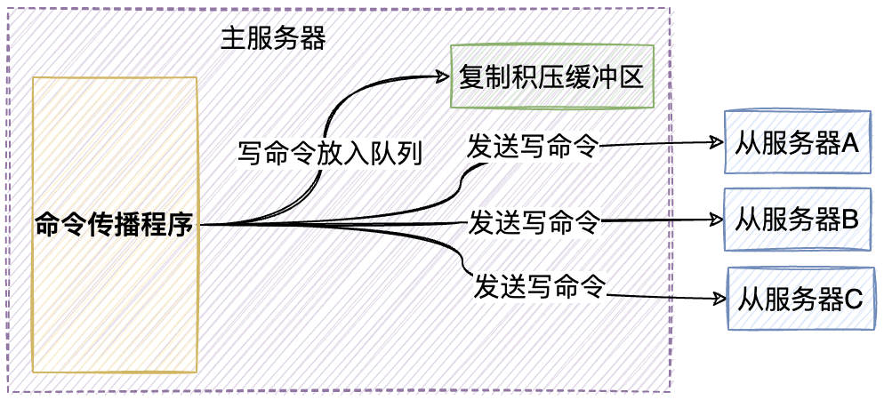

当从服务器重新连上主服务器时，从服务器会通过PSYNC命令将自己的复制偏移量offset发送给主服务器，主服务器会根据这个复制偏移量来决定对从服务器执行何种同步操作:

- 如果offset偏移量之后的数据(也即是偏移量offset+1开始的 数据)仍然存在于复制积压缓冲区里面，那么主服务器将对从服务器 执行部分重同步操作。

- 相反，如果offset偏移量之后的数据已经不存在于复制积压缓 冲区，那么主服务器将对从服务器执行完整重同步操作。

3. **服务器运行ID**

除了复制偏移量和复制积压缓冲区之外，实现部分重同步还需要用到服务器运行ID(run ID):

- 每个Redis服务器，不论主服务器还是从服务，都会有自己的运行ID。

- 运行ID在服务器启动时自动生成，由40个随机的十六进制字符组成，如53b9b28df8042fdc9ab5e3fcbbbabff1d5dce2b3。

当从服务器对主服务器进行初次复制时，主服务器会将自己的运行ID传送给从服务器，而从服务器则会将这个运行ID保存起来。当从服务器断线并重新连上一个主服务器时，从服务器将向保存的主服务器的运行ID发送给主服务器：

- 如果从服务器保存的运行ID和当前连接的主服务器的运行ID相同，那么说明从服务器断线之前复制的就是当前连接的这个主服务器，主服务器可以继续尝试执行部分重同步操作。

- 相反地，如果从服务器保存的运行ID和当前连接的主服务器的 运行ID并不相同，那么说明从服务器断线之前复制的主服务器并不是当前连接的这个主服务器，主服务器将对从服务器执行完整重同步操作。

#### 4.2.2 复制到步骤

通过向从服务器发送SLAVEOF命令，可以让一个从服务器去复制一个主服务器，步骤如下：

1. 设置主服务器的地址和端口
2. 建立套接字连接
3. 发送PING命令
4. 身份验证
5. 发送端口信息
6. 同步
7. 命令传播

#### 4.2.3 心跳检测

在命令传播阶段，从服务器默认会以每秒一次的频率，向主服务器发送命令:

```shell
REPLCONF ACK <replication_offset>
```

其中replication_offset是从服务器当前的复制偏移量。 发送REPLCONF ACK命令对于主从服务器有三个作用：

1. **检测主从服务器的网络连接状态**

   主从服务器可以通过发送和接收REPLCONF ACK命令来检查两者之间的网络连接是否正常:如果主服务器超过一秒钟没有收到从服务器发来的REPLCONF ACK命令，那么主服务器就知道主从服务器之间的连接出现问题了

2. **辅助实现min-slaves选项**

   Redis的min-slaves-to-write和min-slaves-max-lag两个选项可以防止主服务器在不安全的情况下执行写命令。如果我们向主服务器提供以下设置：

   ```shell
   min-slaves-to-write 3
   min-slaves-max-lag 10
   ```

   那么在从服务器的数量少于3个，或者三个从服务器的延迟 (lag)值都大于或等于10秒时，主服务器将拒绝执行写命令。

3. **检测命令丢失**

   如果因为网络故障，主服务器传播给从服务器的写命令在半路丢 失，那么当从服务器向主服务器发送REPLCONF ACK命令时，主服务器 将发觉从服务器当前的复制偏移量少于自己的复制偏移量，然后主服 务器就会根据从服务器提交的复制偏移量，在复制积压缓冲区里面找 到从服务器缺少的数据，并将这些数据重新发送给从服务器。

## 5. Sentinel

Sentinel(哨岗、哨兵)是Redis的高可用性(high availability)解决方案:由一个或多个Sentinel实例(instance) 组成的Sentinel系统(system)可以监视任意多个主服务器，以及这 些主服务器属下的所有从服务器，并在被监视的主服务器进入下线状态时，自动将下线主服务器属下的某个从服务器升级为新的主服务器，然后由新的主服务器代替已下线的主服务器继续处理命令请求。

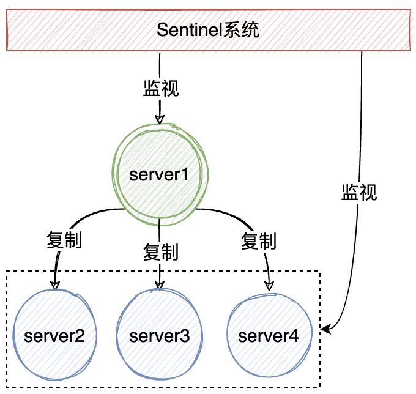

- 双环图案表示的是当前的主服务器server1

- 单环图案表示的是主服务器的三个从服务器server2、 server3以及server4
- server2、server3、server4三个从服务器正在复制主服务器 server1，Sentinel系统则在监视所有四个服务器


