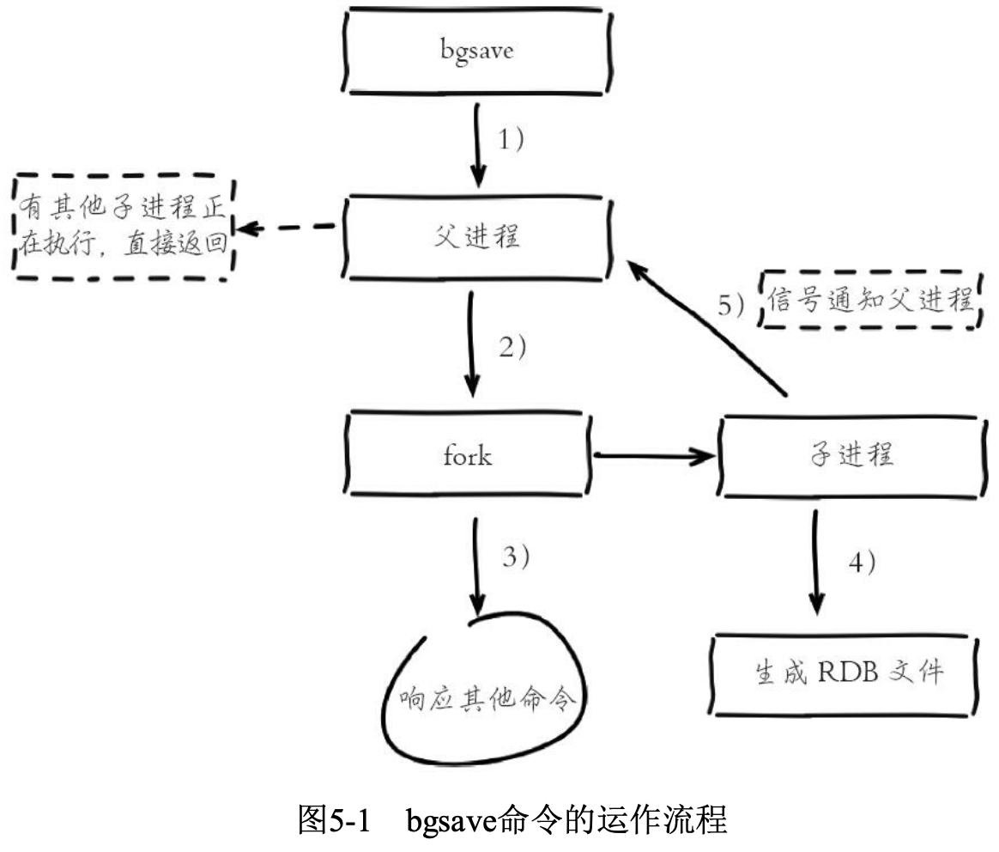
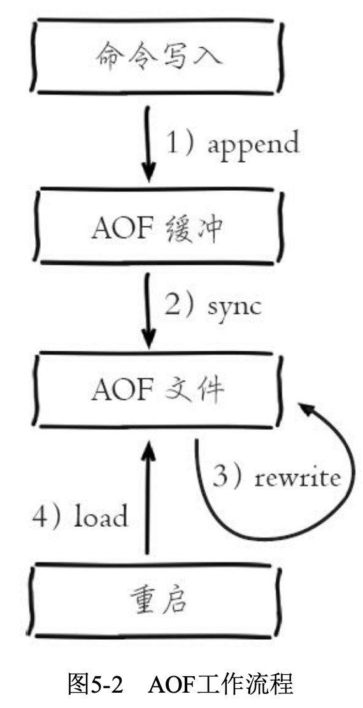
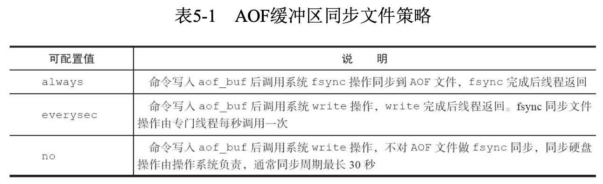
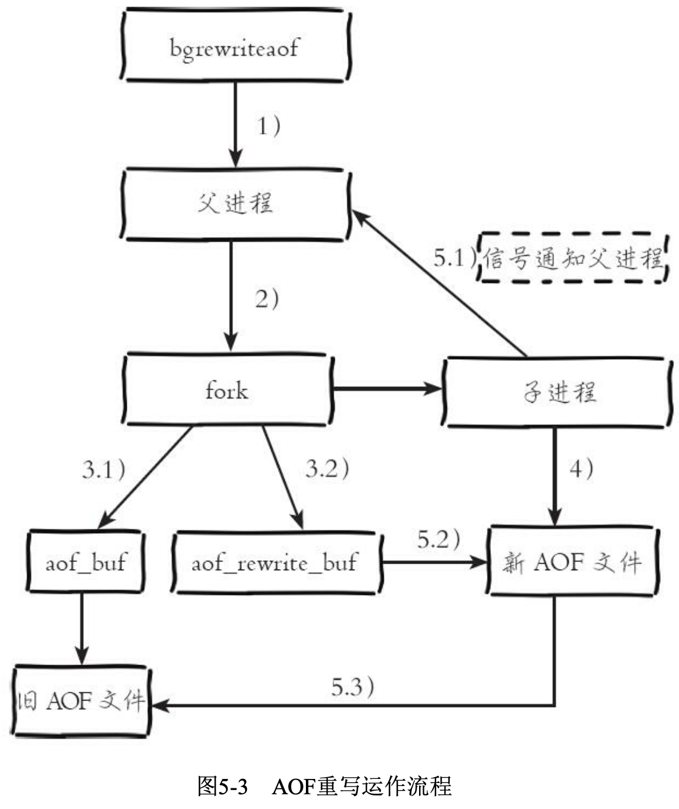
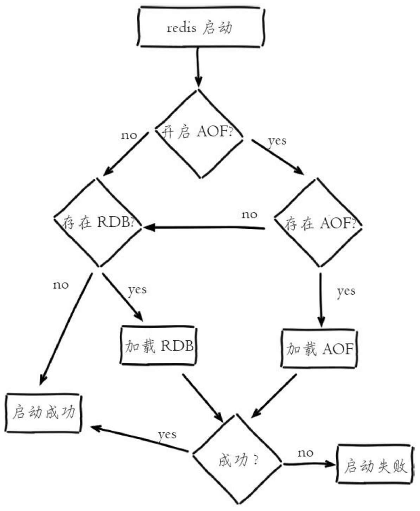

## 1. 概述

### 0.1 Redis特性

- **速度快**

  Redis执行命令的速度非常快，官方给出的数字是读写性 能可以达到10万/秒。

  Redis速度快的原因可以大致归纳为以下两点:

  1. Redis的所有数据都是存放在内存中的
  2. Redis使用了单线程架构，预防了多线程可能产生的竞争问题

- **基于键值对的数据结构服务器**

  主要提供了5种数据结 构:字符串、哈希、列表、集合、有序集合，同时在字符串的基础之上演变 出了位图(Bitmaps)和HyperLogLog两种神奇的“数据结构”，并且Redis3.2版本中加入有关GEO(地理信息定位)的数据结构 geospatial。

- **功能丰富、简单稳定**

  1. 提供了键过期功能，可以用来实现缓存
  2. 提供了发布订阅功能，可以用来实现消息系统。
  3. 支持Lua脚本功能，可以利用Lua创造出新的Redis命令。
  4. 提供了简单的事务功能，能在一定程度上保证事务特性。
  5. 提供了流水线(Pipeline)功能，这样客户端能将一批命令一次性传到 Redis，减少了网络的开销。

- **持久化**

  Redis提供了两种持久化方式:RDB和 AOF，即可以用两种策略将内存的数据保存到硬盘中。

- **主从复制**

- **高可用、分布式**

  Redis从2.8版本正式提供了高可用实现Redis Sentinel，它能够保证Redis 节点的故障发现和故障自动转移。Redis从3.0版本正式提供了分布式实现 Redis Cluster，它是Redis真正的分布式实现，提供了高可用、读写和容量的 扩展性。

### 0.2 Redis使用场景

- **缓存**

  Redis提供了 键值过期时间设置，并且也提供了灵活控制最大内存和内存溢出后的淘汰策略。

- **排行榜系统**

  Redis提供了列表 和有序集合数据结构，合理地使用这些数据结构可以很方便地构建各种排行 榜系统。

- **计数器应用**

  Redis的原子操作天然支持计数功能而且计数的性能也非常好，可以说是计数器系统的重要选择。

- **社交网络**

  赞/踩、粉丝、共同好友/喜好、推送、下拉刷新等是社交网站的必备功能，由于社交网站访问量通常比较大，而且传统的关系型数据不太适合保存 这种类型的数据，Redis提供的数据结构可以相对比较容易地实现这些功 能。

- **消息队列系统**

  消息队列系统可以说是一个大型网站的必备基础组件，因为其具有业务 解耦、非实时业务削峰等特性。Redis提供了发布订阅功能和阻塞队列的功能，虽然和专业的消息队列比还不够足够强大，但是对于一般的消息队列功 能基本可以满足。

## 1. 基本数据结构

### 1.1 简单动态字符串 SDS

Redis自己构建了一种名为简单动态字符串(simple dynamic string，SDS)的抽象类型，并将 SDS 用作 Redis 的默认字符串表示。

在 Redis 里面，C 字符串只会作为字符串字面量(string literal)用在一些无须对字符串 值进行修改的地方，比如打印日志。

当 Redis 需要的不仅仅是一个字符串字面量，而是一个可以被修改的字符串值时，Redis 就会使用 SDS 来表示字符串值，比如在 Redis 的数据库里面，包含字符串值的键值对在底层都是由 SDS 实现的。

除了用来保存数据库中的字符串值之外，SDS 还被用作缓冲区(buffer)：AOF 模块中的 AOF 缓冲区，以及客户端状态中的输入缓冲区，都是由 SDS 实现的。

#### 1.1.1 SDS 的定义

```c
struct sdshdr {
	// 记录buf数组中已使用字节的数量 
  // 等于SDS所保存字符串的长度 
  int len;
	// 记录buf数组中未使用字节的数量 
  int free;
	// 字节数组，用于保存字符串 
  char buf[];
};
```


- free 属性的值为 0，表示这个 SDS 没有分配任何未使用空间
- len 属性的值为 5，表示这个 SDS 保存了一个五字节长的字符串
- buf 属性是一个 char 类型的数组，数组的前五个字节分别保存了 'R'、'e'、'd'、'i'、's' 五个字符，最后一个字节则保存了空字符 '\0'

#### 1.1.2 SDS 与 C 字符串的区别

C 语言使用长度为 N+1 的字符数组来表示长度为 N 的字符串，并且字符数组的最后一个元素总是空字符 '\0'。

C 语言使用的这种简单的字符串表示方式，并不能满足 Redis 对字符串在安全性、效率以及功能方面的要求，接下来的内容将详细
对比 C 字符串和 SDS 之间的区别，并说明 SDS 比 C 字符串更适用于 Redis 的原因。

**1. 常数复杂度获取字符串长度**

因为 C 字符串并不记录自身的长度信息，所以为了获取一个 C 字符串的长度，程序必须遍历整个字符串，对遇到的每个字符进行计数，直到遇到代表字符串结尾的空字符为止，这个操作的复杂度为 *O*(*N*)。

SDS 在 len 属性中记录了 SDS 本身的长度，所以获取一个 SDS 长度的复杂度仅为 *O*(1)。

**2. 杜绝缓冲区溢出**

除了获取字符串长度的复杂度高之外，C 字符串不记录自身长度带来的另一个问题是容易造成缓冲区溢出(buffer overflow)。

举个例子，<string.h>/strcat函数可以将 src 字符串中的内容拼接到 dest 字符串的末尾:

```c
char *strcat(char *dest, const char *src);
```

如果执行该函数前 dest 字符串没有足够的内存保存 src 字符串，就会产生缓冲区溢出。

SDS 的空间分配策略完全杜绝了发生缓冲区溢出的可能性：当 SDS API 需要对 SDS 进行修改时，API 会先检查 SDS 的空间是否满足修改所需的要求，如果不 满足的话，API 会自动将 SDS 的空间扩展至执行修改所需的大小，然后才执行实际的修改 操作，所以使用 SDS 既不需要手动修改 SDS 的空间大小，也不会出现前面所说的缓冲区溢出问题。

**3. 减少修改字符串时带来的内存重分配次数**

因为 C 字符串并不记录自身的长度，所以对于一个包含了 N 个 字符的 C 字符串来说，这个 C 字符串的底层实现总是一个 N+1 个字符长的数组。所以每次增长或者缩短一个 C 字符串，程序都总要对保存这个 C 字符串的数组进行一次内存重分配操作:

- 如果程序执行的是增长字符串的操作，比如拼接操作(append)，那么在执行这个操 作之前，程序需要先通过内存重分配来扩展底层数组的空间大小——如果忘了这一 步就会产生缓冲区溢出。
- 如果程序执行的是缩短字符串的操作，比如截断操作(trim)，那么在执行这个操作 之后，程序需要通过内存重分配来释放字符串不再使用的那部分空间——如果忘了这一步就会产生内存泄漏。

为了避免 C 字符串的这种缺陷，**SDS 通过未使用空间解除了字符串长度和底层数组长度之间的关联：**在 SDS 结构体中，使用 free 属性记录数组里面未使用的字节。

通过未使用空间，SDS 实现了空间预分配和惰性空间释放两种优化策略。

**空间预分配**

空间预分配用于优化 SDS 的字符串增长操作：当 SDS 的 API 对一个 SDS 进行修改，并且需要对 SDS 进行空间扩展的时候，程序不仅会为 SDS 分配修改所必须要的空间，还会 为 SDS 分配额外的未使用空间。

额外分配的未使用空间数量由以下公式决定：

- 如果对 SDS 进行修改之后，SDS 的长度(也即是len属性的值)将小于1MB，那么程序分配和 len 属性同样大小的未使用空间，这时 SDS len 属性的值将和 free 属性的值相同

- 如果对 SDS 进行修改之后，SDS 的长度将大于等于 1MB，那么程序会分配 1MB 的未使用空间

通过空间预分配策略，Redis 可以减少连续执行字符串增长操作所需的内存重分配次数。

**惰性空间释放**

惰性空间释放用于优化 SDS 的字符串缩短操作：当 SDS 的 API 需要缩短 SDS 保存的 字符串时，程序并不立即使用内存重分配来回收缩短后多出来的字节，而是使用 free 属性 将这些字节的数量记录起来，并等待将来使用。

通过惰性空间释放策略，SDS 避免了缩短字符串时所需的内存重分配操作，并为将来可 能有的增长操作提供了优化。

与此同时，SDS 也提供了相应的 API，可以在有需要时释放 SDS 的未使用空间，所以不用担心惰性空间释放策略会造成内存浪费。

**4. 二进制安全**

C 字符串中的字符必须符合某种编码(比如 ASCII)，并且除了字符串的末尾之外，字符串里面不能包含空字符，否则最先被程序读入的空字符将被误认为是字符串结尾，这些限制使得 C 字符串只能保存文本数据，而不能保存像图片、音频、视频、压缩文件这样的二进制数据。

SDS 的 API 都是二进制安全的(binary-safe)，所有 SDS API 都会以处理二进制的方式来处理 SDS 存放在 buf 数组里的数据， 程序不会对其中的数据做任何限制、过滤、或者假设，数据在写入时是什么样的，它被读取时就是什么样。

### 1.2 链表 List

链表提供了高效的节点重排能力，以及顺序性的节点访问方式，并且可以通过增删节点 来灵活地调整链表的长度。

Redis 使用的 C 语 言并没有内置这种数据结构，所以 Redis 构建了自己的链表实现。链表在 Redis 中的应用非常广泛，比如列表键的底层实现之一就是链表。除了链表键之外，发布与订阅、慢查询、监视器等功能也用到了链表，Redis 服务器 本身还使用链表来保存多个客户端的状态信息，以及使用链表来构建客户端输出缓冲区。

#### 1.2.1 链表和链表节点的实现

链表节点结构体：

```c
typedef struct listNode {
  // 前置节点
  struct listNode * prev;
  // 后置节点
  struct listNode * next;
  // 节点的值 
  void *value;
}listNode;
```

链表结构体：

```c
typedef struct list { 
  // 表头节点
	listNode *head; 
  // 表尾节点
	listNode *tail;
	// 链表所包含的节点数量
	unsigned long len; 
  // 节点值复制函数
	void *(*dup)(void *ptr); 
  // 节点值释放函数
	void (*free)(void *ptr); 
  // 节点值对比函数
	int (*match)(void *ptr,void *key); 
} list;
```


list 结构为链表提供了表头指针 head、表尾指针 tail，以及链表长度计数器 len， 而 dup、free 和 match 成员则是用于实现多态链表所需的类型特定函数:

- dup 函数用于复制链表节点所保存的值
- free 函数用于释放链表节点所保存的值;

- match 函数则用于对比链表节点所保存的值和另一个输入值是否相等。

Redis 的链表实现的特性可以总结如下:

- 双端：链表节点带有 prev 和 next 指针，获取某个节点的前置节点和后置节点的 复杂度都是 *O*(1)。

- 无环：表头节点的 prev 指针和表尾节点的 next 指针都指向 NULL，对链表的访 问以 NULL 为终点。

- 带表头指针和表尾指针：通过 list 结构的 head 指针和 tail 指针，程序获取链 表的表头节点和表尾节点的复杂度为 *O*(1)。
- 带链表长度计数器：程序使用 list 结构的 len 属性来对 list 持有的链表节点进 行计数，程序获取链表中节点数量的复杂度为 *O*(1)。
- 多态：链表节点使用 void* 指针来保存节点值，并且可以通过 list 结构的 dup、 free、match 三个属性为节点值设置类型特定函数，所以链表可以用于保存各种不 同类型的值。

### 1.3 字典

字典，又称为符号表(symbol table)、关联数组(associative array)或映射(map)，是用于保存键值对(key-value pair) 的抽象数据结构。

字典在Redis中的应用相当广泛，比如Redis的数据库就是使用字 典来作为底层实现的，对数据库的增、删、查、改操作也是构建在对字典的操作之上的。

除了用来表示数据库之外，字典还是哈希键的底层实现之一，当 一个哈希键包含的键值对比较多，又或者键值对中的元素都是比较长的字符串时，Redis就会使用字典作为哈希键的底层实现。

#### 1.3.1 字典实现

Redis的字典使用哈希表作为底层实现，一个哈希表里面可以有多 个哈希表节点，而每个哈希表节点就保存了字典中的一个键值对。


## 2. 常用对象

### 2.1 概述

1. Redis的命令有上百个，如果纯靠死记硬背比较困难，但是如果理解Redis的一些机制，会发现这些命令有很强的通用性。
2. Redis不是万金油，有些数据结构和命令 必须在特定场景下使用，一旦使用不当可能对Redis本身或者应用本身造成 致命伤害。

#### 2.1.1 全局命令

Redis有5种数据结构，它们是键值对中的值，对于键来说有一些通用的命令。

```shell
# 数据库相关命令
127.0.0.1:6379> select 3 //切换到3号数据库
OK
127.0.0.1:6379> flushdb //清空数据库
OK
127.0.0.1:6379[3]> DBSIZE //查看当前数据库键总数
(integer) 0

# 键相关命令
127.0.0.1:6379> keys * //查看所有数据库键
1) "name"
127.0.0.1:6379> exists key  // 查看键是否存在 键存在则返回1，不存在则返回0
(integer) 1
127.0.0.1:6379> del key [key ...]  // 删除键 成功返回1 键不存在返回0
(integer) 1
127.0.0.1:6379> type a  // 查看键类型
string
127.0.0.1:6379> object encoding key  // 查看键 
"embstr"

# 键过期时间相关命令
127.0.0.1:6379> expire key seconds  // 给键设置过期时间
(integer) 1
127.0.0.1:6379> ttl key  // 查看键过期时间 大于等于0-键剩余的过期时间 1-键没设置过期时间 2-键不存在
(integer) 7
```

#### 2.1.2 数据结构和内部编码

type命令实际返回的就是当前键的数据结构类型，它们分别是: 

- string(字符串)

- hash(哈希)

- list(列表)

- set(集合)

- zset(有序集合)

但这些只是Redis对外的数据结构，实际上每种数据结构都有自己底层的内部编码实现，而且是多种实现


Redis这样设计有两个好处：

1. 可以改进内部编码，而对外的数据 结构和命令没有影响，这样一旦开发出更优秀的内部编码，无需改动外部数 据结构和命令，例如Redis3.2 提供了quicklist，结合了ziplist和linkedlist两者的优势，为列表类型提供了一种更为优秀的内部编码实现，而对外部用户来 说基本感知不到。

2. 多种内部编码实现可以在不同场景下发挥各自的优 势，例如ziplist比较节省内存，但是在列表元素比较多的情况下，性能会有所下降，这时候Redis会根据配置选项将列表类型的内部实现转换为linkedlist。

#### 2.1.3 单线程架构

Redis使用了单线程架构和I/O多路复用模型来实现高性能的内存数据库服务。

1. **单线程模型**

Redis客户端与服务端的模型可以简化成图2-3，每次客户端调用都经历 了发送命令、执行命令、返回结果三个过程。


Redis是单线程来处理命令的，所以一 条命令从客户端达到服务端不会立刻被执行，所有命令都会进入一个队列中，然后逐个被执行。这就 是Redis单线程的基本模型。但是像发送命令、返回结果、命令排队肯定不像描述的这么简单，**Redis使用了I/O多路复用技术来解决I/O的问题**。

2. **为什么单线程还能这么快**

为什么Redis使用单线程模型会达到每秒万级别的处理能力呢？可以将其归结为三点：

- 纯内存访问，Redis将所有数据放在内存中，内存的响应时长大 约为100纳秒，这是Redis达到每秒万级别访问的重要基础

- 非阻塞I/O，Redis使用epoll作为I/O多路复用技术的实现，再加上 Redis自身的事件处理模型将epoll中的连接、读写、关闭都转换为事件，不在网络I/O上浪费过多的时间，如下图所示


- 单线程避免了线程切换和竞态产生的消耗

单线程的优点：

- 单线程可以简化数据结构和算法的实现。如果对高级编程语言熟悉的读者应该了解并发数据结构实现不但困难而且开发测试比较麻烦
- 单线程避免了线程切换和竞态产生的消耗，对于服务端开发来说，锁和线程切换通常是性能杀手

单线程的缺点：

- 对于每个命令的执行时间是有要求的。如果某个命令执行过长，会造成其他命令的阻塞，对于Redis这种高性能的服务 来说是致命的，所以Redis是面向快速执行场景的数据库

### 2.2 字符串

字符串类型是Redis最基础的数据结构。键都是字符串类型，而且 其他几种数据结构都是在字符串类型基础上构建的。值最大不能 超过512MB。


#### 2.2.1 命令

1. **常用命令**

```shell
# 设置值 set
# set key value [ex seconds] [px milliseconds] [nx|xx]
# set命令有几个选项:
# ex seconds:为键设置秒级过期时间
# px milliseconds:为键设置毫秒级过期时间
# nx:键必须不存在，才可以设置成功，用于添加; xx:与nx相反，键必须存在，才可以设置成功，用于更新。
127.0.0.1:6379> set key value
OK

# 设置值 setex/setnx 和ex、nx作用一致
# setex key seconds value 
# setnx key value 因为redis单线程 可以用作分布式锁
127.0.0.1:6379> setnx key value # 0-失败 1-成功
(integer) 0

# 批量设置值
# mset key value [key value ...]
127.0.0.1:6379> mset key1 value1 key2 value2 key3 value3
OK

# 获取值 get
# get key
127.0.0.1:6379> get key # 不存在则返回 nil
"value"

# 批量获取值
# mget key [key ...]
127.0.0.1:6379> mget key1 key2
1) "1"
2) "2"

# 计数
# incr key
# 值不是整数，返回错误
# 值是整数，返回自增后的结果
# 键不存在，按照值为0自增，返回结果为1
127.0.0.1:6379> exists key 
(integer) 0 
127.0.0.1:6379> incr key 
(integer) 1
# 除了incr命令，Redis提供了decr(自减)、incrby(自增指定数字)、 decrby(自减指定数字)、incrbyfloat(自增浮点数)
# decr key
# incrby key increment 
# decrby key decrement 
# incrbyfloat key increment
```

2. **不常用命令**

```shell
# 追加值 向字符串尾部追加值
# append key value
127.0.0.1:6379> get key
"redis"
127.0.0.1:6379> append key world 
(integer) 10
127.0.0.1:6379> get key 
"redisworld"

# 获取字符串长度 中文占3个字节
# strlen key
strlen key
127.0.0.1:6379> get key 
"redisworld" 
127.0.0.1:6379> strlen key 
(integer) 10

# 设置并返回原值
# getset key value
127.0.0.1:6379> getset hello world 
(nil)
127.0.0.1:6379> getset hello redis 
"world"

# 获取部分字符串
# getrange key start end
127.0.0.1:6379> getrange key 0 4
"redis"
```

#### 2.2.2 内部编码

字符串类型的内部编码有3种：

- int：8个字节的长整型

- embstr：小于等于39个字节的字符串

- raw：大于39个字节的字符串

Redis会根据当前值的类型和长度决定使用哪种内部编码实现。

```shell
# 整数类型
127.0.0.1:6379> set key 8653
OK
127.0.0.1:6379> object encoding key 
"int"

# 小于等于39个字节的字符串:embstr 
127.0.0.1:6379> set key "hello,world" 
OK
127.0.0.1:6379> object encoding key 
"embstr"


#大于39个字节的字符串:raw
127.0.0.1:6379> set key "one string greater than 39 byte........." 
OK
127.0.0.1:6379> object encoding key
"raw"
127.0.0.1:6379> strlen key
(integer) 40
```

#### 2.2.3 经典使用场景

1. **缓存功能**

比较典型的缓存使用场景，其中Redis作为缓存层，MySQL作 为存储层，绝大部分请求的数据都是从Redis中获取。由于Redis具有支撑高 并发的特性，所以缓存通常能起到加速读写和降低后端压力的作用。


设计合理的键名，有 利于防止键冲突和项目的可维护性，比较推荐的方式是使用 “业务名-对象名-id[属性]” 作为键名。可以在能描 述键含义的前提下适当减少键的长度，从而减少由于键过长的内存浪费。

2. **计数**

许多应用都会使用Redis作为计数的基础工具，它可以实现快速计数、 查询缓存的功能，同时数据可以异步落地到其他数据源。

```java
// 视频播放数就会自增1
long incrVideoCounter(long id) { 
  key = "video:playCount:" + id; 
  return redis.incr(key);
}
```

3. **共享Session**

一个分布式Web服务将用户的Session信息(例如用户登录信息)保存在各自服务器中，这样会造成一个问题，出于负载均衡的考虑，分布式服务会将用户的访问均衡到不同服务器上，用户刷新一次访问可能会发现需要重新登录，这个问题是用户无法容忍的。


为了解决这个问题，可以使用Redis将用户的Session进行集中管理，如下图所示，在这种模式下只要保证Redis是高可用和扩展性的，每次用户更新或者查询登录信息都直接从Redis中集中获取。


4. **限速**

很多应用出于安全的考虑，会在每次进行登录时，让用户输入手机验证 码，从而确定是否是用户本人。但是为了短信接口不被频繁访问，会限制用 户每分钟获取验证码的频率。此功能可以使用Redis来实现。

```java
phoneNum = "138xxxxxxxx";
key = "shortMsg:limit:" + phoneNum;
// SET key value EX 60 NX
isExists = redis.set(key,1,"EX 60","NX"); 
if(isExists != null || redis.incr(key) <=5){
	// 通过 
}else{
	// 限速 
}
```

上述就是利用Redis实现了限速功能，例如一些网站限制一个IP地址不能在一秒钟之内访问超过n次也可以采用类似的思路。

### 2.3 哈希 hash

在Redis中，哈希类型是指键值本身又是一个键值对结构，形如value={{field1，value1}，...{fieldN，valueN}}。


#### 2.3.1 命令

```shell
# 设置值 hset
# hset key field value
127.0.0.1:6379> hset key field value
(integer) 1

# 获取值 hget
# hget key field
127.0.0.1:6379> hget key field  # 不存在返回 nil
"tom"

# 删除值 hdel
# hdel key field [field ...]
127.0.0.1:6379> hdel key field
(integer) 1
127.0.0.1:6379> hdel key field
(integer) 0

# 计算field数量 hlen
# hlen key
127.0.0.1:6379> hlen key
(integer) 3

# 批量设置或获取field-value hmset hmget
# hmset key field value [field value ...]
127.0.0.1:6379> hmset key field1 value1 field2 value2
# hmget key field [field ...]
127.0.0.1:6379> hmget key field1 field2
1) "value1"
2) "value2"

# 判断field是否存在 hexists
# hexists key field
127.0.0.1:6379> hexists key field  # 存在返回1 不存在返回0
(integer) 1

# 获取所有field hkeys
# hkeys key
127.0.0.1:6379> hkeys key
1) "field1"
2) "field2"

# 获取所有value hvals
# hvals key
127.0.0.1:6379> hvals key
1) "value1"
2) "value2"

# 获取所有field-value hgetall
# hgetall key
127.0.0.1:6379> hgetall key
1) "field1"
2) "value1"
3) "field2"
4) "value2"
```

#### 2.3.2 内部编码

哈希类型的内部编码有两种：

- ziplist(压缩列表)

  **当哈希类型元素个数小于 hash-max-ziplist-entries 配置(默认512个)、同时所有值都小于hash-max-ziplist-value配置(默认64 字节)时，**Redis会使用ziplist作为哈希的内部实现，ziplist使用更加紧凑的结构实现多个元素的连续存储，所以在节省内存方面比hashtable更加优秀。

- hashtable(哈希表)

  当哈希类型无法满足ziplist的条件时，Redis会使用hashtable作为哈希的内部实现，因为此时ziplist的读写效率会下降，而hashtable的读写时间复杂度为O(1)。

```shell
# 内部编码为ziplist
127.0.0.1:6379> hmset hashkey f1 v1 f2 v2 
OK
127.0.0.1:6379> object encoding hashkey 
"ziplist"

# 当有value大于64字节，内部编码会由ziplist变为hashtable
127.0.0.1:6379> hset hashkey f3 "one string is bigger than 64 byte......" 
OK
127.0.0.1:6379> object encoding hashkey
"hashtable"

# 当field个数超过512，内部编码也会由ziplist变为hashtable
127.0.0.1:6379> hmset hashkey f1 v1 f2 v2 f3 v3 ...... f513 v513
OK
127.0.0.1:6379> object encoding hashkey 
"hashtable"
```

#### 2.3.3 使用场景

关系型数据表记录的两条用户信息，用户的属性作为表的列，每条用户信息作为行。 如果将其用哈希类型存储在更新操作上会更加便捷。可以将每个用户的id定义为键后缀，多对field- value对应每个用户的属性。


需要注意的是哈希类型和关系型数据库有两点不同之处：

- 哈希类型是稀疏的，而关系型数据库是完全结构化的，例如哈希类型每个键可以有不同的field，而关系型数据库一旦添加新的列，所有行都要为其设置值(即使为NULL)

- 关系型数据库可以做复杂的关系查询，而Redis去模拟关系型复杂查询开发困难，维护成本高

常用的缓存用户信息的三种方法如下：

1. 原生字符串类型：每个属性一个键

```shell
set user:1:name tom
set user:1:age 23
set user:1:city beijing
```

 - 优点：简单直观，每个属性都支持更新操作
 - 缺点：占用过多的键，内存占用量较大，同时用户信息内聚性比较差

2. 序列化字符串类型：将用户信息序列化后用一个键保存

```shell
set user:1 serialize(userInfo)
```

- 优点：简化编程，如果合理的使用序列化可以提高内存的使用效率

- 缺点：序列化和反序列化有一定的开销，同时每次更新属性都需要把全部数据取出进行反序列化，更新后再序列化到Redis中。

3. 哈希类型：每个用户属性使用一对field-value，但是只用一个键保存

```shell
hmset user:1 name tom age 23 city beijing
```

- 优点：简单直观，如果使用合理可以减少内存空间的使用

- 缺点：要控制哈希在ziplist和hashtable两种内部编码的转换，hashtable会消耗更多内存

### 2.4 列表

列表(list)类型是用来存储多个有序的字符串。在Redis中，可 以对列表两端插入(push)和弹出(pop)，还可以获取指定范围的元素列 表、获取指定索引下标的元素等。列表是一种比 较灵活的数据结构，它可以充当栈和队列的角色，在实际开发上有很多应用场景。


列表类型有两个特点：

1. 列表中的元素是有序的，这就意味着可以通过索引下标获取某个元素或者某个范围内的元素列表

2. 第二、列表中的元素可以是重复的

#### 2.4.1 命令

```shell
# 从左边插入数据 rpush
# rpush key value [value ...]
127.0.0. 1:6379> rpush listkey a b c
(integer) 3
# 从右边插入数据 lpush
# lpush key value [value ...]
127.0.0. 1:6379> lpush listkey a b c
# 向某个元素前/后插入元素 linsert
# linsert key before|after pivot value
127.0.0.1:6379> linsert listkey before b insert # a insert b c
(integer) 4

# 获取范围内元素 lrange
# lrange key start end
127.0.0.1:6379> lrange listkey 1 3 
1) "insert"
2) "b"
3) "c"
# 获取指定下标元素 lindex
# lindex key index
127.0.0.1:6379> lindex listkey -1 # 获取最后一个元素
"c"
# 获取链表长度 llen
# llen key
127.0.0.1:6379> llen listkey
(integer) 4

# 从链表左侧弹出元素 lpop
# lpop key
127.0.0.1:6379>t lpop listkey
"a"
127.0.0.1:6379> lrange listkey 0 -1 
1) "insert"
2) "b" 
3) "c"
# 从列表右侧弹出 rpop
# rpop key
127.0.0.1:6379>t rpop listkey
"c"
127.0.0.1:6379> lrange listkey 0 -1 
1) "insert"
2) "b" 
# 删除指定元素 lrem
# lrem key count value
# count>0，从左到右，删除最多count个元素
# count<0，从右到左，删除最多count绝对值个元素
# count=0，删除所有
127.0.0.1:6379> lrem listkey 4 a # 从列表左边开始删除4个为a的元素
(integer) 4
# 按照范围截取链表 ltrim
# ltrim key start end
127.0.0.1:6379> ltrim listkey 1 3 # 保留第2～4个元素
OK

# 修改指定元素
# lset key index newValue
127.0.0.1:6379> lset listkey 2 update 
OK
127.0.0.1:6379> lrange listkey 0 -1 
1) "insert"
2) "b"
3) "update"

# 阻塞操作
# blpop key [key ...] timeout 
# brpop key [key ...] timeout
# key[key...]:多个列表的键。
# timeout:阻塞时间(单位:秒)
```

#### 2.4.2 内部编码

列表类型的内部编码有两种：

- ziplist(压缩列表)

  当列表的**元素个数小于list-max-ziplist-entries配置 (默认512个)，同时列表中每个元素的值都小于list-max-ziplist-value配置时 (默认64字节)，**Redis会选用ziplist来作为列表的内部实现来减少内存的使用

- linkedlist(链表)

  当列表类型无法满足ziplist的条件时，Redis会使用 linkedlist作为列表的内部实现

```shell
# 当元素个数较少且没有大元素时，内部编码为ziplist
127.0.0.1:6379> rpush listkey e1 e2 e3 
(integer) 3
127.0.0.1:6379> object encoding listkey 
"ziplist"

# 当元素个数超过512个，内部编码变为linkedlist
127.0.0.1:6379> rpush listkey e4 e5 ...... e512 e513 
(integer) 513
127.0.0.1:6379> object encoding listkey
"linkedlist"

# 或者当某个元素超过64字节，内部编码也会变为linkedlist
127.0.0.1:6379> rpush listkey "one string is bigger than 64 byte......."
(integer) 1
127.0.0.1:6379> object encoding listkey
"linkedlist"
```

#### 2.4.3 使用场景

1. **消息队列**

Redis的lpush+brpop命令组合即可实现阻塞队列，生产者客户端使用lrpush从列表左侧插入元素，多个消费者客户端使用brpop命令阻塞式的“抢”列表尾部的元素，多个客户端保证了消费的负载均衡和高可用性。


2. **文章列表**

每个用户有属于自己的文章列表，现需要分页展示文章列表。此时可以考虑使用列表，因为列表不但是有序的，同时支持按照索引范围获取元素。

- 每篇文章使用哈希结构存储，例如每篇文章有3个属性title、timestamp、content

```shell
hmset acticle:1 title xx timestamp 1476536196 content xxxx ...
```

- 向用户文章列表添加文章，user:{id}:articles作为用户文章列表的键，值为哈希存储文章的key

```shell
lpush user:1:acticles article:1 article:3 ...
lpush user:k:acticles article:5...
```

- 分页获取用户文章列表，例如下面伪代码获取用户id=1的前10篇文章

```shell
articles = lrange user:1:articles 0 9 
for article in {articles}
hgetall {article}
```

**lpush+lpop=Stack(栈)** 

**lpush+rpop=Queue(队列)** 

**lpsh+ltrim=Capped Collection(有限集合)** 

**lpush+brpop=Message Queue(消息队列)**

### 2.5 集合 set

集合(set)类型也是用来保存多个的字符串元素，但和列表类型不一 样的是，集合中不允许有重复元素，并且集合中的元素是无序的，不能通过索引下标获取元素。一个集合最多可以存储232-1个元 素。Redis除了支持集合内的增删改查，同时还支持多个集合取交集、并集、差集。


#### 2.5.1 命令

```shell
# 添加元素 返回结果为添加成功的元素个数 sadd
# sadd key element [element ...]
127.0.0.1:6379> exists myset 
(integer) 0
127.0.0.1:6379> sadd myset a b c 
(integer) 3
127.0.0.1:6379> sadd myset a b 
(integer) 0

# 删除元素 返回结果为成功删除元素个数 srem
# srem key element [element ...]
127.0.0.1:6379> srem myset a b 
(integer) 2
127.0.0.1:6379> srem myset delete 
(integer) 0

# 计算元素数量 scard
# scard key
127.0.0.1:6379> scard myset 
(integer) 1

# 判断元素是否在集合中 sismember
# sismember key element
127.0.0.1:6379> sismember myset c
(integer) 1

# 随机从集合中返回指定数量个元素 srandmember
# 仅返回 srandmember key [count] 不指定count 则为1
# 返回并删除 spop key [count] 不指定count 则为1
127.0.0.1:6379> srandmember set 2 
1) "a"
2) "c"
127.0.0.1:6379> srandmember myset "d"

# 求多集合交集 sinter key [key ...]
# 求多集合并集 suinon key [key ...]
# 求多集合差集 sdiff key [key ...]
```

#### 2.5.2 内部编码

集合类型的内部编码有两种：

- intset(整数集合)

  当集合中的**元素都是整数且元素个数小于set-max- intset-entries配置(默认512个)时，Redis会选用intset来作为集合的内部实 现**，从而减少内存的使用

- hashtable(哈希表)

  当集合类型无法满足intset的条件时，Redis会使 用hashtable作为集合的内部实现

```shell
# 当元素个数较少且都为整数时，内部编码为intset
127.0.0.1:6379> sadd setkey 1 2 3 4 
(integer) 4
127.0.0.1:6379> object encoding setkey 
"intset"

# 当元素个数超过512个，内部编码变为hashtable
127.0.0.1:6379> sadd setkey 1 2 3 4 5 6 ... 512 513 
(integer) 513
127.0.0.1:6379> scard setkey
(integer) 513
127.0.0.1:6379> object encoding listkey 
"hashtable"

# 当某个元素不为整数时，内部编码也会变为hashtable
127.0.0.1:6379> sadd setkey a 
(integer) 1
127.0.0.1:6379> object encoding setkey 
"hashtable"
```

#### 2.5.3 使用场景

集合类型比较典型的使用场景是标签(tag)。例如一个用户可能对娱 乐、体育比较感兴趣，另一个用户可能对历史、新闻比较感兴趣，这些兴趣 点就是标签。有了这些数据就可以得到喜欢同一个标签的人，以及用户的共 同喜好的标签，这些数据对于用户体验以及增强用户黏度比较重要。例如一个电子商务的网站会对不同标签的用户做不同类型的推荐，比如对数码产品 比较感兴趣的人，在各个页面或者通过邮件的形式给他们推荐最新的数码产品，通常会为网站带来更多的利益。

### 2.6 有序集合 zset

它保留了集合不能有重复成员的特性， 但不同的是，有序集合中的元素可以排序，它给每个元素设置一个分数(score)作为排序的依据。如下图所示：


有序集合中的元素不能重复，但是score可以重复，下表给出了列表、集合、有序集合三者的异同点：


#### 2.6.1 命令

```shell
# 添加元素 zadd
# zadd key score member [score member ...]
127.0.0.1:6379> zadd key 251 value
(integer) 1

# 获取成员个数 zcard
# zcard key
127.0.0.1:6379> zcard key
(integer) 5

# 获取元素分数 zscore
# zscore key member
127.0.0.1:6379> zscore key value 
"251"

# 计算成员的排名
# 升序 zrank key member
# 降序 zrevrank key member

# 删除元素 zrem
# zrem key member [member ...]
127.0.0.1:6379> zrem key value
(integer) 1

# 增加成员的分数 zincrby
# zincrby key increment member
127.0.0.1:6379> zincrby key 9 value  # 增加9分
"260"

# 返回指定分数排名元素
# zrange key [start end] [withscores]
# zrevrange key [start end] [withscores]

# 返回指定分数内元素
# zrangebyscore key min max [withscores] [limit offset count]
# zrevrangebyscore key max min [withscores] [limit offset count]

# 交集
# zinterstore destination numkeys key [key ...] [weights weight [weight ...]] [aggregate sum|min|max]
# destination:交集计算结果保存到这个键
# numkeys:需要做交集计算键的个数
# key[key...]:需要做交集计算的键
# weights weight[weight...]:每个键的权重，在做交集计算时，每个键中的每个member会将自己分数乘以这个权重，每个键的权重默认是1
# aggregate sum|min|max:计算成员交集后，分值可以按照sum(和)、 min(最小值)、max(最大值)做汇总，默认值是sum

# 并集
# zunionstore destination numkeys key [key ...] [weights weight [weight ...]] [aggregate sum|min|max]
```

#### 2.6.2 内部编码

有序集合类型的内部编码有两种：

- ziplist(压缩列表)

  当有序集合的**元素个数小于zset-max-ziplist- entries配置(默认128个)，同时每个元素的值都小于zset-max-ziplist-value配 置(默认64字节)时，Redis会用ziplist来作为有序集合的内部实现，**ziplist 可以有效减少内存的使用。

- skiplist(跳跃表)

  当ziplist条件不满足时，有序集合会使用skiplist作 为内部实现，因为此时ziplist的读写效率会下降

```shell
# 当元素个数较少且每个元素较小时，内部编码为skiplist
127.0.0.1:6379> zadd zsetkey 50 e1 60 e2 30 e3 
(integer) 3
127.0.0.1:6379> object encoding zsetkey 
"ziplist"

# 当元素个数超过128个，内部编码变为ziplist
127.0.0.1:6379> zadd zsetkey 50 e1 60 e2 30 e3 12 e4 ...... 84 e129 
(integer) 129
127.0.0.1:6379> object encoding zsetkey
"skiplist"

# 当某个元素大于64字节时，内部编码也会变为hashtable
127.0.0.1:6379> zadd zsetkey 20 "one string is bigger than 64 byte............. ..................."
(integer) 1
127.0.0.1:6379> object encoding zsetkey
"skiplist"
```

#### 2.6.3 使用场景

有序集合比较典型的使用场景就是**排行榜系统**。例如视频网站需要对用 户上传的视频做排行榜，榜单的维度可能是多个方面的：按照时间、按照播放数量、按照获得的赞数。

## 5. 持久化

Redis支持RDB和AOF两种持久化机制，持久化功能有效地避免因进程退出造成的数据丢失问题，当下次重启时利用之前持久化的文件即可实现数据恢复。

### 5.1 RDB

RDB持久化是把当前进程数据生成快照保存到硬盘的过程，触发RDB持久化过程分为手动触发和自动触发。

#### 5.1.1 触发机制

手动触发分别对应 save 和 bgsave 命令:

1. save命令

   阻塞当前Redis服务器，直到RDB过程完成为止，对于内存 比较大的实例会造成长时间阻塞，线上环境不建议使用。

2. bgsave命令

   Redis进程执行fork操作创建子进程，RDB持久化过程由子进程负责，完成后自动结束。阻塞只发生在fork阶段，一般时间很短。

显然bgsave命令是针对save阻塞问题做的优化。因此Redis内部所有的涉及RDB的操作都采用bgsave的方式，而save命令已经废弃。

除了执行命令手动触发之外，Redis内部还存在自动触发RDB的持久化 机制，例如以下场景:

1. 使用save相关配置，如“save m n”。表示m秒内数据集存在n次修改 时，自动触发bgsave。

2. 如果从节点执行全量复制操作，主节点自动执行bgsave生成RDB文件并发送给从节点，更多细节见6.3节介绍的复制原理。

3. 执行debug reload命令重新加载Redis时，也会自动触发save操作。

4. 默认情况下执行shutdown命令时，如果没有开启AOF持久化功能则自动执行bgsave。

#### 5.1.2 执行流程

bgsave是主流的触发RDB持久化方式，下图为它的运作流程。



1. 执行bgsave命令，Redis父进程判断当前是否存在正在执行的子进程，如RDB/AOF子进程，如果存在bgsave命令直接返回。

2. 父进程执行fork操作创建子进程，fork操作过程中父进程会阻塞，通 过info stats命令查看latest_fork_usec选项，可以获取最近一个fork操作的耗时，单位为微秒。

3. 父进程fork完成后，bgsave命令返回“Background saving started”信息 并不再阻塞父进程，可以继续响应其他命令。

4. 子进程创建RDB文件，根据父进程内存生成临时快照文件，完成后对原有文件进行原子替换。执行lastsave命令可以获取最后一次生成RDB的时间，对应info统计的rdb_last_save_time选项。

5. 进程发送信号给父进程表示完成，父进程更新统计信息，具体见 info Persistence下的rdb_*相关选项。

#### 5.1.3 RDB文件的处理

- 保存

  RDB文件保存在dir配置指定的目录下，文件名通过dbfilename配 置指定。可以通过执行config set dir{newDir}和config set dbfilename{newFileName}运行期动态执行，当下次运行时RDB文件会保存到新目录。

- 压缩

  Redis默认采用LZF算法对生成的RDB文件做压缩处理，压缩后的文件远远小于内存大小，默认开启，可以通过参数config set rdbcompression{yes|no}动态修改。

- 校验

  如果Redis加载损坏的RDB文件时拒绝启动，并打印如下日志:

```shell
# Short read or OOM loading DB. Unrecoverable error, aborting now.
```

#### 5.1.4 RDB的优缺点

RDB的优点:

- RDB是一个紧凑压缩的二进制文件，代表Redis在某个时间点上的数据快照。非常适用于备份，全量复制等场景。比如每6小时执行bgsave备份， 并把RDB文件拷贝到远程机器或者文件系统中(如hdfs)，用于灾难恢复。

- Redis加载RDB恢复数据远远快于AOF的方式。

RDB的缺点:

- RDB方式数据没办法做到实时持久化/秒级持久化。因为bgsave每次运行都要执行fork操作创建子进程，属于重量级操作，频繁执行成本过高。

- RDB文件使用特定二进制格式保存，Redis版本演进过程中有多个格式 的RDB版本，存在老版本Redis服务无法兼容新版RDB格式的问题。

针对RDB不适合实时持久化的问题，Redis提供了AOF持久化方式来解决。

### 5.2 AOF

AOF(append only file)持久化:以独立日志的方式记录每次写命令， 重启时再重新执行AOF文件中的命令达到恢复数据的目的。AOF的主要作用 是解决了数据持久化的实时性，目前已经是Redis持久化的主流方式。

#### 5.2.1 AOF工作流程

开启AOF功能需要设置配置：**appendonly yes，默认不开启。AOF文件名 通过appendfilename配置设置，默认文件名是appendonly.aof。**保存路径同 RDB持久化方式一致，通过dir配置指定。**AOF的工作流程操作：命令写入 (append)、文件同步(sync)、文件重写(rewrite)、重启加载 (load)**，如下图所示：



1. 所有的写入命令会追加到aof_buf(缓冲区)中。

2. AOF缓冲区根据对应的策略向硬盘做同步操作。

3. 随着AOF文件越来越大，需要定期对AOF文件进行重写，达到压缩的目的。

4. 当Redis服务器重启时，可以加载AOF文件进行数据恢复。

#### 5.2.2 命令写入

AOF命令写入的内容直接是文本协议格式。例如set hello world这条命令，在AOF缓冲区会追加如下文本:

```shell
*3\r\n$3\r\nset\r\n$5\r\nhello\r\n$5\r\nworld\r\n
```

**AOF为什么把命令追加到aof_buf中？**

Redis使用单线程响应命令，如果每次写AOF文件命令都直接追加到硬盘，那么性能完全取决于当前硬盘负载。先写入缓冲区aof_buf中，还有另一个好处，Redis可以提供多种缓冲区 同步硬盘的策略，在性能和安全性方面做出平衡。

#### 5.2.3 文件同步

Redis提供了多种AOF缓冲区同步文件策略，由参数appendfsync控制，不同值的含义如下：

- **always：**每次写入都要同步AOF文件，在一般的SATA硬盘 上，Redis只能支持大约几百TPS写入，显然跟Redis高性能特性背道而驰， 不建议配置。
- **everysec：**是建议的同步策略，也是默认配置，做到兼顾性能和数据安全性。理论上只有在系统突然宕机的情况下丢失1秒的数据。
- **no：**由于操作系统每次同步AOF文件的周期不可控，而且会加大每次同步硬盘的数据量，虽然提升了性能，但数据安全性无法保证。



- write操作会触发延迟写(delayed write)机制。Linux在内核提供页缓 冲区用来提高硬盘IO性能。write操作在写入系统缓冲区后直接返回。同步 硬盘操作依赖于系统调度机制，例如:缓冲区页空间写满或达到特定时间周 期。同步文件之前，如果此时系统故障宕机，缓冲区内数据将丢失。

- fsync针对单个文件操作(比如AOF文件)，做强制硬盘同步，fsync将阻塞直到写入硬盘完成后返回，保证了数据持久化。

#### 5.2.4 重写机制

随着命令不断写入AOF，文件会越来越大，为了解决这个问题，Redis 引入AOF重写机制压缩文件体积。AOF文件重写是把Redis进程内的数据转 化为写命令同步到新AOF文件的过程。

重写后的AOF文件变小有如下原因：

1. 进程内已经超时的数据不再写入文件。

2. 旧的AOF文件含有无效命令，如del key1、hdel key2、srem keys、set a111、set a222等。重写使用进程内数据直接生成，这样新的AOF文件只保 留最终数据的写入命令。

3. 多条写命令可以合并为一个，如：lpush list a、lpush list b、lpush list c可以转化为：lpush list a b c。为了防止单条命令过大造成客户端缓冲区溢出，对于list、set、hash、zset等类型操作，以64个元素为界拆分为多条。

AOF重写降低了文件占用空间，除此之外，另一个目的是：更小的AOF 文件可以更快地被Redis加载。

AOF重写过程可以手动触发和自动触发：

- 手动触发：直接调用bgrewriteaof命令。

- 自动触发：根据auto-aof-rewrite-min-size和auto-aof-rewrite-percentage参数确定自动触发时机。

当触发AOF重写时，操作流程如下图所示：



1. 执行AOF重写请求。 如果当前进程正在执行AOF重写，请求不执行并返回如下响应:

   ```shell
   ERR Background append only file rewriting already in progress
   ```

   如果当前进程正在执行bgsave操作，重写命令延迟到bgsave完成之后再 执行，返回如下响应:

   ```shell
   Background append only file rewriting scheduled
   ```

2. 父进程执行fork创建子进程，开销等同于bgsave过程。

3. 主进程fork操作完成后，继续响应其他命令。所有修改命令依然写入AOF缓冲区并根据appendfsync策略同步到硬盘，保证原有AOF机制正确性。

   由于fork操作运用写时复制技术，子进程只能共享fork操作时的内 存数据。由于父进程依然响应命令，Redis使用“AOF重写缓冲区”保存这部分新数据，防止新AOF文件生成期间丢失这部分数据。

4. 子进程根据内存快照，按照命令合并规则写入到新的AOF文件。每次批量写入硬盘数据量由配置aof-rewrite-incremental-fsync控制，默认为 32MB，防止单次刷盘数据过多造成硬盘阻塞。

5. 新AOF文件写入完成后，子进程发送信号给父进程，父进程更新统计信息，具体见info persistence下的aof_*相关统计。

   父进程把AOF重写缓冲区的数据写入到新的AOF文件。

   使用新AOF文件替换老文件，完成AOF重写。

#### 5.2.5 重启加载

AOF和RDB文件都可以用于服务器重启时的数据恢复。如下图所示，表示Redis持久化文件加载流程。



1. AOF持久化开启且存在AOF文件时，优先加载AOF文件

2. AOF关闭或者AOF文件不存在时，加载RDB文件

3. 加载AOF/RDB文件成功后，Redis启动成功

4. AOF/RDB文件存在错误时，Redis启动失败并打印错误信息


