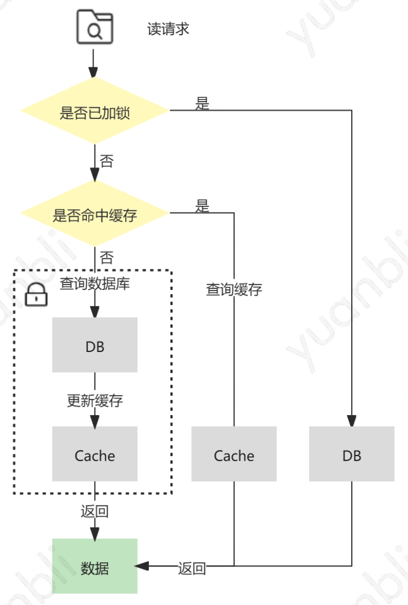

直接访问数据库的话主要通过数据分片、一主多从等方式来扛住读写流量，但随着数据量大积累和流量大激增，仅依赖数据库来承接所有流量，不仅成本高、效率低、而且还伴随着稳定性降低的风险。鉴于大部分业务都是读多写少，甚至存在读操作高出写操作多个数据级的情况，因此在架构设计中，常采用增加缓存层来提高系统的响应能力，提升读写性能，减少数据库访问压力，从而提升业务的稳定性。

根据CAP原理，分布式系统在可用性、一致性和分区容错性上无法兼得，通常由于分区容错无法避免，所以一致性和可用性难以同时成立。对于缓存系统来说，如何保证数据一致性是一个应用缓存时不得不解决的问题。

缓存系统的一致性包括持久化层的一致性和缓存层的一致性、以及多级缓存之间的一致性。缓存层和持久化层的一致性问题通常被称为双写一致性问题。对于应用缓存的大部分场景追求的是最终一致性，少部分对数据一致性要求极高的场景会追求强一致性。

## 1. 保证最终一致性的策略 Cache Policy

为了达到最终一致性，针对不同场景，业界逐步形成了下列几种应用缓存的策略：

### 1.1 Cache-Aside

Cache-Aside意为旁路缓存模式。

- 读请求：首先查询缓存，若缓存命中（cache hit），则直接返回缓存中的数据；若缓存未命中（cache miss），则查询数据库并将查询结果更新至缓存，然后返回查询结果
- 写请求：先更新数据库，再删除缓存

#### 1.1.1 为什么删除缓存而不是更新缓存

在性能和安全的角度来看，更新缓存可能导致不好的后果。

***性能***

当缓存对应的结果需要大量的计算过程才能得到时，比如需要访问多张数据库表并联合计算，那么在写操作中更新缓存的开销较大。同时，当写操作较多时，可以存在刚更新的缓存还未被读取到，又再次被更新的情况，这样的更新会造成资源浪费，也导致缓存利用率不高。而等读请求未命中再去更新，符合懒加载的思路。删除缓存不仅是幂等操作，可以在发生异常时重试，而且`写-删除`和`读-更新`在语义上更加对称。

***安全***

并发场景下，在写请求中更新缓存可能导致数据的不一致问题。

若存在两个不同线程的写请求：

1. 线程1的写请求更新了数据库
2. 线程2的写请求再次更新数据库
3. 由于网络延迟等原因，线程1可能会晚于线程2更新缓存缓存，会导致最终写入数据库等结果是来自线程2的新值，写入缓存的是来自线程1的旧值，即缓存落后数据库

### 1.1.2 为什么先更新数据库，而不是先删除缓存

单线程的场景下，删除缓存成功，但更新数据库失败，下次读操作，仍能将正确订单数据写回到缓存。

但是并发场景下会有比较明显的问题：

1. 线程1的写请求删除了缓存
2. 线程2的读请求由于缓存删除导致缓存未命中，线程2继而查询数据库，但由于写请求慢于读请求，线程1更新数据的操作会晚于线程2查询数据库后更新缓存的操作，那么就会导致写入缓存的数据是线程2中查询到的旧值，数据库的结果是来自线程1的新值
3. 再有读请求命中缓存，读取到的便是旧值

### 1.1.3 先删除缓存，再更新数据库，如何解决一致性问题？

为了避免该方案在读写并发时带来的缓存脏数据，业界又提出了延迟双删策略，即在更新数据库之后，延迟一段时间再删除缓存，为了保证第二次删除缓存的时间点在请求更新缓存之后，这个延迟的时间应稍大于业务中读请求的耗时。显而易见，无论延迟时间如何预估，读无法和读请求完成时间准确衔接。

### 1.1.4 Cache-Aside数据不一致的可能

1. 线程1的读请求未命中缓存的情况下查询数据库
2. 线程2的写请求更新数据库
3. 由于一些极端原因导致线程1中的读请求的更新缓存操作晚线程2中写请求的删除缓存的操作，就会导致最终写入缓存中的是来自线程1的旧值，而写入数据库中的是来自现场2的新值
4. 即缓存落后于数据库，此时再有读请求命中缓存，读到的就是旧值

上述场景出现的条件比较困难，不仅需要缓存失效且读写请求并发执行，还需要读请求查询数据的执行早于写请求更新数据库，同时读请求的执行完成晚于写请求。在实际生产中出现的可能性较小。

除此之外，在并发环境下，Cache-Aside中也存在读请求命中缓存的时间点在写请求更新数据库之后，删除缓存之前，也会导致读请求查询到的缓存落后于数据库的情况。

虽然下一次读请求中，缓存会被更新，但如果业务层对这种情况容忍度较低，那么可以采用加锁在写请求中，保证`更新数据库 & 删除缓存`的串行执行为原子操作。但加锁会导致吞吐量的下降，造成性能损耗。

加锁情况的读写请求并发情况如下：

## 1.2 补偿机制

Cache-Aside中可能存在更新数据库成功，但是删除缓存失败的场景，如果发生这种情况，那么便会导致缓存中的数据落后于数据库，产生数据不一致的问题。主要有下述几种补偿机制：

### 1.2.1 删除重试机制

同步重试删除在性能上会影响吞吐量，所以通常引入消息队列，将删除的缓存对应的`key`放入消息队列中，在对应的消费者中获取删除失败的`key`，异步重试删除。

这种方法实现简单，但是重试操作需要基于业务代码的trigger出发，对业务代码有侵入。

### 1.2.2 基于数据库日志（binlig）增量解析、订阅和消费

让缓存失效补偿机制运行在背后，尽量减少耦合业务代码，简单的方法是通过后台任务来更新时间戳或版本作为对比获取数据的增量数据更新至缓存中，这种方式的扩展性和稳定性都有所欠缺。

相对成熟的方案是基于MySQL数据库增量日志就行解析和消费，较为流行的是阿里巴巴的作为`MySQL binlog` 增量获取和解析的组件` canal`。

canal sever 模拟 MySQL slave 的交互协议，伪装为 MySQL slave ，向 MySQL master 发送dump 协议，MySQL master 收到 dump 请求，开始推送 binary log 给 slave （即 canal sever ），canal sever 解析 binary log 对象（原始为 byte 流），可由 canal client 拉取进行消费，同时 canal server 也默认支持将变更记录投递到 MQ 系统中，主动推送给其他系统进行消费。在 ack 机制的加持下，不管是推送还是拉取，都可以有效的保证数据按照预期被消费。当前版本的 canal 支持的 MQ 有 kafka 或者 RocketMQ 。另外， canal 依赖 zookeeper 作为分布式协调组件来实现 HA ，canal 的 HA (Highly Available)，高可用性集群，分为两个部分：

- 为了减少对 MySQL dump 的请求压力，不同 canal server 上的 instance 要求同一时间只能有一个处于运行状态，其他的 instance 处于 standby 状态；
- 为了保证有序性，对于一个 instance 在同一时间只能由一个 canal client 进行 get/ack 等动作；

### 1.2.3 数据传输服务DTS

数据传输服务（Data Transmission Service）是云服务商提供的一种支持 RDBMS（关系型数据库）、NoSQL、OLAP 等多种数据源之间进行数据交互的数据流服务。提供了包括数据迁移、数据订阅、数据同步等多种数据传输能力，常用于不停服数据迁移、数据异地灾备、异地多活、实时数据库仓、缓存更新、异地消息通知等多种业务场景应用。

## 1.3 Read-Through

Read-Through意为读穿透模式，流程和Cache-Aside类似，但是多了访问控制层，读请求只和该层进行交互，而背后缓存命中与否的逻辑则又控制层与数据源进行交互，业务层的实现更加简洁，并且对于缓存层与持久化层交互的封装程度更高，易于移植。

## 2.4 Write-Through

Write-Through意为直写模式，增加了访问层来提供更高程度的封装。不同于Cache-Aside，直写模式在写请求更新数据库之后，并不会删除缓存，而是更新缓存。

读请求过程简单，不需要查询数据更新缓存等操作。除了更新数据库再更新缓存带来的弊端之外，还会造成更新效率低，并且两个写操作只要有一次写失败就会造成数据不一致。

直写模式适合写操作居多，并且一致性要求较高的场景，当然也需要通过一定的补偿机制来解决问题。

## 2.5 Write-Behind

异步会写模式，也有访问控制层，但是不同的是，Write behind在处理写接口时，只更新缓存而不更新数据库，对数据库的更新，则是通过批量异步更新的方式进行，批量写入的时间点可以选择在数据库负载较低的时间。

该模式下写请求延迟较低，减轻了数据库的压力，具有较好的吞吐性。但数据库和缓存的一致性较弱，比如当更新的数据还未被写入数据库时，直接从数据看查询数据是落后缓存的，同时缓存的负载较大，如果缓存宕机也会导致数据丢失。

## 2.6 Write-Around

非核心业务，对一致性要求较弱，可以选择在cache aside读模式下增加一个缓存过期时间，在写请求中仅仅更新数据库，不做任何删除或更新缓存的操作，这样缓存仅能通过过期时间失效。

## 总结

在解决缓存一致性的过程中，有多种途径可以保证缓存的最终一致性，应该根据场景来设计合适的方案，读多写少的场景下，可以选择采用“ Cache-Aside 结合消费数据库日志做补偿”的方案，写多的场景下，可以选择采用“ Write-Through 结合分布式锁”的方案 ，写多的极端场景下，可以选择采用“ Write-Behind ” 的方案。
