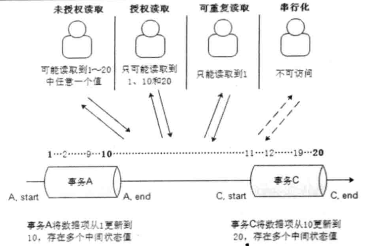

## 1. 分布式架构

随着计算机系统规模变得越来越大，将所有的业务单元集中部署在一个或若千个大型机上的体系结构，已经越来越不能满足当今计算机系统，尤其是大型互联网系统的快速发展，各种灵活多变的系统架构模型层出不穷。

同时，随着微型计算机的出现，越来越多廉价的PC机成为了各大企业IT架构的首选，分布式的处理方式越来越受到业界的青睐。

### 1.1 从集中式到分布式

自20世纪60年代大型主机被发明出来以后，凭借其超强的计算和I/O处理能力以及在稳定性和安全性方面的卓越表现，在很长一段时间内，大型主机引领了计算机行业以及商业计算领域的发展。

随着大型主机时代的到来，集中式的计算机系统架构也成为了主流。由于大型主机卓越的性能和良好的稳定性，其在单机处理能力方面的优势非常明显，使得IT系统快速进入了集中式处理阶段，对应的计算机系统为集中式系统。

但从20世纪80年代以来，计算机系统向网络化和微型化的发展日趋明显，传统的集中式处理模式越来越不能适应人们的需求。

- 大型主机的人才培养成本非常之高。通常一台大型主机汇集了大量精密的计算机组件，操作非常复杂，这对一个运维人员掌握其技术细节提出了非常高的要求

- 大型主机也是非常昂贵的

- 集中式系统具有明显的单点问题。大型主机虽然在性能和稳定性方面表现卓越，但这并不代表其永远不会出现故障。一旦一台大型主机出现了故障，那么整个系统将处于不可用状态，其后果相当严重。在单一大型主机上进行系统的扩容往往比较困难

- 很多企业开始放弃原来的大型主机，而改用小型机和普通PC服务器来搭建分布式的计算机系统

#### 1.1.1 集中式的特点

所谓的集中式系统就是指由一台或多台主计算机组成中心节点，数据集中存储于这个中心节点中，并且整个系统的所有业务单元都集中部署在这个中心节点上，系统的所有功能均由其集中处理。也就是说，在集中式系统中，每个终端或客户端机器仅仅负责数据的录人和输出，而数据的存储与控制处理完全交由主机来完成。

集中式系统最大的特点就是部署结构简单。由于集中式系统往往基于底层性能卓越的大型主机，因此无须考虑如何对服务进行多个节点的部署，也就不用考虑多个节点之间的分布式协作问题。

#### 1.1.2 分布式的特点

分布式系统是一个硬件或软件组件分布在不同的网络计算机上，彼此之间仅仅通过消息传递进行通信和协调的系统

一个标准的分布式系统在没有任何特定业务逻辑约束的情况下，都会有如下几个特征：

1. **发布性**

   分布式系统中的多台计算机都会在空间上随意分布，同时，机器的分布情况也会随时变动。

2. **对等性**

   分布式系统中的计算机没有主/从之分，既没有控制整个系统的主机，也没有被控制的从机，组成分布式系统的所有计算机节点都是对等的。副本(Replica) 是分布式系统最常见的概念之一，指的是分布式系统对数据和服务提供的一种冗余方式。

- 数据副本：在不同的节点上持久化同一份数据，当某一个节点上存储的数据丢失时，可以从副本上读取到该数据，这是解决分布式系统数据丢失问题
- 服务副本：多个节点提供同样的服务，每个节点都有能力接收来自外部的请求并进行相应的处理。

3. **并发性**

   程序运行过程中的并发性操作是非常常见的行为，例如同一个分布式系统中的多个节点，可能会并发地操作一些共享的资源，诸如数据库或分布式存储等，如何准确并高效地协调分布式并发操作也成为了分布式系统架构与设计中最大的挑战之一。

4. **缺乏全局时钟**

   一个典型的分布式系统是由一系列在空间，上随意分布的多个进程组成的，具有明显的分布性，这些进程之间通过交换消息来进行相互通信。

   因此，在分布式系统中，很难定义两个事件究竟谁先谁后，原因就是因为分布式系统缺乏一个全局的时钟序列控制。

5. **故障总是会发生**

   组成分布式系统的所有计算机，都有可能发生任何形式的故障。

   一个被大量工程实践所检验过的黄金定理是：任何在设计阶段考虑到的异常情况，一定会在系统实际运行中发生，并且，在系统实际运行过程中还会遇到很多在设计时未能考虑到的异常故障。

   所以，除非需求指标允许，在系统设计时不能放过任何异常情况。

#### 1.1.3 分布式环境的各种问题

##### 1. 通信异常

从集中式向分布式演变的过程中，必然引入了网络因素，而由于网络本身的不可靠性，因此也引入了额外的问题。

分布式系统需要在各个节点之间进行网络通信，因此每次网络通信都会伴随着网络不可用的风险，网络光纤、路由器或是DNS等硬件设备或是系统不可用都会导致最终分布式系统无法顺利完成一次网络通信。

另外，即使分布式系统各节点之间的网络通信能够正常进行，其延时也会远大于单机操作。

通常我们认为在现代计算机体系结构中，单机内存访问的延时在纳秒数量级(通常是10ns 左右)，而正常的一次网络通信的延迟在0.1~1ms左右(相当于内存访问延时的105~106 倍)，如此巨大的延时差别，也会影响消息的收发的过程，因此消息丢失和消息延迟变得非常普遍。

##### 2. 网络分区

当网络由于发生异常情况，导致分布式系统中部分节点之间的网络延时不断增大，最终导致组成分布式系统的所有节点中，只有部分节点之间能够进行正常通信，而另一些节点则不能，我们将这个现象称为网络分区，就是俗称的“脑裂”。

当网络分区出现时，分布式系统会出现局部小集群，在极端情况下，这些局部小集群会独立完成原本需要整个分布式系统才能完成的功能，包括对数据的事务处理，这就对分布式一致性提出了非常大的挑战。

##### 3. 三态

网络可能会出现各式各样的问题，因此分布式系统的每一次请求 与响应，存在特有的“三态”概念，即成功、失败与超时。在传统的单机系统中，应用程序在调用一个函数之后，能够得到一个非常明确的响应：成功或失败。

而在分布式系统中，由于网络是不可靠的，虽然在绝大部分情况下，网络通信也能够接收到成功或失败的响应，但是当网络出现异常的情况下，就可能会出现超时现象，通常有以下两种情况:

- 由于网络原因，该请求(消息)并没有被成功地发送到接收方，而是在发送过程就发生了消息丢失现象
- 该请求(消息)成功的被接收方接收后，并进行了处理，但是在将响应反馈给发送方的过程中，发生了消息丢失现象

当出现这样的超时现象时，网络通信的发起方是无法确定当前请求是否被成功处理的。

##### 4. 节点故障

节点故障则是分布式环境下另一个比较常见的问题，指的是组成分布式系统的服务器节点出现的宕机或“僵死”现象。通常根据经验来说，每个节点都有可能会出现故障，并且每天都在发生。

### 1.2 从ACID到CAP

介绍分布式系统事务处理与数据一致性上遇到的种种挑战。

#### 1.2.1 ACID

事务(Transaction)是由一系列对系统中数据进行访问与更新的操作所组成的一个程序执行逻辑单元(Unit)，狭义上的事务特指数据库事务。

- 一方面，当多个应用程序并发访问数据库时，事务可以在这些应用程序之间提供-一个隔离方法，以防止彼此的操作互相干扰。

- 另一方面，事务为数据库操作序列提供了一个从失败中恢复到正常状态的方法，同时提供了数据库即使在异常状态下仍能保持数据一致性的方法。

事务具有四个特征,分别是原子性(Atomicity).一致性 (Consistency).隔离性(Isolation)和持久性(Durability)， 简称为事务的ACID特性。

**原子性**

事务的原子性是指事务必须是一个原子的操作序列单元。事务中包含的各项操作在一次执行过程中，只允许出现以下两种状态之一：

- 全部成功执行
- 全部不执行

任何一项操作失败都将导致整个事务失败，同时其他已经被执行的操作都将被撤销并回滚，只有所有的操作全部成功，整个事务才算是成功完成。

**一致性**
事务的一致性是指事务的执行不能破坏数据库数据的完整性和一致性，一个事务在执行之前和执行之后，数据库都必须处于一致性状态。

也就是说，事务执行的结果必须是使数据库从一个一致性状态转变到另一个一致性状态， 因此当数据库只包含成功事务提交的结果时，就能说数据库处于一致性状态。而如果数据库系统在运行过程中发生故障，有些事务尚未完成就被迫中断，这些未完成的事务对数据库所做的修改有一部分已写入物理数据库，这时数据库就处于一种不正确的状态，或者说是不一致的状态。

**隔离性**

事务的隔离性是指在并发环境中，并发的事务是相互隔离的，一个事务的执行不能被其他事务干扰。

也就是说，不同的事务并发操纵相同的数据时，每个事务都有各自完整的数据空间，即一个事务内部的操作及使用的数据对其他并发事务是隔离的，并发执行的各个事务之间不能互相干扰。

在标准SQL规范中，定义了4个事务隔离级别，**未授权读取、授权读取、可重复读取和串行化**。不同的隔离级别对事务的处理不同。

*未授权读取*

未授权读取也被称为读未提交(Read Uncommitted)， 该隔离级别允许脏读取，其隔离级别最低。换句话说，如果一个事务正在处理某一数据， 并对其进行了更新，但同时尚未完成事务，因此还没有进行事务提交；而与此同时，允许另一个事务也能够访问该数据。

举个例子来说，事务A和事务B同时进行，事务A在整个执行阶段，会将某数据项的值从1开始，做一系列加法操作(比如说加1操作)直到变成10之后进行事务提交，此时，事务B能够看到这个数据项在事务A操作过程中的所有中间值(如1变成2、2变成3等)，而对这一系列的中间值的读取就是未授权读取。

*授权读取*

授权读取也被称为读已提交( Read Committed)， 它和未授权读取非常相近，唯一的区别就是授权读取只允许获取已经被提交的数据。

同样以上面的例子来说，事务A和事务B同时进行，事务A进行与，上述同样的操作，此时，事务B无法看到这
个数据项在事务A操作过程中的所有中间值，只能看到最终的10。另外，如果说有一个事务C和事务A进行非常类似的操作，只是事务C是将数据项从10加到20，此时事务B也同样可以读取到20，即授权读取允许不可重复读取。

*可重复读*

可重复读取(RepeatableRead)，简单地说，就是保证在事务处理过程中，多次读取同一个数据时，其值都和事务开始时刻是一致的。

因此该事务级别禁止了不可重复读取和脏读取，但是有可能出现幻影数据。所谓幻影数据,就是指同样的事务操作,在前后两个时间段内执行对同一个数据项的读取，可能出现不一致的结果。

在上面的例子，可重复读取隔离级别能够保证事务B在第一次事务操作过程中，始终对数据项读取到1。

幻读和不可重复读都是读取了另一条已经提交的事务（这点就脏读不同），所不同的是不可重复读查询的都是**同一个数据项**，而幻读针对的是**一批数据整体**（比如数据的个数）。

*串行化*

串行化(Serializable)是最严格的事务隔离级别。它要求所有事务都被串行执行，即事务只能-一个接一个地进行处理，不能并发执行。

事务隔离级别越高，就越能保证数据的完整性和一致性，但同时对并发性能的影响也越大。

通常，对于绝大多数的应用程序来说，可以优先考虑将数据库系统的隔离级别设置为授权读取，这能够在避免脏读取的同时保证较好的并发性能。尽管这种事务隔离级别会导致不可重复读、幻读和第二类丢失更新等并发问题，但较为科学的做法是在可能出现这类问题的个别场合中，由应用程序主动采用悲观锁或乐观锁来进行事务控制。

*持久性*
事务的持久性也被称为永久性，是指一个事务一旦提交，它对数据库中对应数据的状态变更就应该是永久性的。

换句话说，一旦某个事务成功结束，那么它对数据库所做的更新就必须被永久保存下来一即使发生系统崩溃或机器宕机等故障，只要数据库能够重新启动，那么一定能够将其恢复到事务成功结束时的状态。

#### 1.2.2 分布式事务
随着分布式计算的发展，事务在分布式计算领域中也得到了广泛的应用。在单机数据库中，我们很容易能够实现一套满足ACID 特性的事务处理系统，但在分布式数据库中，数据分散在各台不同的机器上，如何对这些数据进行分布式的事务处理具有非常大的挑战。但是在分布式计算领域，为了保证分布式应用程序的可靠性，分布式事务是无法回避的。

一个最典型的分布式事务场景是：一个跨银行的转账操作涉及调用两个异地的银行服务，其中一个是本地银行提供的取款服务，另一个则是目标银行提供的存款服务，这两个服务本身是无状态并且是互相独立的，共同构成了一个完整的分布式事务。如果从本地银行取款成功，但是因为某种原因存款服务失败了，那么就必须回滚到取款前的状态，否则用户可能会发现自己的钱不翼而飞了。

从上面这个例子中，我们可以看到，一个分布式事务可以看作是由多个分布式的操作序列组成的，例如上面例子中的取款服务和存款服务，通常可以把这一系列分布式的操作序列称为子事务。

因此，分布式事务也可以被定义为一种嵌套型的事务，同时也就具有了ACID事务特性。但由于在分布式事务中，各个子事务的执行是分布式的，因此要实现一种能够保证ACID特性的分布式事务处理系统就显得格外复杂。

#### 1.2.3 CAP和BASE理论

对于本地事务处理或者是集中式的事务处理系统，很显然我们可以采用已经被实践证明很成熟的ACID模型来保证数据的严格一致性。 

随着分布式事务的出现，传统的单机事务模型已经无法胜任。尤其是对于一个高访问量、高并发的互联网分布式系统来说，如果我们期望实现一套严格满足ACID特性的分布式事务，很可能出现的情况就是在系统的可用性和严格一致性之间出现冲突，因为当我们要求分布式系统具有严格一致性时，很可能就需要牺牲掉系统的可用性。

而对于一致性，则更加是所有消费者对于一个软件系统的刚需。因此，在可用性和一致性之间永远无法存在一个两全其美的方案，于是如何构建一个兼顾可用性和一致性的分布式系统成为了无数工程师探讨的难题,出现了诸 CAP 和 BASE 这样的分布式系统经典理论。

##### 1. CAP理论

CAP理论告诉我们，一个分布式系统不可能同时满足一致性(C: Consistency)、可用性(A: Availability) 和分区容错性(P: Partition tolerance) 这三个基本需求，最多只能同时满足其中的两项。

**一致性(Consistency)**

在分布式环境中，一致性是指数据在多个副本之间是否能够保持一致的特性。在一致性的需求下，当一个系统在数据一致的状态下执行更新操作后，应该保证系统的数据仍然处于一致的状态。

对于一个将数据副本分布在不同分布式节点上的系统来说，如果对第一个节点的数据进行了更新操作并且更新成功后，却没有使得第二个节点上的数据得到相应的更新，于是在对第二个节点的数据进行读取操作时，获取的依然是老数据(或称为脏数据)，这就是典型的分布式数据不一致情况。

在分布式系统中，如果能够做到针对一个数据项的更新操作执行成功后，所有的用户都可以读取到其最新的值，那么这样的系统就被认为具有强一致性(或严格的一致性)。

**可用性(Availability)**

可用性是指系统提供的服务必须一直处于可用的状态，对于用户的每一个操作请求总是能够在有限的时间内返回结果。这里我们重点看下“有限的时间内”和“返回结果”:

- “有限的时间内”：对于用户的一个操作请求，系统必须能够在指定的时间(即响应时间)内返回对应的处理结果，如果超过了这个时间范围，那么系统就被认为是不可用的
- “返回结果”：是可用性的另一个非常重要的指标，它要求系统在完成对用户请求的处理后，返回一个正常的响应结果。正常的响应结果通常能够明确地反映出对请求的处理结果，即成功或失败，而不是一个让用户感到困惑的返回结果。

**分区容错性(Partition tolerance)**

分区容错性约束了一个分布式系统需要具有如下特性：分布式系统在遇到任何网络分区故障的时候，仍然需要能够保证对外提供满足一致性和可用性的服务，除非是整个网络环境都发生了故障。

网络分区是指在分布式系统中，不同的节点分布在不同的子网络(机房或异地网络等)中，由于一些特殊的原因导致这些子网络之间出现网络不连通的状况，但各个子网络的内部网络是正常的，从而导致整个系统的网络环境被切分成了若干个孤立的区域。需要注意的是，组成一个分布式系统的每个节点的加入与退出都可以看作是一个特殊的网络分区。

从CAP定理中我们可以看出，一个分布式系统不可能同时满足一致性、 可用性和分区容错性这三个需求。另一方面，需要明确的一点是，对于一个分布式系统而言，分区容错性可以说是一个最基本的要求。因为既然是一个分布式系统，那么分布式系统中的组件必然需要被部署到不同的节点，否则也就无所谓分布式系统了，因此必然出现子网络。而对于分布式系统而言，网络问题又是一个必定会出现的异常情况，因此分区容错性也就成为了一个分布式系统必然需要面对和解决的问题。因此系统架构设计师往往需要把精力花在如何根据业务特点在C(一致性)和A(可用性)之间寻求平衡。

##### 2. BASE理论

BASE是Basically Available (基本可用)、Soft state (软状态)和Eventually consistent(最终一致性)三个短语的简写。BASE是对CAP中一致性和可用性权衡的结果，其来源于对大规模互联网系统分布式实践的总结，是基于CAP定理逐步演化而来的，其核心思想是即使无法做到强一致性(Strong consistency)，但每个应用都可以根据自身的业务特点，采用适当的方式来使系统达到最终一致性(Eventual consistency)。

**基本可用(Basically Available)**

基本可用是指分布式系统在出现不可预知故障的时候，允许损失部分可用性，但请注意，这绝不等价于系统不可用。以下两个就是“ 基本可用”的典型例子。

- 响应时间上的损失：正常情况下，一个在线搜索引擎需要在0.5秒之内返回给用户相应的查询结果，但由于出现故障(比如系统部分机房发生断电或断网故障)，查询结果的响应时间增加到了1~2秒

- 功能上的损失：正常情况下，在一个电子商务网站上进行购物，消费者几乎能够顺利地完成每一笔订单，但是在一些节日大促购物高峰的时候，由于消费者的购物行为激增，为了保护购物系统的稳定性，部分消费者可能会被引导到一个降级页面。

**弱状态(Soft state )**

弱状态也称为软状态，和硬状态相对，是指允许系统中的数据存在中间状态，并认为该中间状态的存在不会影响系统的整体可用性，即允许系统在不同节点的数据副本之间进行数据同步的过程存在延时。

**最终一致性(Eventually consistent)**

最终一致性强调的是系统中所有的数据副本，在经过一段时间的同步后，最终能够达到一个一致的状态。因此，最终一致性的本质是需要系统保证最终数据能够达到一致，而不需要实时保证系统数据的强一致性。

最终一致性是一种特殊的弱一致性：系统能够保证在没有其他新的更新操作的情况下，数据最终一定能够达到一
致的状态，因此所有客户端对系统的数据访问都能够获取到最新的值。同时，在没有发生故障的前提下，数据达到一致状态的时间延迟，取决于网络延迟、系统负载和数据复制方案设计等因素。

在实际工程实践中，最终一致性存在以下五类主要变种：

- 因果一致性( Caus'al consistency )

  因果一致性是指，如果进程A在更新完某个数据项后通知了进程B，那么进程B之后对该数据项的访问都应该能够获取到进程A更新后的最新值，并且如果进程B要对该数据项进行更新操作的话，务必基于进程A更新后的最新值，即不能发生丢失更新情况。与此同时，与进程A无因果关系的进程C的数据访问则没有这样的限制。

- 读己之所写( Read your writes )

  读己之所写是指，进程A更新一个数据项之后，它自己总是能够访问到更新过的最新值，而不会看到旧值。也就是说，对于单个数据获取者来说，其读取到的数据，一定不会比自己上次写入的值旧。因此，读己之所写也可以看作是一种特殊的因果一致性。

- 会话一致性( Session consistency )

  会话一致性将对系统数据的访问过程框定在了一个会话当中：系统能保证在同一个有效的会话中实现“读己之所写”的一致性，也就是说，执行更能操作之后，客户端能够在同一个会话中始终读取到该数据项的最新值。

- 单调读一致性( Monotonic read consistency )

  单调读一致性是指如果一个进程从系统中读取出一个数据项的某个值后，那么系统对于该进程后续的任何数据访问都不应该返回更旧的值。

- 单调写一致性( Monotonic write consistency )

  单调写一致性是指，一个系统需要能够保证来自同一个进程的写操作被顺序地执行。

BASE理论面向的是大型高可用可扩展的分布式系统，和传统事务的ACID特性是相反的，它完全不同于ACID的强一致性模型，而是提出通过牺牲强一致性来获得可用性，并允许数据在一-段时间内是不一致的，但最终达到一致状态。

但同时，在实际的分布式场景中，不同业务单元和组件对数据--致性的要求是不同的，因此在具体的分布式系统架构设计过程中，ACID特性与BASE理论往往又会结合在一起使用。

## 2. 一致性协议

为了解决分布式一致性问题， 在长期的探索研究过程中，涌现出了一大批经典的一致性协议和算法，其中最著名的就是二阶段提交协议、三阶段提交协议和Paxos算法。

### 2.1 2PC和3PC

在分布式系统中，每一个机器节点虽然都能够明确地知道自己在进行事务操作过程中的结果是成功或失败，但却无法直接获取到其他分布式节点的操作结果。因此，当一个事务操作需要跨越多个分布式节点的时候，为了保持事务处理的ACID特性，就需要引入一个称为“协调者(Coordinator)”的组件来统一调度所有分布式节点的执行逻辑，这
些被调度的分布式节点则被称为“参与者”(Participant)。 协调者负责调度参与者的行为，并最终决定这些参与者是否要把事务真正进行提交。基于这个思想，衍生出了二阶段提交和三阶段提交两种协议，

#### 2.1.1 2PC
2PC，是Two-Phase Commit的缩写，即二阶段提交，是计算机网络尤其是在数据库领域内，为了使基于分布式系统架构下的所有节点在进行事务处理过程中能够保持原子性和一致性而设计的一种算法。 

通常，二阶段提交协议也被认为是一种一致性协议， 用来保证分布式系统数据的一致性。目前，绝大部分的关系型数据库都是采用二阶段提交协议来完成分布式事务处理的，利用该协议能够非常方便地完成所有分布式事务参与者的协调，统一决定事务的提交或回滚，从而能够有效地保证分布式数据一致性，因此二阶段提交协议被广泛地应用在许多分布式系统中。

##### 1. 协议说明

二阶段提交协议是将事务的提交过程分成了两个阶段来进行处理，其执行流程如下。

**阶段一: 提交事务请求**

1. 事务询问

   协调者向所有的参与者发送事务内容，询问是否可以执行事务提交操作，并开始等待各参与者的响应。

2. 执行事务

   各参与者节点执行事务操作，并将Undo和Redo信息记入事务日志中。

3. 各参与者向协调者反馈事务询问的响应

   如果参与者成功执行了事务操作，那么就反馈给协调者Yes响应，表示事务可以执行；如果参与者没有成功执行事务，那么就反馈给协调者No响应，表示事务不可以执行。

由于上面讲述的内容在形式上近似是协调者组织各参与者对一次事务操作的投票表态过程，因此二阶段提交协议的阶段一也被称为“投票阶段”，即各参与者投票表明是否要继续执行接下去的事务提交操作。

**阶段二: 执行事务提交**

在阶段二中，协调者会根据各参与者的反馈情况来决定最终是否可以进行事务提交操作，正常情况下，包含以下两种可能。

***执行事务提交***

假如协调者从所有的参与者获得的反馈都是Yes响应，那么就会执行事务提交。

1. 发送提交请求

   协调者向所有参与者节点发出Commit请求

2. 事务提交

   参与者接收到Commit 请求后，会正式执行事务提交操作，并在完成提交之后释放在整个事务执行期间占用的事务资源

3. 反馈事务提交结果

   参与者在完成事务提交之后，向协调者发送Ack消息

4. 完成事务。

   协调者接收到所有参与者反馈的Ack消息后，完成事务

***中断事务***

1. 发送回滚请求

   协调者向所有参与者节点发出Rollback请求

2. 事务回滚

   参与者接收到Rollback请求后，会利用其在阶段-一中记录的Undo信息来执行事务回滚操作，并在完成回滚之后释放在整个事务执行期间占用的资源

3. 反馈事务回滚结果。

   参与者在完成事务回滚之后，向协调者发送Ack消息

4. 中断事务。

   协调者接收到所有参与者反馈的Ack消息后，完成事务中断

以上就是二阶段提交过程中，前后两个阶段分别进行的处理逻辑。简单地讲，二阶段提交将一个事务的处理过程分为了投票和执行两个阶段，其核心是对每个事务都采用先尝试后提交的处理方式，因此也可以将二阶段提交看作一个强一致性的算法。

##### 2. 优缺点

二阶段提交协议的优点：原理简单，实现方便

二阶段提交协议的缺点：同步阻塞、单点问题、脑裂、太过保守

***同步阻塞***

二阶段提交协议存在的最明显也是最大的--个问题就是同步阻塞,这会极大地限制分布式系统的性能。在二阶段提交的执行过程中，所有参与该事务操作的逻辑都处于阻塞状态，也就是说，各个参与者在等待其他参与者响应的过程中，将无法进行其他任何操作。

***单点问题***

在上面的讲解过程中，相信读者可以看出，协调者的角色在整个二阶段提交协议中起到了非常重要的作用。一旦协调者出现问题，那么整个二阶段提交流程将无法运转，更为严重的是，如果协调者是在阶段二中出现问题的话，那么其他参与者将会一直处于锁定事务资源的状态中，而无法继续完成事务操作。

***数据不一致***

在二阶段提交协议的阶段二，即执行事务提交的时候，当协调者向所有的参与者发送Commit请求之后，发生了局部网络异常或者是协调者在尚未发送完Commit请求之前自身发生了崩溃，导致最终只有部分参与者收到Commit请求。

于是，这部分收到了Commit请求的参与者就会进行事务的提交，而其他没有收到Commit请求的参与者则无法进行事务提交，于是整个分布式系统便出现了数据不一致性现象。

***太过保守***

如果在协调者指示参与者进行事务提交询问的过程中,参与者出现故障而导致协调者始终无法获取到所有参与者的响应信息的话，这时协调者只能依靠其自身的超时机制来判断是否需要中断事务，这样的策略显得比较保守。

换句话说，二阶段提交，协议没有设计较为完善的容错机制，任意一个节点的失败都会导致整个事务的失败。

#### 2.1.2 3PC

研究者在二阶段提交协议的基础上进行了改进，提出了三阶段提交协议。

##### 1. 协议说明

3PC，是Three-Phase Commit的缩写，即三阶段提交，是2PC的改进版，其将二阶段提交协议的“提交事务请求”过程一分为二，形成了由CanCommit. PreCommit和do Commit三个阶段组成的事务处理协议。

**阶段一: CanCommit**

1. 事务询问

协调者向所有的参与者发送一个包含事务内容的canCommit请求，询问是否可以执行事务提交操作，并开始等待各参与者的响应。

2. 各参与者向协调者反馈事务询问的响应

参与者在接收到来自协调者的canCommit请求后，正常情况下，如果其自身认为可以顺利执行事务，那么会反馈Yes响应，并进入预备状态，否则反馈No响应。

**阶段二: PreCommit**

在阶段二中，协调者会根据各参与者的反馈情况来决定是否可以进行事务的PreCommit操作，正常情况下，包含两种可能：

***执行事务预提交***

假如协调者从所有的参与者获得的反馈都是Yes响应，那么就会执行事务预提交：

1. 发送预提交请求

   协调者向所有参与者节点发出preCommit的请求，并进人Prepared 阶段

2. 事务预提交

   参与者接收到preCommit请求后，会执行事务操作，并将Undo和Redo信息记录到事务日志中

3. 各参与者向协调者反馈事务执行的响应

   如果参与者成功执行了事务操作，那么就会反馈给协调者Ack响应，同时等待最终的指令：提交(commit) 或中止(abort)

***中断事务***

假如任何一个参与者向协调者反馈了No响应，或者在等待超时之后，协调者尚无法接收到所有参与者的反馈响应，那么就会中断事务：

1. 发送中断请求

   协调者向所有参与者节点发出abort请求

2. 中断事务

   无论是收到来自协调者的abort请求,或者是在等待协调者请求过程中出现超时，参与者都会中断事务

**阶段三: doCommit**

该阶段将进行真正的事务提交，会存在以下两种可能的情况：

***执行提交***

1. 发送提交请求

   进入这一阶段，假设协调者处于正常工作状态，并且它接收到了来自所有参与者的Ack响应，那么它将从“预提交”状态转换到“提交”状态，并向所有的参与者发送doCommit请求。

2. 事务提交

   参与者接收到doCommit 请求后，会正式执行事务提交操作，并在完成提交之后释放在整个事务执行期间占用的事务资源

3. 反馈事务提交结果

   参与者在完成事务提交之后，向协调者发送Ack消息

4. 完成事务

   协调者接收到所有参与者反馈的Ack消息后，完成事务

***中断事务***

进入这一阶段，假设协调者处于正常工作状态，并且有任意一一个参与者向协调者反馈了No响应，或者在等待超时之后,协调者尚无法接收到所有参与者的反馈响应，那么就会中断事务：

1. 发送中断请求

   协调者向所有的参与者节点发送abort请求

2. 事务回滚

   参与者接收到abort请求后，会利用其在阶段二中记录的Undo信息来执行事务回滚操作，并在完成回滚之后释放在整个事务执行期间占用的资源

3. 反馈事务回滚结果

   参与者在完成事务回滚之后，向协调者发送Ack消息

4. 中断事务

   协调者接收到所有参与者反馈的Ack消息后，中断事务

需要注意的是，一旦进入阶段三，可能会存在以下两种故障：

- 协调者出现问题。

- 协调者和参与者之间的网络出现故障。

无论出现哪种情况，最终都会导致参与者无法及时接收到来自协调者的doCommit或是abort请求，针对这样的异常情况，参与者都会在等待超时之后，继续进行事务提交。

##### 2. 优缺点

三阶段提交协议的优点：相较于二阶段提交协议，三阶段提交协议最大的优点就是降低了参与者的阻塞范围，并且能够在出现单点故障后继续达成一致。

三阶段提交协议的缺点：三阶段提交协议在去除阻塞的同时也引入新的问题，那就是在参与者接收到preCommit消息后，如果网络出现分区，此时协调者所在的节点和参与者无法进行正常的网络通信，在这种情况下，该参与者依然会进行事务的提交，这必然出现数据的不一致性。

### 2.2 Paxos

Paxos 算法是莱斯利●兰伯特(Leslie Lamport) 2于1990 年提出的一种基于消息传递且具有高度容错特性的一致性算法，是目前公认的解决分布式一致性问题最有效的算法之一。

Paxos算法需要解决的问题就是如何在一个可能发生上述异常的分布式系统中，快速且正确地在集群内部对某个数据的值达成--致，并且保证不论发生以上任何异常，都不会破坏整个系统的一致性。

#### 2.2.1 追溯本源

**拜占庭将军问题**

拜占庭帝国有许多支军队，不同军队的将军之间必须制订一个统一的行动计划，从而做出进攻或者撤退的决定，同时，各个将军在地理上都是被分隔开来的，只能依靠军队的通讯员来进行通讯。然而，在所有的通讯员中可能会存在叛徒，这些叛徒可以任意篡改消息，从而达到欺骗将军的目的。

在分布式计算领域，试图在异步系统和不可靠的通道上来达到一致性状态是不可能的，因此在对一致性的研究过程中，都往往假设信道是可靠的。而事实上，大多数系统都是部署在同一个局域网中的，因此消息被篡改的情况非常罕见；另一方面，由于硬件和网络原因而造成的消息不完整问题，只需一套简单的校验算法即可避免。

实际工程实践中，可以假设不存在拜占庭问题，也即假设所有消息都是完整的，没有被篡改的。那么，在这种情况下需要什么样的算法来保证一致性？

Lamport在1990年提出了一个理论上的一致性解决方案，同时给出了严格的数学证明。

**兼职议会**

在古希腊有一个叫做Paxos的小岛，岛上采用议会的形式来通过法令，议会中的议员通过信使进行消息的传递。值得注意的是，议员和信使都是兼职的，他们随时有可能会离开议会厅，并且信使可能会重复的传递消息，也可能一去不复返。因此，议会协议要保证在这种情况下法令仍然能够正确的产生，并且不会出现冲突。

#### 2.2.2 Paxos算法详解

Paxos算法的核心是一个一致性算法，也就是论文The Part Time Parliament 中提到的“synod”算法，我们将从对一致性问题的描述开始来讲解该算法需要解决的实际需求。

##### 问题描述

假设有一组可以提出提案的进程集合，那么对于一个一致性算法来说需要保证以下几点:

- 在这些被提出的提案中，只有一个会被选定

- 如果没有提案被提出，那么就不会有被选定的提案

- 当一个提案被选定后，进程应该可以获取被选定的提案信息

对于-致性来说，安全性(Safety) 需求如下: 

- 只有被提出的提案才能被选定(Chosen)

- 只能有一个值被选定

- 如果某个进程认为某个提案被选定了，那么这个提案必须是真的被选定的那个

Paxos 算法的目标就是要保证最终有一个提案会被选定，当提案被选定后，进程最终也能获取到被选定的提案。

在该一致性算法中，有三种参与角色，我们用**Proposer、Acceptor和Learner**来表示:

- proposers 提出提案，提案信息包括提案编号和提议的value
- acceptor 收到提案后可以接受提案，若提案获得多数派（majority）的acceptors 的接受，则称该提案被批准
- learners 只能获取被批准的提案

在具体的实现中，一个进程可能充当不止一种角色，在这里我们并不关心进程如何映射到各种角色。假设不同参与者之间可以通过收发消息来进行通信，那么:

- 每个参与者以任意的速度执行，可能会因为出错而停止，也可能会重启。同时，即使一个提案被选定后，所有的参与者也都有可能失败或重启，因此除非那些失败或重启的参与者可以记录某些信息，否则将无法确定最终的值

- 消息在传输过程中可能会出现不可预知的延迟，也可能会重复或丢失，但是消息不会被损坏，即消息内容不会被篡改(拜占庭式的问题

##### 提案的选定

要选定一个唯一提案的最简单方式莫过于只允许一个Accpetor存在，这样的话，Proposer只能发送提案给该Accpetor，Acceptor会选择它接收到的第一个提案作为被选定的提案。这种解决方式尽管实现起来非常简单，但是却很难让人满意，因为一旦这个Accpetor出现问题，那么整个系统就无法工作了。

因此，应该寻找一种更好的解决方式，例如可以使用多个Accpetor来避免Accpetor的单点问题。存在多个Acceptor的情况下，如何进行提案的选取：

Proposer向一个Acceptor 集合发送提案，同样，集合中的每个Acceptor 都可能会批准(Accept)该提案，当有足够多的Acceptor批准这个提案的时候，我们就可以认为该提案被选定了。

假定足够多的Acceptor是整个Acceptor 集合的一个子集，并且让这个集合大得可以包含Acceptor 集合中的大多数成员，因为任意两个包含大多数Acceptor的子集至少有一个公共成员。再规定，每一个Acceptor最多只能批准一个提案，那么就能保证只有一个提案被选定了。

##### 算法陈述

结合Proposer和Acceptor对提案的处理逻辑，就可以得到如下类似于两阶段提交的算法执行过程：

阶段一：

1. Proposer选择一个提案编号Mn,然后向Acceptor的某个超过半数的子集成员发送编号为Mn的Prepare请求。

2. 如果一个Acceptor收到一个编号为Mn的Prepare请求，且编号Mn大于该Acceptor已经响应的所有Prepare请求的编号，那么它就会将它已经批准过的最大编号的提案作为响应反馈给Proposer，同时该Acceptor会承诺不会再批准任何编号小于Mn的提案

   举个例子来说，假定一个Acceptor已经响应过的所有Prepare 请求对应的提案编号分别为1、2、... 5和7，那么该Acceptor在接收到一个编号为8的Prepare请求后，就会将编号为7的提案作为响应反馈给Proposer

阶段二：

1. 如果Proposer收到来自半数以上的Acceptor对于其发出的编号为M的Prepare请求的响应，那么它就会发送一个针对[Mn, Vn]提案的Accept请求给Acceptor。注意，Vn的值就是收到的响应中编号最大的提案的值，如果响应中不包含任何提案，那么它就是任意值

2. 如果Acceptor收到这个针对[Mn，V.]提案的Accept请求，只要该Acceptor尚未对编号大于Mn的Prepare请求做出响应，它就可以通过这个提案

当然，在实际运行过程中，每一个Proposer 都有可能会产生多个提案，但只要每个Proposer都遵循如上所述的算法运行，就一定能够保证算法执行的正确性。

值得一提的是，每个Proposer都可以在任意时刻丢弃一个提案，哪怕针对该提案的请求和响应在提案被丢弃后会到达，但根据Paxos算法的一系列规约，依然可以保证其在提案选定上的正确性。事实上，如果某个Proposer已经在试图生成编号更大的提案，那么丟弃一些旧的提案未尝不是一个好的选择。因此，如果一个Acceptor 因为已经收到过更大编号的Prepare请求而忽略某个编号更小的Prepare或者Accept请求，那么它也应当通知其对应的Proposer，以便该Proposer也能够将该提案进行丢弃。

##### 提案的获取

Learner获取提案，大体可以有以下几种方案。

1. 方案一

   Learner获取一个已经被选定的提案的前提是，该提案已经被半数以上的Acceptor批准。因此，最简单的做法就是一旦Acceptor批准了一一个提案，就将该提案发送给所有的Learner。
   很显然，这种做法虽然可以让Learner尽快地获取被选定的提案，但是却需要让每个Acceptor与所有的Learner逐个进行一次通信,通信的次数至少为二者个数的乘积。

2. 方案二

   让所有的Acceptor 将它们对提案的批准情况，统一发送给一个特定的Learner ( 下文中我们将这样的Learner 称为“主 Learner"), 在不考虑拜占庭将军问题的前提下，我们假定Learner之间可以通过消息通信来互相感知提案的选定情况。基于这样的前提，当主Learner被通知一个提案已经被选定时，它会负责通知其他Learner。

   在这种方案中，Acceptor首先会将得到批准的提案发送给主Learner，再由其同步给其他Learner，因此较方案一而言， 方案二虽然需要多一个步骤才能将提案通知到所有的Learner， 但其通信次数却大大减少了，通常只是Acceptor 和Learner的个数总和。但同时，该方案引入了一个新的不稳定因素：主Learner随时可能出现故障。

3. 方案三

   方案二最大的问题在于主Learner存在单点问题，即主Learner随时可能出现故障。因此,对方案二进行改进，可以将主Learner的范围扩大，即Acceptor可以将批准的提案发送给一一个特定的Learner 集合，该集合中的每个Learner都可以在一个提案被选定后通知所有其他的Learner。这个Learner集合中的Learner个数越多，可靠性就越好，但同时网络通信的复杂度也就越高。

##### 通过选取主Proposer保证算法的活性

假设存在这样一种极端情况，有两个Proposer依次提出了一系列编号递增的议案，但是最终都无法被选定，具体流程如下：

Proposer P提出了一个编号为M的提案，并完成了上述阶段一的流程。但与此同时，另外一个Proposer P2提出了一个编号为M2( M2>M|)的提案，同样也完成了阶段一的流程，于是Acceptor已经承诺不再批准编号小于M2的提案了。因此，当P1进入阶段二的时候，其发出的Accept请求将被Acceptor忽略，于是P再次进入阶段一并提出了一个编号为M; ( M3>M2)的提案，而这又导致P2在第二阶段的Accept请求被忽略，以此类推，提案的选定过程将陷入死循环，如下图所示：

为了保证Paxos算法流程的可持续性，以避免陷入上述提到的‘“死循环” ，就必须选择一个主Proposer，并规定只有主Proposer才能提出议案。这样一来， 只要主Proposer和过半的Acceptor能够正常进行网络通信，那么但凡主Proposer提出一个编号更高的提案，该提案终将会被批准。当然，如果Proposer发现当前算法流程中已经有一个编号更大的提案被提出或正在接受批准，那么它会丟弃当前这个编号较小的提案，并最终能够选出一个编号足够大的提案。因此，如果系统中有足够多的组件(包括Proposer. Acceptor和其他网络通信组件)能够正常工作，那么通过选择一个主Proposer，整套Paxos算法流程就能够保持活性。

