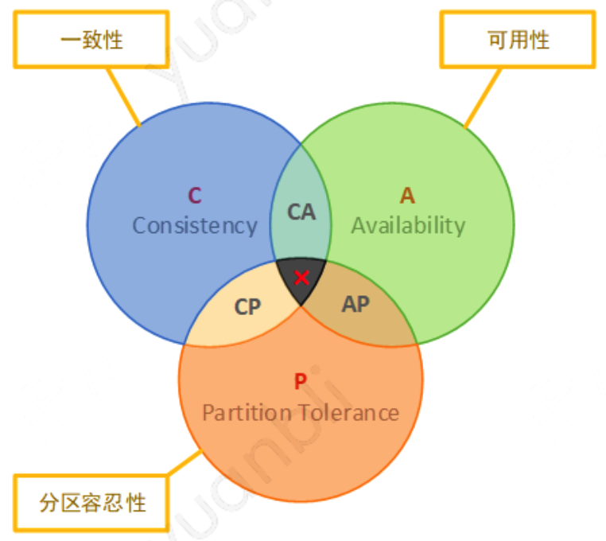

## 1. 概述

分布式事务指这些操作涉及到多台服务器，也称为多机事务，相对的，传统事物也称为单机事务。单机事务时代，通常可以使用数据库系统提供的事务操作来解决原子性问题；微服务时代，则需要依靠分布式事务来保证原子性。

## 2. 预备知识

### 2.1. CAP理论

该理论说明一个分布式系统只能满足下列三个特性的两个，而不能同时满足：

- C：一致性，所有客户端看到的都是同样的数据，即使在数据更新和删除之后
- A：可用性，即使部分节点发生故障，所有客户端也能找到可用的数据备份
- P：分区容错性，即使发生网络分区故障，系统仍然能够按照预期正常工作

*CAP*定理在分布式领域至关重要，在构建大型分布式系统的时候必须根据自己的业务独特性在三者之间进行权衡。由于网络的各种不确定因素，在构建分布式应用的时候往往不得不考虑分区容错性，这个时候通常只能在一致性和可用性之间进行选择。

### 2.2. BASE理论

根据*CAP*定理，如果要完整的实现事务的*ACID*特性，只能放弃可用性选择一致性，即*CP*模型。但是可用性也至关重要，于是eBay架构师根据*CAP*定理进行妥协提出一种*ACID*替代性方案，从而达到可用性和一致性之间某种微妙的平衡，选择*AP*模型的同时最大限度的满足一致性：强一致性不可强求，退而求其次选择最终一致性。*BASE*理论的概述如下：

- BA：*Basically Available*，基本可用性
- S：*Soft State*，软状态
- E：*Eventually Consistency*，最终一致性

**基本可用**，是相对*CAP*的完全可用而言，即在部分节点出现故障的时候不要求整个系统完全可用，允许系统出现部分功能和性能上的损失：比如增加响应时间，引导用户到降级提示页面等。

**软状态**，是相对*CAP*强一致性的硬状态而言，*CAP*定理的一致性要求数据变化要立即反映到所有的节点副本上，是一种强一致性。软状态不要求数据变化立即反映到所有服务器节点上，允许存在一个中间状态进行过渡，比如允许放大延时等。

**最终一致性**，相对于强一致性而言，它不要求系统数据始终保持一致性状态，只求系统经过一段时间后最终达到一致性状态即可。

## 3. 强一致性方案

强一致性方案便是前面提到的舍弃A保证C的CP模型，即通过牺牲可用性来保证一致性，该方案适用于对一致性要求很高的场景，如金融交易等。

### 3.1 XA协议

最早的分布式事务模型由 *X/Open* 国际联盟提出的 *X/Open Distributed Transaction Processing(DTP)模型*，也称为*XA*协议。定义了三大组件，以及它们之间互相操作的*XA*接口：

- AP：应用程序，定义了事务以及对涉及到的资源的一系列操作，并在事务边界内访问资源
- RMs：资源管理器，计算机共享资源的一个特定部分，如数据库管理系统 *DBMS*、打印服务等，即参与者
- TM：事务管理器，管理全局事务，协调事务等提交和回滚，并协助进行故障恢复，即协调者

*XA* 本质上也是借助两阶段提交协议来实现分布式事务的。

MySQL从5.0.3开始支持 *XA* 分布式事务(InndDB引擎)，业务开发人员在编写代码时，不应该直接操作这些*XA*事务操作的接口。因为在*DTP*模型中，*RM*上的事务分支的开启、结束、准备、提交、回滚等操作，都是应该由事务管理器*TM*来统一管理。

*XA*是资源层面的分布式事务，强一致性，在两阶段提交的整个过程中，一直会持有资源锁。基于两阶段提交的分布式事务在提交事务是需要在多个节点之间进行协调，最大限度延后了提交事务的时间点，客观上延长事务执行时间，这会导致事务在访问共享资源时发生冲突和死锁的概率增高。*XA*并发性能不理想，无法满足高并发场景，所以业界使用也较少。

### 3.2 2PC 二阶段提交

二阶段提交 *Two-phaseCommit*，是指在计算机网络以及数据库领域内，为了使基于分布式系统架构下的所有节点在进行事务提交时保持一致性而设计的一种算法(*Algorithm*)。通常，二阶段提交也被称为一种协议(*Protocol*)。

当一个事务跨越多个节点时，为了保证事务的*ACID*特性，需要引入一个作为协调者的组件来统一掌握所有节点的操作结果并最终指示这些节点是否要把操作结构进行真正的提交。

因此，二阶段提交的算法思路可以概括为：参与者将操作是否成功通知给协调者，再由协调组根据所有参与者的反馈结果决定各参与者是否要提交操作。其中两阶段指：

**阶段一：*voting phase* 投票阶段**

事务协调者给每个参与者发送 *Prepare* 消息，每个参与者要么直接返回失败(如权限验证失败)，要么在本地执行事务，写本地的 *redo* 和 *undo* 日志，但不提交。

**阶段二：*commit phase* 提交阶段**

如果协调者收到了参与者的失败消息或超时，直接给每个参与者发送回滚 *Rollback* 消息；否则，发送提交 *Commit* 消息；参与者根据协调者的指令执行提交或回滚操作，释放所有事务处理过程中使用的锁资源。

二阶段提交的操作时序图如下：

二阶段提交的原理很简单，也不难实现，但有几个非常明显的缺点：

- **单点故障问题**：因为协调者在两阶段中具有举重若轻的作用，协调者等待参与者回复时可以有超时机制，允许参与者宕机，但参与者等待协调者指令无法做超时处理。一旦协调者宕机，所有参与者都会受到影响。如果协调者一直没有回复，没有正常发送 *Commit* 或者 *Rollback* 的指令，那所有参与者会一直等待
- **同步阻塞问题**：执行过程中，所有参与节点都是事务阻塞型的。当参与者占有公共资源时，其他第三方节点访问公共资源不得不处于阻塞状态。即从投票阶段到提交阶段完成这段时间，资源都是被锁住的
- **数据一致性问题**：当网络稳定性和宕机恢复能力的假设不成立时，两段式提交可能会出现一致性问题

如果宕机最后不能恢复，那就不存在任何一种分布式协议可以正确地达成一致性结果。

对于网络稳定性来说，尽管提交阶段时间很短，但仍是明确存在的危险期。如果协调者在发出准备指令后，根据各个参与者发回的信息确定事务状态是可以提交的，协调者就会先持久化事务状态，并提交自己的事务。如果这时候网络忽然断开了，无法再通过网络向所有参与者发出 Commit 指令的话，就会导致部分数据（协调者的）已提交，但部分数据（参与者的）既未提交也没办法回滚，导致数据不一致。

### 3.3 3PC 三阶段提交

为了解决两段式提交的单点故障问题、同步阻塞问题和数据一致性问题，三段式提交 *3 Phase Commit* 协议出现。与两阶段提交不同的是，三阶段提交有两个改动点。

- **引入超时机制**：同时在协调者和参与者中都引入超时机制
- **将2PC的准备阶段细分为两个阶段**：将准备阶段一分二的理由是该阶段是重负载的操作，一旦协调者发出开始准备的消息，每个参与者都马上开始写 *redo* 日志，这时候设计的数据资源都会被锁住。如果此时某一个参与者无法完成提交，相当于所有的参与者都做了无意义的操作。所以增加询问阶段，如果都得到了正面的响应，那事务能够提交的把握就比较大，也意味着因某个参与者提交时发送崩溃导致全部回滚大风险相对变小了

3PC的三个阶段分别为：

**阶段一：*Can Commot* 阶段**

3PC的 *Can Commit* 阶段其实和2PC的准备阶段很像。协调者向参与者发送 *commit* 请求，参与者如果可以返回提交就返回 *YES* 响应，否则返回 *NO* 响应。

**阶段二：*Pre Commit* 阶段**

该阶段协调者会根据第一阶段拿到的返回值采取相应操作，返回结果主要有两种：

- 协调者从所有参与者获得得反馈都是 *Yes*，那么就会执行事务的预执行
- 假如有任何一个参与者向协调者发送了 *No* 响应，或者等待超时后，协调者没有接到参与者的响应，那么就会执行事务的中断

**阶段三：*do Commit* 阶段**

该阶段进行真正的事务提交，也可以分为两种情况：

- 执行提交：协调者向各个参与者发起事务提交强求
- 中断事务：协调者没有接收到参与者发生的 *ACK* 响应，那么久执行中断事务

相对于2PC，3PC主要解决了单点故障问题，并减少阻塞，因为一旦参与者无法接收到来自协调者的信息之后，会默认执行 *commit*，而不会一直持有事务资源并处于阻塞状态。

但是这种机制也会导致数据一致性问题，因为由于网络原因，协调者发送到 *abort* 响应没有及时被参与者接收到，那么参与者在等待超时之后执行了 *commit* 操作，这样就和其他接到 *abort* 命令并执行回滚的参与者之间存在数据不一致的情况。

## 4. 最终一致性方案

基于2PC的强一致性方案的阻塞特性对性能影响很大，在*CAP*定理中属于*CP*范畴。在实际应用中为了提升性能和可用性，基于*BASE*理论，可以使用最终一致性来代替强一致性，通过牺牲部分一致性来换取性能和可用性的提升。

### 4.1 本地事务状态表

本地事务状态表的方案是在调用分布式事务之前讲待执行的事务流程及其状态信息存储到数据库中，依赖数据库DB本地事务的原子特性，这一步操作是原子完成的，这个存储事务执行状态信息的表称为本地事务状态表。

将事务状态信息存储到DB后，调用方才会开始继续后面的调用操作，每次调用成功时更新对应的事务状态，某一步失败时则中止执行。同时后台需要运行一个定时任务来定期扫描事务状态表，对于没有完成的事务操作重新发起调用，或者执行回滚，或者在失败重试指定次数后出发告警。本地事务表的方案如下图所示：

### 4.2 可靠消息队列

可靠消息队列方案是指当事务发起方执行完成本地事务后发出一条消息，事务参与方（消息消费者）一定能够接受消息并处理事务成功，此方案强调的是只要消息发给事务参与方那么可以达到最终一致性。

该方案需要使用消息中间件完成：

事务发起方（生产者）将消息发送给消息中间件，事务参与方（消费者）从消息中间件接收消息，事务发起方和消息中间件之间，事务参与方和消息中间件之间都是通过网络通信，网络通信的不确定会导致分布式事务问题。

因此可靠消息队列最终一致性方案要解决以下几个问题：

1. **本地事务与消息发送的原子性问题**

   本地事务发起方在本地事务执行成功后消息必须发送出去，否则就丢弃消息

2. **事务参与方接收消息的可靠性**

   事务参与方必须能够从消息队列中接收到消息，如果接收消息失败可以重新接收消息

3. **消息重复消费到问题**

   要解决消息重复消费到问题就要实现事务参与方到方法幂等性

目前主要的解决方案有2种，一种是本地消息表方案，一种是事务消息方案。

#### 本地消息表

参与事务的系统需要在给消息中间件发送消息之前，把消息的信息和状态存储到本地的消息表中：

事务发起方系统A接收到请求后，在执行本地事务的同时需要将待发送的消息同时记录到事务消息表里面去，将业务和消息表放在一个数据库事务里，保证两者的原子性；执行完后系统A不直接给消息中间件发送消息，而是通过后台的定时任务来扫描消息表来进行发送，定时任务会不断的失败重试，直到消息中间件成功返回*ack*消息并更新消息表状态，从而保证消息不丢失。

消息中间件接收到消息后会给后续事务执行者系统B发送消息，只有系统B成功应答*ack*消息后消息中间件才会将系统消息A发送到消息丢弃。由于消息会不断的重复发送，所以事务的所有参与者需要自行爆炸事务执行的幂等性。

#### 事务消息方案

消息中间件支持事务操作，则流程会简化，上述过程中定时任务的工作将交给消息中间件来提供。

事务消息（原子消息）的实现的基本原理是二阶段提交协议。它将一个消息的发送操作分为两步，即：准备消息*Prepare Message* 和 确认消息*Confirm Message*。时序图如下：

### 4.3 最大努力通知

最大努力通知方案*Best-Effort delivery*是最简单的柔性事务，适用于一些最终一致性时间敏感度低的业务，且被动方处理结果，不影响主动方的处理结果。典型使用场景：银行通知、商户通知等。最大努力通知型的实现方案，一般符合以下特点：

- **不可靠消息**：业务主动方，在完成业务处理之后，向业务被动方发送消息，直到通知N次后不再通知，允许消息丢失（不可靠消息）
- **定期校队**：业务被动方，根据定时策略，查询业务主动方数据，恢复丢失的业务消息

充值系统的操作流程图如下：

最大努力通知无法保证消息从发出到接收的一致性，只提供消息接收的可靠性机制。可靠机制是，最大努力的将消息通知给接收方，当消息无法被接收方接收时，由接收方主动查询消息（业务处理结果）。

### 4.4 TCC

*TCC (Try-Confirm-Cancel)*是除可靠消息队列以外另一种场景的分布式事务机制。

可靠消息队列能保证最终的结果是相对可靠的，过程也简单，但可靠消息队列的整个实现过程完全没有隔离性可言。在某些业务场景会有很大的局限性。比如下面一个简化版的订销存交易流程：

用户在电商网站下单后通知库存服务扣减库存，最后积分服务给用户增加积分。整个交易操作应该具有原子性，这些步骤要么全部成功，要么全部失败。

假设用户下单通知库存服务扣减库存失败时，会导致数据不一致情况，可能出现超卖问题。

如果采用2PC的解决方案，在整个交易成功完成或失败回滚之前，其他用户的操作都将处于阻塞等待的状态，会降低系统的性能和用户体验。

如果业务需要隔离，通常应该重点考虑 *TCC* 方案，*TCC*天生适用于需要强隔离性的分布式事务中。

*TCC* 的操作较复杂，是一种业务侵入性较强的事务方案，要求业务处理过程必须拆分为“预留业务资源”和“确认/释放消费资源”两个子过程。*TCC* 的实现分为了三个阶段：

- **Try：尝试执行阶段**，完成所有业务可执行性的检查，保障一致性；并且预留好事务需要用到的所有业务资源，保障隔离性
- **Confirm：确认执行阶段**，不进行任何业务检查，直接使用 *Try* 阶段准备的资源来完成业务处理，*Confirm* 阶段可能会重复执行，因此需要满足幂等性
- **Cancel：取消执行阶段**，释放 *Try* 阶段预留的业务资源。也可能重复执行，需要满足幂等性

*TCC* 是基于 *BASE* 理论的类 *2PC* 方案，根据业务的特性针对 *2PC* 的流程进行了优化，与 *2PC* 的区别在于一些步骤的细节上，如下图：

不同于 *2PC* 第一阶段的 *Prepare*，**TCC在Try阶段主要是对资源的预留这类轻量级操作**，如：冻结部分库存数量，不需要像 *2PC* 在第二阶段完成之后才释放整个资源，即不需要等待整个事务完成才进行提交，这时其他用户的购买操作可以继续正常进行，因此**阻塞范围小时间短暂，性能比2PC方案有较大提升**。

**TCC是位于用户代码层面**，而不是在基础设施层面，为它的实现带来了较高的灵活性，**可以根据需要设计资源锁定的粒度**。*TCC* 在业务执行时只操作预留资源，**几乎不会设计锁和资源争用，具有很高的性能潜力**。

但是 *TCC* 要求所有的事务参与方必须提供三个操作接口：*Try/Confirm/Cancel*，带来了更高的开发成本和业务侵入性，更换事务实现方案的替换成本更高。

### 4.5 SAGA事务

*SAGA* 的意思是“长篇故事、长篇记叙、一长串事件”，起源于 1987 年普林斯顿大学的赫克托 · 加西亚 · 莫利纳（Hector Garcia Molina）和肯尼斯 · 麦克米伦（Kenneth Salem）在 ACM 发表的论文《SAGAS》。

文中提出了一种如何提升“长时间事务”运行效率的方法，大致思路是将一个大事务分解成可以交错运行的一系列子事务的集合。**原本提出SAGA的目的，是为了避免大事务长时间锁定数据库的资源，后来才逐渐发展成将一个分布式环境中的大事务分解为一系列本地事务的设计模式**。

*Saga* 事务基本协议如下：

- 每个 *Saga* 事务由一系列幂等的有序子事务(sub-transaction) T1, T2,....., Tn组成
- 每个 Ti 都有对应的幂等补偿操作 C1, C2, ......, Cn 用于撤销 T1, T2,....., Tn 造成的结果

如果 T1 到 Tn 均成功提交，那么事务就可以顺利完成，否则就要采取恢复策略，恢复策略分为向前恢复和向后恢复两种。

#### Saga恢复策略

**向前恢复（Forward Recovery）**

如果 Ti 事务提交失败，则一直对 Ti 进行重试，直至成功为止（最大努力交付）。这种方式不需要补偿，适用于事务最终都要成功的场景，比如在别人的银行账号中扣了款，就一定要给别人发货。正向恢复的执行模式为：T1，T2，…，Ti（失败），Ti（重试）…，Ti+1，…，Tn，**该情况下不需要Ci**。

**向后恢复（Backward Recovery）**

如果 Ti 事务提交失败，则一直执行 Ci 对 Ti 进行补偿，直至成功为止（最大努力交付）。Ci 必须执行成功，向后恢复的执行模式为 T1，T2，…，Ti（失败），Ci（补偿），…，C2，C1。

#### Saga实现模式

*Saga* 常见有两种不同的实现模式：

**命令协调模式**

这种模式由中央协调器（*Orchestrator OSO*）集中处理事件的决策和业务逻辑排序，以命令/回复方式与每项服务进行通信，全权负责通知每个参与者该做什么操作以及什么时候该做什么操作。

以电商订单为例：

1. 事务发起方的主业务逻辑请求 *OSO* 服务开启订单事务
2. *OSO* 向库存服务请求扣减库存，库存服务回复处理结果
3. *OSO* 向订单服务请求创建订单，订单服务回复创建结果
4. *OSO* 向支付服务请求支付，支付服务回复处理结果
5. 主业务逻辑接收并处理 *OSO* 事务处理返回结果

中央协调器必须事先知道执行整个订单事务所需流程（可通过读取配置）。如果有如何失败，*OSO* 还还负责通过向每个参与者发送命令来撤销之前都操作来协调分布式事务回滚。

基于 *OSO* 协调器协调整个事务时，回滚要容易得多，因为协调器默认执行正向流程，回滚时只要执行反向流程即可。

**事件编排模式**

这种模式没有中央协调器，也就没有单点风险，由每个服务产生并观察其他服务的事件，决定是否采取对应的操作。

事务编排方法中，第一个服务执行一个事务，然后发布一个事件。该事件被一个或多个服务进行监听，这些服务再执行本地事务并发布新的事件。

当最后一个事务执行本地事务并且不发布事件时，意味着分布式事务结束，或者它发布的事件没有被任何 *Saga* 参与者触发都意味着事务结束。

以电商订单为例：

1. 事务发起方的主业务逻辑开始订单事件
2. 库存服务监听开始订单事件，扣减库存，并发布库存已扣减事件
3. 订单服务监听库存扣减事件，创建订单，并发布订单已创建事件
4. 支付服务监听订单创建事件，进行支付，并发布订单已创建事件
5. 主业务逻辑监听订单已支付事件并处理

事务编排是实现 *Saga* 模式的自然方式，容易理解，不需要太多代码构建。

#### Saga适用场景及优势

**SAGA适用场景**

1. 业务流程长，业务流程多
2. 参与者包含第三方或遗留系统服务，无法提供 TCC 模式要求的三个接口
3. 典型业务系统：金融网络、渠道整合、分布式架构服务集成等业务系统

**SAGA优势**

1. 一阶段提交本地数据库事务，无锁，高性能
2. 参与者可以采用事务驱动异步执行，高吞吐
3. 补偿服务即正向服务等反向操作，易于实现

但是SAGA模式由于一阶段已经提交本地数据库事务，且没有进行预留动作，所以不能保证隔离性。

## 5. 弱一致性方案

在一些场景下，对系统的可用性有更高要求，如海量请求的高并发秒杀场景中，如何保证服务高可用是很大挑战，除了对秒杀的非核心功能进行降级、增加响应时间外，根据 CAP 定理，还需要对一致性再进行妥协，从最终一致性弱化到弱一致性。

弱一致性指数据更新后，容忍后续只能访问到部分或全部访问不到，并且不会对业务产生重大影响。下述介绍了几种解决思路：

### 5.1 基于状态的补偿

根据业务特性进行妥协的方案，根据实际的业务场景对数据的重要性进行划分，放弃传统的全局数据统一，允许部分不重要的数据出现不一致，但不会对业务产出重大影响。

比如电商网站购物场景中，其中主要两个步骤是创建订单和扣库存，分别由订单服务和库存服务处理：

- 如果采用可靠消息队列方案，订单服务创建订单并发送相应消息到消息队列，库存服务消费对应消息并扣除库存，由于异步消息延迟可能导致超卖
- 如果采用 TCC 方案，每次请求操作都需要 Try、Confirm 两次请求调用，性能不佳
- 如果采用本地事务状态表，则需要对海量的事务状态进行更新操作，性能不佳

但是可以依据实际的电商购物场景进行取舍：**允许少卖，但不能超卖**。所以可以先扣库存，扣库存操作成功后才能创建订单并关联库存，如果扣库存失败则不能创建订单。有以下几种场景：

|      | 扣库存 | 创建订单 | 返回结果 | 可能结果       |
| ---- | ------ | -------- | -------- | -------------- |
| 1    | √      | √        | √        | 正常           |
| 2    | √      | ×        | ×        | 多扣库存，少卖 |
| 3    | ×      | ×        | ×        | 下单失败       |

### 5.2 事后对账

**对于那些业务流程复杂，涉及外部服务比较多，并且需要维护的状态也很复杂的场景**，就很难根据状态进行自动补偿，这时可以进一步简化操作：**不做自动的状态补偿**。

拿上面那个订单和库存的例子进行说明，比如先扣库存，然后创建订单，如果订单创建失败则重试，重试还是失败则回滚，回滚失败则触发告警，然后由脚本对业务数据自动进行对账，并对异常数据进行修复。

对账的关键是找出数据的特征，有些好找，有些难，但是它的基本要求是数据记录是“完备”的，然后研发人员根据经验，对不同特征的数据执行不同的修复，对于常见的问题可能会有一些修复脚本来辅助处理。

事后对账一般会根据业务特点设计自动对账脚本，实现对业务数据的自动检查，发现业务中可能存在的问题（比如异常、假账）等，然后触发执行对应的动作，至少是要有告警，通知研发同学介入，如果做的更好一点的话，可以对特定类型的异常数据自动进行修复，减少人工成本。

## 6. 总结

**强一致性方案主要用于对数据一致性要求比较高的场景**，如金融系统，且大多在数据库层面实现。

**在常规应用中，对性能和可用性要求更高，可以采用基于BASE理论的最终一致性方案**。

**弱一致性方案需要容忍数据的部分不一致，主要用于一些极端场景**，如高并发秒杀场景。

各个方案特点如下：

1. **2PC/3PC**：依赖数据库，能够很好的提供强一致性和强事务性，但相对来说延迟较高，比较适合传统单体应用，不适合高并发和高性能要求的场景
2. **XA协议**：基于 *XA* 协议但强一致性事务使用简单，但是无法很好应对短事务和高并发场景
3. **本地事务状态表**：方案轻量，容易实现，但与具体业务场景耦合度较高，不够通用
4. **可靠消息队列**：适合执行周期长且实时性要求不高的场景。引入消息机制后，同步的事务操作变为基于消息执行的异步操作，避免了分布式事务中同步阻塞的影响，并实现了两个服务间解耦。典型使用场景：注册送积分，登陆送优惠券等
5. **最大努力通知**：是分布式事务中要求最低的一种，适用于一些最终一致性时间敏感度低的业务。允许发起通知方业务失败，在接收通知方收到后续处理后进行失败处理，无论发起通知方如何处理结果都不会影响接收通知方的后续处理。发起通知方需提供查询执行情况的接口，用于接收通知方校对结果。典型使用场景：银行通知、支付结果通知等
6. **TCC**：适用于执行时间确定且较短，实时性要求高，对数据一致性要求高，如交易、支付、账户。但是对业务的侵入性非常强，业务逻辑的没个分支都需要实现 try、confirm、cancel 三个操作。实现难度较大，需按照网络状态、系统故障等不同失败原因实现不同的回滚策略
7. **SAGA**：适用于**业务流程长、业务流程多**的场景。但 Saga 不能保证隔离性，需要在业务层控制并发，适合于事务并发操作同一资源较少的情况。Saga 缺少预提交动作，导致补偿操作的实现比较麻烦。Saga 事务较适合于补偿动作容易处理的场景
8. **弱一致性方案**：弱一致性方案是在高并发场景下，为了提高系统的性能和可用性而在一致性方面做妥协，一般要结合具体业务特点、实现成本等因素对一些最终一致性方案做改造

## 7. 开源框架

分布式事务解决方案的开源框架主要有 *Seata* 和 *Dtm*。

