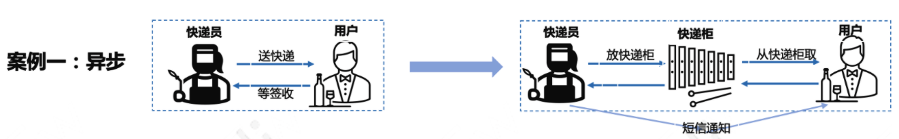
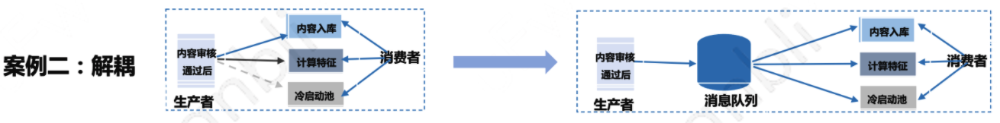
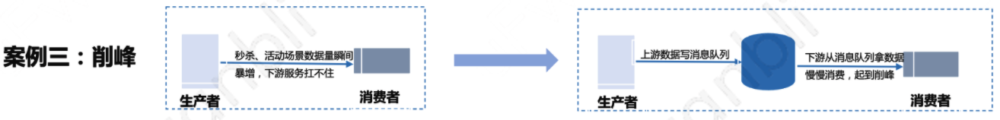
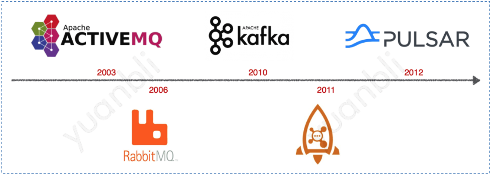
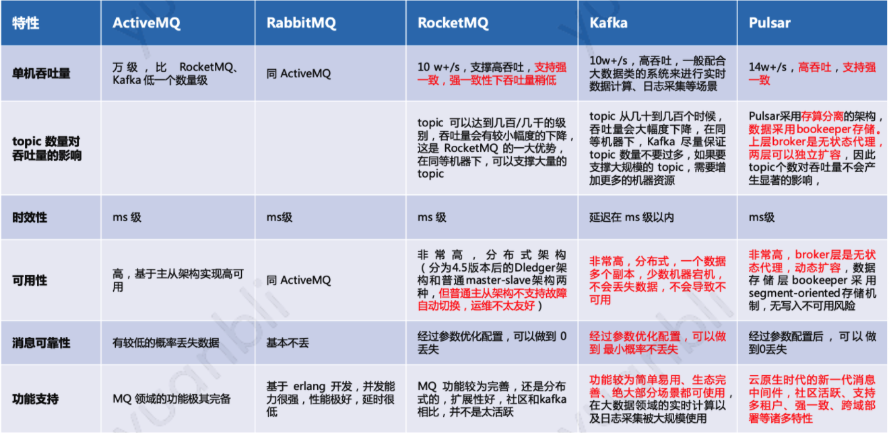
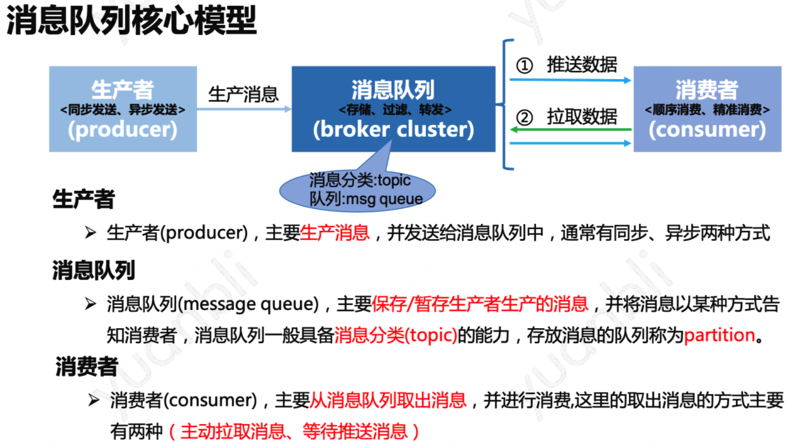
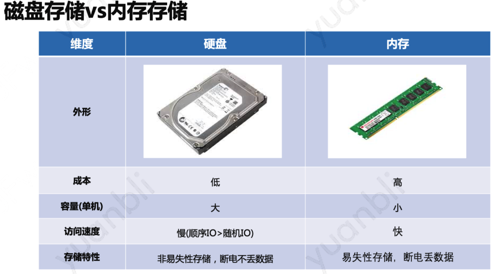
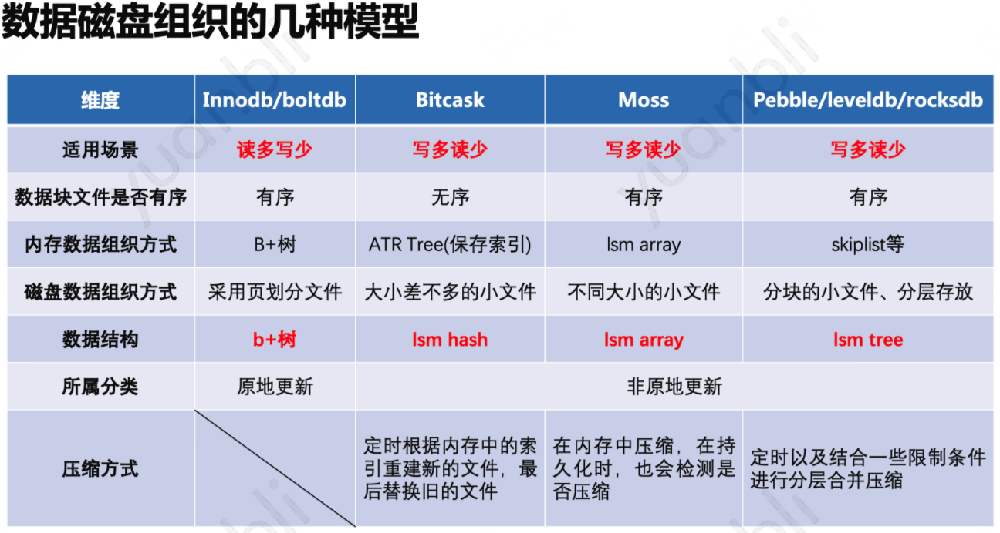
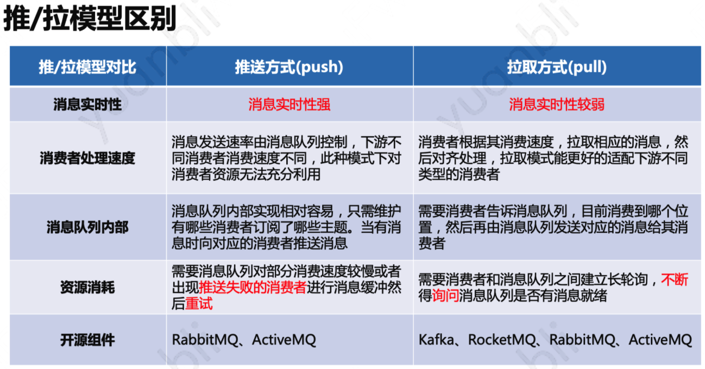
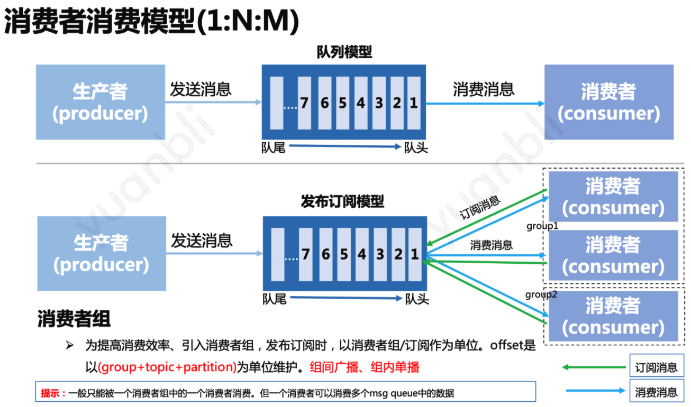

## 1. 消息队列适合场景

**消息队列：它主要用来暂存生产者生产的消息，供后续其他消费者来消费。它的功能主要有两个：a.暂存(存储)、b.队列(有序：先进先出)。其他大部分场景对数据的消费没有顺序要求，主要用它的暂存能力** 。从目前互联网应用中使用消息队列的场景来看，主要有以下三个：

1. 异步处理数据
2. 系统应用解耦
3. 业务流量削峰

### 1.1 异步处理数据

第一个例子我们以现实生活中**送快递**来类比，在该例子中我们把**暂存快递的快递柜**比作**暂存数据的消息队列**。我们来看一下在现实生活中，没有快递柜时，快递员把快递送到目的地后，一般需要把联系收货人来签收快递，如果收货人此时有空，那一切都很顺利。但如果收货人此时不方便(开会、正在吃午饭、外出出差)。那对于快递员而言，就很尴尬，需要一直等待(开会or吃午饭)或者将快递拿回去(外出出差)，导致白跑一趟。这对于快递员而言简直太不友好。

从这儿可以看出，当快递员送货时，是一个同步状态，即需要等待收货人签收后才能去送下一趟单子，对快递员而言效率太低。上述例子虽然有点牵强，大家凑合理解，意思能大概理解到位就ok。

接着我们再来看一下，当有了快递柜后，对于快递员而言，每次需要送快递时，只需要将快递投掷到快递柜，然后再通过短信或者电话通知收货人具体的快递信息即可。他就可以继续去派送下一单。而对于收获人而言，也可以根据具体方便的时间来取件。这样一来，二者完全异步了，不用相互等待了。

在这个例子中，如果把快递员比作生产者，收货人比作是消费者，则快递柜就类似于消息队列。我们可以通过采用消息队列来实现异步数据的处理。

### 1.2 系统应用接耦

我们以目前最主流的推荐系统中内容的流转来举例。在推荐系统中当创作者发布了一条内容后，该内容会首先经过安全部分的相关审核，通过审核后的内容，通常需要进行内容入库存储、送入模型进行特征的计算和生成。

假如后期我们想提升推荐的效果，需要单独构建一份冷启动的推荐池，此时也需要用到这部分内容，那问题来了，在没有使用消息队列时，对于上游服务而言，需要通过扩展新的逻辑来实现该功能。同时在该场景里，会存在依赖三个下游服务，如果其中一个下游服务失败后，该如何处理，是重试还是返回失败等这些细节的处理。如果后期这部分数据还想在其他渠道分发，那又该如何对接。明显这种场景下面临着系统紧耦合的问题。

我们再来看一下，如果我们一开始就引入了消息队列，那问题又会变成怎样的呢？当内容审核通过后，就直接将数据生产出来丢到消息队列中，下游的多个服务再从消息队列消费数据。当后续这一份数据需要扩展供其他系统使用时，也只要通过新的消费者来接入到消息队列消费就ok。上游生产消息的模块不要做任何的改动。

### 1.3 业务流量削峰

消息对应的第三个使用场景便是**削峰**。在现如今的互联网世界中，电商场景中每年的618秒杀活动、双11抢购便是最典型的案例。这种场景中系统的峰值流量往往集中于一小段时间内，平常的流量比较可控，所以为了防止系统在短时间内的峰值流量冲垮，往往采用消息队列来削弱峰值流量，高峰值期间产生的订单消息等数据首先送入到消息队列中暂存，然后供下游系统根据自己的消费能力来逐步处理。同时这类消息往往对时延的要求不是很高，比较适合采用消息队列暂存。

### 1.4 总结

上面通过三个简单的实例介绍了消息队列的典型的三个使用场景：**异步**、**解耦**、**削峰**。换个角度来理解可以看到，消息队列主要适用于处理**对消息要求不是很实时，同时一份数据可能会多处使用的场景，不同的使用方处理速率不同。**

## 2. 开源消息队列产品

### 2.1 消息队列主流产品

上图根据时间线展示了不同时间点产生的消息列队产品，主要的产品有：ActiveMQ(2003)、RabbitMQ(2006)、Kafka(2010)、RocketMQ(2011)、Pulsar(2012)。

**ActiveMQ：** ActiveMQ由Apache软件基金会基于Java语言开发的一个开源的消息代理。能够支持多个客户机或服务器。计算机集群等属性支持ActiveMQ来管理通信系统。

**RabbitMQ：** RabbitMQ是实现了高级消息队列协议（AMQP）的开源消息代理软件（亦称面向消息的中间件）。RabbitMQ服务器是用Erlang语言编写的，而集群和故障转移是构建在开放电信平台框架上的。所有主要的编程语言均有与代理接口通讯的客户端库。RabbitMQ支持多种消息传递协议、传递确认等特性。

**Kafka：** Apache Kafka是由Apache软件基金会开发的一个开源消息系统项目，由Scala写成。Kafka最初是由LinkedIn开发，并于2011年初开源。2012年10月从Apache Incubator毕业。该项目的目标是为处理实时数据提供一个统一、高通量、低等待的平台。Kafka是一个分布式的、分区的、多复本的日志提交服务。它通过一种独一无二的设计提供了一个消息系统的功能。

**RocketMQ：** Apache RocketMQ是一个分布式消息和流媒体平台，具有低延迟、**强一致**、高性能和可靠性、万亿级容量和灵活的可扩展性。它有借鉴Kafka的设计思想，但不是kafka的拷贝。

**Pulsar：** Apache Pulsar 是 Apache 软件基金会顶级项目，是下一代云原生分布式消息流平台，集消息、存储、轻量化函数式计算为一体，采用计算与存储分离架构设计，支持多租户、持久化存储、多机房跨区域数据复制，具有**强一致性**、高吞吐、低延时及高可扩展性等流数据存储特性，被看作是云原生时代实时消息流传输、存储和计算最佳解决方案。

### 2.2 不同消息队列对比

## 3. 消息队列背后的设计思想

### 3.1 消息队列核心模型

对于一个消息队列而言，从数据流向的维度，可以拆解为三大部分：**生产者**、**消息队列集群**、**消费者**，数据是从生产者流向消息队列集群，最终再从消息队列集群流向消费者。

**生产者：** 生产数据的服务，通常也称为数据的输入提供方，这里的数据通常指我们的业务数据，例如推荐场景中用户对内容的点击数据、内容曝光数据、电商中的订单数据等等。生产者通常是作为客户端的方式存在，但在支持事务消息的消息队列中，生产者也被设计为服务端，实现事务消息这一特性。其次生产者通常会有多个，消息队列集群内部也会有多个分区队列，所以在生产者发送数据时，通常会存在负载均衡的一些策略，常见的有**按key hash**、**轮询**、**随机**等方式。其本质是**一条数据，被消息队列封装后也被称为一条消息，该条消息只能发送到其消息队列集群内部的一个分区队列中。因此只需按照一定的策略从多个队列中选择一个队列即可**。

**消息队列集群：** 消息队列集群是消息队列这种组件实现中的核心中的核心，它的主要功能是**存储消息**、**过滤消息**、**分发消息**。

- 存储消息：指生产者生产的数据需要存储到消息队列内部；存储消息可以说是消息队列的核心，一个消息队列吞吐量的高低、性能优劣都和它的存储模型脱不开关系

- 过滤消息：指消息队列可以通过一定的规则或者策略进行消息的过滤，该项能力通常也被称为消息路由；过滤消息属于高阶的特性功能，AMQP协议对这些能力抽象的比较完备，部分消息队列可以选择性的实现该协议来达到该功能

- 分发消息：指消息队列通常需要将消息分发给处理同一逻辑的多个消费者处理或者处理不同逻辑的不同消费者处理。分发消息可以说和消费者模型想挂钩，这块会涉及到不同的数据获取方式，也会涉及到消费者消费消息的模型

**消费者：** 最终消息队列存储的消息会被消费者消费使用，消费者也可以看做消息队列中数据的输出方。消费者通常有两种方式从消息队列中获取数据：**推送(push)数据**、**拉取(pull)数据**，其次消费者也经常是作为客户端的角色出现在在消息队列这种组件中。

### 3.2 消息队列数据组织方式

通常数据的存储无外乎就是两种，一种是存储在**非易失性存储**中，例如磁盘这种介质；另一种是选择存储在**易失性存储**中，典型的就是内存。

在大部分组件设计时，往往会选择一种主要介质来存储、另一种介质作为辅助使用。就拿redis来说，它主要采用内存存储数据，磁盘用来做辅助的持久化。拿RabbitMQ举例，它也是主要采用内存存储消息，但也支持将消息持久化到磁盘。而RocketMQ、Kafka、Pulsar这种，则是数据主要存储在磁盘，通过内存来主力提升系统的性能。关系型数据库例如mysql这种组件也是主要采用磁盘组织数据，合理利用内存提升性能。

**针对采用内存存储数据的方案而言：**

- 难点一在于如何在不降低访问效率的情况下，充分利用有限的内存空间来存储尽可能多的数据，这个过程中少不了对数据结构的选型、优化
- 难点二在于如何保证数据尽可能少的丢失，我们可以看到针对此问题的解决方案通常是快照+广泛意义的wal(即Write-Ahead Logging,预写式日志)文件来解决。此类典型的代表就是redis

**针对采用磁盘存储数据的方案而言:**

- 难点一在于如何根据系统所要解决的特点场景进行合理的对磁盘布局。读多写少情况下采用b+树方式存储数据；写多读少情况下采用lsm tree这类方案处理
- 难点二在于如何尽可能减少对磁盘的频繁访问，一些做法是采用mmap进行内存映射，提升读性能；还有一些则是采用缓存机制缓存频繁访问的数据。还有一些则是采用巧妙的数据结构布局，充分利用磁盘预读特性保证系统性能

**总的来说，针对写磁盘的优化，要不采用顺序写提升性能、要不采用异步写磁盘提升性能(异步写磁盘时需要结合wal保证数据的持久化，事实上wal也主要采用顺序写的特性)；针对读磁盘的优化，一方面是缓存、另一方面是mmap内存映射加速读**。

### 3.3 获取数据的推、拉方案对比

消费者在从消息队列中获取数据时，主要有两种方案：

- 等待推送数据
- 主动拉取数据

推拉模型不仅仅只用于消息队列这种组件中，更一般意义上，它解决的其实是数据传送双方的一个问题。本质是**数据需要从一方流向另一方**。下面这两个例子都是遵循这个原则。

**网络中传输的数据：** 在IO多路复用中，以epoll为例，当内核检测到监听的描述符有数据到来时，epoll_wait()阻塞会返回，上层用户态程序就知道有数据就绪了，然后可以通过read()系统调用函数读取数据。这个过程就绪通知，类似于推送，但推送的不是数据，而是数据就绪的信号。具体的数据获取方式还是需要通过拉取的方式来主动读。

**feeds流系统用户时间线后台实现方案(读扩散、写扩散)：** 读扩散和写扩散更是这样一个case。对于读扩散而言，主要采用拉取的方式获取数据。而对于写扩散而言，它是典型的数据推送的方式。当然在系统实现中，更复杂的场景往往会选择**读写结合**的思路来实现。

### 3.4 消息队列消费模型

**消费者消费者模型其实是一个1:N:M的关系，一份数据被N个消费者组独立使用，每个消费者组中有M个消费者进行分摊消费**

其实这种模型也称为**发布订阅模型**，对于一条消息而言，组间广播、组内单播。一条消息只能被一个消费者组中的一个消费者使用。在消费者组内部也存在一些负载均衡的策略。常用的有：**轮询**、**随机**、**hash**、**一致性hash**等方案。

### 3.5 总结

重点介绍了关于消息队列背后的一些设计思想，其中包括：**消息队列的核心模型**、**数据存储模型**、**推拉方案获取数据对比**、**消费者消费模型**。

