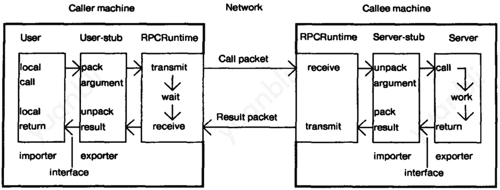
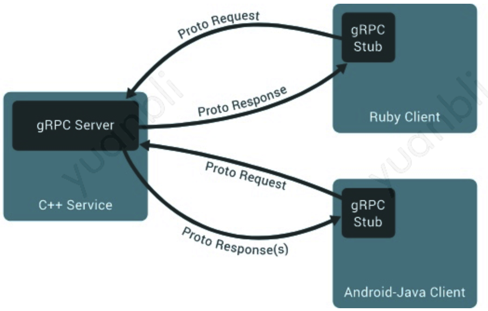
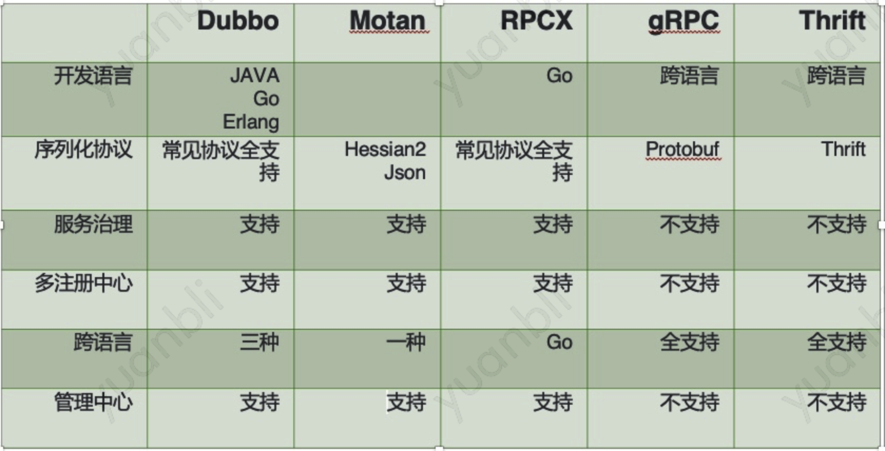

# 1. RPC基本框架

## 1.1 RPC基本框架

RPC(Remote Procedure Calls)就是远程调用。像是调用本地函数一样进行跨服务的函数调用。在微服务的基础上，相关依赖的调用，就变成了跨服务之间的调用，通信方式就是RPC。

### 1.1.1 基础结构

RPC协议包含五个部分：

1. CLient
2. Client-stub
3. RPCRuntime
4. Server-stub
5. Server

Client发起一个远程调用，实际是调用本地的Stub。本地的Stub负责将调用的接口、方法和参数，通过约定的协议规范进行编码，并通过本地的RPCRuntime进行传输，然后将数据包发送到网络上传输出去。Server端的RPCRuntime收到请求后，交给Server-Stub解码，然后调用服务端方法，获得返回结果，Server-Stub将返回结果编码，发送给Client，Client端端RPCRuntime收到返回结果，通过Clinent-Stub解码得到结果，返回给客户端。

分为三个层次：

- 客户端和服务端：像本地调用一样，专注于业务逻辑的处理即可
- Stub层：处理双方约定好的语法、语义、封装、解封装
- RPCRuntime：处理高性能的传输，以及网络错误和异常

## 1.2 RPC框架的重点

### 1.2.1 数据序列化

序列化就是将数据结构或对象转换成二进制的过程，也是编码的过程，序列化后的数据更加方便进行网络传输；反序列化就是将序列化过程中生成的二进制转换为数据结构或对象的过程，将二进制转换为对象后业务才更好的进行处理。常见序列化协议：

- protobuf
- json
- xml

常见的RPC框架如：gRPC、Doubbo、RPCX、Motan等都会支持上述协议，尤其是pb和json。
### 1.2.2 网络传输
数据被序列化之后就可以进行网络传输了，网络传输就是如何将数据传输到目标服务器，常见到通信方式有：TCP、UDP、HTTP/HTTP2.0、QUIC协议，TCP是大部分框架默认支持到，RPCX支持QUIC而GRPC支持HTTP2.0。

QUIC(Quick UDP Internet Connection)是谷歌制定的互联网传输层协议，基于UDP协议，同时兼容TCP、TLS、HTTP/2.0等协议的可靠性与安全性，可以有效的减少连接与传输延迟。

### 1.2.3 RPC调用方式
网络传输是数据传输基础的一方面，发起RPC调用，还需要考虑RPC的调用方式：
- 同步RPC：常用的调用方式，实现简单
- 异步RPC：客户端发起服务调用后，不同步的等待响应，而是注册监听器或回调函数，待接收到响应后发起异步回调，驱动业务流程继续执行，实现较复杂
- 并行RPC：并行服务调用，一次I/O操作，发起批量调用然后同步等待响应
### 1.2.4 服务治理
RPC协议只定义了Client和Server之间的点对点调用流程，包括Stub、通信协议、RPC消息解析等部分。但是实际使用中，远程过程调用还需要考虑服务的路由、负载均衡、高可用等问题。

保障服务之间的调用就需要进行服务治理，服务治理的基本涵盖：服务注册和发现、限流、降级、熔断、重试、失败处理、负载均衡。

## 1.3 常见RPC框架

RPC框架就是在RPC协议的基础上，完善一些偏业务实际应用的功能，从而满足不同场景的业务诉求。RPC大致可以分为两种不同的侧重方向：

- 服务治理
- 跨语言调用

### 1.3.1 服务治理型RPC框架

服务治理型的RPC框架有Dubbo、DubboX、Motan、RPCX等。

- Dubbo是阿里开源的分布式服务框架，可以实现高性能RPC调用，并通过了丰富的管理功能
  - 序列化：Protobuf、jsonRPC、Hessian2
  - 兼容协议：gRPC、Thrift
  - Triple协议是Dubbo3的主力协议，完整兼容gRPC over HTTP/2
- DubboX是基于Dubbo框架开发的RPC框架，支持REST风格远程调用，并增加了新的feature
- Motan是微博开源的轻量级、方便使用的Java语言的RPC框架
  - 使用对java更友好的hessian2进行序列化
  - 通信协议支持Motan、HTTP、TCP

- RPCX是一个用Go实现的类似Dubbo的分布式RPC框架
  - 支持多种编解码协议，如：Gob、Json、gencode、ProtoBuf等
  - 支持常见的服务治理策略
  - 支持TCP、HTTP、QUIC和KCP

这类框架特点是功能丰富，通过高性能的远程调用 以及服务发现及治理功能，适用于大型服务的微服务化拆分及管理，缺点是语言耦合度较高，跨语言支持难度较大。

### 1.3.2 跨语言调用型RPC框架

跨语言调用的RPC框架有：

- gRPC是Google开发的高性能、通用的开源RPC框架
  - 支持ProtoBuf
  - 基于HTTP2
  - 支持多种语言
- Thrift是Apache的一个跨语言的高性能服务框架
- Hprose是一款轻量级的、跨语言的、无侵入式、高性能动态远程对象调用引擎库

这类RPC框架重点关注于服务的跨语言调用，能够支持常见的大部分语言进行语言无关的调用，适合不同语言提供通用远程服务的场景。

跨语言指：客户端和服务器可以在各种环境中运行和相互通信，可以用框架支持的任何语言来编写协议，gRPC如图：

### 1.3.2 对比

# 2. 通用的服务化框架设计

微服务框架一般包含了RPC框架。微服务需要提供的能力包括：微服务架构中通讯的基础协议RPC、服务发现注册、负载均衡、容错、熔断、限流、降级、权限、全链路日志追踪。

## 2.1 微服务框架的核心能力

### 2.1.1 服务注册与发现

微服务后服务大量增加，因此需要有一个合适的方案能够发现全部服务，比较常见的服务发现组件如zookeeper、etcd、consul等，基本的原理就是将自己的服务列表注册，然后提供服务发现能力。

服务发现机制有客户端和服务端两种实现方式：

- 服务端发现模式(server-side)：可以通过DNS或者带VIP的负载均衡实现
  - 优点：对客户端无侵入，客户端只需要简单的向负载均衡或者服务域名发起请求，无需关系服务发现的具体细节，也不用引入服务发现的逻辑
  - 缺点是不灵活，并且同时需要引入一个统一的负载均衡器
- 客户端发现模式(client-server)：需要客户端去服务注册中心查询服务地址列表，然后决定通过那个地址去请求对应服务
  - 灵活性高，可以根据客户端诉求进行满足自身业务的负载均衡，但客户端需要引入服务发现的逻辑，同时依赖服务注册中心

### 2.1.2 服务路由&负载均衡

服务路由和服务发现密切相关服务路由通常和服务发现放在一起组成一个系统。服务发现核心功能就是路由算法，也就是负载均衡，负载均衡方案一般可以分为三类：

- 服务端负载均衡
  - 负载均衡在一台单独的主机上，可以使用软负载，如Nginx、LVS等，也可以使用硬负载，如F5等
  - 实现很简单，但是存在单点问题，所有的流量都需要通过负载均衡器，如果负载均衡器存在问题，则直接导致服务不可用；中间经过负载均衡器做代理，性能也有损耗
- 客户端负载均衡
  - 解决了服务器单点问题，每个客户端都实现自己的负载均衡，负载能力和客户端进程在一起
  - 负载均衡要求每个客户端自己实现
- 客户端主机独立负载均衡
  - 将服务发现和负载均衡能力从客户端进程中剥离，客户端进程和负载均衡进程上独立的进程，在同一个主机上。也就是SideCar模式
  - 没有单点问题，如果一个主机负载均衡出问题，只影响一个节点调用，不影响别的节点。性能损耗低

常见的负载均衡算法有：随机路由、轮询路由、hash、权重、最小压力路由、最小连接数路由、就近路由

### 2.1.3 服务容错

负载均衡和容错是服务高可用的重要手段。服务容错的设计基本原则是"Design for Failure"。常见的服务容错策略如：请求重试、流控、隔离

#### 超时和重试

超时是最常见的服务容错模式，主要解决了当依赖服务出现建立网络连接或响应延迟，不需要一直等待的问题，调用方可以根据事先设计的超时时间中断调用，及时释放关键资源，避免系统资源耗尽出现拒绝服务的情况。常见的超时一般有网络连接超时时间、RPC的响应超时时间等。

重试一般会和超时模式结合使用，适用于对于下游服务的数据强依赖的场景，通过重试来保证数据的可靠性和一致性，常用于网络抖动导致服务调用出现超时的场景。在重试的设计一般会使用***Exponential Backoff***策略，即"指数级退避"，没次重试所需要sleep时间都会指数增加，否则可能导致拖累整个系统

#### 服务限流

限流和降级用来保证核心服务的稳定性；限流是指限制每个服务的最大访问量、降级是指高峰期对非核心的系统进行降级从而保证核心服务的可用性

限流的实现方式：

- 计数器方式(最简单)
- 队列算法
  - 常规队列FIFO
  - 优先级队列
  - 带权重的队列
- 漏斗(漏桶)算法Leaky Bucket
- 令牌桶算法Token Bucket
- 基于响应时间的动态限流
  - 参考TCP协议中算法：TCP使用RTT来探测网络的延时和性能，从而设定滑动窗口大小

分布式限流和单机限流：

- 单机限流：有多种限流算法可供选择，主要是两种：漏桶算法和令牌桶算法。如果要对并发总数进行严格限制的话，漏桶算法更适合一点
- 分布式限流(集群限流)：集群限流的情况更加复杂，一般都是去中心化设计
  - 可以选择在各个微服务节点上实现一个计数器，对单位时间的调用进行计数，计数值会被定期的汇总到日志中心，由统计分析器进行统一汇总，计算这个时间点总调用，集群限流分析器拿到这个总调用，并和预先定义的限流阈值对比，得出限流比例，通过注册中心将限流比例下发到各个服务器节点，服务器节点基于限流比例会各自算出当前节点对应的最终限流阈值，最后利用单机限流进行流控
  - 分布式限流常用框架包括Hystrix、resilience4j

#### 容错降级

容错降级可以分为三大类，从小到大依次是：

- 接口降级：对非核心接口，可以设置直接返回空或者异常，可以在高峰期减少接口对资源如CPU、内存、磁盘、网络的占用和消耗
- 功能降级：对非核心功能，可以设置该功能直接执行本地逻辑，不做跨服务、跨网络访问；也可以设置降级开关，一键关闭指定功能，保证整体稳定；还可以通过熔断机制实现
- 服务降级：对非核心服务，可以通过服务治理框架根据错误率或响应时间自动触发降级策略；还可以通过断路器实现

#### 熔断

熔断器一般需要实现三个状态：闭合、断开、半开。分别对应于正常、故障和故障后检测故障是否被修复的场景

- 闭合：正常情况，后台会掉调用失败次数统计，达到阈值或比例则自动启动熔断机制
- 断开：一旦对服务的调用失败次数达到一定阈值，熔断器就会打开，服务的调用将直接返回一个预定的错误，而不执行真正的网络调用。同时熔断器内设置了一个时间间隔，当处理请求达到这个时间间隔时会进入半熔断状态
- 半开：在半开状态下，熔断器会对通过它的部分请求进行处理，如果对这些请求的成功处理数量达到一定比例则认为服务已经恢复正常，就会关闭熔断器，反正就会打开熔断器

熔断器的设计思路一般是：在请求失败N次后在X时间内不再请求，进行熔断；然后再X时间后恢复M%的请求，如果M%的请求都成功则恢复正常，关闭熔断，否则再熔断Y时间，依次循环。

在熔断的设计中，根据`Netflix`的开源组件`hystrix`的设计，最重要的是三个模块：熔断请求判断算法、熔断恢复机制、熔断报警：

- 熔断请求判断机制：根据实现设置的固定时间内失败比例计算
- 熔断恢复：对于被熔断状态，每隔X时间允许部分请求通过，若请求成功则恢复正常
- 熔断报警：对于熔断的请求打开异常日志和监控，异常请求超过阈值则报警

#### 隔离

在服务化框架的隔离设计中，重点需要对系统进行分离，有两种方式：以服务类型来做分离、以用户来做分离

- 以服务类型来做分离的方式：如社交APP，服务类型包括账号系统、聊天系统、可以通过不同系统来做隔离
- 以用户来做分离的方式：如通过策略来实现不同用户访问到不同的实例

### 2.1.4 集群容错

分布式场景下，服务在集群中都是有冗余的，为了容错的同时可以保证高并发，针对大量服务实例的情况下，就有了集群容错的设计，集群容错是微服务集群高可用的保障，有多种策略可供选择：

- 快速失败Failfast：快速失败，只发起一次调用，失败立即报错，通用于靡等性的写操作，如新增记录
- 失败转移Failover：失败自动转换，当出现失败，重试集群其它服务实例。通常用于读操作，但重试会带来更长的延迟，一般都会设置重试次数
- 失败重试Failback：失败自动恢复，后台记录失败请求，定时重发。通常用于消息通知操作
- 聚合调用Forking：并行调用多个服务器，只要一个成功即返回。通常用于实时性要求较高的读操作，但会浪费更多服务资源，可以设置最大并行数
- 广播调用Broadcast：广播调用所有提供者，逐个调用，任意一台报错则报错。通常用于通知所有提供者更新缓存或日志等本地资源信息

## 2.2 微服务框架的基础能力

**1、服务监控和告警**

开源代表：`Prometheus` + `Grafana`

**2、分布式服务Tracing跟踪系统**

目前有两种协议规范：

- OpenTracing：链路跟踪领域的标准，目前业界系统支持最多的标准，开源代表：
  - jaeger
  - zipkin
- OpenTelemetry：可观测领域的标准，对Trace、Metrice、Log统一支持的唯一标准
  - 天机阁

**3、配置中心**

如tconf、七彩石这种

**4、日志分析**

日志组件：

- ELK系统：Elasticsearch、Logstash、Kibana
- 鹰眼

在微服务架构中，一个客户端请求的介入，往往涉及到一系统服务的调用，业界通常的方案是采用全局流水号`TraceId`串联起来。通过全局流水号`TraceId`，从日志里边可以拉出整条调用链路。

## 2.3 微服务框架依托的自动化运维能力

微服务涉及到大量的服务，大量服务的运维就依托自动化运维能力，包括如下几个方面：

- 自动化测试
- 自动化部署
- 生命周期管理

业界目前一般采用容器平台：微服务框架 + K8S容器平台 是当今互联网业务的黄金标准
