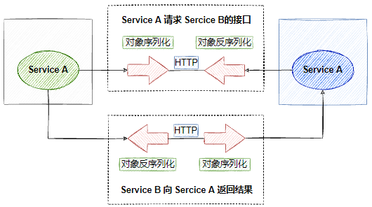

## 1. gRPC概述

### 1.1 RPC框架的关键要素

- 接口定义
- 通信协议
- 序列化机制

### 1.2 gRPC的解决方案

- 接口定义：Protocol Buffers
- 通信协议：HTTP/2
- 序列化机制：Protocol Buffers（二进制）/JSON

## 2. gRPC的四种通信模式

## 3. gRPC的底层原理

## 4. gPRC的高级用法

## 5. gRPC的优劣

