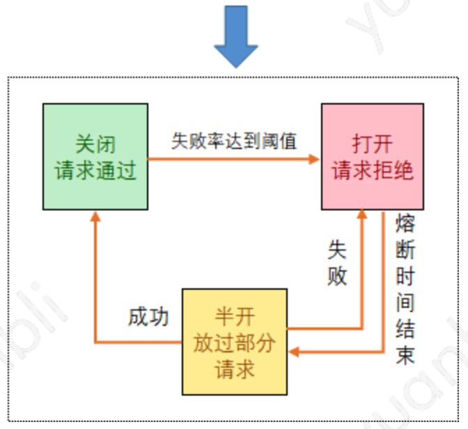

合理运用优秀的算法可以低损耗高性能低解决问题：


## 1. 调度算法

调度算法随处可见，资源的调度，请求的分配，负载均衡的策略等都与调度算法相关。调度算法没有好坏之分，适合业务场景的才是最好的。

### 1.1 轮询

轮询是非常简单并且常用的一种调度算法，轮询即将请求依次分配到各个服务节点从第一个节点开始，依次将请求分配到最后一个节点，然后重新开始下一轮循环。最终所有的请求会均摊分配在每个节点上，假设每个请求消耗是一样的，那么沦陷调度是最平衡的调度算法。

### 1.2 加权平均

有时候服务节点的性能配置各不相同，处理能力不一样，针对这种情况，可以根据节点处理能力的强弱配置不同的权重值，采用加权轮询的方式进行调整。

- 调度节点记录所有服务节点的当前权重值，初始化为配置对应值
- 当有请求需要调度时，每次分配选择当前权重最高的节点，同时被选择的节点权重值减一
- 若所有节点权重值都为零，则重置为初始化配置的权重值

最终所有请求会按各节点的权重值成比例的分配到服务节点上，假设有三个服务节点{a, b, c}，配置的权重为{2, 3, 4}，那么请求分配的次序将是：{c, b, c, a, b, c, a, b, c}。

### 1.3 平滑权重轮询

加权轮询比较容易造成某个服务节点段时间被集中调用，导致瞬时压力过大，权重高的节点会被先选中直至达到权重次数才会选择下一个节点，会出现请求连续的分配在同一个节点上的情况，例如：三个服务节点{a, b, c}，权重配置分别是{5, 1, 1}，那么加权轮询调度请求的分配次序将是{a, a, a, a, a, b, c}，a节点有连续多个请求被分配。

平滑权重轮询实现了基于权重的平滑轮询算法。在一段时间，不仅服务节点被选择次数的发布和权重一致，而且调度算法还能均匀的选择节点，不会在一段时间内集中选择某一个权重较高的服务节点。算法描述如下：

- 调度节点记录所有服务节点当前权重，初始化为配置对应值
- 当有请求需要调度时，每次先把各节点的当前权重值加上自己的配置权重值，然后选择分配当前权重最高的节点，同时被选择的节点权重值减去所有节点的原始权重总和
- 若所有节点权重值都为零，则重置为初始化时配置的权重值

假设三个服务节点{a, b, c}，权重分别是{5, 1, 1}，那么平滑权重分配过程如下：

| 请求序号 | 当前权重  | 选中节点 | 调整后权重 |
| :------: | :-------: | :------: | :--------: |
|    1     |  {5,1,1}  |    a     |  {-2,1,1}  |
|    2     |  {3,2,2}  |    a     |  {-4,2,2}  |
|    3     |  {1,3,3}  |    b     |  {1,-4,3}  |
|    4     | {6,-3,4}  |    a     | {-1,-3,4}  |
|    5     | {4,-2,5}  |    c     | {4,-2,-2}  |
|    6     | {9,-1,-1} |    a     | {2,-1,-1}  |
|    7     |  {7,0,0}  |    a     |  {0,0,0}   |

最终分配次序为{a, a, b, a, c, a, }，相对于普通权重轮询算法更平滑一些。

### 1.4 随机

随机将每次请求分配到服务节点上，随机的优点是完全无状态的调整，调整节点不需要记录过往请求分配情况的数据。理论上请求量足够大的情况下，随机算法会趋于完全平衡的负载均衡调度算法。

### 1.5 加权随机

类似于加权轮询，加权随机支持根据服务节点处理能力的大小配置不同的权重值，当有请求需要调度时，每次根据节点的权重值做一次加权随机分配，服务节点权重越大，随机到的概率就越大。最终所有请求分配到各个节点的数量与节点配置的权重成正比关系。

### 1.6 最小负载

实际请求中，各个请求可能是异构的，不同请求对服务器的消耗不同，无论是使用轮询还是随机的方式，都可能无法准确的做到完全的负载均衡。最小负载算法是根据各服务节点当前的真实负载能力进行请求分配的，当前负载最小的节点会被优先选择。算法描述如下：

- 服务节点定时向调度节点上报各自的负载情况，调度节点更新并记录所有服务节点当前负载值
- 当有请求需要调度时，每次分配选择当前负载最小的服务节点

负载情况可以统计节点正在处理请求量，服务器的CPU及内存使用率，过往请求的响应延迟情况等数据。

### 1.7 两次随机选择策略

最小负载算法可以在请求异构情况下做到更好的均衡性。但是一般情况下服务节点的负载数据都是定时同步道调度节点，存在滞后性，使用滞后的负载数据进行调度会导致产生“群居”行为，这种行为中，请求将被批量的发送到当前某个低负载的节点，而下一次同步更新负载数据，该节点又可能处于较高位置，然后不被分配任何请求。使服务节点一直处于很忙和很闲的循环状态，不利于服务器稳定。

两次随机算法针对上述问题做了改进，算法描述如下：

- 服务器节点定时向调度节点上报各自的负载情况，调度节点更新并记录所有服务器节点当前负载值
- 从所有可用节点列表中做两次随机选择，得到两个节点
- 比较两个节点负载情况，选择负载更低的节点作为被调度节点

两次随机选择结合了随机和最小负载算法的优点，避免了"群居"行为。

### 1.8 一致性哈希

为了保序和充分利用缓存，通常希望相同请求key的请求总被分配到同一个服务节点上，以保持请求到一致性，所以就有了一致性哈希的调度方式。

#### 1.8.1 划段

最简单的一致性哈希方案就是划段，事先规划好资源段，根据请求key值映射找到所属段，比如通过配置的方式，配置id为 [1 - 10000] 的请求映射到服务节点1，[10001 - 20000] 的请求映射到节点2等等。这种方式存在很大局限性，对于平衡性和稳定性也不太理想。

#### 1.8.2 割环法

割环法的实现有很多种，原理都类似。将N台服务节点地址哈希成N组整型值，该组整型即为该服务器节点的所有虚拟节点，将所有虚拟节点打散在一个环上。

请求分配过程中，对于给定的对象key也哈希映射成整型值，在环上搜索大于该值的第一个虚拟节点，虚拟节点对应的实际节点即为该对象需要映射到的服务节点。

如下图所示：对象K1映射到节点2，对象K2映射到节点3:


割环法实现的时间复杂度为O(log(vn))，n是服务节点个数，v是每个节点拥有的虚拟节点数。该算法具有很好的单调性，而平衡性和稳定性要取决于虚拟节点的个数和虚拟节点生成规则，例如 ketama hash 割环法采用的是通过服务节点 ip 和端口组成的字符串的 MD5 值来生产160组虚拟节点。

#### 1.8.3 二次取模

取模哈希映射是一种简单的一致性哈希方式，但是简单的一次性取模哈希单调性很差，对故障的容灾不好，一旦某台服务节点不可用，会导致大部分的请求被重新分配到新节点，造成缓存的大面积迁移，因此有了二次取模的一致性哈希。

二次取模算法即调度节点维护两张服务节点表：松散表和紧实表。请求分配过程中，先对松散表取模运算，若结果节点可用，则直接选取；若结果节点已不可用，再对紧实表做二次取模运算，得到最终节点。


二次取模算法实现简单，时间复杂度为O(1)，具有较好的单调性，能很好的处理缩容和节点故障的情况。主要取决于对象key的发布是否足够散列。

#### 1.8.4 最高随机权重

以请求key和节点标识作为参数进行一轮散列运算，得出所有节点的权重值进行对比，最终取最大权重值对应节点作为目标映射节点。可以描述为下述公式：


散列运算可以认为是一种保持一致性的伪随机的方式，通过随机比较每个对象的随机值进行选择。这种方式需要O(n)的时间复杂度，换来的是非常好的单调性和平衡性，节点数量变化时，只有当对象的最大权重落在变化的节点上时才受影响，只会影响变化的节点上的对象的重新映射，因此无论扩缩容还是节点故障都能保证以最小代价转移对象，在节点数较少而对于单调性要求非常高的场景可以采用这种方式。

#### 1.8.5 Jump consistent hash

通过简单的跳跃算法通过给定对象key算出该对象被映射的服务节点，算法如下：

```go
int JumpConsistentHash(unsigned long long key, int num_buckets) 
{
    long long  b = -1, j = 0;
    while (j < num_buckets) {
        b = j;
        key = key * 2862933555777941757ULL + 1;
        j = (b + 1) * (double(1LL << 31) / double((key >> 33) + 1));
    }
    return b;
}
```

## 2. 不放回随机抽样算法

不放回随机抽样即从n个数据中抽取m个不重复的数据。

### 2.1 Knuth洗牌抽样

不放回随机抽样可以当成一次洗牌算法过程，利用洗牌算法来对序列进行随机排序，然后选取前m个序列作为抽样结果。Knuth洗牌算法是在Fisher-Yates洗牌算法中改进而来的，通过交换位置的方式代替了删除操作，将每个被删除的数字交换为最后一个未删除的数字。算法可以描述为：

- 生成数字1到n的随机排列，数组索引从1开始，且 i <= j < n

```go
for i=1; i<n; i++ {
	j = rand.Int() //保证i <= j < n
  a[i], a[j] = a[j], a[i]
}
```

## 3. 排序算法

### 3.1 基础排序

基础排序是建立在通过对元素排序码进行比较实现排序的算法。

#### 3.1.1 冒泡排序


## 4. 限流与过载保护

复杂业务场景，经常容易遇到瞬时请求量的突增，可能导致服务器占用过多资源，发生大量的重试和资源竞争，导致响应速度降低、超时、乃至宕机，甚至引发雪崩造成整个系统不可用。

应对这种情况，通常需要系统具备可靠的限流和过载保护的能力，对于超出系统承载能力的部分请求作出快速拒绝，丢弃处理，保证本服务或下游服务的稳定。

### 4.1 计数器

计数器算法是限流算法里最简单也是最容易实现的一种算法。计数器算法可以针对某个用户的请求，或某类接口请求，或全局总请求量进行限制。

比如设定针对单个玩家的登录协议，每3秒才能请求一次，服务器可以在玩家数据上记录上次登录时间，通过与本次登录时间对比，判断是否超过了3秒来决定本次请求是否需要继续处理。

又如针对某类协议，假设我们设定服务器同一秒内总登录协议请求次数不超过100条，可以设置一个计数器，当一个请求过来，计数器加1，如果计数器值大于100，那么判定为达到请求上限，拒绝服务。每秒将计算机置零。

也可以设置多个不同间隔的计算器结合的方式进行限频，如登录请求每秒不超过100且每分钟不超过1000.

### 4.2 漏桶

漏桶算法原理简单，假设有一个水桶所有请求都会先丢进漏桶中，漏桶则以固定的速率处理请求，当请求速率过大，漏桶中的请求将被丢弃，如下图所示：


### 4.3 令牌桶

对于很多应用场景来说，除了要求能限制请求的固定处理速率外，还要求允许某种程度的突发请求量，这时候漏桶算法可能就不合适了。

令牌桶算法的原理是系统会以一个恒定速度往桶里放入令牌，而如果请求需要被处理，则需先从桶里获取一个令牌，当桶里没有令牌时，则拒绝服务。算法大概描述如下：

1. 所有请求在处理之前都需要拿到一个可用的令牌才会被处理
2. 根据限流大小，设置按照一定速率往桶里添加令牌
3. 桶设置的最大放置令牌限制，当桶满时，新添加的令牌就被丢弃
4. 请求达到后首先要获取令牌桶中的令牌，拿着令牌才能进行其他业务逻辑，处理完业务逻辑后，将令牌删除


### 4.4 滑动窗口

计数器，漏桶和令牌桶算法是在上游节点做的限流，通过配置系统参数做限制，不依赖于下游服务的反馈数据，对于异构请求不太适用，且需预估下游节点的处理能力。

滑动窗口限制类似 *TCP* 的滑动窗口协议，设置一个窗口大小，这个大小即当前最大在处理中的请求量，同时记录滑动窗口的左右端点，每次发送一个请求就将右端口往前移一格，每次收到请求处理完毕响应后窗口左端点往前移一格，当左右端点差值超过最大窗口大小时，等待或拒绝服务。


### 4.5 SRE自适应限流

滑动窗口是以固定的窗口大小限制请求的，而 *Google* 的 *SRE* 自适应限流相当于是一个动态的窗口，根据过往请求的成功率动态调整向后端发送请求的速率，当成功率越高请求被拒绝的概率越小，反之，成功率越低请求被拒绝的概率就相应越大。

*SRE* 自适应限流算法需要在应用层记录过去两分钟的两个数据信息：

- *requests*：请求总量
- *accepts*：成功被后端处理的请求数

请求被拒绝的概率 *p* 的计算公式如下：


1. *K* 为倍率因子，由用户设置
2. 正常情况下 *requests* 等于 *accepts*，请求被拒绝的概率 *p = 0*
3. 后端出现异常，则 *accepts* 的数量会逐渐小于 *requests*，直到 *accepts* 等于 *K accepts* ，一旦超过这个值，自适应限流启动，新请求会以概率 *p* 被拒绝
4. 当后端逐渐恢复时，*accepts* 逐渐增加，概率 *p* 增大

可以针对不同场景处理更多请求带来的风险成本与拒绝更多请求带来的服务损失成本之间进行权衡，调整*K*大小：

- 降低 *K* 值会使自适应算法更加激进，可能拒绝更多请求，服务损失成本增高，风险成本降低
- 增加 *K* 值会使自适应限流算法放过更多请求，服务损失成本降低，风险成本升高

### 4.6 熔断

熔断算法的原理是系统统计并定时检查过往请求的失败比例，当失败率达到一定阈值后，熔断器开启，并休眠一段时间，当休眠期结束后，熔断器关闭，重新往后端节点发送请求，并重新统计失败率，周而复始，如下图：


### 4.7 Hystrix半开熔断器

*Hystrix* 半开熔断器相对于简单熔断增加了一种半开状态，*Hystrix* 在运行过程中会向每个请求对应的节点报告成功、失败、超时和拒绝的状态，熔断器维护计算机统计的数据，根据这些统计的信息来确定熔断器是否打开。如果打开，后续的请求都会被截断。然后会隔一段时间，尝试半开状态，即放一部分请求过去，相对于对服务进行一次健康检查，如果服务恢复，熔断器关闭，随后完全恢复调用，如果失败，则重新打开熔断器，继续进入熔断等待状态，如下图所示：



## 5. 序列化与编码

数据结构序列化是将数据或对象状态转换为可取用格式，后续可以在相同或另一台计算机环境中，可以恢复原先状态的过程。经过依照序列化格式重新获取字节的结果时，可以利用它来产生与原始对象相同语义的副本。

### 5.1 标记语言

标记语言时一种将文本（Text）以及文本相关的其他信息结合起来，展现出关于文档结构和数据处理细节的计算机文字编码。

#### 5.1.1 超文本标记语言（HTML）

HTML是一种用于创建网页的标准标记语言。HTML是一种基础技术，常与CSS、JavaScript一起被众多网站用于设计网页、网页应用程序以及移动应用程序的用户界面。网页浏览器可以读取HTML文件，并将其渲染成可视化网页。HTML描述了一个网站的结构语义随着线索的呈现，使之成为一种标记语言而非编程语言。

#### 5.1.2 可扩展标记语言（XML）

XML是一种标记语言，设计用来传送及携带数据信息。每个XML文档都由XML声明开始，在前面的代码中的第一行就是XML声明<?xml version="1.0"?>。这一行代码会告诉解析器或浏览器这个文件应该按照XML规则进行解析。

#### 5.1.3 Markdown

Markdown是一种轻量级标记语言，创始人为约翰·格鲁伯。它允许人们使用易读易写的纯文本格式编写文档，然后转换成有效的XHTML（或者HTML）文档。这种语言吸收了很多在电子邮件中已有的纯文本标记的特性。

由于Markdown的轻量化、易读易写特性，并且对于图片，图表、数学式都有支持，目前许多网站都广泛使用Markdown来撰写帮助文档或是用于论坛上发表消息。如GitHub、Reddit、Diaspora、Stack Exchange、OpenStreetMap 、SourceForge、简书等，甚至还能被用来撰写电子书。当然还有咱们的KM平台，很强大。

#### 5.1.4 JSON

JSON是以数据线性化为目标的轻量级标记语言，相比于XML，JSON更加简洁、轻量和具有更好的可读性。JSON的基本数据类型和编码规则：

- 数值：十进制数，不能有前导0，可以为负数，可以有小数部分。还可以用e或者E表示指数部分。不能包含非数，如NaN。不区分整数与浮点数。
- 字符串：以双引号""括起来的零个或多个Unicode码位。支持反斜杠开始的转义字符序列。
- 布尔值：表示为true或者false。
- 数组：有序的零个或者多个值。每个值可以为任意类型。序列表使用方括号[，]括起来。元素之间用逗号,分割。形如：[value, value]
- 对象：若干无序的“键-值对”（key-value pairs），其中键只能是字符串。建议但不强制要求对象中的键是独一无二的。对象以花括号{开始，并以}结束。键-值对之间使用逗号分隔。键与值之间用冒号:分割。
- 空值：值写为null

### 5.2 TLV二进制序列化


## 6. 加密与校验


## 7. 缓存淘汰策略

服务器常用缓存来提升数据访问性能，但由于缓存容量有限，当缓存容量到达上限，就需要淘汰部分缓存数据挪出空间，这样新数据才可以添加进来。好的缓存应该是在有限的内存空间被尽量保持最热的数据在缓存中，可以提高缓存命中率，因此如何淘汰数据有必要进行一番考究。缓存淘汰有多种策略，可以根据不同的业务场景来选择最合适的淘汰策略。

### 7.1 FIFO

*FIFO(First In First Out)* 是一种先进先出的数据缓存器，当访问的数据节点不在缓存时，从后端拉取节点数据并插入在队列头，如果队列已满，则淘汰最先插入队列的数据。

算法描述如下图：


### 7.2 LRU

*LRU(Least recently used)* 是最近最少使用缓存淘汰算法，根据数据的历史访问记录来进行淘汰数据。核心思想是认为最近使用的数据是热门数据。因此当缓存容量满的时候，优先淘汰最近最少使用的数据。即每次将被访问的数据移到队列头节点。

算法描述如下图：


*LRU* 算法缺陷在于对于偶发的访问操作，比如批量查询某些数据，可能使缓存中热门数据被偶发使用的数据替代，造成缓存污染，导致缓存命中率下降。

### 7.3 LFU

*LFU* 是被使用最少的淘汰算法，核心思想认为如果数据过去被多次访问，那么未来被访问的频率也更高。*LFU* 的淘汰策略是基于访问次数，使用一个计数器来记录数据被访问的次数，最低访问数的缓存首先被移除。、

算法描述图如下：


*LFU* 可以避免偶发性操作导致缓存命中率下降的问题，但也有缺陷，比如对于一开始有高访问率而之后长时间没有被访问的数据，会一直占有缓存空间，因此一旦数据访问模式改变，*LFU* 可能需要长时间来适应新的访问模式，即*LFU* 存在历史数据影响将来数据的“缓存污染”问题。

### 7.4 LRU-K

*LRU-K* 像是结合了 *LRU* 基于时间访问和 *LFU* 基于访问次数的思想，将 *LRU* 最近使用过一次的判断标准扩展为最近使用过 *K* 次，以提高缓存队列淘汰置换的门槛。需要维护两个队列：访问列表和缓存列表。*LRU* 可以被认为是*LRU-K* 中 *K = 1* 的特殊case。

算法可以描述为：

1. 数据第一次被访问，加入到访问列表，访问列表安一定规则（*FIFO、LRU*）淘汰
2. 当访问列表中的数据访问次数达到 *K* 次后，将数据从访问列表删除，并将数据添加到缓存列表头节点，如果数据已经在缓存列表中，则移动到头节点
3. 若缓存列表数据量超过上限，淘汰缓存列表中排在末尾的数据

假设访问列表和缓存列表长度为4，*K = 2*，算法过程如下：


*LRU-K* 同时能够降低缓存数据被污染的程度，*K* 值越大，缓存列表中数据置换的门槛越高。

### 7.5 Two queues

*Two queues* 可以看作是 *LRU-K* 算法中 *K = 2* 的情况，同时访问列表使用 *FIFO* 淘汰算法的一个特例。算法如下：


### 7.6 LIRS

*LIRS（Low Inter-reference Recency Set）* 算法将缓存分为两部分区域：热数据区和冷数据区。*LIRS* 算法利用冷数据区做一层隔离，目的是即使在有偶发性访问操作时，保护热数据区的数据不会被频繁的置换，以提高缓存命中。

*LIRS* 继承了 *LRU* 根据时间局部性对冷热数据进行预测的思想，并引入了两个衡量数据块的指标：

- *IRR（Inter-Reference Recency）*：表示数据最近两次访问之间访问其他数据的非重复个数
- *R（Recency）*：表示数据最近一次访问到当前时间内访问其它数据的非重复个数，也就是 *LRU* 维护的数据

如下图，从左往右经过 8 次访问后，A 节点此时的 *IRR* 值为 3， *R* 值为1:


*IRR* 可以由 *R* 值计算而来，IRR = 上一刻的R - 当前时刻的R。

### 7.7 MySQL InnoDB LRU

*MySQL InnoDB* 中的 *LRU* 淘汰算法采用了类似 *LIRS* 的分级思想，置换数据方式更加简单，通过判断冷数据在缓存中存在的时间是否足够长（即还没有被 *LRU* 淘汰）来实现。算法描述如下：

1. 访问数据如果位于热数据区，与 *LRU* 算法一样，移动到热数据区的头节点
2. 访问数据位于冷数据区，若该数据已在缓存中超过指定时间，比如 1s，则移动到热数据区的头节点；若该数据存在时间小于指定时间，则位置保持不变
3. 访问数据如果不在热数据区也不在冷数据区，插入冷数据区的头节点，若冷数据区已满，淘汰尾节点数据


## 8. 基数集与基数统计

基数集就是不重复元素的集合，基数统计就是统计基数集中元素的个数。

### 8.1 哈希表

哈希表是根据关键码 *Key* 而直接进行数据访问的数据结构，把关键码映射到一个有限地址区间上放在哈西表中，这个映射函数叫做散列函数。哈希表的设计最关键的是使用合理的散列函数和冲突解决算法。

好的散列函数应该在输入域中较少出现散列冲突，数据元素能被更快的插入和查找。常见的散列函数算法有：直接寻址法、数字分析法、平方取中法、折叠法、随机数法、除留余数法等。

必须要有冲突解决算法，常见的有：

1. **开放定址法**：从发生冲突的那个单元起，按照一定的次序，从哈希表中找到一个空闲的单元，然后把发生冲突的元素存入到该单元。开放定址法需要表长度大于等于需要存放的元素。查询对象的时候，则需要从对应的位置开始向后找，直到找到活找到空位。根据探查步长决策规则不同，开放定址法中一般有：线行探查法(步长为)、平方探查法(步长为探查次数的平方)、双散列函数探查法(步长由另一个散列函数计算决定)
2. **拉链法**：每个冲突处构建链表，将所有冲突值链入链表，该链表称为冲突链表，发生冲突时如同拉链一般，向链表末尾添加节点即可
3. **再哈希法**：同时构建多个不同的哈希函数，当前面的哈希函数发生冲突时，再用下一个哈希函数进行计算，直到冲突不再产生
4. **建立公共溢出区**：哈希表分为公共表和溢出表，当溢出发生时，将所有溢出数据统一放到溢出区

使用哈希表统计基数值就是将所有元素存储在一个哈希表中，利用哈希表对元素进行去重，并统计元素个数，这种方式可以精确的计算出不重复元素的数量。

使用哈希表进行基数统计，需要存储实际的元素数据，在数据量小的时候还可行，但当数据量达到百万、千万时，使用哈希表统计会占用大量的内存，同时查找过滤成本也很高。

### 8.2 位图 *Bitmap*

位图就是用每一比特来存放真和假两种状态的一种数据结构，用位图进行基数统计不需要存储实际元素信息，只需要用相应位置的*1bit*来标识某个元素是否出现过，这样能够极大的节省内存。

假设需要存储的数据范围是 0～15，只需要两个字节创建一个拥有 *16bit* 位的比特数组，需要存储某个值时只需要将相应位置的 *bit* 位设置为1，如下图所示：


该 *Bitmap* 存储了 *{2, 5, 6, 9, 11, 14}* 这几个值。

### 8.3 布隆过滤器

位图方式有个很大的局限性就是要求值范围有限，比如统计观看直播的微信id总计2000万个，但实际却需要按照微信id范围上限20亿来开辟空间。布隆过滤器可以将20亿id值映射到更小数值范围内，然后使用位图来记录元素是否存在，因为值域范围被压缩了，必然存在大面积的冲突，为了降低冲突导致的统计错误率，它通过K个不同的散列函数将元素映射成一个位图中的K个 *bit* 位，并将他们都置为1，只有当某个元素对应的这K个 *bit* 位同时为1，才认为这个元素已经存在。

假设 *K = 3* ，3个哈希函数将数据映射到 0～15的位图存储，如下：


类似百分比近似排序，布隆过滤器也是牺牲了一定精确度换取高性能的做法。它仍然存在一定的错误率，不能保证完全准确。如上图，假设下一个插入的数据是 *251*，通过三个哈希函数分别被映射为：*{2, 3, 6}*，此时会误判为该数据已经存在。

实际上只要K值喝位图数组空间设置合理，就能保证错误率在一定范围内，对于大量数据的基数统计，完全可以接受这样的统计误差。

### 8.4 布谷鸟过滤器

布谷鸟过滤器是另一种通过牺牲一定精度来换取高性能的做法，布谷鸟哈希算法如下：

>布谷鸟哈希算法是8.1节中讲到的解决哈希冲突的另一种算法。布谷鸟哈希算法会有两个散列函数将元素映射到哈希表的两个不同位置。如果两个位置中有一个为空，那么就可以将元素放进去。但如果两个位置都满了，就随机踢走一个，然后自己霸占那个位置。被踢走的元素会去查看它的另一个散列值位置是否空闲，如果是空位就占了，不是空位就把受害者角色转移出去，挤走对方，如此循环直到某个元素找到空位为止。
>
>布谷鸟哈希算法的缺点是，如果当前空间很拥挤，插入效率会很低，一种改良优化方案是让每个散列值对应位置上可以放置多个元素。

布谷鸟哈希表也可以用来做基数统计，而布谷鸟过滤器基于布谷鸟哈希算法来实现基数统计，布谷鸟哈希算法需要存储数据的整个元素信息，而布谷鸟过滤器为了减少内存，**将存储的元素信息映射为一个简单的指纹信息**，例如微信用户id大小需要8字节，可以将其映射为一字节甚至几个bit的指纹信息来存储。

由于只存储了指纹信息，因此布谷鸟过滤器的两个散列函数的选择比较特殊，当一个位置上的元素被挤走后，需要通过指纹信息计算出另一个对偶位置，因此采用异或的方式达到目的：

```shell
h1(x) = hash(x)
h2(x) = h1(x) ⊕ hash(x的指纹)
```

位置 h2 可以通过位置 h1 和 h1 中存储的指纹信息计算出来，同样位置 h1 也可以通过位置 h2 和指纹信息计算。

布谷鸟过滤器实现了哈希表概率和基数统计的能力，同时存储元素信息改为存储更清亮指纹信息节约了内存，但损失了精确度，比如会出现两个元素的散列位置相同，指纹也正好相同的情况，那么插入检查会认为它们相等，只会统计一次，但同样这个误差率是可以接受的。

### 8.5 HyperLogLog

*HyperLogLog* 算法的思想是：可以通过计算集合中每个数字的二进制表示中前导零的最大数目来估计均匀分布的随机数，如果观察到前导零到最大数目为n，则集合中不同元素的数量多估计是是2^n。

这种算法可能存在一定的偶然性，未来降低这种极端偶然性带来的误差，在*HyperLogLog*算法中，会根据集合分成多个子集，分别计算这些子集中数字的前导零最大数量，最后使用调和平均数的计算方式将所有子集的这些估计值计算为全集的基数。例如*Redis*会分成16384个子集进行分桶求平均统计。


