## 1.1 kafka概述

Kafka是一款开源的消息引擎系统。常见的两种消息传输模型如下：

- 点对点模型
- 发布/订阅模型

Kafka可以同时支持这两种模型。

Kafka的主要作用是削峰填谷。就是指缓冲上下游瞬时突发的流量，使其更平滑。对于发送能力很强的上游系统，如果没有消息引擎的保护，下游系统可能会直接被压垮导致全链路服务雪崩，消息引擎可以在很大程度上避免流量的震荡。消息引擎系统的另外一大好处在于发送方和接收方的松耦合，减少系统间不必要的交互。

### 1.1.1 Kafka体系架构

一个典型的 Kafka 体系架构包括若干 Producer、若干 Broker、若干 Consumer，以及一个 ZooKeeper 集群。其中 ZooKeeper 是 Kafka 用来负责集群元数据的管理、控制器的选举等操作的。Producer 将消息发送到 Broker，Broker 负责将收到的消息存储到磁盘中，而 Consumer 负责从 Broker 订阅并消费消息。

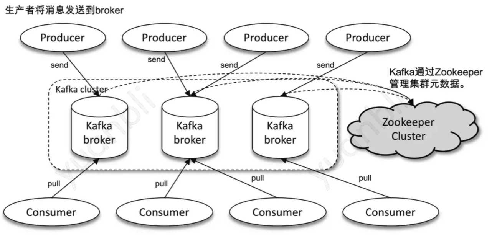

名词解释：

- **Producer：** 生产者，也就是发送消息的一方。生产者负责创建消息，然后将其投递到 Kafka 中
- **Consumer：** 消费者，也就是接收消息的一方。消费者连接到 Kafka 上并接收消息，进而进行相应的业务逻辑处理
- **Broker：** 服务代理节点。对于 Kafka 而言，Broker 可以简单地看作一个独立的 Kafka 服务节点或 Kafka 服务实例。大多数情况下也可以将 Broker 看作一台 Kafka 服务器，前提是这台服务器上只部署了一个 Kafka 实例。一个或多个 Broker 组成了一个 Kafka 集群。一般而言，我们更习惯使用首字母小写的 broker 来表示服务代理节点

在 Kafka 中还有两个特别重要的概念—主题（Topic）与分区（Partition）。Kafka 中的消息以主题为单位进行归类，生产者负责将消息发送到特定的主题（发送到 Kafka 集群中的每一条消息都要指定一个主题），而消费者负责订阅主题并进行消费。

主题是一个逻辑上的概念，它还可以细分为多个分区，一个分区只属于单个主题，很多时候也会把分区称为主题分区（Topic-Partition）。同一主题下的不同分区包含的消息是不同的，分区在存储层面可以看作一个可追加的日志（Log）文件，消息在被追加到分区日志文件的时候都会分配一个特定的偏移量（offset）。

offset 是消息在分区中的唯一标识，是一个单调递增且不变的值。Kafka 通过它来保证消息在分区内的顺序性，不过 offset 并不跨越分区，也就是说，Kafka 保证的是分区有序而不是主题有序。

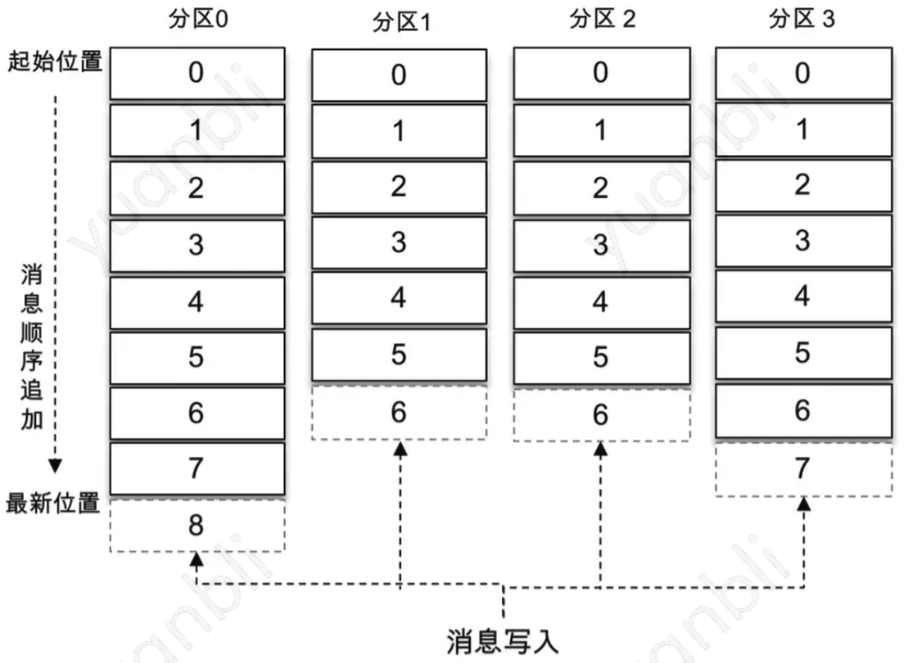

如上图所示，主题中有4个分区，消息被顺序追加到每个分区日志文件的尾部。Kafka 中的分区可以分布在不同的服务器（broker）上，也就是说，一个主题可以横跨多个 broker，以此来提供比单个 broker 更强大的性能。

每一条消息被发送到 broker 之前，会根据分区规则选择存储到哪个具体的分区。如果分区规则设定得合理，所有的消息都可以均匀地分配到不同的分区中。如果一个主题只对应一个文件，那么这个文件所在的机器I/O将会成为这个主题的性能瓶颈，而分区解决了这个问题。在创建主题的时候可以通过指定的参数来设置分区的个数，当然也可以在主题创建完成之后去修改分区的数量，通过增加分区的数量可以实现水平扩展。

不考虑多副本的情况，一个分区对应一个日志（Log）。为了防止 Log 过大，Kafka 又引入了日志分段（LogSegment）的概念，将 Log 切分为多个 LogSegment，相当于一个巨型文件被平均分配为多个相对较小的文件，这样也便于消息的维护和清理。事实上，Log 和 LogSegment 也不是纯粹物理意义上的概念，Log 在物理上只以文件夹的形式存储，而每个 LogSegment 对应于磁盘上的一个日志文件和两个索引文件，以及可能的其他文件（比如以“.txnindex”为后缀的事务索引文件）。下图描绘了主题、分区、副本、Log 以及 LogSegment 之间的关系。

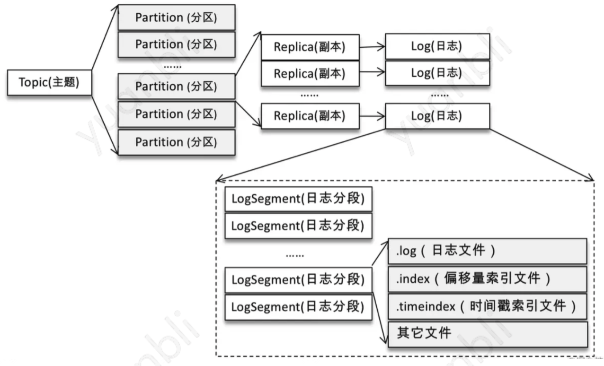

### 1.1.2 多幅本机制

Kafka 为分区引入了多副本（Replica）机制，通过增加副本数量可以提升容灾能力。备份的思想，就是把相同的数据拷贝到多台机器上，而这些相同的数据拷贝在 Kafka 中被称为副本（Replica）。

同一分区的不同副本中保存的是相同的消息（在同一时刻，副本之间并非完全一样），副本之间是“一主多从”的关系，其中 leader 副本负责处理读写请求，follower 副本只负责与 leader 副本的消息同步。副本处于不同的 broker 中，当 leader 副本出现故障时，从 follower 副本中重新选举新的 leader 副本对外提供服务。Kafka 通过多副本机制实现了故障的自动转移，当 Kafka 集群中某个 broker 失效时仍然能保证服务可用。

**那这里为什么Kafka不像MySQL和Redis那样允许follwer副本对外提供读服务呢？**

- Redis和MySQL都支持主从读写分离，这和它们的使用场景有关。对于那种读操作很多而写操作相对不频繁的负载类型而言，采用读写分离是非常不错的方案——我们可以添加很多follower横向扩展，提升读操作性能。反观Kafka，它的主要场景还是在消息引擎而不是以数据存储的方式对外提供读服务，通常涉及频繁地生产消息和消费消息，这不属于典型的读多写少场景，因此读写分离方案在这个场景下并不太适合

- Kafka副本机制使用的是异步消息拉取，因此存在leader和follower之间的不一致性。如果要采用读写分离，必然要处理副本引入的一致性问题，比如如何实现read-your-writes、如何保证单调读（monotonic reads）以及处理消息因果顺序颠倒的问题。相反地，如果不采用读写分离，所有客户端读写请求都只在Leader上处理也就没有这些问题了——当然最后全局消息顺序颠倒的问题在Kafka中依然存在，常见的解决办法是使用单分区，其他的方案还有version vector，但是目前Kafka没有提供

- 主写从读无非就是为了减轻leader节点的压力，将读请求的负载均衡到follower节点，如果Kafka的分区相对均匀地分散到各个broker上，同样可以达到负载均衡的效果，没必要实现主写从读增加代码实现的复杂程度

下图是kafka分区和副本的架构图：

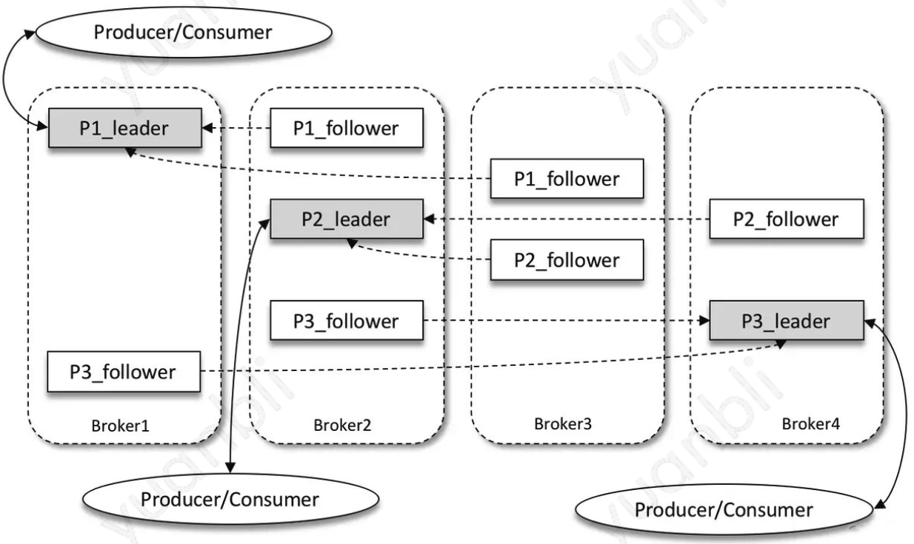

Kafka 集群中有4个 broker，某个主题中有3个分区，且副本因子（即副本个数）也为3，如此每个分区便有1个 leader 副本和2个 follower 副本。生产者和消费者只与 leader 副本进行交互，而 follower 副本只负责消息的同步，很多时候 follower 副本中的消息相对 leader 副本而言会有一定的滞后。

Kafka 消费端也具备一定的容灾能力。Consumer 使用拉（Pull）模式从服务端拉取消息，并且保存消费的具体位置，当消费者宕机后恢复上线时可以根据之前保存的消费位置重新拉取需要的消息进行消费，这样就不会造成消息丢失。

分区中的所有副本统称为 AR（Assigned Replicas）。所有与 leader 副本保持一定程度同步的副本（包括 leader 副本在内）组成ISR（In-Sync Replicas），ISR 集合是 AR 集合中的一个子集。消息会先发送到 leader 副本，然后 follower 副本才能从 leader 副本中拉取消息进行同步，同步期间内 follower 副本相对于 leader 副本而言会有一定程度的滞后。

前面所说的“一定程度的同步”是指可忍受的滞后范围，这个范围可以通过参数进行配置。与 leader 副本同步滞后过多的副本（不包括 leader 副本）组成 OSR（Out-of-Sync Replicas），由此可见，AR=ISR+OSR。在正常情况下，所有的 follower 副本都应该与 leader 副本保持一定程度的同步，即 AR=ISR，OSR 集合为空。

leader 副本负责维护和跟踪 ISR 集合中所有 follower 副本的滞后状态，当 follower 副本落后太多或失效时，leader 副本会把它从 ISR 集合中剔除。如果 OSR 集合中有 follower 副本“追上”了 leader 副本，那么 leader 副本会把它从 OSR 集合转移至 ISR 集合。默认情况下，当 leader 副本发生故障时，只有在 ISR 集合中的副本才有资格被选举为新的 leader，而在 OSR 集合中的副本则没有任何机会。

ISR 与 HW 和 LEO 也有紧密的关系。HW 是 High Watermark 的缩写，俗称高水位，它标识了一个特定的消息偏移量（offset），消费者只能拉取到这个 offset 之前的消息。

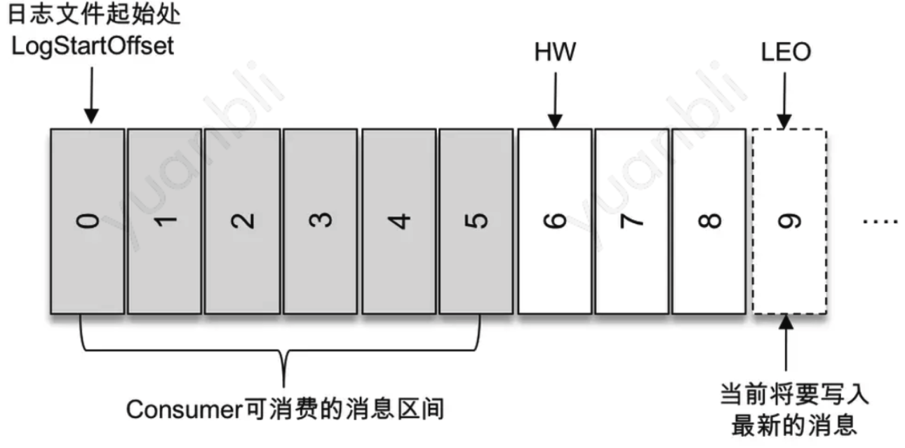

如上图所示，它代表一个日志文件，这个日志文件中有9条消息，第一条消息的 offset（LogStartOffset）为0，最后一条消息的 offset 为8，offset 为9的消息用虚线框表示，代表下一条待写入的消息。日志文件的 HW 为6，表示消费者只能拉取到 offset 在0至5之间的消息，而 offset 为6的消息对消费者而言是不可见的。

LEO 是 Log End Offset 的缩写，它标识当前日志文件中下一条待写入消息的 offset，上图中 offset 为9的位置即为当前日志文件的 LEO，LEO 的大小相当于当前日志分区中最后一条消息的 offset 值加1。分区 ISR 集合中的每个副本都会维护自身的 LEO，且集合中最小的 LEO 即为分区的 HW，对消费者而言只能消费 HW 之前的消息。

### 1.1.3 分区机制

虽然有了副本机制可以保证数据的高可用，但没有解决伸缩性（Scalability）的问题。什么是伸缩性呢？拿副本来说，虽然现在有了领导者副本和追随者副本，但倘若领导者副本积累了太多的数据以至于单台 Broker 机器都无法容纳了，此时应该怎么办呢？一个很自然的想法就是，能否把数据分割成多份保存在不同的 Broker 上？这种机制就是所谓的分区（Partitioning）。Kafka 中的分区机制指的是将每个主题划分成多个分区（Partition），每个分区是一组有序的消息日志。生产者生产的每条消息只会被发送到一个分区中，也就是说如果向一个双分区的主题发送一条消息，这条消息要么在分区 0 中，要么在分区 1 中。

副本是在分区这个层级定义的。每个分区下可以配置若干个副本，其中只能有 1 个领导者副本和 N-1 个追随者副本。生产者向分区写入消息，每条消息在分区中的位置信息由一个叫位移（Offset）的数据来表征。

Kafka 的三层消息架构：

- 主题层，每个主题可以配置 M 个分区，而每个分区又可以配置 N 个副本
- 分区层，每个分区的 N 个副本中只能有一个充当领导者角色，对外提供服务；其他 N-1 个副本是追随者副本，只是提供数据冗余之用
- 消息层，分区中包含若干条消息，每条消息的位移从 0 开始，依次递增

## 1.2 Kafka生产者

### 1.2.1 分区的必要性

分区的作用就是提供负载均衡的能力，或者说对数据进行分区的主要原因，就是为了实现系统的高伸缩性（Scalability）。不同的分区能够被放置到不同节点的机器上，而数据的读写操作也都是针对分区这个粒度而进行的，这样每个节点的机器都能独立地执行各自分区的读写请求处理。并且，我们还可以通过添加新的节点机器来增加整体系统的吞吐量。分区是实现负载均衡以及高吞吐量的关键，故在生产者这一端就要仔细盘算合适的分区策略，避免造成消息数据的“倾斜”，使得某些分区成为性能瓶颈，这样极易引发下游数据消费的性能下降。

### 1.2.2 分区策略

Kafka生产者的分区策略是决定生产者将消息发送到哪个分区的算法。Kafka提供默认的分区策略，同时它也支持自定义分区策略。常见的分区策略如下：

#### 1. 轮询策略

也称 Round-robin 策略，即顺序分配。比如一个主题下有 3 个分区，那么第一条消息被发送到分区 0，第二条被发送到分区 1，第三条被发送到分区 2，以此类推。当生产第 4 条消息时又会重新开始，即将其分配到分区 0。轮询策略有非常优秀的负载均衡表现，它总是能保证消息最大限度地被平均分配到所有分区上，故默认情况下它是最合理的分区策略，也是我们最常用的分区策略之一。

#### 2. 随机策略

也称 Randomness 策略，所谓随机就是我们随意地将消息放置到任意一个分区上。本质上看随机策略也是力求将数据均匀地打散到各个分区，但从实际表现来看，它要逊于轮询策略，所以如果追求数据的均匀分布，还是使用轮询策略比较好。

#### 3. 按消息键保序策略

Kafka 允许为每条消息定义消息键，简称为 Key。这个 Key 的作用非常大，它可以是一个有着明确业务含义的字符串，比如客户代码、部门编号或是业务 ID 等；也可以用来表征消息元数据。一旦消息被定义了 Key，那么你就可以保证同一个 Key 的所有消息都进入到相同的分区里面，由于每个分区下的消息处理都是有顺序的，故这个策略被称为按消息键保序策略。Kafka的主题会有多个分区，分区作为并行任务的最小单位，为消息选择分区要根据消息是否含有键来判断。

## 1.3 Kafka消费者

1. 消费者采用拉取模型带来的优点有哪些？
2. 为什么要约定“同一个分区只可被一个消费者处理”？
3. 消费者如何拉取数据
4. 消费者如何消费消息
5. 消费者提交分区偏移量
6. 消费者组再平衡操作
7. 消费者组是什么
8. 消费者组的协调者

上面提到过两种消息模型，点对点模型（Peer to Peer，P2P）和发布订阅模型。这里面的点对点指的是同一条消息只能被下游的一个消费者消费，其他消费者则不能染指。在 Kafka 中实现这种 P2P 模型的方法就是引入了消费者组（Consumer Group）。所谓的消费者组，指的是多个消费者实例共同组成一个组来消费一组主题。这组主题中的每个分区都只会被组内的一个消费者实例消费，其他消费者实例不能消费它。为什么要引入消费者组呢？主要是为了提升消费者端的吞吐量。多个消费者实例同时消费，加速整个消费端的吞吐量（TPS）。

### 1.3.1 消费模型

消息由生产者发布到Kafka集群后，会被消费者消费。消息的消费模型有两种：推送模型（push）和拉取模型（pull）。基于推送模型的消息系统，由broker记录消费者的消费状态。broker在将消息推送到消费者后，标记这条消息为已消费，这种方式无法很好地保证消息的处理语义。比如，broker把消息发送出去后，当消费进程挂掉或者由于网络原因没有收到这条消息时，就有可能造成消息丢失（因为消息代理已经把这条消息标记为己消费了，但实际上这条消息并没有被实际处理） 。如果要保证消息的处理语义，broker发送完消息后，要设置状态为“已发送”，只有收到消费者的确认请求后才更新为“已消费”，这就需要在消息代理中记录所有消息的消费状态，这种方式需要在客户端和服务端做一些复杂的状态一致性保证，比较复杂。

因此，kafka采用拉取模型，由消费者自己记录消费状态，每个消费者互相独立地顺序读取每个分区的消息。这种由消费者控制偏移量的优点是消费者可以按照任意的顺序消费消息，比如，消费者可以重置到旧的偏移量，重新处理之前已经消费过的消息；或者直接跳到最近的位置，从当前时刻开始消费。broker是无状态的，它不需要标记哪些消息被消费者处理过，也不需要保证一条消息只会被一个消费者处理。而且，不同的消费者可以按照自己最大的处理能力来拉取数据，即使有时候某个消费者的处理速度稍微落后，它也不会影响其他的消费者，并且在这个消费者恢复处理速度后，仍然可以追赶之前落后的数据。

### 1.3.2 消费者组

Consumer Group 是 Kafka 提供的可扩展且具有容错性的消费者机制。既然是一个组，那么组内必然可以有多个消费者或消费者实例（Consumer Instance），它们共享一个公共的 ID，这个 ID 被称为 Group ID。组内的所有消费者协调在一起来消费订阅主题（Subscribed Topics）的所有分区（Partition）。当然，每个分区只能由同一个消费者组内的一个 Consumer 实例来消费。

传统的消息引擎模型是点对点模型和分布/订阅模型，这种模型的伸缩性很差，因为下游的多个consumer都要抢这个共享消息队列的消息。发布 / 订阅模型倒是允许消息被多个 Consumer 消费，但它的问题也是伸缩性不高，因为每个订阅者都必须要订阅主题的所有分区。这种全量订阅的方式既不灵活，也会影响消息的真实投递效果。

Kafka 的 Consumer Group 既可以避开这两种模型的缺陷，又兼具它们的优点。当 Consumer Group 订阅了多个主题后，组内的每个实例不要求一定要订阅主题的所有分区，它只会消费部分分区中的消息。Consumer Group 之间彼此独立，互不影响，它们能够订阅相同的一组主题而互不干涉。再加上 Broker 端的消息留存机制，Kafka 的 Consumer Group 完美地规避了上面提到的伸缩性差的问题。可以这么说，Kafka 仅仅使用 Consumer Group 这一种机制，却同时实现了传统消息引擎系统的两大模型：如果所有实例都属于同一个 Group，那么它实现的就是消息队列模型；如果所有实例分别属于不同的 Group，那么它实现的就是发布 / 订阅模型。

分区是以消费者级别被消费的，但分区的消费进度要保存成消费者组级别的

一个分区只能属于一个消费者线程，将分区分配给消费者有以下几种场景。

- 线程数量多于分区的数量
- 线程数量少于分区的数量
- 线程数量等于分区的数量

理想情况下，Consumer实例的数量应该等Group订阅主题的分区总数。

老版本的 Consumer Group 把位移保存在 ZooKeeper 中。Apache ZooKeeper 是一个分布式的协调服务框架，Kafka 重度依赖它实现各种各样的协调管理。将位移保存在 ZooKeeper 外部系统的做法，最显而易见的好处就是减少了 Kafka Broker 端的状态保存开销。现在比较流行的做法是将服务器节点做成无状态的，这样可以自由地扩缩容，实现超强的伸缩性。Kafka 最开始也是基于这样的考虑，才将 Consumer Group 位移保存在独立于 Kafka 集群之外的框架中。

但是，ZooKeeper 这类元框架其实并不适合进行频繁的写更新，而 Consumer Group 的位移更新却是一个非常频繁的操作。这种大吞吐量的写操作会极大地拖慢 ZooKeeper 集群的性能，因此 Kafka 社区渐渐有了这样的共识：将 Consumer 位移保存在 ZooKeeper 中是不合适的做法。于是，在新版本的 Consumer Group 中，Kafka 社区重新设计了 Consumer Group 的位移管理方式，采用了将位移保存在 Kafka 内部主题的方法。这个内部主题就是__consumer_offsets，现在新版本的 Consumer Group 将位移保存在 Broker 端的内部主题中。

### 1.3.3 重平衡

Rebalance 就是让一个 Consumer Group 下所有的 Consumer 实例就如何消费订阅主题的所有分区达成共识的过程。在 Rebalance 过程中，所有 Consumer 实例共同参与，在协调者组件（Coordinator）的帮助下，完成订阅主题分区的分配。Rebalance 的触发条件有 3 个。

- 组成员数发生变更。比如有新的 Consumer 实例加入组或者离开组，或是有 Consumer 实例崩溃被“踢出”组

- 订阅主题数发生变更。Consumer Group 可以使用正则表达式的方式订阅主题，比如 consumer.subscribe(Pattern.compile("t.*c")) 就表明该 Group 订阅所有以字母 t 开头、字母 c 结尾的主题。在 Consumer Group 的运行过程中，你新创建了一个满足这样条件的主题，那么该 Group 就会发生 Rebalance

- 订阅主题的分区数发生变更。Kafka 当前只能允许增加一个主题的分区数。当分区数增加时，就会触发订阅该主题的所有 Group 开启 Rebalance

**Coordinator 会在什么情况下认为某个 Consumer 实例已挂从而要被“踢出”组呢？**

当 Consumer Group 完成 Rebalance 之后，每个 Consumer 实例都会定期地向 Coordinator 发送心跳请求，表明它还存活着。如果某个 Consumer 实例不能及时地发送这些心跳请求，Coordinator 就会认为该 Consumer 已经“死”了，从而将其从 Group 中移除，然后开启新一轮 Rebalance。Rebalance 发生时，Group 下所有的 Consumer 实例都会协调在一起共同参与。每个 Consumer 实例怎么知道应该消费订阅主题的哪些分区呢？这就需要上面提到的分配策略的协助了。

Rebalance 也存在一些缺点：

首先，Rebalance 过程对 Consumer Group 消费过程有极大的影响。如果你了解 JVM 的垃圾回收机制，你一定听过万物静止的收集方式，即著名的 stop the world，简称 STW。在 STW 期间，所有应用线程都会停止工作，表现为整个应用程序僵在那边一动不动。Rebalance 过程也和这个类似，在 Rebalance 过程中，所有 Consumer 实例都会停止消费，等待 Rebalance 完成。这是 Rebalance 为人诟病的一个方面。

其次，目前 Rebalance 的设计是所有 Consumer 实例共同参与，全部重新分配所有分区。其实更高效的做法是尽量减少分配方案的变动。例如实例 A 之前负责消费分区 1、2、3，那么 Rebalance 之后，如果可能的话，最好还是让实例 A 继续消费分区 1、2、3，而不是被重新分配其他的分区。这样的话，实例 A 连接这些分区所在 Broker 的 TCP 连接就可以继续用，不用重新创建连接其他 Broker 的 Socket 资源。

最后，Rebalance 实在是太慢了。所以，我们尽量避免一些非必要的Rebalance。

- 第一类非必要 Rebalance 是因为未能及时发送心跳，导致 Consumer 被“踢出”Group 而引发的。因此，需要仔细地设置 session.timeout.ms（决定了 Consumer 存活性的时间间隔）和 heartbeat.interval.ms（控制发送心跳请求频率的参数） 的值
- 第二类非必要 Rebalance 是 Consumer 消费时间过长导致的，Consumer 端还有一个参数，用于控制 Consumer 实际消费能力对 Rebalance 的影响，即 max.poll.interval.ms 参数。它限定了 Consumer 端应用程序两次调用 poll 方法的最大时间间隔。它的默认值是 5 分钟，表示你的 Consumer 程序如果在 5 分钟之内无法消费完 poll 方法返回的消息，那么 Consumer 会主动发起“离开组”的请求，Coordinator 也会开启新一轮 Rebalance。

#### 1.3.3.1 消费者组重平衡流程

消费者组的重平衡流程，它的作用是让组内所有的消费者实例就消费哪些主题分区达成一致。重平衡需要借助 Kafka Broker 端的 Coordinator 组件，在 Coordinator 的帮助下完成整个消费者组的分区重分配。

**触发与通知**

1. 重平衡过程通过心跳线程（Heartbeat Thread）通知到其他消费者实例

2. Kafka Java消费者需要定期地发送心跳请求到Broker端的协调者，以表明它还存活着。在kafka 0.10.1.0版本之前，发送心跳请求是在消费者主线程完成的，也就是代码中调用KafkaConsumer.poll方法的那个线程。这样做，消息处理逻辑也是在这个线程中完成的 ，因此，一旦消息处理消耗了过长的时间，心跳请求将无法及时发到协调者那里，导致协调者错判消费者已死。在此版本后，kafka社区引入了单独的心跳线程来专门执行心跳请求发送，避免这个问题

3. 消费者端的参数heartbeat.interval.ms，从字面上看，它就是设置了心跳的间隔时间，但这个参数的真正作用是控制重平衡通知的频率

**消费者组状态机**

重平衡一旦开启，Broker 端的协调者组件就要开始忙了，主要涉及到控制消费者组的状态流转。Kafka设计了一套消费者组状态机（State Machine），帮助协调者完成整个重平衡流程。

1. Kafka消费者组状态

- Empty：组内没有任何成员，但消费者组可能存在已提交的位移数据，而且这些位移尚未过期
- Dead：组内没有任何成员，但组的元数据信息已经在协调者端被移除。协调者保存着当前向它注册过的所有组信息，所谓元数据就是类似于这些注册信息
- PreparingRebalance：消费者组准备开启重平衡，此时所有成员都要重新请求加消费者组
- CompletingRebalance：消费者组下所有成员已经加入，各个成员正在等待分配方案
- stable：消费者组的稳定状态。该状态表明重平衡已经完成，组内成员能够正常消费数据了

2. 状态机的各个状态流转图如下

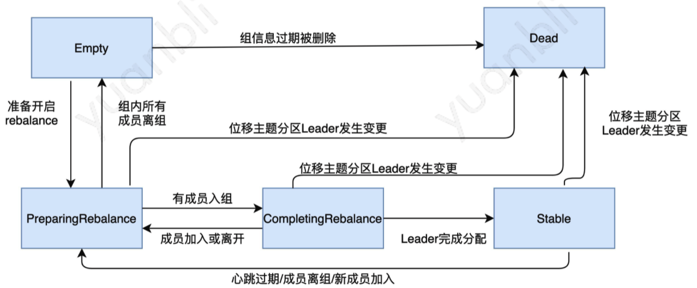

一个消费者组最开始是 Empty 状态，当重平衡过程开启后，它会被置于 PreparingRebalance 状态等待成员加入，之后变更到 CompletingRebalance 状态等待分配方案，最后流转到 Stable 状态完成重平衡。当有新成员加入或已有成员退出时，消费者组的状态从 Stable 直接跳到 PreparingRebalance 状态，此时，所有现存成员就必须重新申请加入组。当所有成员都退出组后，消费者组状态变更为 Empty。Kafka定期自动删除过期位移的条件是组要处于Empty状态。如果消费者组停了很长时间（超过7天），那么Kafka很可能就把该组的位移数据删除了。

**消费者端重平衡流程**

重平衡的完整流程需要消费者端和协调者组件共同参与才能完成。在消费者端，重平衡分为以下两个步骤：

- 加入组：JoinGroup请求
- 等待领导者消费者分配方案：SyncGroup请求

当组内成员加入组时，他会向协调者发送JoinGroup请求。在该请求中，每个成员都要将自己订阅的主题上报，这样协调者就能收集到所有成员的订阅信息。一旦收集了全部成员的JoinGroup请求后，协调者会从这些成员中选择一个担任这个消费者组的领导者。通常情况下，第一个发送JoinGroup 请求的成员自动成为领导者。注意区分这里的领导者和之前介绍的领导者副本，不是一个概念。**这里的领导者是具体的消费者实例，它既不是副本，也不是协调者。领导者消费者的任务是收集所有成员的订阅信息，然后根据这些信息，制定具体的分区消费分配方案。**

选出领导者之后，协调者会把消费者组订阅信息封装进JoinGroup请求的响应中，然后发给领导者，由领导者统一做出分配方案后，进入下一步：发送SyncGroup请求。在这一步中，领导者向协调者发送SyncGroup请求，将刚刚做出的分配方案发给协调者。值得注意的是，其他成员也会向协调者发送SyncGroup请求，只是请求体中并没有实际内容。这一步的目的是让协调者接收分配方案，然后统一以SyncGroup 响应的方式发给所有成员，这样组内成员就都知道自己该消费哪些分区了。

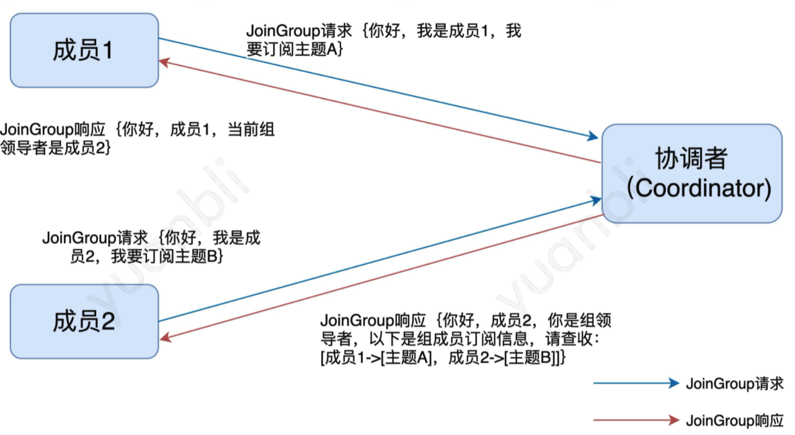

以上是JoinGroup 请求的处理过程。就像前面说的，JoinGroup 请求的主要作用是将组成员订阅信息发送给领导者消费者，待领导者制定好分配方案后，重平衡流程进入到 SyncGroup 请求阶段。下面这张图是SyncGroup请求的处理流程。

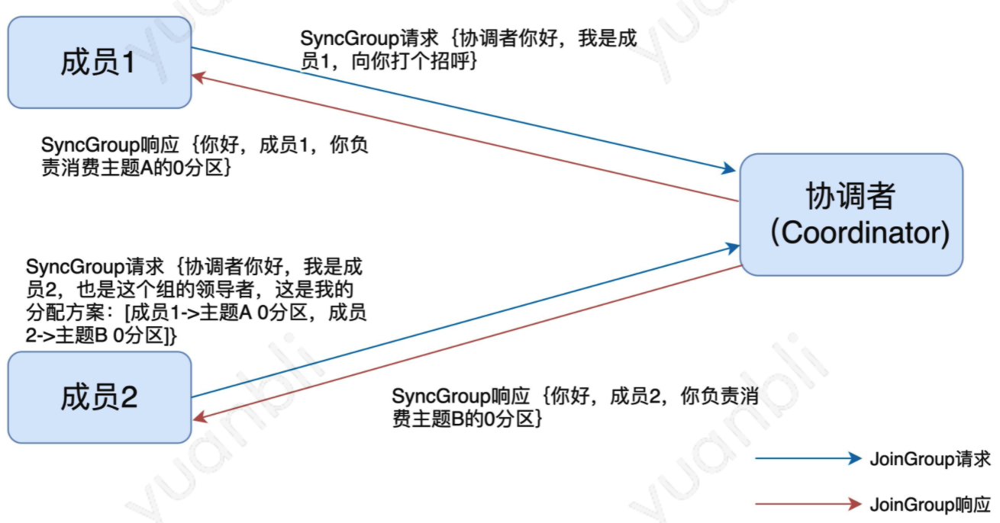

SyncGroup 请求的主要目的，就是让协调者把领导者制定的分配方案下发给各个组内成员。当所有成员都成功接收到分配方案后，消费者组进入到 Stable 状态，即开始正常的消费工作。

**Broker端(协调者)重平衡场景**

分以下几个场景来讨论，这几个场景分别是新成员加入组、组成员主动离组、组成员崩溃离组、组成员提交位移。

**Case 1: 新成员入组**

新成员入组是指组处于 Stable 状态后，有新成员加入。当协调者收到新的 JoinGroup 请求后，它会通过心跳请求响应的方式通知组内现有的所有成员，强制它们开启新一轮的重平衡。具体的过程和之前的客户端重平衡流程是一样的。

**Case 2: 组成员主动离组**

主动离组就是指消费者实例所在线程或进程调用 close() 方法主动通知协调者它要退出。这个场景就涉及到了第三类请求：LeaveGroup 请求。协调者收到 LeaveGroup 请求后，依然会以心跳响应的方式通知其他成员。

**Case 3: 组成员崩溃离组**
崩溃离组是指消费者实例出现严重故障，突然宕机导致的离组。它和主动离组是有区别的，后者是主动发起的离组，协调者能马上感知并处理。但崩溃离组是被动的，协调者通常需要等待一段时间才能感知到，这段时间一般是由消费者端参数session.timeout.ms控制的。也就是说，Kafka 一般不会超过session.timeout.ms就能感知到这个崩溃。当然，后面处理崩溃离组的流程与之前是一样的。

**Case 4: 重平衡时协调者对组内成员提交位移的处理**
正常情况下，每个组内成员都会定期汇报位移给协调者。当重平衡开启时，协调者会给予成员一段缓冲时间，要求每个成员必须在这段时间内快速地上报自己的位移信息，然后在开启正常JoinGroup/SyncGroup请求发送。

### 1.3.4 位移主题

**__consumer_offsets**

__consumer_offsets 是Kafka里的内部主题，也被称为位移主题，即 Offsets Topic。和你创建的其他主题一样，位移主题就是普通的 Kafka 主题。你可以手动地创建它、修改它，甚至是删除它。为什么要引入位移主题这个概念呢？我们知道，版本 Consumer 的位移管理是依托于 Apache ZooKeeper 的，它会自动或手动地将位移数据提交到 ZooKeeper 中保存。当 Consumer 重启后，它能自动从 ZooKeeper 中读取位移数据，从而在上次消费截止的地方继续消费。这种设计使得 Kafka Broker 不需要保存位移数据，减少了 Broker 端需要持有的状态空间，因而有利于实现高伸缩性。但是，ZooKeeper 其实并不适用于这种高频的写操作。

新版本 Consumer 的位移管理机制其实也很简单，就是将 Consumer 的位移数据作为一条条普通的 Kafka 消息，提交到 __consumer_offsets 中。可以这么说，__consumer_offsets 的主要作用是保存 Kafka 消费者的位移信息。它要求这个提交过程不仅要实现高持久性，还要支持高频的写操作。显然，Kafka 的主题设计天然就满足这两个条件，因此，使用 Kafka 主题来保存位移这件事情，实际上就是一个水到渠成的想法了。

**位移主题消息结构**

虽说位移主题是一个普通的 Kafka 主题，但它的消息格式却是 Kafka 自己定义的，用户不能修改，也就是说你不能随意地向这个主题写消息，因为一旦你写入的消息不满足 Kafka 规定的格式，那么 Kafka 内部无法成功解析，就会造成 Broker 的崩溃。事实上，Kafka Consumer 有 API 帮你提交位移，也就是向位移主题写消息。那么位移主题的消息格式是什么样子的呢？所谓的消息格式，可以简单地理解为是一个KV对。Key和Value分别表示消息的键值和消息体。

首先从 Key 说起。一个 Kafka 集群中的 Consumer 数量会有很多，既然这个主题保存的是 Consumer 的位移数据，那么消息格式中必须要有字段来标识这个位移数据是哪个 Consumer 的。位移主题的 Key 中应该保存 3 部分内容：<Group ID，主题名，分区号>。

实际上，社区的方案要复杂得多，比如消息体还保存了位移提交的一些其他元数据，诸如时间戳和用户自定义的数据等。保存这些元数据是为了帮助 Kafka 执行各种各样后续的操作，比如删除过期位移消息等。但总体来说，我们还是可以简单地认为消息体就是保存了位移值。当然了，位移主题的消息格式可不是只有这一种。事实上，它有 3 种消息格式。除了刚刚我们说的这种格式，还有 2 种格式：

- 保存 Consumer Group 信息的消息。用于注册 Consumer Group

- 删除 Group 过期位移甚至是删除 Group 的消息。tombstone 消息，即墓碑消息，也称 delete mark

**位移主题创建**

通常来说，当 Kafka 集群中的第一个 Consumer 程序启动时，Kafka 会自动创建位移主题。

**删除位移主题过期消息**

使用 Compact 策略来删除位移主题中的过期消息，避免该主题无限期膨胀。那么应该如何定义 Compact 策略中的过期呢？对于同一个 Key 的两条消息 M1 和 M2，如果 M1 的发送时间早于 M2，那么 M1 就是过期消息。Compact 的过程就是扫描日志的所有消息，剔除那些过期的消息，然后把剩下的消息整理在一起。

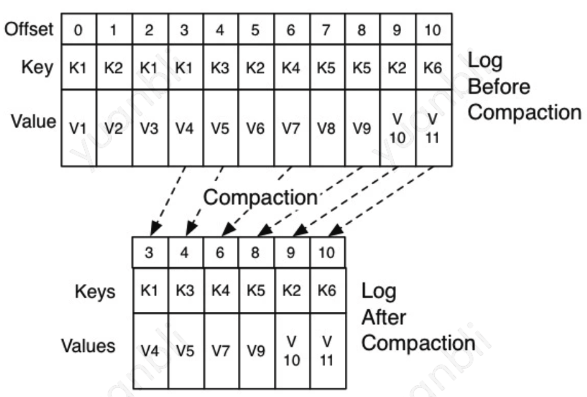

#### 1.3.4.1 位移提交

消费者提交偏移量是为了保存分区的消费进度。Kafka保证同一个分区只会分配给消费者组中的唯一消费者，即使发生再平衡后，分区和消费者的所有权关系发生变化，新消费者也可以接着上一个消费者记录的偏移量位置继续消费消息。

每个消费者在消费消息的过程中必然需要有个字段记录它当前消费到了分区的哪个位置上，这个字段就是消费者位移（Consumer Offset）。注意，这和上面所说的位移完全不是一个概念。上面的“位移”表征的是分区内的消息位置，它是不变的，即一旦消息被成功写入到一个分区上，它的位移值就是固定的了。而消费者位移则不同，它可能是随时变化的，毕竟它是消费者消费进度的指示器。Consumer 的消费位移，它记录了 Consumer 要消费的下一条消息的位移。

**位移提交在分区粒度上进行**

Consumer 需要向 Kafka 汇报自己的位移数据，这个汇报过程被称为提交位移（Committing Offsets）。因为 Consumer 能够同时消费多个分区的数据，所以位移的提交实际上是在分区粒度上进行的，即 Consumer 需要为分配给它的每个分区提交各自的位移数据。提交位移主要是为了表征 Consumer 的消费进度，这样当 Consumer 发生故障重启之后，就能够从 Kafka 中读取之前提交的位移值，然后从相应的位移处继续消费，从而避免整个消费过程重来一遍。从用户的角度来说，位移提交分为自动提交和手动提交；从 Consumer 端的角度来说，位移提交分为同步提交和异步提交。

### 1.3.5 Kafka Java Consumer设计原理

从 Kafka 0.10.1.0 版本开始，KafkaConsumer 就变为了双线程的设计，即用户主线程和心跳线程。所谓用户主线程，就是你启动 Consumer 应用程序 main 方法的那个线程，而新引入的心跳线程（Heartbeat Thread）只负责定期给对应的 Broker 机器发送心跳请求，以标识消费者应用的存活性（liveness）。引入这个心跳线程还有一个目的，那就是期望它能将心跳频率与主线程调用 KafkaConsumer.poll 方法的频率分开，从而解耦真实的消息处理逻辑与消费者组成员存活性管理。

KafkaConsumer 类不是线程安全的 (thread-safe)。所有的网络 I/O 处理都是发生在用户主线程中，因此，在使用过程中必须要确保线程安全。简单来说，就是不能在多个线程中共享同一个 KafkaConsumer 实例，否则程序会抛出 ConcurrentModificationException 异常。鉴于 KafkaConsumer 不是线程安全的事实，有两套多线程方案。

**1. 消费者程序启动多个线程，每个线程维护专属 KafkaConsumer 实例，负责完整的消息获取、处理流程。**

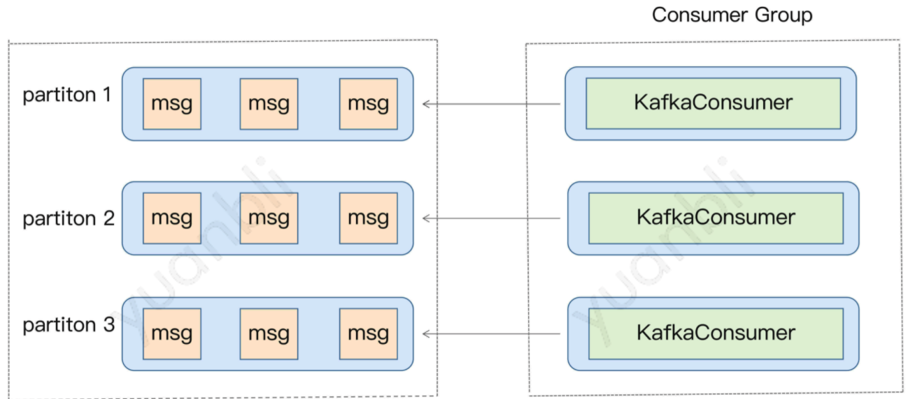

**2. 消费者程序使用单或多线程获取消息，同时创建多个消费线程执行消息处理逻辑。获取消息的线程可以是一个，也可以是多个，每个线程维护专属的 KafkaConsumer 实例，处理消息则交由特定的线程池来做，从而实现消息获取与消息处理的真正解耦。**

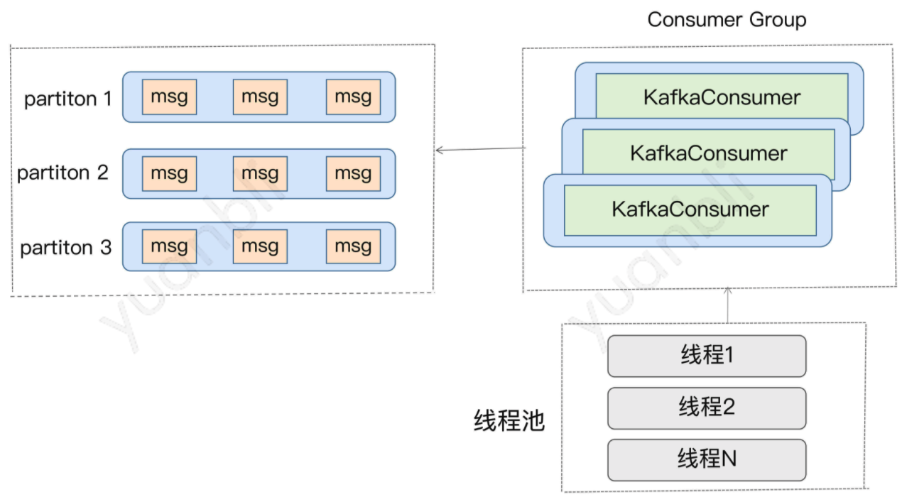

两种方案的优缺点如下：

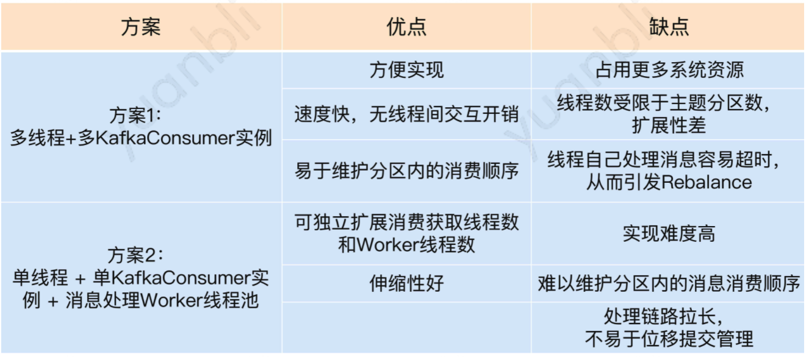

## 1.4 Kafka服务端

1. 副本机制如何工作，故障发生时，怎么确保数据不会丢失？
2. 消息成功提交的定义是什么？
3. Kafka的消息提交机制如何保证消费者看到的数据是一致的？（ISR）

分布式系统处理系统故障时，需要明确地定义节点是否处于存活状态。Kafka对节点的存活定义有两个条件：

- 节点必须和ZK保持会话
- 如果这个节点是某个分区的备份副本，它必须对分区主副本的写操作进行复制，并且复制的进度不能落后太多

满足这两个条件，叫作“正在同步中”（in-sync）。

ZooKeeper 是做什么的呢？它是一个分布式协调框架，负责协调管理并保存 Kafka 集群的所有元数据信息，比如集群都有哪些 Broker 在运行、创建了哪些 Topic，每个 Topic 都有多少分区以及这些分区的 Leader 副本都在哪些机器上等信息。

### 1.4.1 Kafka副本机制

所谓的副本机制（Replication），也可以称之为备份机制，通常是指分布式系统在多台网络互联的机器上保存有相同的数据拷贝。优势如下：

- 提供数据冗余。即使系统部分组件失效，系统依然能够继续运转，因而增加了整体可用性以及数据持久性
- 提供高伸缩性。支持横向扩展，能够通过增加机器的方式来提升读性能，进而提高读操作吞吐量
- 改善数据局部性。允许将数据放入与用户地理位置相近的地方，从而降低系统延时

对于 Kafka 而言，目前只能享受到副本机制带来的第 1 个好处，即提供数据冗余实现高可用性和高持久性。

Kafka 是有主题概念的，而每个主题又进一步划分成若干个分区。副本的概念实际上是在分区层级下定义的，每个分区配置有若干个副本。所谓副本（Replica），本质就是一个只能追加写消息的提交日志。根据 Kafka 副本机制的定义，同一个分区下的所有副本保存有相同的消息序列，这些副本分散保存在不同的 Broker 上，从而能够对抗部分 Broker 宕机带来的数据不可用。

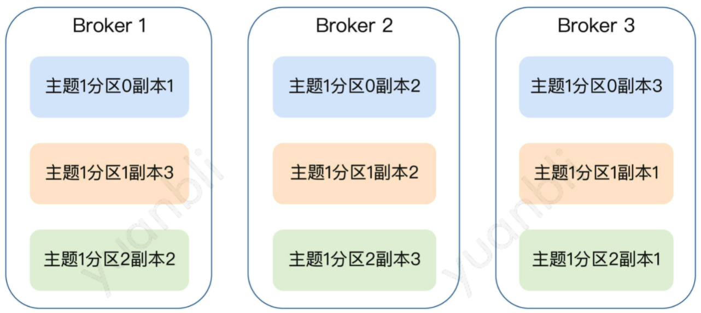

#### 1.4.1.1 副本角色

**如何保证副本内容一致？**

Apache Kafka采用基于领导者（Leader-based）的副本机制：

- 在 Kafka 中，副本分成两类：领导者副本（Leader Replica）和追随者副本（Follower Replica）。每个分区在创建时都要选举一个副本，称为领导者副本，其余的副本自动称为追随者副本

- 在 Kafka 中，追随者副本是不对外提供服务的。这就是说，追随者副本不处理客户端请求，它唯一的任务就是从领导者副本异步拉取消息，并写入到自己的提交日志中，从而实现与领导者副本的同步

- 领导者副本挂掉了，或者说领导者副本所在的 Broker 宕机时，Kafka 依托于 ZooKeeper 提供的监控功能能够实时感知到，并立即开启新一轮的领导者选举，从追随者副本中选一个作为新的领导者。老 Leader 副本重启回来后，只能作为追随者副本加入到集群中

对于客户端用户而言，Kafka 的追随者副本没有任何作用，它既不能像 MySQL 那样帮助领导者副本“抗读”，也不能实现将某些副本放到离客户端近的地方来改善数据局部性。但是 kafka 这样设计有两方面的好处：

**1.方便实现“Read-your-writes”**

所谓 Read-your-writes，顾名思义就是，当你使用生产者 API 向 Kafka 成功写入消息后，马上使用消费者 API 去读取刚才生产的消息。

**2.方便实现单调读（Monotonic Reads）**

对于一个消费者用户而言，在多次消费消息时，它不会看到某条消息一会儿存在一会儿不存在。如果允许追随者副本提供读服务，那么假设当前有 2 个追随者副本 F1 和 F2，它们异步地拉取领导者副本数据。倘若 F1 拉取了 Leader 的最新消息而 F2 还未及时拉取，那么，此时如果有一个消费者先从 F1 读取消息之后又从 F2 拉取消息，它可能会看到这样的现象：第一次消费时看到的最新消息在第二次消费时不见了，这就不是单调读一致性。但是，如果所有的读请求都是由 Leader 来处理，那么 Kafka 就很容易实现单调读一致性。

#### 1.4.1.2 In-sync Replicas(ISR)

**follow副本与leader处于同步状态的条件**

Kafka 引入了 In-sync Replicas，也就是所谓的 ISR 副本集合。ISR 中的副本都是与 Leader 同步的副本，相反，不在 ISR 中的追随者副本就被认为是与 Leader 不同步的。Leader 副本天然就在 ISR 中。也就是说，ISR 不只是追随者副本集合，它必然包括 Leader 副本。甚至在某些情况下，ISR 只有 Leader 这一个副本。ISR 是一个动态调整的集合，而非静态不变的。

判断 Follower 是否与 Leader 同步的标准，不看相差的消息数，而是看 Broker 端参数 replica.lag.time.max.ms参数值。这个参数的含义是 Follower 副本能够落后 Leader 副本的最长时间间隔，当前默认值是 10 秒。这就是说，只要一个 Follower 副本落后 Leader 副本的时间不连续超过 10 秒，那么 Kafka 就认为该 Follower 副本与 Leader 是同步的，即使此时 Follower 副本中保存的消息明显少于 Leader 副本中的消息。

#### 1.4.1.3 Unclean领导者选举

如果 ISR 为空了，就说明 Leader 副本也“挂掉”了，Kafka 需要重新选举一个新的 Leader。可是 ISR 是空，不能从 ISR 中进行选举。Kafka 把所有不在 ISR 中的存活副本都称为非同步副本。通常来说，非同步副本落后 Leader 太多，因此，**如果选择这些副本作为新 Leader，就可能出现数据的丢失。毕竟，这些副本中保存的消息远远落后于老 Leader 中的消息**。在 Kafka 中，选举这种副本的过程称为 Unclean 领导者选举。

Broker 端参数 unclean.leader.election.enable 控制是否允许 Unclean 领导者选举。开启 Unclean 领导者选举可能会造成数据丢失，但好处是，它使得分区 Leader 副本一直存在，不至于停止对外提供服务，因此提升了高可用性。反之，禁止 Unclean 领导者选举的好处在于维护了数据的一致性，避免了消息丢失，但牺牲了高可用性。

这就是常说的分布式系统的CAP理论，在这个问题上，Kafka 赋予你选择 C（Consistency） 或 A (Availability)的权利。你可以根据你的实际业务场景决定是否开启 Unclean 领导者选举。

### 1.4.2 Kafka如何处理请求

无论是 Kafka 客户端还是 Broker 端，它们之间的交互都是通过“请求 / 响应”的方式完成的。比如，客户端会通过网络发送消息生产请求给 Broker，而 Broker 处理完成后，会发送对应的响应给到客户端。

常见的请求处理方式有两种：

1. 顺序处理请求

这个方法实现简单，但是有个致命的缺陷，那就是吞吐量太差。由于只能顺序处理每个请求，因此，每个请求都必须等待前一个请求处理完毕才能得到处理。这种方式只适用于请求发送非常不频繁的系统。

2. 每个请求使用单独线程处理

完全采用异步的方式。系统会为每个入站请求都创建单独的线程来处理。这个方法的好处是，它是完全异步的，每个请求的处理都不会阻塞下一个请求。但缺陷也同样明显。为每个请求都创建线程的做法开销极大，在某些场景下甚至会压垮整个服务。这个方法只适用于请求发送频率很低的业务场景。

**Kafka如何处理请求**

Kafka 使用的是 Reactor 模式。Reactor 模式是事件驱动架构的一种实现方式，特别适合应用于处理多个客户端并发向服务器端发送请求的场景。

Reactor模式的架构如下图：

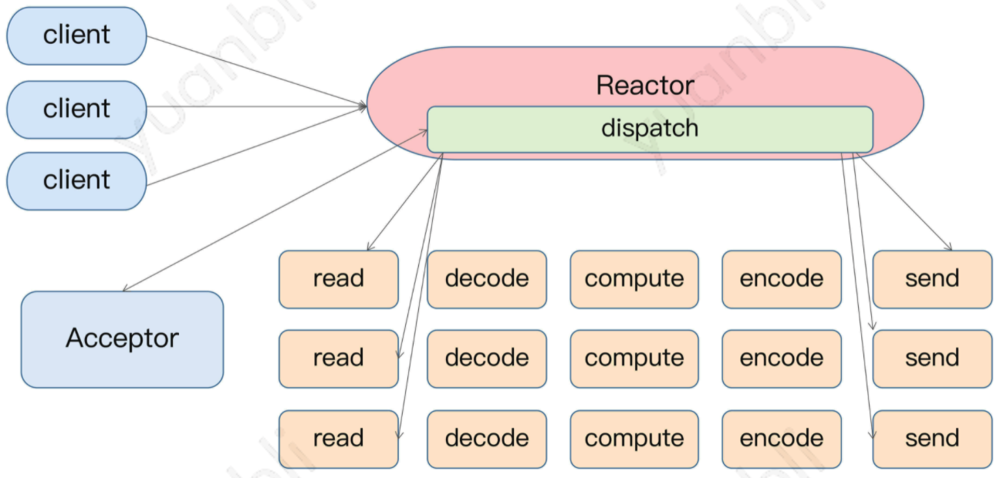

多个客户端会发送请求给到 Reactor。Reactor 有个请求分发线程 Dispatcher，也就是图中的 Acceptor，它会将不同的请求下发到多个工作线程中处理。在这个架构中，Acceptor 线程只是用于请求分发，不涉及具体的逻辑处理，非常得轻量级，因此有很高的吞吐量表现。而这些工作线程可以根据实际业务处理需要任意增减，从而动态调节系统负载能力。

Kafka 的请求处理架构如下图：

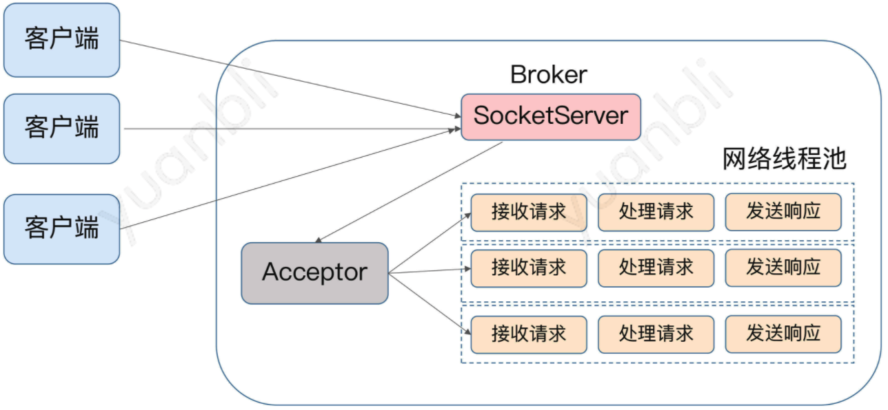

Kafka 的 Broker 端有个 SocketServer 组件，类似于 Reactor 模式中的 Dispatcher，它也有对应的 Acceptor 线程和一个工作线程池，只不过在 Kafka 中，这个工作线程池有个专属的名字，叫网络线程池。Kafka 提供了 Broker 端参数 num.network.threads，用于调整该网络线程池的线程数。其默认值是 3，表示每台 Broker 启动时会创建 3 个网络线程，专门处理客户端发送的请求。

Acceptor 线程采用轮询的方式将入站请求公平地发到所有网络线程中，因此，在实际使用过程中，这些线程通常都有相同的几率被分配到待处理请求。这种轮询策略编写简单，同时也避免了请求处理的倾斜，有利于实现较为公平的请求处理调度。

**网络线程处理请求**

Kafka 在这个环节又做了一层异步线程池的处理。

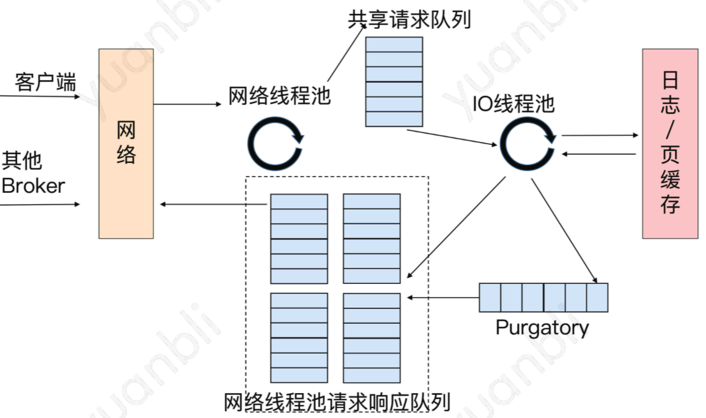

当网络线程拿到请求后，它不是自己处理，而是将请求放入到一个共享请求队列中。Broker 端还有个 IO 线程池，负责从该队列中取出请求，执行真正的处理。如果是 PRODUCE 生产请求，则将消息写入到底层的磁盘日志中；如果是 FETCH 请求，则从磁盘或页缓存中读取消息。IO 线程池处中的线程才是执行请求逻辑的线程。Broker 端参数 num.io.threads 控制了这个线程池中的线程数。目前该参数默认值是 8，表示每台 Broker 启动后自动创建 8 个 IO 线程处理请求。你可以根据实际硬件条件设置此线程池的个数。

请求队列是所有网络线程共享的，而响应队列则是每个网络线程专属的。这么设计的原因就在于，Dispatcher 只是用于请求分发而不负责响应回传，因此只能让每个网络线程自己发送 Response 给客户端，所以这些 Response 也就没必要放在一个公共的地方。

**Purgatory 组件**

是用来缓存延时请求（Delayed Request）的***。\***所谓延时请求，就是那些一时未满足条件不能立刻处理的请求。比如设置了 acks=all 的 PRODUCE 请求，一旦设置了 acks=all，那么该请求就必须等待 ISR 中所有副本都接收了消息后才能返回，此时处理该请求的 IO 线程就必须等待其他 Broker 的写入结果。当请求不能立刻处理时，它就会暂存在 Purgatory 中。稍后一旦满足了完成条件，IO 线程会继续处理该请求，并将 Response 放入对应网络线程的响应队列中。

**控制类请求和数据类请求**

Kafka Broker 对所有请求是一视同仁的。但是，在 Kafka 内部，除了客户端发送的 PRODUCE 请求和 FETCH 请求之外，还有很多执行其他操作的请求类型，比如负责更新 Leader 副本、Follower 副本以及 ISR 集合的 LeaderAndIsr 请求，负责勒令副本下线的 StopReplica 请求等。

Kafka 社区把 PRODUCE 和 FETCH 这类请求称为数据类请求，把 LeaderAndIsr、StopReplica 这类请求称为控制类请求。当前这种一视同仁的处理方式对控制类请求是不合理的，因为控制类请求可以直接令数据类请求失效。

此时最合理的处理顺序应该是，赋予控制类请求更高的优先级，使它能够得到抢占式的处理。基于这些问题，社区于 2.3 版本正式实现了数据类请求和控制类请求的分离。

具体的解决方法是：Kafka Broker 启动后，会在后台分别创建两套网络线程池和 IO 线程池的组合，它们分别处理数据类请求和控制类请求。至于所用的 Socket 端口，自然是使用不同的端口了，你需要提供不同的 listeners 配置，显式地指定哪套端口用于处理哪类请求。

### 1.4.3 Kafka的协调者

协调者，在 Kafka 中对应的术语是 Coordinator，它专门为 Consumer Group 服务，负责为 Group 执行 Rebalance 以及提供位移管理和组成员管理等。

具体来讲，Consumer 端应用程序在提交位移时，其实是向 Coordinator 所在的 Broker 提交位移。同样地，当 Consumer 应用启动时，也是向 Coordinator 所在的 Broker 发送各种请求，然后由 Coordinator 负责执行消费者组的注册、成员管理记录等元数据管理操作。Broker 在启动时，都会创建和开启相应的 Coordinator 组件。

Kafka 为某个 Consumer Group 确定 Coordinator 所在的 Broker 的算法有 2 个步骤。

1. 确定由位移主题的哪个分区来保存该 Group 数据：

   *partitionId=Math.abs(groupId.hashCode() % offsetsTopicPartitionCount)*

2. 找出该分区 Leader 副本所在的 Broker，该 Broker 即为对应的 Coordinator

### 1.4.4 Kafka控制器

控制器组件（Controller），是Apache Kafka的核心组件。它的主要作用是在Apache Zookeeper的帮助下管理和协调整个Kafka集群。集群中任意一台Broker都能充当控制器的角色，但在运行过程中，只能有一个Broker成为控制器，行使其管理和协调的职责。

**依赖Zookeeper**

制器重度依赖Zookeeper。Apache ZooKeeper 是一个提供高可靠性的分布式协调服务框架。它使用的数据模型类似于文件系统的树形结构，根目录也是以“/”开始。该结构上的每个节点被称为 znode，用来保存一些元数据协调信息。

以 znode 持久性来划分，znode 可分为持久性 znode 和临时 znode：

- 持久性 znode 不会因为 ZooKeeper 集群重启而消失
- 临时 znode 则与创建该 znode 的 ZooKeeper 会话绑定，一旦会话结束，该节点会被自动删除

ZooKeeper 赋予客户端监控 znode 变更的能力，即所谓的 Watch 通知功能。一旦 znode 节点被创建、删除，子节点数量发生变化，抑或是 znode 所存的数据本身变更，ZooKeeper 会通过节点变更监听器 (ChangeHandler) 的方式显式通知客户端。依托于这些功能，ZooKeeper 常被用来实现集群成员管理、分布式锁、领导者选举等功能。Kafka 控制器大量使用 Watch 功能实现对集群的协调管理。

下图展示的是 Kafka 在 ZooKeeper 中创建的 znode 分布：

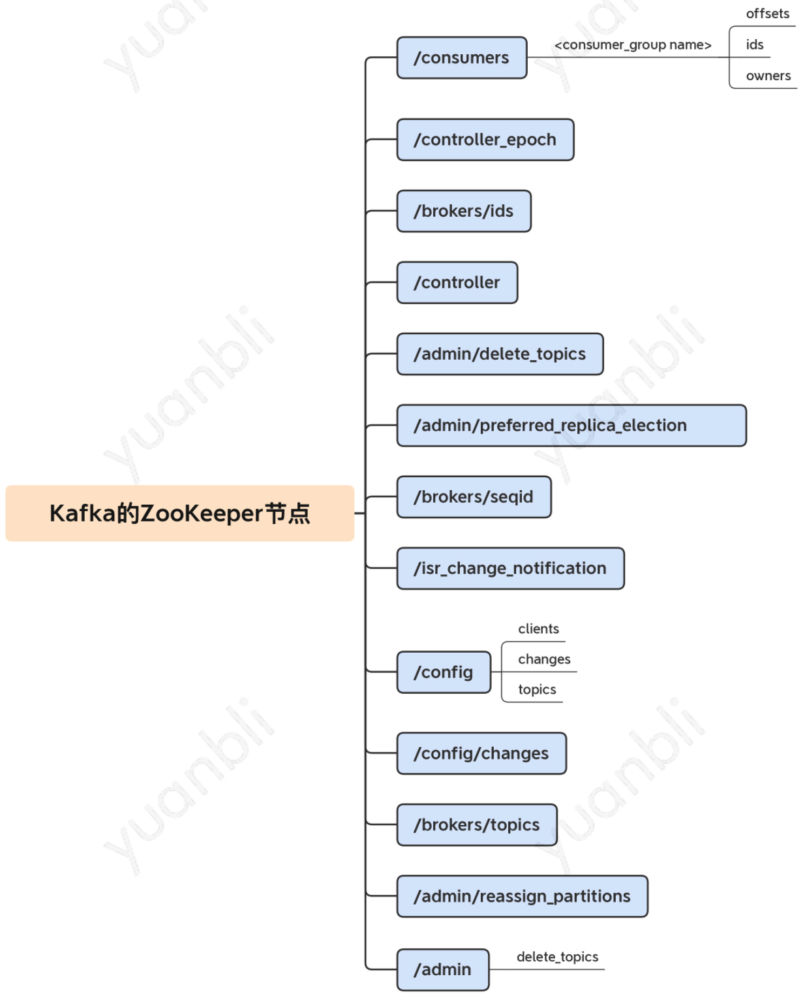

**控制器如何被选出来？**

Broker在启动时，会尝试去Zookeeper中创建/controller节点。Kafka当前选举控制器的规则是：第一个成功创建/controller节点的Broker会被指定为控制器。

**控制器的功能**

1. 主题管理（创建，删除，增加分区）

   指控制器帮助我们完成对 Kafka 主题的创建、删除以及分区增加的操作

2. 分区重分配

   Kafka-reassign-partitions脚本提供的对已有主题分区进行细粒度的分配功能

3. Preferred领导者选举

   Kafka为了避免部分Broker负载过重而提供的一种换Leader的方案

4. 集群成员管理（新增Broker，Broker主动关闭，Broker宕机）

   自动检测新增 Broker、Broker 主动关闭及被动宕机。这种自动检测是依赖于前面提到的 Watch 功能和 ZooKeeper 临时节点组合实现的

   控制器组件会利用watch机制检查Zookeeper的/brokers/ids节点下的子节点数量变更。当有新Broker启动后，它会在/brokers下创建专属的znode节点。一旦创建完毕，Zookeeper会通过Watch机制将消息通知推送给控制器，这样，控制器就能自动地感知到这个变化。进而开启后续新增Broker作业

   侦测Broker存活性则是依赖于刚刚提到的另一个机制：临时节点。每个Broker启动后，会在/brokers/ids下创建一个临时的znode。当Broker宕机或主机关闭后，该Broker与Zookeeper的会话结束，这个znode会被自动删除。同理，Zookeeper的Watch机制将这一变更推送给控制器，这样控制器就能知道有Broker关闭或宕机了，从而进行善后

5. 数据服务

   控制器上保存了最全的集群元数据信息，其他所有Broker会定期接收控制器发来的元数据更新请求，从而更新其内存中的缓存数据

**控制器保存的数据**

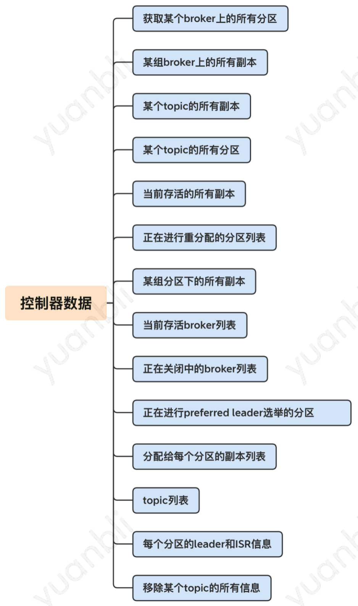

控制器中保存的这些数据在Zookeeper中也保存了一份。每当控制器初始化时，它都会从Zookeeper上读取对应的元数据并填充到自己的缓存中。这里面比较重要的数据有：

- 所有主题信息。包括具体的分区信息，比如领导者副本是谁，ISR 集合中有哪些副本等

- 所有 Broker 信息。包括当前都有哪些运行中的 Broker，哪些正在关闭中的 Broker 等

- 所有涉及运维任务的分区。包括当前正在进行 Preferred 领导者选举以及分区重分配的分区列表

**控制器故障转移Failover**

在 Kafka 集群运行过程中，只能有一台 Broker 充当控制器的角色，那么这就存在单点失效（Single Point of Failure）的风险，Kafka 是如何应对单点失效的呢？答案就是，为控制器提供故障转移功能，也就是说所谓的 Failover。故障转移是指：当运行中的控制器突然宕机或意外终止时，Kafka能够快速地感知到，并立即启用备用控制器来替代之前失败的控制器。

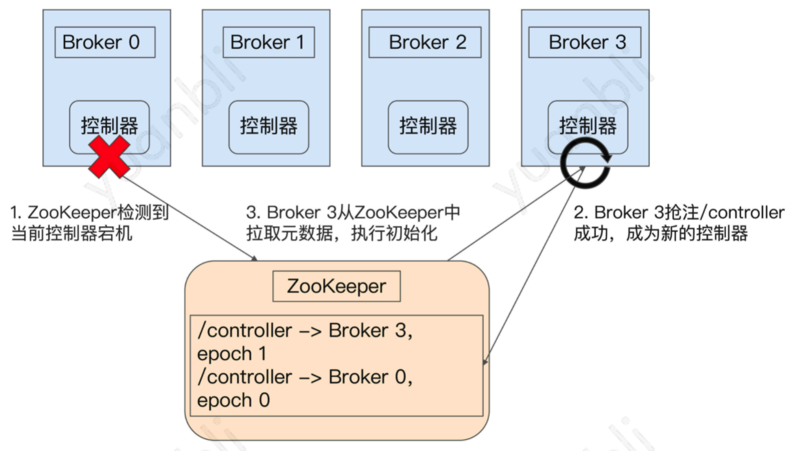

最开始时，Broker 0 是控制器。当 Broker 0 宕机后，ZooKeeper 通过 Watch 机制感知到并删除了 /controller 临时节点。之后，所有存活的 Broker 开始竞选新的控制器身份。Broker 3 最终赢得了选举，成功地在 ZooKeeper 上重建了 /controller 节点。之后，Broker 3 会从 ZooKeeper 中读取集群元数据信息，并初始化到自己的缓存中。至此，控制器的 Failover 完成，可以行使正常的工作职责了。

**控制器内部设计原理**

在 Kafka 0.11 版本之前，控制器的内部设计相当复杂。控制器是多线程的设计，会在内部创建很多线程。如：

- 为每个Broker创建一个对应的Socket连接，然后在创建一个专属的线程，用于向这些Broker发送特定的请求
- 控制连接zookeeper,也会创建单独的线程来处理Watch机制通知回调
- 控制器还会为主题删除创建额外的I/O线程

线程还会访问共享的控制器缓存数据，为了维护数据安全性，控制在代码中大量使用ReetrantLock同步机制，进一步拖慢了整个控制器的处理速度。

0.11版对控制器的底层设计进了重构，最大的改进是：把多线程的方案改成了单线程加事件队列的方案。

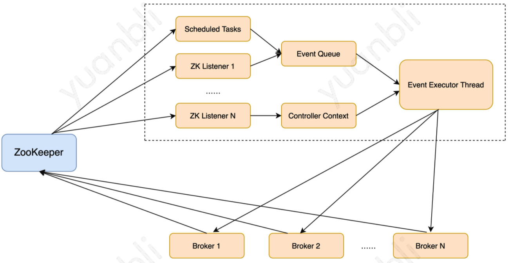

- 单线程+队列的实现方式：社区引入了一个事件处理线程，统一处理各种控制器事件，然后控制器将原来执行的操作全部建模成一个个独立的事件，发送到专属的事件队列中，供此线程消费
- 单线程不代表之前提到的所有线程都被干掉了，控制器只是把缓存状态变更方面的工作委托给了这个线程而已

将之前同步操作Zookeeper全部改为异步操作。 Zookeeper本身的API提供了同步写和异步写两种方式。同步操作zk，在有大量主题分区发生变更时，Zookeeper容易成为系统的瓶颈。

### 1.4.5 Kafka的定时器

Kafka 中存在大量的延时操作，比如延时生产、延时拉取和延时删除等。Kafka 并没有使用 JDK 自带的 Timer 或 DelayQueue 来实现延时的功能，而是基于时间轮自定义实现了一个用于延时功能的定时器（SystemTimer），基于时间轮可以将插入和删除操作的时间复杂度都降为 O(1)。

Kafka中使用的请求被延时处理的机制是分层时间轮算法：以手表为例，秒针转动一圈，分针会向前推进一格；分针转动一圈，时针会向前推进一格。手表中的“一格”叫“一个桶（Bucket）”，而“推进”对应于 Kafka 中的“滴答”，也就是 tick。每个 Bucket 实际上是一个双向循环链表（Doubly Linked Cyclic List），里面保存了一组延时请求。由于是双向链表结构，能够利用 next 和 prev 两个指针快速地定位元素，因此，在 Bucket 下插入和删除一个元素的时间复杂度是 O(1)。

**在 Kafka 中，具体是怎么应用分层时间轮实现请求队列的呢？**

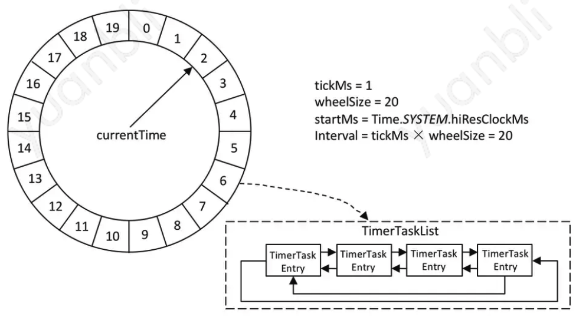

Kafka 中的时间轮（TimingWheel）是一个存储定时任务的环形队列，底层采用数组实现，数组中的每个元素可以存放一个定时任务列表（TimerTaskList）。TimerTaskList 是一个环形的双向链表，链表中的每一项表示的都是定时任务项（TimerTaskEntry），其中封装了真正的定时任务（TimerTask）。

时间轮由多个时间格组成，每个时间格代表当前时间轮的基本时间跨度（tickMs）。时间轮的时间格个数是固定的，可用 wheelSize 来表示，那么整个时间轮的总体时间跨度（interval）可以通过公式 tickMs×wheelSize 计算得出。时间轮还有一个表盘指针（currentTime），用来表示时间轮当前所处的时间，currentTime 是 tickMs 的整数倍。currentTime 可以将整个时间轮划分为到期部分和未到期部分，currentTime 当前指向的时间格也属于到期部分，表示刚好到期，需要处理此时间格所对应的 TimerTaskList 中的所有任务。

若时间轮的 tickMs 为 1ms 且 wheelSize 等于20，那么可以计算得出总体时间跨度 interval 为20ms。初始情况下表盘指针 currentTime 指向时间格0，此时有一个定时为2ms的任务插进来会存放到时间格为2的 TimerTaskList 中。随着时间的不断推移，指针 currentTime 不断向前推进，过了2ms之后，当到达时间格2时，就需要将时间格2对应的 TimeTaskList 中的任务进行相应的到期操作。此时若又有一个定时为8ms的任务插进来，则会存放到时间格10中，currentTime 再过8ms后会指向时间格10。

如果此时有一个定时为 350ms 的任务该如何处理？直接扩充 wheelSize 的大小？Kafka 中不乏几万甚至几十万毫秒的定时任务，这个 wheelSize 的扩充没有底线，就算将所有的定时任务的到期时间都设定一个上限，比如100万毫秒，那么这个 wheelSize 为100万毫秒的时间轮不仅占用很大的内存空间，而且也会拉低效率。Kafka 为此引入了**层级时间轮**的概念，当任务的到期时间超过了当前时间轮所表示的时间范围时，就会尝试添加到上层时间轮中。

## 1.5 Kafka的存储层

1. Kafka的主题与分区内部是如何存储的，有什么特点？
2. 如何利用操作系统优化技术来高效地持久化日志文件和加快数据传输效率？**page cache和zero copy**的技术

Kafka 使用消息日志（Log）来保存数据，一个日志就是磁盘上一个只能追加写（Append-only）消息的物理文件。因为只能追加写入，故避免了缓慢的随机 I/O 操作，用性能较好的顺序 I/O 写操作，这也是实现 Kafka 高吞吐量特性的一个重要手段。不过如果你不停地向一个日志写入消息，最终也会耗尽所有的磁盘空间，因此 Kafka 必然要定期地删除消息以回收磁盘。

Kafka通过日志段（Log Segment）机制定期删除消息以回收磁盘。在 Kafka 底层，一个日志又进一步细分成多个日志段，消息被追加写到当前最新的日志段中，当写满了一个日志段后，Kafka 会自动切分出一个新的日志段，并将老的日志段封存起来。Kafka 在后台还有定时任务会定期地检查老的日志段是否能够被删除，从而实现回收磁盘空间的目的。

向 Kafka 发送数据并不是真要等数据被写入磁盘才会认为成功，而是只要数据被写入到操作系统的页缓存（Page Cache）上就可以了，随后操作系统根据 LRU 算法会定期将页缓存上的“脏”数据落盘到物理磁盘上。这个定期就是由提交时间来确定的，默认是 5 秒。

如果在页缓存中的数据在写入到磁盘前机器宕机了，那数据就丢失了。但鉴于 Kafka 在软件层面已经提供了多副本的冗余机制，因此这里稍微拉大提交间隔去换取性能还是一个合理的做法。

现代的操作系统针对磁盘的读写已经做了一些优化方案来加快磁盘的访问速度：

- 预读（ read-ahead ）会提前将一个比较大的磁盘块读入内存

- 后写 (write-behind) 会将很多小的逻辑写操作合并起来组合成一个大的物理写操作

并且，操作系统还会将主内存剩余的所有空闲内存空间都用作磁盘缓存 (disk cache/page cache)，所有的磁盘读写操作都会经过统一的磁盘缓存（除了直接I/O会绕过磁盘缓存）。

应用程序写入数据到文件系统的一般做法是：在内存中保存尽可能多的数据，并在需要时将这些数据刷新到文件系统。但这里我们要做完全相反的事情，右图中所有的数据都写入文件系统的持久化日志文件，但不进行刷新数据的任何调用。数据会首先被传输到磁盘缓存，操作系统随后会将这些数据定期自动刷新到物理磁盘。

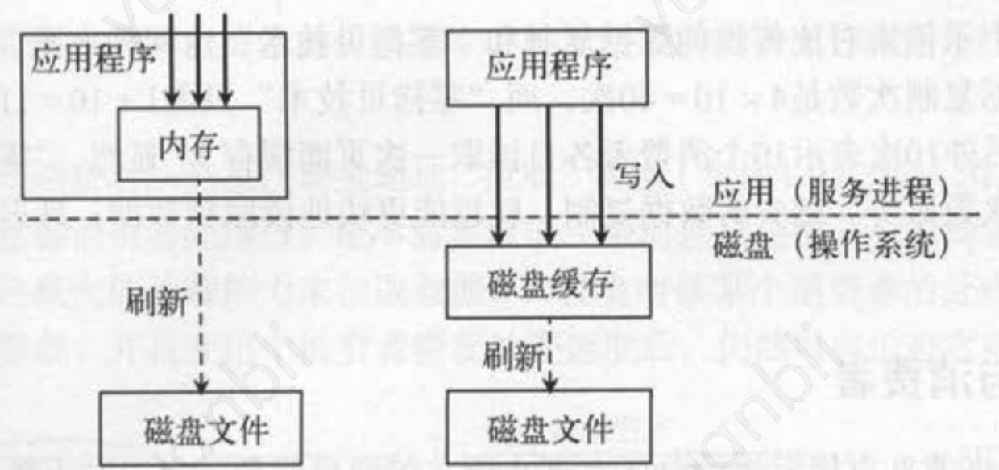

消息系统内的消息从生产者保存到服务端，消费者再从服务端读取出来，数据的传输效率决定了生产者和消费者的性能。生产者如果每发送一条消息都直接通过网络发送到服务端，势必会造成过多的网络请求。如果我们能够将多条消息按照分区进行分组，并采用批量的方式一次发送一个消息集，并且对消息集进行压缩，就可以减少网络传输的带宽，进一步提高数据的传输效率。

消费者要读取服务端的数据，需要将服务端的磁盘文件通过网络发送到消费者进程，而网络发送通常涉及不同的网络节点。 传统读取磁盘文件的数据在每次发送到网络时，都需要将页面缓存先保存到用户缓存，然后在读取消息时再将其复制到内核空间，具体步骤如下：

1. 操作系统将数据从磁盘中读取文件到内核空间里的页面缓存

2. 应用程序将数据从内核空间读入用户空间的缓冲区

3. 应用程序将读到的数据写回内核空间并放入socket缓冲区

4. 操作系统将数据从socket缓冲区复制到网卡接口，此时数据才能通过网络发送归去

结合Kafka 的消息有多个订阅者的使用场景，生产者发布的消息一般会被不同的消费者消费多次。使用零拷贝技术（ zero-copy ）只需将磁盘文件的数据复制到页面缓存中一次，然后将数据从页面缓存直接发送到网络中（发送给不同的使用者时，都可以重复使用同一个页面缓存），避免了重复的复制操作。这样，消息使用的速度基本上等同于网络连接的速度了。

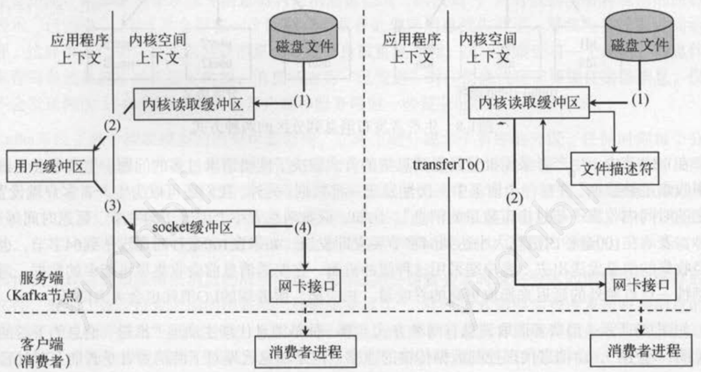

### 1.5.1 Kafka日志结构

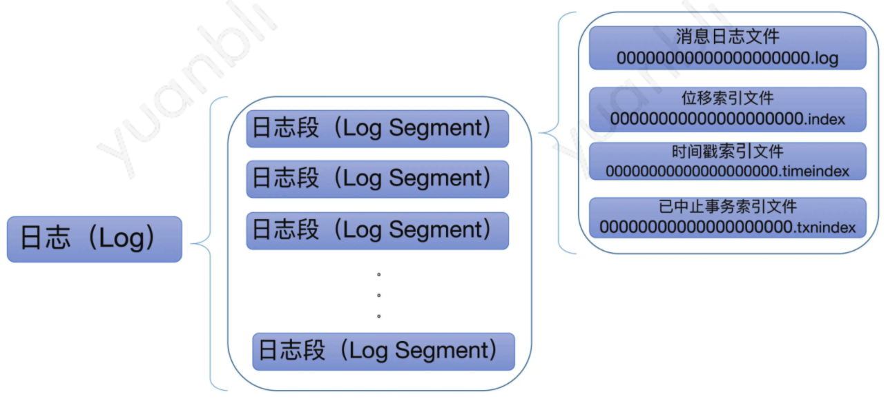

日志是 Kafka 服务器端代码的重要组件之一，很多其他的核心组件都是以日志为基础的，比如状态管理机和副本管理器等。Kafka 日志对象由多个日志段对象组成，而每个日志段对象会在磁盘上创建一组文件，包括消息日志文件（.log）、位移索引文件（.index）、时间戳索引文件（.timeindex）以及已中止（Aborted）事务的索引文件（.txnindex）。图中的一串数字 0 是该日志段的起始位移值（Base Offset），也就是该日志段中所存的第一条消息的位移值。

一个 Kafka 主题有很多分区，每个分区就对应一个 Log 对象，在物理磁盘上则对应于一个子目录。比如你创建了一个双分区的主题 test-topic，那么，Kafka 在磁盘上会创建两个子目录：test-topic-0 和 test-topic-1。而在服务器端，这就是两个 Log 对象。每个子目录下存在多组日志段，也就是多组.log、.index、.timeindex 文件组合，只不过文件名不同，因为每个日志段的起始位移不同。

## 1.6 Kafka常见问题

### 1.6.1 Kafka无消息丢失配置

分布式系统处理故障容错时，需要明确地定义节点的存活状态。Kafka对节点的存活定义有两个条件：

- 节点必须和ZK保持会话

- 如果这个节点是某个分区的备份副本，它必须对分区主副本的写操作进行复制，并且复制的进度不能落后太多

满足这两个条件，叫作“正在同步中”（ in-sync）。 每个分区的主副本会跟踪正在同步中的备份副本节点（ In Sync Replicas ，即ISR）。如果一个备份副本挂掉、没有响应或者落后太多，主副本就会将其从同步副本集合中移除。反之，如果备份副本重新赶上主副本，它就会加入到主副本的同步集合中。Kafka 中， 一条消息只有被ISR集合的所有副本都运用到本地的日志文件，才会认为消息被成功提交了。任何时刻，只要ISR至少有一个副本是存活的，Kafka就可以保证“一条消息一旦被提交，就不会丢失“。只有已经提交的消息才能被消费者消费，因此消费者不用担心会看到因为主副本失败而丢失的消息，下面我们举例分析Kafka的消息提交机制如何保证消费者看到的数据是一致的。

1）生产者发布了10条消息，但都还没有提交（没有完全复制到ISR中的所有副本） 如果没有提交机制，消息写到主副本的节点就对消费者立即可见，即消费者可以立即看到这10条消息。但之后主副本挂掉了，这10条消息实际上就丢失了，而消费者之前能看到这 10 条丢失的数据，在主副本挂掉后就看不到了，导致消费者看到的数据出现了不一致。

2）如果有提交机制的保证，并且生产者发布的 10条消息还没有提交，则对消费者不可见。即使10条消息都已经写入主副本，但是它们在还没有来得及复制到其他备份副本之前，主副本就挂掉了。那么，这 10条消息就不算写入成功，生产者会重新发送这 10条消息。当这 10条消息成功地复制到ISR 的所有副本后，它们才会认为是提交的，即对消费者才是可见的。在这之后，即使主副本挂掉了也没有关系，因为原先消费者能看到主副本的10条消息，在新的主副本上也能看到这10条消息，不会出现不一致的情况。

**Kafka 只对“已提交”的消息（committed message）做有限度的持久化保证。**

- 已提交的消息。当 Kafka 的若干个 Broker 成功地接收到一条消息并写入到日志文件后，它们会告诉生产者程序这条消息已成功提交。为什么是若干个 Broker 呢？这取决于你对“已提交”的定义。你可以选择只要有一个 Broker 成功保存该消息就算是已提交，也可以是令所有 Broker 都成功保存该消息才算是已提交。不论哪种情况，Kafka 只对已提交的消息做持久化保证这件事情是不变的。
- 有限度的持久化保证。 Kafka 不可能保证在任何情况下都做到不丢失消息。Kafka 不丢消息是有前提条件的。假如你的消息保存在 N 个 Kafka Broker 上，那么这个前提条件就是这 N 个 Broker 中至少有 1 个存活。只要这个条件成立，Kafka 就能保证你的这条消息永远不会丢失。

常见的消息丢失情况如下：

**生产者程序丢失数据：**

**问题：**目前 Kafka Producer 是异步发送消息的，也就是说如果你调用的是 producer.send(msg) 这个 API，那么它通常会立即返回，但此时你不能认为消息发送已成功完成。如果用这个方式，可能会有哪些因素导致消息没有发送成功呢？其实原因有很多，例如网络抖动，导致消息压根就没有发送到 Broker 端；或者消息本身不合格导致 Broker 拒绝接收（比如消息太大了，超过了 Broker 的承受能力）等。这种情况下，Kafka 不认为消息是已提交的，因此也就没有 Kafka 丢失消息这一说了

**解决：**Producer 永远要使用带有回调通知的发送 API，也就是说不要使用 producer.send(msg)，而要使用 producer.send(msg, callback)，它能准确地告诉你消息是否真的提交成功了。一旦出现消息提交失败的情况，你就可以有针对性地进行处理

**消费者程序丢失数据**

**问题：**Consumer 端丢失数据主要体现在 Consumer 端要消费的消息不见了。Consumer 有个“位移”的概念，表示的是这个 Consumer 当前消费到的 Topic 分区的位置。如果先更新位移 offset 再消费消息就可能导致消息丢失

**解决：**先消费消息，再更新位移即可。这样就能最大限度地保证消息不丢失。当然，这种处理方式可能带来的问题是消息的重复处理

### 1.6.2 消息堆积

消息堆积可能原因如下：

1. 生产速度大于消费速度，这样可以适当增加分区，增加consumer数量，提升消费TPS
2. consumer消费性能低，查一下是否有很重的消费逻辑，看看是否可以优化consumer TPS
3. 确保consumer端没有因为异常而导致消费hang住;
4. 如果你使用的是消费者组，确保没有频繁地发生rebalance

### 1.6.3 Kafka 消息交付可靠性保障以及精确处理一次语义的实现

所谓的消息交付可靠性保障，是指 Kafka 对 Producer 和 Consumer 要处理的消息提供什么样的承诺。常见的承诺有以下三种：

- 最多一次（at most once）：消息可能会丢失，但绝不会被重复发送

- 至少一次（at least once）：消息不会丢失，但有可能被重复发送

- 精确一次（exactly once）：消息不会丢失，也不会被重复发送

Kafka 默认提供的交付可靠性保障是第二种，即至少一次。之前我们说过消息“已提交”的含义，即只有 Broker 成功“提交”消息且 Producer 接到 Broker 的应答才会认为该消息成功发送。如果消息成功“提交”，但 Broker 的应答没有成功发送回 Producer 端（比如网络出现瞬时抖动），那么 Producer 就无法确定消息是否真的提交成功了。因此，它只能选择重试，这就是 Kafka 默认提供至少一次可靠性保障的原因，不过这会导致消息重复发送。

Kafka 也可以提供最多一次交付保障，只需要让 Producer 禁止重试即可。这样一来，消息要么写入成功，要么写入失败，但绝不会重复发送。

无论是至少一次还是最多一次，都不如精确一次来得有吸引力。大部分用户还是希望消息只会被交付一次，这样的话，消息既不会丢失，也不会被重复处理。或者说，即使 Producer 端重复发送了相同的消息，Broker 端也能做到自动去重。在下游 Consumer 看来，消息依然只有一条。

Kafka 是通过两种机制做到精确一次的：幂等性（Idempotence）和事务（Transaction）。

#### 1.6.3.1 幂等性Producer

幂等，指的是某些操作或函数能够被执行多次，但每次得到的结果都是不变的。幂等性有很多好处，其最大的优势在于我们可以安全地重试任何幂等性操作，反正它们也不会破坏我们的系统状态。如果是非幂等性操作，我们还需要担心某些操作执行多次对状态的影响，但对于幂等性操作而言，我们根本无需担心此事。

Kafka 中，Producer 默认不是幂等性的，但我们可以创建幂等性 Producer。它其实是 0.11.0.0 版本引入的新功能。enable.idempotence 被设置成 true 后，Producer 自动升级成幂等性 Producer，其他所有的代码逻辑都不需要改变。Kafka 自动帮你做消息的重复去重。Kafka为了实现幂等性，它在底层设计架构中引入了ProducerID和SequenceNumber。

- ProducerID

  在每个新的Producer初始化时，会被分配一个唯一的ProducerID，用来标识本次会话。 - 
  
- SequenceNumber

  对于每个ProducerID，Producer发送数据的每个Topic和Partition都对应一个从0开始单调递增的SequenceNumber值。broker在内存维护(pid,seq)映射，收到消息后检查seq。producer在收到明确的的消息丢失ack，或者超时后未收到ack，要进行重试。

```shell
new_seq = old_seq+1: 正常消息；
new_seq <= old_seq : 重复消息；
new_seq > old_seq+1: 消息丢失；
```

幂等性Producer的作用范围：

1. 只能保证单分区上的幂等性，即一个幂等性 Producer 能够保证某个主题的一个分区上不出现重复消息，它无法实现多个分区的幂等性
2. 它只能实现单会话上的幂等性，不能实现跨会话的幂等性。这里的会话，你可以理解为 Producer 进程的一次运行。当你重启了 Producer 进程之后，这种幂等性保证就丧失了

如果想实现多分区以及多会话上的消息无重复，可以使用事务（transaction）或者依赖事务型 Producer。这也是幂等性 Producer 和事务型 Producer 的最大区别。

#### 1.6.3.2 **事务型Producer**

事务型 Producer 能够保证将消息原子性地写入到多个分区中。这批消息要么全部写入成功，要么全部失败。另外，事务型 Producer 也不惧进程的重启。Producer 重启回来后，Kafka 依然保证它们发送消息的精确一次处理。和普通 Producer 代码相比，事务型 Producer 的显著特点是调用了一些事务 API，如 initTransaction、beginTransaction、commitTransaction 和 abortTransaction，它们分别对应事务的初始化、事务开始、事务提交以及事务终止。

事务消息是由producer、事务协调器、broker、组协调器、consumer共同参与实现的

- producer

  为producer指定固定的TransactionalId，可以穿越producer的多次会话(producer重启/断线重连)中，持续标识producer的身份。

  使用epoch标识producer的每一次"重生"，防止同一producer存在多个会话。

  producer遵从幂等消息的行为，并在发送的BatchRecord中增加事务id和epoch。

- 事务协调器(Transaction Coordinator)

  引入事务协调器，以两阶段提交的方式，实现消息的事务提交。

  事务协调器使用一个特殊的topic：transaction，来做事务提交日志。

  事务控制器通过RPC调用，协调 broker 和 consumer coordinator 实现事务的两阶段提交。

  每一个broker都会启动一个事务协调器，使用hash(TransactionalId)确定producer对应的事务协调器，使得整个集群的负载均衡

- broker

  broker处理事务协调器的commit/abort控制消息，把控制消息向正常消息一样写入topic(和正常消息交织在一起，用来确认事务提交的日志偏移)，并向前推进消息提交偏移hw

- 组协调器

  如果在事务过程中，提交了消费偏移，组协调器在offset log中写入事务消费偏移。当事务提交时，在offset log中写入事务offset确认消息

- consumer

  consumer过滤未提交消息和事务控制消息，使这些消息对用户不可见

有两种实现方式，

- consumer缓存方式

  设置isolation.level=read_uncommitted，此时topic的所有消息对consumer都可见。consumer缓存这些消息，直到收到事务控制消息。若事务commit，则对外发布这些消息；若事务abort，则丢弃这些消息

- broker过滤方式

  设置isolation.level=read_committed，此时topic中未提交的消息对consumer不可见，只有在事务结束后，消息才对consumer可见。broker给consumer的BatchRecord消息中，会包含以列表，指明哪些是"abort"事务，consumer丢弃abort事务的消息即可

### 1.6.4  高水位和Leader Epoch

在 Kafka 的世界中，水位是和位置信息绑定的，具体来说，它是用消息位移来表征的。高水位在界定 Kafka 消息对外可见性以及实现副本机制等方面起到了非常重要的作用，但其设计上的缺陷给 Kafka 留下了很多数据丢失或数据不一致的潜在风险。为此，社区引入了 Leader Epoch 机制，主要是用来判断出现 Failure 时是否执行日志截断操作（Truncation），尝试规避掉这类风险。下面将依次介绍高水位和Leader Epoch机制。

#### 1.6.4.1 高水位的作用

在 Kafka 中，高水位的作用主要有 2 个。

- 定义消息可见性，即用来标识分区下的哪些消息是可以被消费者消费的。

- 帮助 Kafka 完成副本同步。

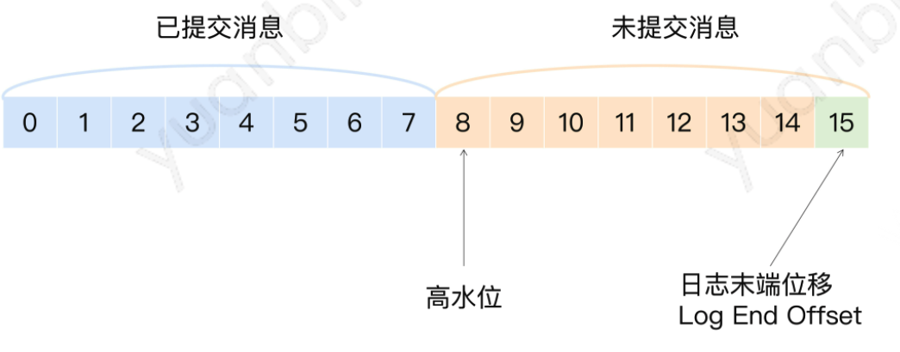

假设这是某个分区 Leader 副本的高水位图，在分区高水位以下的消息被认为是已提交消息，反之就是未提交消息。消费者只能消费已提交消息。

图中还有一个日志末端位移的概念，即 Log End Offset，简写是 LEO。它表示副本写入下一条消息的位移值。这个副本当前只有 15 条消息，位移值是从 0 到 14，下一条新消息的位移是 15。显然，介于高水位和 LEO 之间的消息就属于未提交消息。同一个副本对象，其高水位值不会大于 LEO 值。

高水位和 LEO 是副本对象的两个重要属性。Kafka 所有副本都有对应的高水位和 LEO 值，而不仅仅是 Leader 副本。只不过 Leader 副本比较特殊，Kafka 使用 Leader 副本的高水位来定义所在分区的高水位。换句话说，分区的高水位就是其 Leader 副本的高水位。

#### 1.6.4.2 高水位更新机制

每个副本对象都保存了一组高水位值和 LEO 值，但实际上，在 Leader 副本所在的 Broker 上，还保存了其他 Follower 副本的 LEO 值。如下图所示：

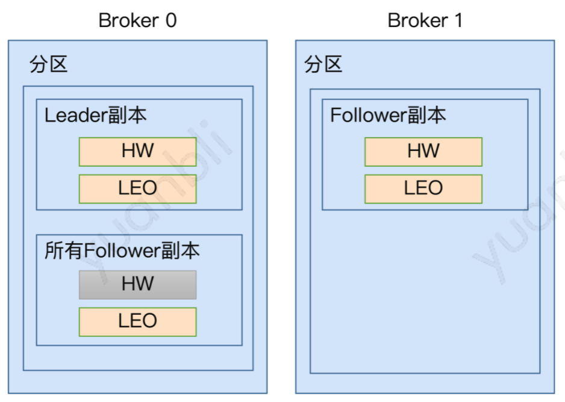

Kafka 副本机制在运行过程中，会更新 Broker 1 上 Follower 副本的高水位和 LEO 值，同时也会更新 Broker 0 上 Leader 副本的高水位和 LEO 以及所有远程副本的 LEO，但它不会更新远程副本的高水位值，也就是图中标记为灰色的部分。在 Broker 0 上保存这些远程副本信息的主要原因是帮助 Leader 副本确定其高水位，也就是分区高水位。

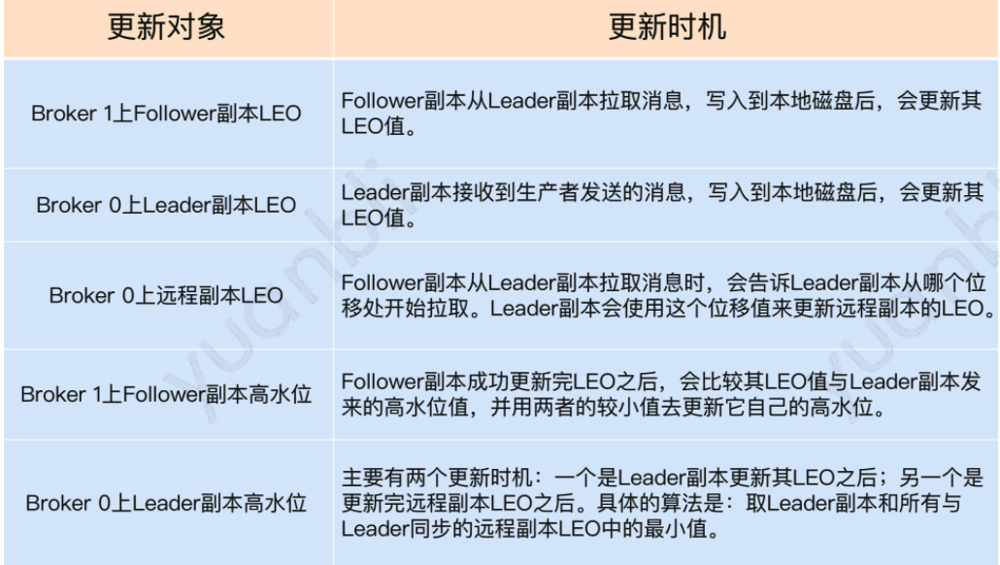

#### 1.6.4.3 Leader Epoch

依托于高水位，Kafka 既界定了消息的对外可见性，又实现了异步的副本同步机制。但是其中存在一些问题，Follower 副本的高水位更新需要一轮额外的拉取请求才能实现，也就是说，Leader 副本高水位更新和 Follower 副本高水位更新在时间上是存在错配的。这种错配是很多“数据丢失”或“数据不一致”问题的根源。

社区在 0.11 版本正式引入了 Leader Epoch 概念，来规避因高水位更新错配导致的各种不一致问题。所谓 Leader Epoch，我们大致可以认为是 Leader 版本。它由两部分数据组成。

- Epoch。一个单调增加的版本号。每当副本领导权发生变更时，都会增加该版本号。小版本号的 Leader 被认为是过期 Leader，不能再行使 Leader 权力

- 起始位移（Start Offset）。Leader 副本在该 Epoch 值上写入的首条消息的位移

Kafka Broker 会在内存中为每个分区都缓存 Leader Epoch 数据，每次有 Leader 变更时，新的 Leader 副本会查询这部分缓存，取出对应的 Leader Epoch 的起始位移，以避免数据丢失和不一致的情况。


